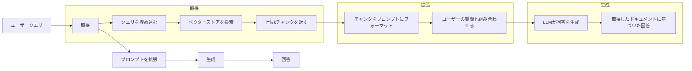
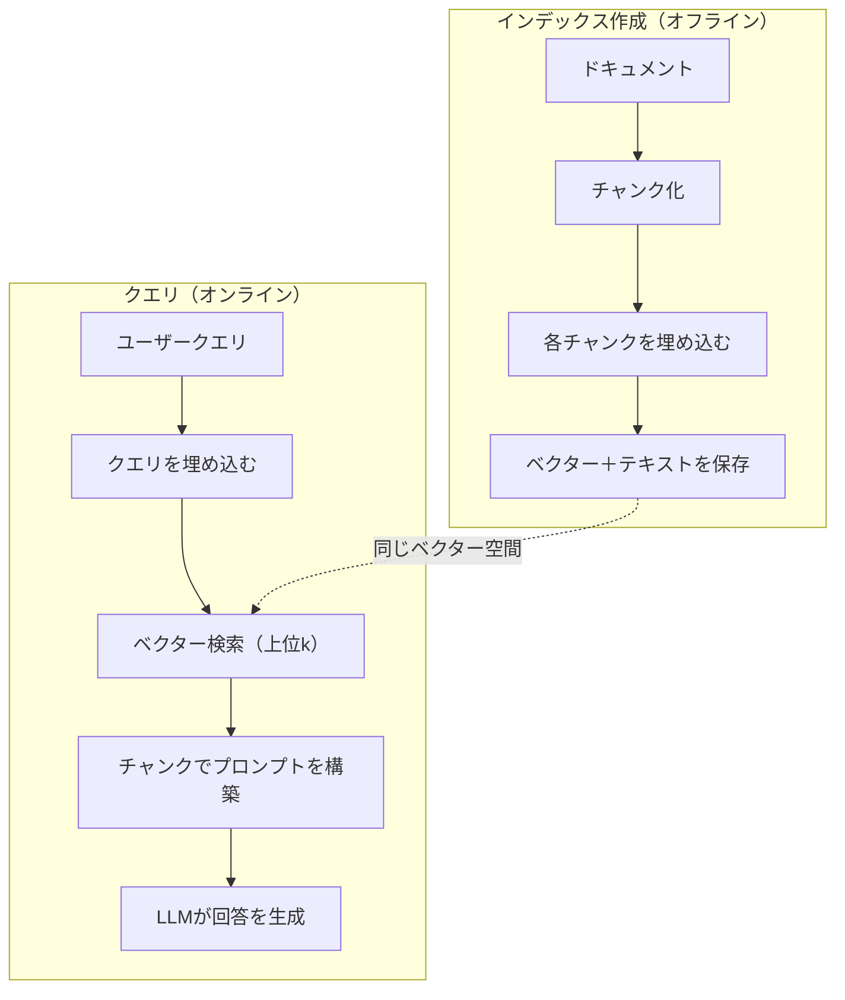

# RAG（Retrieval-Augmented Generation）

> LLMは訓練カットオフ時点までのすべてを知っている。しかし会社のドキュメント・コードベース・先週の会議メモについては何も知らない。RAGはこれを解決する——関連ドキュメントを取得してプロンプトに詰め込むことで。これは本番AIで最も広く使われているパターンだ。このコースから1つだけ実装するとしたら、RAGパイプラインを実装せよ。

**関連レッスン:** フェーズ5・23（RAGのチャンキング戦略）——6つのチャンキングアルゴリズムとそれぞれが適したケース。フェーズ5・22（埋め込みモデル深掘り）——埋め込み器の選び方。フェーズ11・07（Advanced RAG）——ハイブリッド検索・再ランク付け・クエリ変換。

## 学習目標

- 完全なRAGパイプラインを構築する：ドキュメントの読み込み・チャンキング・埋め込み・ベクターストレージ・取得・生成
- ベクターデータベース（ChromaDB・FAISS・Pinecone）を使って適切なインデックスでセマンティック検索を実装する
- 知識グラウンデッドなアプリケーションにfine-tuningではなくRAGが好まれる理由（コスト・鮮度・帰属）を説明する
- 取得指標（precision・recall）と生成指標（faithfulness・relevance）を使ってRAGの品質を評価する

## 問題

会社のチャットボットを構築する。顧客が「エンタープライズプランの返金ポリシーは何ですか？」と聞く。LLMは一般的なSaaS返金ポリシーについての汎用的な回答を返す。200ページの内部wikiに埋もれている実際のポリシーは、エンタープライズ顧客が日割り計算の返金付きで60日間の対応を受けられると述べている。LLMはこのドキュメントを見たことがない。訓練されていない内容を知ることはできない。

fine-tuningは1つの解決策だ。LLMを取り、内部ドキュメントで訓練して更新されたモデルをデプロイする。これは機能するが深刻な問題がある。fine-tuningには何千ドルもの計算コストがかかる。ドキュメントが変更された瞬間にモデルは古くなる。モデルがどのソースから回答を引き出したかを知る方法がない。そして会社が来月新しい製品ラインを買収したら、また再びfine-tuningが必要になる。

RAGはもう一方の解決策だ。モデルはそのままにする。質問が来たとき、ドキュメントストアで関連するパッセージを検索し、質問の前にプロンプトに貼り付け、それらのパッセージをコンテキストとして使ってモデルに回答させる。ドキュメントストアは数分で更新できる。取得されたドキュメントを正確に見ることができる。モデル自体は変わらない。これがRAGが本番で支配的なパターンである理由だ：安価・新鮮・監査可能・どんなLLMでも機能する。

## 概念

### RAGパターン

パターン全体は4つのステップに収まる：



クエリ→取得→プロンプト拡張→生成。すべてのRAGシステムはこのパターンに従う。本番RAGシステムの違いは各ステップの詳細にある：チャンクの方法・埋め込みの方法・検索の方法・プロンプトの構築方法。

### RAGがfine-tuningに勝る理由

| 懸念点 | fine-tuning | RAG |
|--------|------------|-----|
| コスト | 訓練1回あたり$1,000〜$100,000+ | クエリあたり$0.01〜$0.10（埋め込み＋LLM） |
| 鮮度 | 再訓練まで古くなる | ドキュメントを再インデックスすることで数分で更新 |
| 監査可能性 | 回答をソースまで追跡不可 | 取得された正確なパッセージを表示可能 |
| ハルシネーション | 自由にハルシネーションする | 取得されたドキュメントにグラウンデッド |
| データプライバシー | 訓練データがウェイトに焼き付けられる | ドキュメントがベクターストアに留まる |

fine-tuningはモデルのウェイトを永続的に変更する。RAGはモデルのコンテキストを一時的に変更する。ほとんどのアプリケーションにとって、一時的なコンテキストが望まれるものだ。

fine-tuningが勝る唯一のケース：プロンプトだけでは達成できない特定のスタイル・トーン・推論パターンをモデルに採用させる必要がある場合。事実の知識の取得においては、RAGが常に勝る。

### 埋め込みモデル

埋め込みモデルはテキストを密なベクターに変換する。類似したテキストはこの高次元空間で近くに配置されるベクターを生成する。「パスワードをリセットするにはどうすればいいですか？」と「パスワードを変更する必要があります」は共通する単語が少ないにもかかわらず、ほぼ同一のベクターを生成する。「猫がマットに座っていた」はまったく異なるベクターを生成する。

よく使われる埋め込みモデル（2026年のラインナップ——完全な分析はフェーズ5・22を参照）：

| モデル | 次元数 | プロバイダー | メモ |
|-------|-----------|----------|-------|
| text-embedding-3-small | 1536（Matryoshka） | OpenAI | ほとんどのユースケースでベストなコスト対性能 |
| text-embedding-3-large | 3072（Matryoshka） | OpenAI | より高精度・256/512/1024に切り捨て可能 |
| Gemini Embedding 2 | 3072（Matryoshka） | Google | MTEBトップの取得。8Kコンテキスト |
| voyage-4 | 1024/2048（Matryoshka） | Voyage AI | ドメイン別バリアント（コード・金融・法律） |
| Cohere embed-v4 | 1024（Matryoshka） | Cohere | 強力な多言語対応・128Kコンテキスト |
| BGE-M3 | 1024（dense+sparse+ColBERT） | BAAI（オープンウェイト） | 1つのモデルから3つのビュー |
| Qwen3-Embedding | 4096（Matryoshka） | Alibaba（オープンウェイト） | トップのオープンウェイト取得スコア |
| all-MiniLM-L6-v2 | 384 | オープンウェイト（Sentence Transformers） | プロトタイピングベースライン |

このレッスンでは、TF-IDFを使った自作のシンプルな埋め込みを構築する。本番システムがTF-IDFを使うからではなく、概念を具体化するためだ：テキストが入力されるとベクターが出力され、類似したテキストは類似したベクターを生成する。

### ベクターの類似度

2つのベクターが与えられた場合、類似度をどう測定するか？3つの選択肢がある：

**コサイン類似度**：2つのベクターの角度のコサイン。-1（反対）から1（同一）の範囲。大きさを無視して方向のみを考慮する。これがRAGのデフォルトだ。

```
cosine_sim(a, b) = dot(a, b) / (||a|| * ||b||)
```

**ドット積**：生の内積。大きなベクターがより高いスコアを得る。大きさが情報を持つ場合（長いドキュメントがより関連性が高いかもしれない）に便利だ。

```
dot(a, b) = sum(a_i * b_i)
```

**L2（ユークリッド）距離**：ベクター空間内の直線距離。小さい距離＝より類似している。大きさの差に敏感だ。

```
L2(a, b) = sqrt(sum((a_i - b_i)^2))
```

コサイン類似度が標準だ。大きさで正規化するため、異なる長さのドキュメントを丁寧に扱う。誰かが「ベクター検索」と言うとき、ほぼ常にコサイン類似度を意味している。

### チャンキング戦略

ドキュメントは単一のベクターとして埋め込むには長すぎる。50ページのPDFは何十ものトピックを含むため、ひどい埋め込みを生成するかもしれない。代わりに、ドキュメントをチャンクに分割して各チャンクを別々に埋め込む。

**固定サイズチャンキング**：Nトークンごとに分割する。シンプルで予測可能だ。50トークンのオーバーラップを持つ512トークンのチャンクは、チャンク1がトークン0〜511・チャンク2がトークン462〜973・といった具合になる。オーバーラップにより、不運な境界で文が分割されるのを防ぐ。

**セマンティックチャンキング**：自然な境界で分割する。段落・セクション・Markdownヘッダーなどだ。各チャンクは意味のある一貫した単位だ。実装が複雑だが、より良い取得を生む。

**再帰的チャンキング**：最大の境界（セクションヘッダー）で最初に分割しようとする。セクションがまだ大きすぎる場合、段落境界で分割しようとする。段落がまだ大きすぎる場合、文の境界で分割する。これはLangChainの`RecursiveCharacterTextSplitter`のアプローチで、実際にうまく機能する。

チャンクサイズは人々が思っている以上に重要だ：

- 小さすぎる（64〜128トークン）：各チャンクにコンテキストが不足する。「それは先四半期に15%増加した」は「それ」が何を指すかを知らなければ何も意味しない。
- 大きすぎる（2048+トークン）：各チャンクが複数のトピックをカバーし、関連性を薄める。収益データを検索すると、10%が収益について・90%が人員数についてのチャンクが返ってくる。
- スイートスポット（256〜512トークン）：自己完結するのに十分なコンテキストがあり、関連性を保つのに十分フォーカスされている。

ほとんどの本番RAGシステムは50トークンのオーバーラップを持つ256〜512トークンのチャンクを使う。AnthropicのRAGガイドラインはこの範囲を推奨している。

### ベクターデータベース

埋め込みを作成したら、保存と検索のための場所が必要だ。選択肢：

| データベース | タイプ | 最適な用途 |
|----------|------|----------|
| FAISS | ライブラリ（インプロセス） | プロトタイピング・小〜中規模データセット |
| Chroma | 軽量DB | ローカル開発・小規模デプロイメント |
| Pinecone | マネージドサービス | オペレーションオーバーヘッドなしの本番 |
| Weaviate | オープンソースDB | セルフホスト本番 |
| pgvector | Postgres拡張 | すでにPostgresを使っている場合 |
| Qdrant | オープンソースDB | 高性能セルフホスト |

このレッスンでは、シンプルなインメモリベクターストアを構築する。ベクターをリストに保存してブルートフォースのコサイン類似度検索を行う。これはフラットインデックスを持つFAISSと同等だ。遅くなる前に約100,000ベクターまでスケールする。本番システムはHNSWのような近似最近傍（ANN）アルゴリズムを使ってミリ秒で数百万のベクターを検索する。

### 完全なパイプライン



インデックス作成フェーズはドキュメントごとに1回実行する（またはドキュメントが更新されたとき）。クエリフェーズはすべてのユーザーリクエストで実行する。本番では、インデックス作成は何時間もかけて何百万ものドキュメントを処理するかもしれない。クエリは1秒以内に応答しなければならない。

### 実際の数値

ほとんどの本番RAGシステムはこれらのパラメーターを使う：

- **k = 5〜10** クエリごとの取得チャンク数
- **チャンクサイズ = 256〜512トークン** 50トークンのオーバーラップ付き
- **コンテキストバジェット**：クエリあたり2,500〜5,000トークンの取得コンテンツ
- **合計プロンプト**：〜8,000〜16,000トークン（システムプロンプト＋取得チャンク＋会話履歴＋ユーザークエリ）
- **埋め込み次元数**：モデルによって384〜3072
- **インデックス作成スループット**：APIの埋め込みを使うと毎秒100〜1,000ドキュメント
- **クエリレイテンシ**：取得に50〜200ms・生成に500〜3000ms

## 実装する

### Step 1: ドキュメントチャンキング

```python
def chunk_text(text, chunk_size=200, overlap=50):
    words = text.split()
    chunks = []
    start = 0
    while start < len(words):
        end = start + chunk_size
        chunk = " ".join(words[start:end])
        chunks.append(chunk)
        start += chunk_size - overlap
    return chunks
```

### Step 2: TF-IDF埋め込み

シンプルな埋め込み関数を構築する。TF-IDF（Term Frequency-Inverse Document Frequency）はニューラル埋め込みではないが、単語の重要性をとらえる方法でテキストをベクターに変換する。ドキュメント内で頻繁な単語は高いTFを得る。コーパス全体でまれな単語は高いIDFを得る。その積により、重要で特徴的な単語が高い値を持つベクターが得られる。

```python
import math
from collections import Counter

def build_vocabulary(documents):
    vocab = set()
    for doc in documents:
        vocab.update(doc.lower().split())
    return sorted(vocab)

def compute_tf(text, vocab):
    words = text.lower().split()
    count = Counter(words)
    total = len(words)
    return [count.get(word, 0) / total for word in vocab]

def compute_idf(documents, vocab):
    n = len(documents)
    idf = []
    for word in vocab:
        doc_count = sum(1 for doc in documents if word in doc.lower().split())
        idf.append(math.log((n + 1) / (doc_count + 1)) + 1)
    return idf

def tfidf_embed(text, vocab, idf):
    tf = compute_tf(text, vocab)
    return [t * i for t, i in zip(tf, idf)]
```

### Step 3: コサイン類似度検索

```python
def cosine_similarity(a, b):
    dot = sum(x * y for x, y in zip(a, b))
    norm_a = math.sqrt(sum(x * x for x in a))
    norm_b = math.sqrt(sum(x * x for x in b))
    if norm_a == 0 or norm_b == 0:
        return 0.0
    return dot / (norm_a * norm_b)

def search(query_embedding, stored_embeddings, top_k=5):
    scores = []
    for i, emb in enumerate(stored_embeddings):
        sim = cosine_similarity(query_embedding, emb)
        scores.append((i, sim))
    scores.sort(key=lambda x: x[1], reverse=True)
    return scores[:top_k]
```

### Step 4: プロンプト構築

これがRAGの「Augmented（拡張）」の部分だ。取得したチャンクを受け取り、プロンプトにフォーマットして、提供したコンテキストに基づいて回答するようLLMに求める。

```python
def build_rag_prompt(query, retrieved_chunks):
    context = "\n\n---\n\n".join(
        f"[Source {i+1}]\n{chunk}"
        for i, chunk in enumerate(retrieved_chunks)
    )
    return f"""Answer the question based ONLY on the following context.
If the context doesn't contain enough information, say "I don't have enough information to answer that."

Context:
{context}

Question: {query}

Answer:"""
```

### Step 5: 完全なRAGパイプライン

```python
class RAGPipeline:
    def __init__(self):
        self.chunks = []
        self.embeddings = []
        self.vocab = []
        self.idf = []

    def index(self, documents):
        all_chunks = []
        for doc in documents:
            all_chunks.extend(chunk_text(doc))
        self.chunks = all_chunks
        self.vocab = build_vocabulary(all_chunks)
        self.idf = compute_idf(all_chunks, self.vocab)
        self.embeddings = [
            tfidf_embed(chunk, self.vocab, self.idf)
            for chunk in all_chunks
        ]

    def query(self, question, top_k=5):
        query_emb = tfidf_embed(question, self.vocab, self.idf)
        results = search(query_emb, self.embeddings, top_k)
        retrieved = [(self.chunks[i], score) for i, score in results]
        prompt = build_rag_prompt(
            question, [chunk for chunk, _ in retrieved]
        )
        return prompt, retrieved
```

### Step 6: 生成（シミュレーション）

本番では、ここでLLM APIを呼び出す。このレッスンでは、取得したコンテキストから最も関連する文を抽出することで生成をシミュレートする。

```python
def simple_generate(prompt, retrieved_chunks):
    query_words = set(prompt.lower().split("question:")[-1].split())
    best_sentence = ""
    best_score = 0
    for chunk in retrieved_chunks:
        for sentence in chunk.split("."):
            sentence = sentence.strip()
            if not sentence:
                continue
            words = set(sentence.lower().split())
            overlap = len(query_words & words)
            if overlap > best_score:
                best_score = overlap
                best_sentence = sentence
    return best_sentence if best_sentence else "I don't have enough information."
```

## 使ってみる

実際の埋め込みモデルとLLMを使っても、コードはほとんど変わらない：

```python
from openai import OpenAI

client = OpenAI()

def embed(text):
    response = client.embeddings.create(
        model="text-embedding-3-small",
        input=text
    )
    return response.data[0].embedding

def generate(prompt):
    response = client.chat.completions.create(
        model="gpt-4o-mini",
        messages=[{"role": "user", "content": prompt}],
        temperature=0
    )
    return response.choices[0].message.content
```

またはAnthropicを使う場合：

```python
import anthropic

client = anthropic.Anthropic()

def generate(prompt):
    response = client.messages.create(
        model="claude-sonnet-4-20250514",
        max_tokens=1024,
        messages=[{"role": "user", "content": prompt}]
    )
    return response.content[0].text
```

パイプラインは同じだ。埋め込み関数を入れ替える。生成関数を入れ替える。取得ロジック・チャンキング・プロンプト構築——使うモデルに関係なくすべて同一だ。

大規模なベクターストレージには、ブルートフォース検索を適切なベクターデータベースに置き換える：

```python
import chromadb

client = chromadb.Client()
collection = client.create_collection("my_docs")

collection.add(
    documents=chunks,
    ids=[f"chunk_{i}" for i in range(len(chunks))]
)

results = collection.query(
    query_texts=["What is the refund policy?"],
    n_results=5
)
```

Chromaは内部で埋め込みを処理し（デフォルトでall-MiniLM-L6-v2を使用）、ベクターをローカルデータベースに保存する。同じパターン・異なる配管だ。

## 成果物を出す

このレッスンでは以下を作成する：
- `outputs/prompt-rag-architect.md` — 特定のユースケースのRAGシステムを設計するためのプロンプト
- `outputs/skill-rag-pipeline.md` — RAGパイプラインの構築とデバッグ方法をエージェントに教えるスキル

## 演習

1. TF-IDF埋め込みをシンプルなbag-of-wordsアプローチ（バイナリ：単語が存在すれば1、なければ0）に置き換える。サンプルドキュメントでの取得品質を比較する。TF-IDFはまれな単語を高くウェイト付けするため優れているはずだ。

2. チャンクサイズを実験する：同じドキュメントセットで50・100・200・500ワードを試す。各サイズで同じ5つのクエリを実行し、上位3件に関連するチャンクが含まれる数を数える。取得品質がピークになるスイートスポットを見つける。

3. 各チャンクにメタデータ（ソースドキュメント名・チャンクの位置）を追加する。LLMがソースを引用できるようにプロンプトテンプレートにソース帰属を含めるよう修正する。

4. シンプルな評価を実装する：10の質問-回答ペアが与えられた場合、各質問をRAGパイプラインで実行し、取得したチャンクに回答が含まれる割合を計測する。これがkでの取得リコールだ。

5. 会話対応のRAGパイプラインを構築する：最後の3つのやり取りの履歴を維持し、取得したチャンクとともにプロンプトに含める。価格について聞いた後に「エンタープライズはどうですか？」のようなフォローアップ質問でテストする。

## キーワード

| 用語 | 一般的な言い方 | 実際の意味 |
|------|----------------|----------------------|
| RAG | 「ドキュメントを読むAI」 | 関連ドキュメントを取得してプロンプトに貼り付け、それらのドキュメントにグラウンデッドした回答を生成する |
| 埋め込み | 「テキストを数値に変換」 | 類似した意味が類似したベクターを生成するテキストの密なベクター表現 |
| ベクターデータベース | 「AIの検索エンジン」 | ベクターを保存して類似性で最近傍を見つけることに最適化されたデータストア |
| チャンキング | 「ドキュメントをピースに分割」 | ドキュメントをより小さなセグメント（通常256〜512トークン）に分割して各チャンクを独立して埋め込み・取得できるようにする |
| コサイン類似度 | 「2つのベクターがどれほど類似しているか」 | 2つのベクター間の角度のコサイン。1=同一方向・0=直交・-1=反対 |
| 上位k取得 | 「k個の最良マッチを取得」 | クエリに対してベクターストアから最もkつ類似したチャンクを返す |
| コンテキストウィンドウ | 「LLMが見られるテキスト量」 | LLMが1つのリクエストで処理できる最大トークン数。取得したチャンクはこの中に収まらなければならない |
| 拡張生成 | 「与えられたコンテキストを使って回答」 | 訓練された知識のみに頼るのではなく、取得したドキュメントをコンテキストとして使って応答を生成する |
| TF-IDF | 「単語重要度スコアリング」 | Term Frequency掛けるInverse Document Frequency。コーパス内でどれだけ特徴的かによって単語をウェイト付けする |
| インデックス作成 | 「検索のためにドキュメントを準備」 | ドキュメントをチャンク化・埋め込み・保存するオフラインプロセス。クエリ時に検索できるようにする |

## 参考資料

- Lewis et al., 「Retrieval-Augmented Generation for Knowledge-Intensive NLP Tasks」（2020） — Facebook AI Researchの元のRAG論文。取得してから生成するパターンを形式化した
- AnthropicのRAGドキュメント（docs.anthropic.com） — チャンクサイズ・プロンプト構築・評価の実践的なガイドライン
- Pinecone Learning Center「What is RAG?」 — 本番上の考慮事項を含むRAGパイプラインの明確なビジュアル説明
- Sentence-BERT：Reimers & Gurevych（2019） — all-MiniLM埋め込みモデルの背後にある論文。セマンティック類似度のためのバイエンコーダーの訓練方法を示す
- [Karpukhin et al., 「Dense Passage Retrieval for Open-Domain Question Answering」（EMNLP 2020）](https://arxiv.org/abs/2004.04906) — DPR論文。オープンドメインQAでdenseバイエンコーダー取得がBM25に勝ることを証明し、現代のRAG取得器のパターンを確立した
- [LlamaIndex High-Level Concepts](https://docs.llamaindex.ai/en/stable/getting_started/concepts.html) — RAGパイプライン構築の際に知っておくべき主要概念：データローダー・ノードパーサー・インデックス・取得器・レスポンスシンセサイザー
- [LangChain RAGチュートリアル](https://python.langchain.com/docs/tutorials/rag/) — 反対のフレーバーのオーケストレーター。同じ取得してから生成するパターンのチェーン・オブ・ランナブルズの見方
