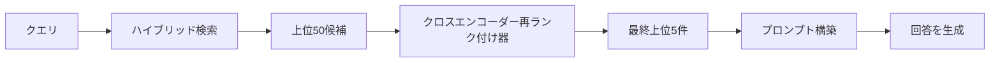
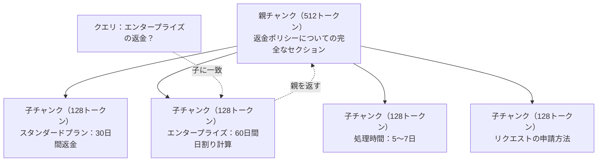
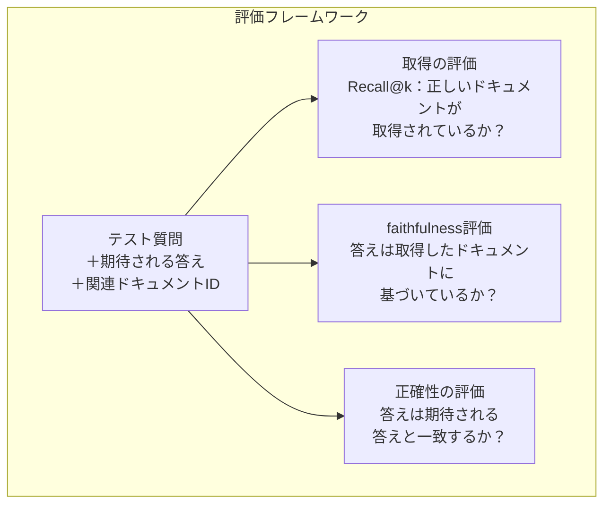

# Advanced RAG（チャンキング・再ランク付け・ハイブリッド検索）

> 基本的なRAGは最も類似した上位kチャンクを取得する。シンプルな質問にはこれで十分だ。マルチホップの推論・曖昧なクエリ・大規模なコーパスでは崩壊する。Advanced RAGは10ドキュメントで機能するデモと1,000万ドキュメントで機能するシステムの差だ。

**関連レッスン:** フェーズ5・23（RAGのチャンキング戦略）は6つのチャンキングアルゴリズム全体——再帰的・セマンティック・文・親ドキュメント・レイトチャンキング・コンテキスト取得——をVectara/Anthropicのベンチマーク付きで解説。このレッスンはその上に構築する：ハイブリッド検索・再ランク付け・クエリ変換。

## 学習目標

- ドキュメント構造とコンテキストを保持するAdvancedチャンキング戦略（セマンティック・再帰的・親子）を実装する
- BM25キーワードマッチングとセマンティックベクター検索とクロスエンコーダー再ランク付け器を組み合わせたハイブリッド検索パイプラインを構築する
- 曖昧または複雑な質問の取得を改善するクエリ変換技術（HyDE・マルチクエリ・ステップバック）を適用する
- よくあるRAGの失敗を診断して修正する：間違ったチャンクが取得される・コンテキストに答えがない・マルチホップの推論の崩壊

## 問題

レッスン06で基本的なRAGパイプラインを構築した。小規模なコーパスの単純な質問には機能する。ここでこれらを試してみる：

**曖昧なクエリ**：「先四半期の収益はいくらでしたか？」セマンティック検索は収益戦略・収益予測・CFOの収益成長についての考えに関するチャンクを返す。すべて「収益」という言葉と意味的に類似している。しかし実際の数値を含むものはない。正しいチャンクは「2025年Q3で$47.2M」と書かれているが、「収益」の代わりに「利益」という言葉を使っている。埋め込みモデルは「Q3の利益は$47.2Mだった」より「収益戦略」の方がクエリに近いと判断する。

**マルチホップ質問**：「どのチームが最も顧客満足度スコアの改善を達成しましたか？」これは各チームの満足度スコアを見つけ・比較し・最大値を特定する必要がある。単一のチャンクには答えが含まれていない。情報は複数のチームレポートに散らばっている。

**大規模コーパスの問題**：200万チャンクがある。正しい答えはチャンク#1,847,293にある。上位5件の取得はチャンク#14・#89,201・#1,200,000・#44・#901,333を返す。埋め込み空間では近いが、どれも答えを含まない。このスケールでは、近似最近傍検索が十分なエラーを導入して関連する結果が上位kから押し出される。

基本的なRAGが失敗する理由：ベクターの類似性は関連性と同じではないからだ。チャンクはクエリと意味的に類似していてもそれに答えるのに役立たない場合がある。Advanced RAGはこれを4つの技術で対処する：ハイブリッド検索（キーワードマッチングを追加する）・再ランク付け（候補をより慎重にスコアリングする）・クエリ変換（検索前にクエリを修正する）・よりよいチャンキング（適切な粒度で取得する）。

## 概念

### ハイブリッド検索：セマンティック＋キーワード

セマンティック検索（ベクター類似性）は意味の理解が得意だ。「サブスクリプションをキャンセルするにはどうすればいいですか？」は単語を共有していなくても「プランを終了するステップ」に一致する。しかし完全一致を見逃す。「エラーコードE-4021」は埋め込みモデルがノイズとして扱う場合、「E-4021」を含むチャンクに一致しないかもしれない。

キーワード検索（BM25）は逆だ。完全一致が得意だ。「E-4021」は完璧に一致する。しかしドキュメントが「プランを終了する」と書いている場合、「サブスクリプションをキャンセルする」は結果ゼロを返す。

ハイブリッド検索は両方を実行してから結果をマージする。

**BM25**（Best Matching 25）は標準的なキーワード検索アルゴリズムだ。1990年代から検索エンジンのバックボーンになっている。公式：

```
BM25(q, d) = 項目qの各用語tの合計:
    IDF(t) * (tf(t,d) * (k1 + 1)) / (tf(t,d) + k1 * (1 - b + b * |d| / avgdl))
```

tf(t,d)はドキュメントd内の用語tの頻度・IDF(t)は逆文書頻度・|d|はドキュメント長・avgdlは平均ドキュメント長・k1は用語頻度の飽和を制御する（デフォルト1.2）・bは長さの正規化を制御する（デフォルト0.75）。

平易な言葉で言うと：BM25はクエリの用語を含むドキュメント（特にまれな用語）に高いスコアを付けるが、繰り返しの用語では逓減収益となる。「収益」という言葉を50回含むドキュメントは、1回含むドキュメントより50倍関連性が高いわけではない。

### 相互ランクフュージョン（RRF）

2つのランクリストがある：ベクター検索からの1つとBM25からの1つ。どのように組み合わせるか？Reciprocal Rank Fusionが標準的なアプローチだ。

```
RRF_score(d) = ランキングRの合計:
    1 / (k + rank_R(d))
```

kは定数（通常60）で、最高ランクの結果が支配するのを防ぐ。

ベクター検索で#1・BM25で#5のドキュメントは：1/(60+1) + 1/(60+5) = 0.0164 + 0.0154 = 0.0318

ベクター検索で#3・BM25で#2のドキュメントは：1/(60+3) + 1/(60+2) = 0.0159 + 0.0161 = 0.0320

RRFは自然に2つのシグナルのバランスを取る。両方のリストで高くランクされるドキュメントが最良のスコアを得る。一方のリストで#1にランクされるが他方にないドキュメントは中程度のスコアを得る。これは生のスコアではなくランクを使うため、2つのシステム間のスコア分布の違いは重要ではなく、ロバストだ。

### 再ランク付け

取得（ベクター・キーワード・ハイブリッドのいずれか）は速いが不正確だ。バイエンコーダーを使う：クエリと各ドキュメントを独立して埋め込んで比較する。埋め込みは一度計算されてキャッシュされる。これは何百万ものドキュメントにスケールする。

再ランク付けはクロスエンコーダーを使う：クエリと候補ドキュメントを関連性スコアを出力するモデルに一緒に入力する。モデルは両方のテキストを同時に見て、それらの間の細かいインタラクションをとらえることができる。クロスエンコーダーは「Q3の収益はいくらでしたか？」が「Q3で$47.2M」を含むチャンクと高度に関連していることを、バイエンコーダーが接続を見逃した場合でも理解できる。

トレードオフ：クロスエンコーダーはクエリとドキュメントのペアを共同処理するため、バイエンコーダーより100〜1,000倍遅い。100万ドキュメントに対してクロスエンコーダーのスコアを事前計算することはできない。解決策：より大きな候補セットを取得し（ハイブリッド検索で上位50件）、クロスエンコーダーで再ランク付けして最終上位5件を得る。



よく使われる再ランク付けモデル（2026年のラインナップ）：
- Cohere Rerank 3.5：マネージドAPI・多言語対応・混合コーパスでのリコール向上が最良
- Voyage rerank-2.5：マネージドAPI・ホスト型オプション中最低レイテンシ
- Jina-Reranker-v2 Multilingual：オープンウェイト・100以上の言語
- bge-reranker-v2-m3：オープンウェイト・強いベースライン
- cross-encoder/ms-marco-MiniLM-L-6-v2：オープンウェイト・プロトタイピング向けにCPUで動作
- ColBERTv2 / Jina-ColBERT-v2：レイトインタラクションマルチベクター再ランク付け器——スコアリング時にO(docs)ではなくO(tokens)

### クエリ変換

問題が取得ではなくクエリ自体にあることがある。「新しいポリシー変更についてのあれは何でしたか？」はひどい検索クエリだ。具体的な用語が含まれていない。埋め込みは曖昧だ。どんな取得システムもこれから正しいドキュメントを見つけることはできない。

**クエリの書き換え**：ユーザーのクエリをより良い検索クエリに言い換える。LLMがこれを実行できる：

```
ユーザー: 「新しいポリシー変更についてのあれは何でしたか？」
書き換え後: 「最近のポリシー変更とアップデート」
```

**HyDE（Hypothetical Document Embeddings）**：クエリで検索する代わりに、仮説的な答えを生成してそれを埋め込み、類似した実際のドキュメントを検索する。

```
クエリ: 「エンタープライズの返金ポリシーは何ですか？」
仮説的な答え: 「エンタープライズのお客様は購入後60日以内に全額返金を受ける資格があります。
返金はサブスクリプション期間の残り期間に基づいて日割り計算され、5〜7営業日以内に処理されます。」
```

仮説的な答えを埋め込んでそれに類似した実際のドキュメントを検索する。直感：仮説的な答えは元の質問よりも実際の答えに近い埋め込み空間に存在する。質問と答えは異なる言語構造を持つ。仮説的な答えを生成することで、埋め込み内の「質問空間」と「答え空間」の間のギャップを埋める。

HyDEは取得前に1回のLLM呼び出しを追加する。レイテンシが500〜2000ms増加する。生のクエリでの取得品質が悪い場合は価値がある。

### 親子チャンキング

標準的なチャンキングはトレードオフを強いる：正確な取得のための小さなチャンク、十分なコンテキストのための大きなチャンク。親子チャンキングはこのトレードオフを解消する。

取得のために小さなチャンク（128トークン）をインデックスする。小さなチャンクが取得されたとき、プロンプトには親チャンク（512トークン）を返す。小さなチャンクはクエリに正確に一致する。親チャンクはLLMが良い答えを生成するのに十分なコンテキストを提供する。



クエリ「エンタープライズの返金？」は子チャンクC2に正確に一致する。しかしプロンプトには、処理時間と申請プロセスについての周囲のコンテキストを含む完全な親チャンクPが届く。

### メタデータフィルタリング

ベクター検索を実行する前に、メタデータでコーパスをフィルタリングする：日付・ソース・カテゴリー・著者・言語。これにより検索スペースが削減され、無関係な結果が防がれる。

「先月のセキュリティポリシーで何が変わりましたか？」はセキュリティカテゴリーの過去30日間のドキュメントのみを検索すべきだ。メタデータフィルタリングがなければ、コーパス全体を検索して意味的に類似している2年前のセキュリティドキュメントが取得されるかもしれない。

本番のRAGシステムは各チャンクとともにメタデータを保存する：ソースドキュメント・作成日・カテゴリー・著者・バージョン。ベクターデータベースは類似性検索の前にメタデータによる事前フィルタリングをサポートしており、これが大規模なパフォーマンスにとって重要だ。

### 評価

RAGシステムを構築した。それが機能するかどうかをどうやって知るか？3つの指標：

**取得の関連性（Recall@k）**：既知の関連ドキュメントを持つテスト質問のセットに対して、上位k件の結果に関連ドキュメントのどのくらいの割合が含まれているか？質問の答えがチャンク#47にある場合、チャンク#47は上位5件に含まれているか？

**faithfulness**：生成された答えは取得されたドキュメントに基づいているか？取得されたチャンクが「60日間の返金ウィンドウ」と書いており、モデルが「90日間の返金ウィンドウ」と言った場合、それはfaithfulnessの失敗だ。正しいコンテキストを持っているにもかかわらずモデルがハルシネーションした。

**答えの正確性**：生成された答えは期待される答えと一致するか？これがエンドツーエンドの指標だ。取得品質と生成品質の両方を組み合わせる。

シンプルなfaithfulnessチェック：生成された答えの各主張を受け取り、取得されたチャンクに（実質的に）含まれていることを確認する。答えに取得されたチャンクにない事実が含まれている場合、それはおそらくハルシネーションだ。



## 実装する

### Step 1: BM25の実装

```python
import math
from collections import Counter

class BM25:
    def __init__(self, k1=1.2, b=0.75):
        self.k1 = k1
        self.b = b
        self.docs = []
        self.doc_lengths = []
        self.avg_dl = 0
        self.doc_freqs = {}
        self.n_docs = 0

    def index(self, documents):
        self.docs = documents
        self.n_docs = len(documents)
        self.doc_lengths = []
        self.doc_freqs = {}

        for doc in documents:
            words = doc.lower().split()
            self.doc_lengths.append(len(words))
            unique_words = set(words)
            for word in unique_words:
                self.doc_freqs[word] = self.doc_freqs.get(word, 0) + 1

        self.avg_dl = sum(self.doc_lengths) / self.n_docs if self.n_docs else 1

    def score(self, query, doc_idx):
        query_words = query.lower().split()
        doc_words = self.docs[doc_idx].lower().split()
        doc_len = self.doc_lengths[doc_idx]
        word_counts = Counter(doc_words)
        score = 0.0

        for term in query_words:
            if term not in word_counts:
                continue
            tf = word_counts[term]
            df = self.doc_freqs.get(term, 0)
            idf = math.log((self.n_docs - df + 0.5) / (df + 0.5) + 1)
            numerator = tf * (self.k1 + 1)
            denominator = tf + self.k1 * (1 - self.b + self.b * doc_len / self.avg_dl)
            score += idf * numerator / denominator

        return score

    def search(self, query, top_k=10):
        scores = [(i, self.score(query, i)) for i in range(self.n_docs)]
        scores.sort(key=lambda x: x[1], reverse=True)
        return scores[:top_k]
```

### Step 2: 相互ランクフュージョン

```python
def reciprocal_rank_fusion(ranked_lists, k=60):
    scores = {}
    for ranked_list in ranked_lists:
        for rank, (doc_id, _) in enumerate(ranked_list):
            if doc_id not in scores:
                scores[doc_id] = 0.0
            scores[doc_id] += 1.0 / (k + rank + 1)
    fused = sorted(scores.items(), key=lambda x: x[1], reverse=True)
    return fused
```

### Step 3: ハイブリッド検索パイプライン

```python
def hybrid_search(query, chunks, vector_embeddings, vocab, idf, bm25_index, top_k=5, fusion_k=60):
    query_emb = tfidf_embed(query, vocab, idf)
    vector_results = search(query_emb, vector_embeddings, top_k=top_k * 3)
    bm25_results = bm25_index.search(query, top_k=top_k * 3)
    fused = reciprocal_rank_fusion([vector_results, bm25_results], k=fusion_k)
    return fused[:top_k]
```

### Step 4: シンプルな再ランク付け器

本番では、クロスエンコーダーモデルを使う。ここでは単語の重複・用語の重要性・フレーズマッチングを使ってクエリとドキュメントの関連性をスコアリングする再ランク付け器を構築する。

```python
def rerank(query, candidates, chunks):
    query_words = set(query.lower().split())
    stop_words = {"the", "a", "an", "is", "are", "was", "were", "what", "how",
                  "why", "when", "where", "do", "does", "for", "of", "in", "to",
                  "and", "or", "on", "at", "by", "it", "its", "this", "that",
                  "with", "from", "be", "has", "have", "had", "not", "but"}
    query_terms = query_words - stop_words

    scored = []
    for doc_id, initial_score in candidates:
        chunk = chunks[doc_id].lower()
        chunk_words = set(chunk.split())

        term_overlap = len(query_terms & chunk_words)

        query_bigrams = set()
        q_list = [w for w in query.lower().split() if w not in stop_words]
        for i in range(len(q_list) - 1):
            query_bigrams.add(q_list[i] + " " + q_list[i + 1])
        bigram_matches = sum(1 for bg in query_bigrams if bg in chunk)

        position_boost = 0
        for term in query_terms:
            pos = chunk.find(term)
            if pos != -1 and pos < len(chunk) // 3:
                position_boost += 0.5

        rerank_score = (
            term_overlap * 1.0
            + bigram_matches * 2.0
            + position_boost
            + initial_score * 5.0
        )
        scored.append((doc_id, rerank_score))

    scored.sort(key=lambda x: x[1], reverse=True)
    return scored
```

### Step 5: HyDE（Hypothetical Document Embeddings）

```python
def hyde_generate_hypothesis(query):
    templates = {
        "what": "The answer to '{query}' is as follows: Based on our documentation, {topic} involves specific policies and procedures that define how the process works.",
        "how": "To address '{query}': The process involves several steps. First, you need to initiate the request. Then, the system processes it according to the defined rules.",
        "default": "Regarding '{query}': Our records indicate specific details and policies related to this topic that provide a comprehensive answer."
    }
    query_lower = query.lower()
    if query_lower.startswith("what"):
        template = templates["what"]
    elif query_lower.startswith("how"):
        template = templates["how"]
    else:
        template = templates["default"]

    topic_words = [w for w in query.lower().split()
                   if w not in {"what", "is", "the", "how", "do", "does", "a", "an",
                                "for", "of", "to", "in", "on", "at", "by", "and", "or"}]
    topic = " ".join(topic_words) if topic_words else "this topic"

    return template.format(query=query, topic=topic)


def hyde_search(query, chunks, vector_embeddings, vocab, idf, top_k=5):
    hypothesis = hyde_generate_hypothesis(query)
    hypothesis_emb = tfidf_embed(hypothesis, vocab, idf)
    results = search(hypothesis_emb, vector_embeddings, top_k)
    return results, hypothesis
```

### Step 6: 親子チャンキング

```python
def create_parent_child_chunks(text, parent_size=200, child_size=50):
    words = text.split()
    parents = []
    children = []
    child_to_parent = {}

    parent_idx = 0
    start = 0
    while start < len(words):
        parent_end = min(start + parent_size, len(words))
        parent_text = " ".join(words[start:parent_end])
        parents.append(parent_text)

        child_start = start
        while child_start < parent_end:
            child_end = min(child_start + child_size, parent_end)
            child_text = " ".join(words[child_start:child_end])
            child_idx = len(children)
            children.append(child_text)
            child_to_parent[child_idx] = parent_idx
            child_start += child_size

        parent_idx += 1
        start += parent_size

    return parents, children, child_to_parent
```

### Step 7: faithfulness評価

```python
def evaluate_faithfulness(answer, retrieved_chunks):
    answer_sentences = [s.strip() for s in answer.split(".") if len(s.strip()) > 10]
    if not answer_sentences:
        return 1.0, []

    grounded = 0
    ungrounded = []
    context = " ".join(retrieved_chunks).lower()

    for sentence in answer_sentences:
        words = set(sentence.lower().split())
        stop_words = {"the", "a", "an", "is", "are", "was", "were", "and", "or",
                      "to", "of", "in", "for", "on", "at", "by", "it", "this", "that"}
        content_words = words - stop_words
        if not content_words:
            grounded += 1
            continue

        matched = sum(1 for w in content_words if w in context)
        ratio = matched / len(content_words) if content_words else 0

        if ratio >= 0.5:
            grounded += 1
        else:
            ungrounded.append(sentence)

    score = grounded / len(answer_sentences) if answer_sentences else 1.0
    return score, ungrounded


def evaluate_retrieval_recall(queries_with_relevant, retrieval_fn, k=5):
    total_recall = 0.0
    results = []

    for query, relevant_indices in queries_with_relevant:
        retrieved = retrieval_fn(query, k)
        retrieved_indices = set(idx for idx, _ in retrieved)
        relevant_set = set(relevant_indices)
        hits = len(retrieved_indices & relevant_set)
        recall = hits / len(relevant_set) if relevant_set else 1.0
        total_recall += recall
        results.append({
            "query": query,
            "recall": recall,
            "hits": hits,
            "total_relevant": len(relevant_set)
        })

    avg_recall = total_recall / len(queries_with_relevant) if queries_with_relevant else 0
    return avg_recall, results
```

## 使ってみる

実際のクロスエンコーダーで再ランク付けする：

```python
from sentence_transformers import CrossEncoder

reranker = CrossEncoder("cross-encoder/ms-marco-MiniLM-L-6-v2")

def rerank_with_cross_encoder(query, candidates, chunks, top_k=5):
    pairs = [(query, chunks[doc_id]) for doc_id, _ in candidates]
    scores = reranker.predict(pairs)
    scored = list(zip([doc_id for doc_id, _ in candidates], scores))
    scored.sort(key=lambda x: x[1], reverse=True)
    return scored[:top_k]
```

Cohereのマネージド再ランク付け器を使う：

```python
import cohere

co = cohere.Client()

def rerank_with_cohere(query, candidates, chunks, top_k=5):
    docs = [chunks[doc_id] for doc_id, _ in candidates]
    response = co.rerank(
        model="rerank-english-v3.0",
        query=query,
        documents=docs,
        top_n=top_k
    )
    return [(candidates[r.index][0], r.relevance_score) for r in response.results]
```

実際のLLMを使ったHyDE：

```python
import anthropic

client = anthropic.Anthropic()

def hyde_with_llm(query):
    response = client.messages.create(
        model="claude-sonnet-4-20250514",
        max_tokens=256,
        messages=[{
            "role": "user",
            "content": f"Write a short paragraph that would be a good answer to this question. Do not say you don't know. Just write what the answer would look like.\n\nQuestion: {query}"
        }]
    )
    return response.content[0].text
```

Weaviateを使った本番のハイブリッド検索：

```python
import weaviate

client = weaviate.connect_to_local()

collection = client.collections.get("Documents")
response = collection.query.hybrid(
    query="enterprise refund policy",
    alpha=0.5,
    limit=10
)
```

alphaパラメーターはバランスを制御する：0.0=純粋なキーワード（BM25）・1.0=純粋なベクター・0.5=均等なウェイト。ほとんどの本番システムはalphaを0.3〜0.7の間で使う。

## 成果物を出す

このレッスンでは以下を作成する：
- `outputs/prompt-advanced-rag-debugger.md` — RAG品質の問題を診断して修正するためのプロンプト
- `outputs/skill-advanced-rag.md` — ハイブリッド検索と再ランク付けを使った本番グレードのRAG構築のためのスキル

## 演習

1. サンプルドキュメントでBM25とベクター検索とハイブリッド検索を比較する。5つのテストクエリのそれぞれについて、どのアプローチが1位に最も関連するチャンクを返すかを記録する。ハイブリッド検索は5つのうち少なくとも3つで勝つはずだ。

2. メタデータフィルターを実装する。各ドキュメントに「カテゴリー」フィールド（セキュリティ・請求・api・製品）を追加する。ベクター検索を実行する前に、関連するカテゴリーのみにチャンクをフィルタリングする。「どんな暗号化が使われていますか？」でテストして、セキュリティカテゴリーのチャンクのみを検索することを確認する。

3. レッスン06のシンプルな生成関数を使って完全なHyDEパイプラインを構築する。5つのすべてのテストクエリで直接クエリ検索とHyDE検索の取得品質（上位3件の関連性）を比較する。HyDEは曖昧なクエリで結果を改善するはずだ。

4. サンプルドキュメントで親子チャンキング戦略を実装する。child_size=30・parent_size=100を使う。子チャンクで検索するが、プロンプトには親チャンクを返す。chunk_size=50の標準的なチャンキングと比較して生成された答えを比較する。

5. 評価データセットを作成する：既知の答えチャンクを持つ10の質問。（a）ベクター検索のみ・（b）BM25のみ・（c）ハイブリッド検索・（d）ハイブリッド＋再ランク付けのRecall@3・Recall@5・Recall@10を計測する。結果をプロットして再ランク付けが最も効果的な場所を特定する。

## キーワード

| 用語 | 一般的な言い方 | 実際の意味 |
|------|----------------|----------------------|
| BM25 | 「キーワード検索」 | 用語頻度・逆文書頻度・ドキュメント長の正規化によってドキュメントをスコアリングする確率的ランキングアルゴリズム |
| ハイブリッド検索 | 「いいとこ取り」 | セマンティック（ベクター）検索とキーワード（BM25）検索を並行して実行し、ランクフュージョンで結果をマージする |
| 相互ランクフュージョン | 「ランクリストのマージ」 | すべてのリストにわたって各ドキュメントの1/(k + ランク)を合計することで複数のランクリストを組み合わせる |
| 再ランク付け | 「第2パスのスコアリング」 | より高コストなクロスエンコーダーモデルを使って初期取得からの候補セットを再スコアリングする |
| クロスエンコーダー | 「共同クエリ-ドキュメントモデル」 | クエリとドキュメントを単一入力として取り関連性スコアを出力するモデル。バイエンコーダーより正確だが全コーパス検索には遅すぎる |
| バイエンコーダー | 「独立した埋め込みモデル」 | クエリとドキュメントを独立して埋め込むモデル。埋め込みが事前計算されるため速いが、クロスエンコーダーより精度が低い |
| HyDE | 「偽の答えで検索する」 | クエリへの仮説的な答えを生成し、それを埋め込み、類似した実際のドキュメントを検索する |
| 親子チャンキング | 「小さく検索・大きなコンテキスト」 | 正確な取得のために小さなチャンクをインデックスするが、十分なコンテキストを提供するためにより大きな親チャンクを返す |
| メタデータフィルタリング | 「検索前に絞り込む」 | ベクター検索を実行する前に属性（日付・ソース・カテゴリー）でドキュメントをフィルタリングして検索スペースを削減する |
| faithfulness | 「グラウンデッドを保つ」 | 生成された答えが取得されたドキュメントによって支持されているかどうか。モデルの訓練データからのハルシネーションと対比する |

## 参考資料

- Robertson & Zaragoza、「The Probabilistic Relevance Framework: BM25 and Beyond」（2009） — BM25の決定的なリファレンス。公式の背後にある確率的基礎を説明する
- Cormack et al.、「Reciprocal Rank Fusion Outperforms Condorcet and Individual Rank Learning Methods」（2009） — RRFがより複雑なフュージョン方法に勝ることを示した元のRRF論文
- Gao et al.、「Precise Zero-Shot Dense Retrieval without Relevance Labels」（2022） — 仮説的なドキュメント埋め込みが訓練データなしで取得を改善することを示したHyDE論文
- Nogueira & Cho、「Passage Re-ranking with BERT」（2019） — BM25上でのクロスエンコーダー再ランク付けが取得品質を大幅に改善することを示した
- [Khattab et al., 「DSPy: Compiling Declarative Language Model Calls into Self-Improving Pipelines」（2023）](https://arxiv.org/abs/2310.03714) — プロンプト構築とウェイト選択を取得パイプライン上の最適化問題として扱う。「LLMにプロンプトを出す」ではなく「LLMをプログラムする」ために読む
- [Edge et al., 「From Local to Global: A Graph RAG Approach to Query-Focused Summarization」（Microsoft Research 2024）](https://arxiv.org/abs/2404.16130) — GraphRAG論文：エンティティ関係抽出＋Leidenコミュニティ検出でクエリフォーカスの要約。グローバル取得とローカル取得の区別
- [Asai et al., 「Self-RAG: Learning to Retrieve, Generate, and Critique through Self-Reflection」（ICLR 2024）](https://arxiv.org/abs/2310.11511) — リフレクショントークンを使った自己評価RAG。静的な取得してから生成するパターンを超えたエージェンティックなフロンティア
- [LangChain Query Constructionブログ](https://blog.langchain.dev/query-construction/) — 自然言語クエリを構造化データベースクエリ（Text-to-SQL・Cypher）に変換する事前取得ステップ
