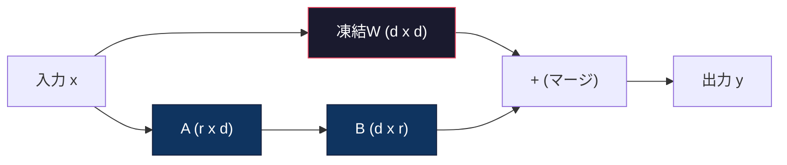
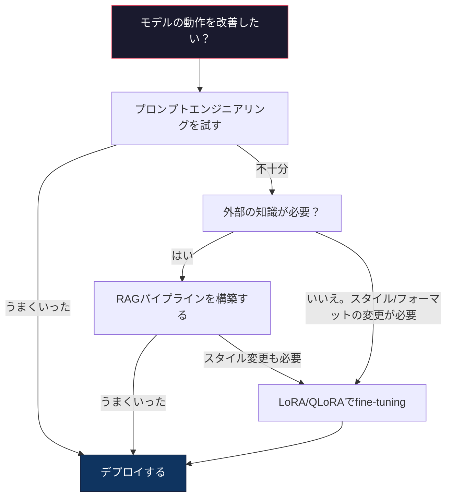

# LoRA & QLoRAによるfine-tuning

> 7Bモデルのfull fine-tuningには56GBのVRAMが必要だ。あなたにはない。ほとんどの企業にもない。LoRAはパラメーターの1%未満を訓練することで同じモデルを6GBでfine-tuningできる。これは妥協ではない——ほとんどのタスクでfull fine-tuningと同等の品質を達成する。オープンソースのfine-tuningエコシステム全体がこの1つのトリックで動いている。

**関連レッスン:** フェーズ10でSFT/DPOループをゼロから解説。このレッスンはそれを2026年のPEFTツールキット（PEFT・TRL・Unsloth・Axolotl・LLaMA-Factory）に接続する。

## 学習目標

- 事前訓練モデルのアテンション層に低ランクアダプター行列（AとB）を注入することでLoRAを実装する
- LoRAとfull fine-tuningのパラメーター節約を計算する：d_model次元のランクrはd^2ではなく2*r*dのパラメーターを訓練する
- コンシューマーGPUのメモリに収めるためにQLoRA（4ビット量子化ベース＋LoRAアダプター）を使ってモデルをfine-tuningする
- デプロイのためにLoRAウェイトをベースモデルにマージし、アダプターあり・なしの推論速度を比較する

## 問題

ベースモデルがある。Llama 3 8B。会社のボイスでカスタマーサポートチケットに回答させたい。SFTが答えだ。しかしSFTにはコストの問題がある。

full fine-tuningはモデルのすべてのパラメーターを更新する。Llama 3 8Bには80億のパラメーターがある。fp16では各パラメーターが2バイトを取る。ウェイトをロードするだけで16GB必要だ。訓練中には、グラジエント（16GB）・Adamのオプティマイザー状態（モーメンタム＋分散で32GB）・活性化も必要になる。合計：1つの8Bモデルで約56GBのVRAM。

A100 80GBはかろうじてこれに収まる。2つのA100はクラウドプロバイダーで時間あたり$3〜4かかる。5万件の例を3エポック訓練すると6〜10時間かかる。1実験あたり$30〜40だ。ハイパーパラメーターを正しく設定するために10回実験すると、何もデプロイする前に$400を使ってしまう。

これをLlama 3 70Bにスケールすると数字は馬鹿げたものになる。ウェイトだけで140GB。クラスターが必要だ。1実験あたり$100以上。

さらに深い問題もある。full fine-tuningはモデルのすべてのウェイトを修正する。カスタマーサポートデータでfine-tuningすると、モデルの汎用的な能力を劣化させるかもしれない。これが壊滅的忘却と呼ばれるものだ。モデルはタスクが上手くなってそれ以外のことが下手になる。

より少ないパラメーターを訓練して・少ないメモリを使って・モデルの既存の知識を破壊しない方法が必要だ。

## 概念

### LoRA：低ランク適応

MicrosoftのEdward Huらが2021年6月にLoRAを発表した。論文の洞察：fine-tuning中のウェイト更新は内在的なランクが低い。4096x4096のウェイト行列の1677万2216個のパラメーター全部を更新する必要はない。更新内の有用な情報はランク16または32の行列でとらえることができる。

数式を見てみよう。標準的な線形層は次を計算する：

```
y = Wx
```

Wはd_out x d_inの行列だ。4096x4096のアテンション射影の場合、それは16,777,216個のパラメーターだ。

LoRAはWを凍結して低ランク分解を追加する：

```
y = Wx + BAx
```

BはAがd_out x r）で（r x d_in）だ。ランクrはdよりずっと小さい——通常は8・16・32。

4096x4096の層でr=16の場合：
- 元のパラメーター：4096 x 4096 = 16,777,216
- LoRAパラメーター：(4096 x 16) + (16 x 4096) = 65,536 + 65,536 = 131,072
- 削減率：131,072 / 16,777,216 = 0.78%

パラメーターの0.78%を訓練して品質の95〜100%を得ている。



Aはスケールされたランダム値で初期化される。Bはゼロで初期化される。BAの積はゼロから始まる——モデルは元の動作から訓練を始めて徐々に適応を学習する。

### スケーリング係数：Alpha

LoRAは低ランク更新が出力にどれだけ影響するかを制御するスケーリング係数alphaを導入する：

```
y = Wx + (alpha / r) * BAx
```

alpha = rのとき、スケーリングは1x。alpha = 2r（一般的なデフォルト）のとき、スケーリングは2x。このハイパーパラメーターはベース学習率とは独立してLoRAパスの学習率を制御する。

実用的なガイダンス：
- alpha = 2 * rankはコミュニティの一般的な慣習（元の論文はほとんどの実験でalpha = rankを使用）
- alpha = rankは1xスケーリングを与える。保守的だが安定している
- alphaが高いほどステップごとの更新が大きくなり、収束が早まるか不安定になる

### LoRAをどこに適用するか

トランスフォーマーには多くの線形層がある。すべてに追加する必要はない。元の論文は異なる組み合わせをテストした：

| ターゲット層 | 訓練可能なパラメーター（7B） | 品質 |
|------------|----------------------|------|
| q_projのみ | 4.7M | 良い |
| q_proj + v_proj | 9.4M | より良い |
| q_proj + k_proj + v_proj + o_proj | 18.9M | アテンションで最良 |
| すべての線形（アテンション＋MLP） | 37.7M | 限界的な改善・2xパラメーター |

ほとんどのタスクのスイートスポット：q_proj + v_proj。これはセルフアテンションのクエリとバリューの射影をターゲットにし、モデルが何に注意を向けるかと何の情報を抽出するかを制御する。MLP層を追加するとコード生成のような複雑なタスクに有効だが、よりシンプルなタスクでは逓減収益でパラメーター数が2倍になる。

### ランクの選択

ランクrは適応の表現力を制御する：

| ランク | 訓練可能なパラメーター（層ごと） | 最適なユースケース |
|------|---------------------------|----------|
| 4 | 32,768 | シンプルな分類・感情分析 |
| 8 | 65,536 | 単一ドメインのQ&A・要約 |
| 16 | 131,072 | マルチドメインタスク・インストラクションフォロー |
| 32 | 262,144 | 複雑な推論・コード生成 |
| 64 | 524,288 | ほとんどのタスクで逓減収益 |
| 128 | 1,048,576 | 正当化されることはまれ |

Huらはr=4がシンプルなタスクの適応のほとんどをすでにとらえることを示した。r=8とr=16が実際に最もよく使われる。r=64を超えるとめったに品質が改善されず、LoRAのメモリの優位性を失い始める。

### QLoRA：4ビット量子化＋LoRA

ワシントン大学のTim Dettmersらが2023年5月にQLoRAを発表した。アイデア：凍結されたベースモデルを4ビット精度に量子化し、その上にfp16のLoRAアダプターを付ける。

これによりメモリの計算が大きく変わる：

| 方法 | ウェイトメモリ（7B） | 訓練メモリ（7B） | 必要GPU |
|------|-------------------|---------------------|---------|
| full fine-tune（fp16） | 14GB | 〜56GB | 1x A100 80GB |
| LoRA（fp16ベース） | 14GB | 〜18GB | 1x A100 40GB |
| QLoRA（4ビットベース） | 3.5GB | 〜6GB | 1x RTX 3090 24GB |

QLoRAは3つの技術的貢献をする：

**NF4（Normal Float 4-bit）**：ニューラルネットワークのウェイト専用に設計された新しいデータ型。ニューラルネットワークのウェイトはおよそ正規分布に従う。NF4は16の量子化レベルを標準正規分布の分位数に配置する。これは正規分布データに対して情報理論的に最適だ。一様な4ビット量子化（INT4）や標準的なFloat4より少ない情報を失う。

**二重量子化**：量子化定数自体がメモリを取る。64ウェイトのブロックごとにfp32のスケールファクター（4バイト）が必要だ。7Bモデルでは余分に0.4GBになる。二重量子化はこれらの定数をfp8に量子化して、オーバーヘッドを0.1GBに削減する。小さいが積み重なる。

**ページドオプティマイザー**：訓練中、長いシーケンスではオプティマイザー状態（Adamのモーメンタムと分散）がGPUメモリを超えることがある。ページドオプティマイザーはNVIDIAのunified memoryを使ってGPUメモリが枯渇したときにオプティマイザー状態を自動的にCPU RAMにページアウトし、必要なときにページインする。スループットをある程度犠牲にしてOOMクラッシュを防ぐ。

### 品質の問題

パラメーターの削減やベースの量子化は品質を損なうか？複数の論文からの結果：

| 方法 | MMLU（5-shot） | MT-Bench | HumanEval |
|------|--------------|----------|-----------|
| full fine-tune（Llama 2 7B） | 48.3 | 6.72 | 14.6 |
| LoRA r=16 | 47.9 | 6.68 | 14.0 |
| QLoRA r=16（NF4） | 47.5 | 6.61 | 13.4 |
| QLoRA r=64（NF4） | 48.1 | 6.70 | 14.2 |

r=16のLoRAはほとんどのベンチマークでfull fine-tuningの1%以内だ。r=16のQLoRAはさらにわずかな割合を失う。r=64のQLoRAは90%少ないメモリを使いながらfull fine-tuningとほぼ同等だ。

### 実世界のコスト

5万件の例でLlama 3 8Bをfine-tuningする（3エポック）：

| 方法 | GPU | 時間 | コスト |
|------|-----|------|------|
| full fine-tune | 2x A100 80GB | 8時間 | 〜$32 |
| LoRA r=16 | 1x A100 40GB | 4時間 | 〜$8 |
| QLoRA r=16 | 1x RTX 4090 24GB | 6時間 | 〜$5 |
| QLoRA r=16（Unsloth） | 1x RTX 4090 24GB | 2.5時間 | 〜$2 |
| QLoRA r=16 | 1x T4 16GB | 12時間 | 〜$4 |

単一のコンシューマーGPUでのQLoRAはランチより安い。これが2023年にオープンウェイトのfine-tuningコミュニティが爆発した理由であり、2026年時点で以下のすべての訓練フレームワークがデフォルトでQLoRAを提供している理由だ。

### 2026年のPEFTスタック

| フレームワーク | 内容 | 選ぶ時 |
|-----------|-----------|-----------|
| **Hugging Face PEFT** | 標準的なLoRA/QLoRA/DoRA/IA3ライブラリ | 生のコントロールが必要で訓練ループがすでに`transformers.Trainer`上にある場合 |
| **TRL** | HFのreinforcement-from-feedbackトレーナー（SFT・DPO・GRPO・PPO・ORPO） | SFT後にDPO/GRPOが必要。PEFTの上に構築 |
| **Unsloth** | forward/backwardパスのTritonカーネル書き直し | 精度損失なしに2〜5xのスピードアップ＋半分のVRAMが欲しい場合。Llama/Mistral/Qwenファミリー |
| **Axolotl** | PEFT＋TRL＋DeepSpeed＋UnslothのYAML設定ラッパー | 再現可能でバージョン管理された訓練ランが欲しい場合 |
| **LLaMA-Factory** | PEFT＋TRLのGUI/CLI/API | コードゼロのfine-tuningが欲しい場合。100以上のモデルファミリーをサポート |
| **torchtune** | `transformers`の依存なしのネイティブPyTorchレシピ | 依存関係を最小にしたい場合とすでにPyTorchを標準化している組織 |

経験則：研究用途または1回限りの実験→PEFT。繰り返し可能な本番パイプライン→Unslothカーネル有効化のAxolotl。使い捨てのプロトタイピング→LLaMA-Factory。

### アダプターのマージ

訓練後、2つのものがある：凍結されたベースモデルと小さなLoRAアダプター（通常10〜100MB）。2つの選択肢：

1. **分離したまま**：ベースモデルをロードし、その上にアダプターをロードする。異なるタスクのためにアダプターを入れ替える。これが1つのベースモデルから複数のfine-tuningバリアントを提供する方法だ。

2. **永続的にマージ**：W' = W + (alpha/r) * BAを計算して結果を新しいフルモデルとして保存する。マージされたモデルは元と同じサイズだ。推論オーバーヘッドなし。管理するアダプターなし。

複数タスクの提供（カスタマーサポートアダプター・コードアダプター・翻訳アダプター）には分離したままにする。単一の特化したモデルのデプロイにはマージする。

複数のアダプターを組み合わせるためのAdvancedマージ技術：

- **TIES-Merging**（Yadavら 2023）：小さな大きさのパラメーターを刈り込み・符号の競合を解決し・マージする。アダプター間の干渉を削減する。
- **DARE**（Yuら 2023）：マージ前にランダムにアダプターパラメーターを削除して残りを再スケーリングする。能力を組み合わせるのに驚くほど効果的だ。
- **タスク演算**：アダプターウェイトを単純に加算または減算する。「コード」アダプターと「数学」アダプターを追加すると、多くの場合両方が得意なモデルが生成される。

### fine-tuningしてはいけない場合

fine-tuningは第3の選択肢であって最初ではない。

**最初：プロンプトエンジニアリング。** より良いシステムプロンプトを書く。few-shotの例を追加する。Chain-of-Thoughtを使う。コストゼロで数分でできる。プロンプティングで80%達成できるなら、おそらくfine-tuningは必要ない。

**次：RAG。** モデルが特定のデータ（ドキュメント・ナレッジベース・製品カタログ）を知る必要がある場合、取得はウェイトに焼き付けるよりも安価で保守が容易だ。レッスン06を参照。

**その次：fine-tuning。** プロンプティングで達成できない特定のスタイル・フォーマット・推論パターンをモデルに採用させる必要がある場合に使用する。一貫した構造化出力が必要な場合。より大きなモデルを小さなモデルに蒸留する必要がある場合。レイテンシが重要でfew-shotプロンプティングの余分なトークンを使えない場合。



## 実装する

純粋なPyTorchでLoRAをゼロから実装する。ライブラリなし。マジックなし。LoRA層を構築し・モデルに注入し・訓練し・ウェイトをマージして戻す。

### Step 1: LoRA層

```python
import torch
import torch.nn as nn
import math

class LoRALayer(nn.Module):
    def __init__(self, in_features, out_features, rank=8, alpha=16):
        super().__init__()
        self.rank = rank
        self.alpha = alpha
        self.scaling = alpha / rank

        self.A = nn.Parameter(torch.randn(in_features, rank) * (1 / math.sqrt(rank)))
        self.B = nn.Parameter(torch.zeros(rank, out_features))

    def forward(self, x):
        return (x @ self.A @ self.B) * self.scaling
```

Aはスケールされたランダム値で初期化される。Bはゼロで初期化される。BAの積はゼロから始まる——モデルは元の動作から訓練を始める。

### Step 2: LoRAでラップされた線形層

```python
class LinearWithLoRA(nn.Module):
    def __init__(self, linear, rank=8, alpha=16):
        super().__init__()
        self.linear = linear
        self.lora = LoRALayer(
            linear.in_features, linear.out_features, rank, alpha
        )

        for param in self.linear.parameters():
            param.requires_grad = False

    def forward(self, x):
        return self.linear(x) + self.lora(x)
```

元の線形層は凍結される。LoRAパラメーター（AとB）だけが訓練可能だ。

### Step 3: LoRAをモデルに注入する

```python
def inject_lora(model, target_modules, rank=8, alpha=16):
    for param in model.parameters():
        param.requires_grad = False

    lora_layers = {}
    for name, module in model.named_modules():
        if isinstance(module, nn.Linear):
            if any(t in name for t in target_modules):
                parent_name = ".".join(name.split(".")[:-1])
                child_name = name.split(".")[-1]
                parent = dict(model.named_modules())[parent_name]
                lora_linear = LinearWithLoRA(module, rank, alpha)
                setattr(parent, child_name, lora_linear)
                lora_layers[name] = lora_linear
    return lora_layers
```

まずモデルのすべてのパラメーターを凍結する。次にモデルツリーを走査して、ターゲット名に一致する線形層を見つけ、LoRAでラップされたバージョンに置き換える。LoRAのAとB行列がモデル全体で唯一の訓練可能なパラメーターだ。

### Step 4: パラメーターのカウント

```python
def count_parameters(model):
    total = sum(p.numel() for p in model.parameters())
    trainable = sum(p.numel() for p in model.parameters() if p.requires_grad)
    frozen = total - trainable
    return {
        "total": total,
        "trainable": trainable,
        "frozen": frozen,
        "trainable_pct": 100 * trainable / total if total > 0 else 0
    }
```

### Step 5: ウェイトをマージして戻す

```python
def merge_lora_weights(model):
    for name, module in model.named_modules():
        if isinstance(module, LinearWithLoRA):
            with torch.no_grad():
                merged = (
                    module.lora.A @ module.lora.B
                ) * module.lora.scaling
                module.linear.weight.data += merged.T
            parent_name = ".".join(name.split(".")[:-1])
            child_name = name.split(".")[-1]
            if parent_name:
                parent = dict(model.named_modules())[parent_name]
            else:
                parent = model
            setattr(parent, child_name, module.linear)
```

マージ後、LoRA層はなくなる。モデルはウェイトに適応が焼き付けられた元と同じサイズだ。推論オーバーヘッドなし。

### Step 6: QLoRA量子化のシミュレーション

```python
def quantize_to_nf4(tensor, block_size=64):
    blocks = tensor.reshape(-1, block_size)
    scales = blocks.abs().max(dim=1, keepdim=True).values / 7.0
    scales = torch.clamp(scales, min=1e-8)
    quantized = torch.round(blocks / scales).clamp(-8, 7).to(torch.int8)
    return quantized, scales

def dequantize_from_nf4(quantized, scales, original_shape):
    dequantized = quantized.float() * scales
    return dequantized.reshape(original_shape)
```

これは64ブロック内でウェイトを16の離散レベルにマッピングすることで4ビット量子化をシミュレートする。本番のQLoRAはGPU上での真のNF4のためにbitsandbytesライブラリを使う。

### Step 7: 訓練ループ

```python
def train_lora(model, data, epochs=5, lr=1e-3, batch_size=4):
    optimizer = torch.optim.AdamW(
        [p for p in model.parameters() if p.requires_grad], lr=lr
    )
    criterion = nn.MSELoss()

    losses = []
    for epoch in range(epochs):
        epoch_loss = 0.0
        n_batches = 0
        indices = torch.randperm(len(data["inputs"]))

        for i in range(0, len(indices), batch_size):
            batch_idx = indices[i:i + batch_size]
            x = data["inputs"][batch_idx]
            y = data["targets"][batch_idx]

            output = model(x)
            loss = criterion(output, y)

            optimizer.zero_grad()
            loss.backward()
            optimizer.step()

            epoch_loss += loss.item()
            n_batches += 1

        avg_loss = epoch_loss / n_batches
        losses.append(avg_loss)

    return losses
```

### Step 8: フルデモ

```python
def demo():
    torch.manual_seed(42)
    d_model = 256
    n_classes = 10

    model = nn.Sequential(
        nn.Linear(d_model, 512),
        nn.ReLU(),
        nn.Linear(512, 512),
        nn.ReLU(),
        nn.Linear(512, n_classes),
    )

    n_samples = 500
    x = torch.randn(n_samples, d_model)
    y = torch.randint(0, n_classes, (n_samples,))
    y_onehot = torch.zeros(n_samples, n_classes).scatter_(1, y.unsqueeze(1), 1.0)

    data = {"inputs": x, "targets": y_onehot}

    params_before = count_parameters(model)

    lora_layers = inject_lora(
        model, target_modules=["0", "2"], rank=8, alpha=16
    )

    params_after = count_parameters(model)

    losses = train_lora(model, data, epochs=20, lr=1e-3)

    merge_lora_weights(model)
    params_merged = count_parameters(model)

    return {
        "params_before": params_before,
        "params_after": params_after,
        "params_merged": params_merged,
        "losses": losses,
    }
```

デモは小さなモデルを作成し、2つの層にLoRAを注入し、訓練し、ウェイトをマージして戻す。パラメーター数はLoRA訓練中に完全に訓練可能から〜1%の訓練可能に下がり、マージ後に元のアーキテクチャに戻る。

## 使ってみる

Hugging Faceエコシステムを使うと、実際のモデルでLoRAを使うのに約20行のコードで済む：

```python
from transformers import AutoModelForCausalLM, AutoTokenizer
from peft import LoraConfig, get_peft_model, TaskType

model = AutoModelForCausalLM.from_pretrained("meta-llama/Llama-3.1-8B")
tokenizer = AutoTokenizer.from_pretrained("meta-llama/Llama-3.1-8B")

lora_config = LoraConfig(
    task_type=TaskType.CAUSAL_LM,
    r=16,
    lora_alpha=32,
    lora_dropout=0.05,
    target_modules=["q_proj", "v_proj"],
)

model = get_peft_model(model, lora_config)
model.print_trainable_parameters()
```

QLoRAにはbitsandbytesの量子化を追加する：

```python
from transformers import BitsAndBytesConfig

bnb_config = BitsAndBytesConfig(
    load_in_4bit=True,
    bnb_4bit_quant_type="nf4",
    bnb_4bit_compute_dtype=torch.bfloat16,
    bnb_4bit_use_double_quant=True,
)

model = AutoModelForCausalLM.from_pretrained(
    "meta-llama/Llama-3.1-8B",
    quantization_config=bnb_config,
    device_map="auto",
)

model = get_peft_model(model, lora_config)
```

それだけだ。同じ訓練ループ。同じデータパイプライン。ベースモデルは4ビットで動き、LoRAアダプターはfp16で訓練され、全体が6GBに収まる。

Hugging Face Trainerでの訓練：

```python
from transformers import TrainingArguments, Trainer
from datasets import load_dataset

dataset = load_dataset("tatsu-lab/alpaca", split="train[:5000]")

training_args = TrainingArguments(
    output_dir="./lora-llama",
    num_train_epochs=3,
    per_device_train_batch_size=4,
    gradient_accumulation_steps=4,
    learning_rate=2e-4,
    fp16=True,
    logging_steps=10,
    save_strategy="epoch",
    optim="paged_adamw_8bit",
)

trainer = Trainer(
    model=model,
    args=training_args,
    train_dataset=dataset,
)

trainer.train()

model.save_pretrained("./lora-adapter")
```

保存されたアダプターは10〜100MBだ。ベースモデルは手付かずのままだ。フルモデルを再配布せずにHugging Face Hubでアダプターを共有できる。

## 成果物を出す

このレッスンでは以下を作成する：
- `outputs/prompt-lora-advisor.md` — 特定のタスクのLoRAランク・ターゲットモジュール・ハイパーパラメーターの決定を助けるプロンプト
- `outputs/skill-fine-tuning-guide.md` — いつ・どのようにfine-tuningするかの意思決定ツリーをエージェントに教えるスキル

## 演習

1. **ランクアブレーション研究。** ランク2・4・8・16・32・64でデモを実行する。最終損失対ランクをプロットする。ランクを2倍にしても損失が半分にならなくなる逓減収益のポイントを見つける。256次元特徴のシンプルな分類タスクでは、これはr=8〜16周辺になるはずだ。

2. **ターゲットモジュールの比較。** 層「0」のみ・層「2」のみ・層「4」のみ・3つすべてをターゲットにするようにinject_loraを修正する。各バリアントを20エポック訓練する。収束速度と最終損失を比較する。これはq_proj対v_proj対すべての線形層をターゲットにする実際の意思決定を反映している。

3. **量子化誤差分析。** quantize_to_nf4 / dequantize_from_nf4の前後で訓練されたモデルのウェイト行列を取る。平均二乗誤差・最大絶対誤差・元の重みと再構築されたウェイトの相関を計算する。block_sizeの値32・64・128・256を実験する。

4. **マルチアダプター提供。** 異なるデータのサブセット（偶数インデックス対奇数インデックス）で2つのLoRAアダプターを訓練する。両方のアダプターを保存する。ベースモデルを一度ロードし、アダプターを入れ替えて各々が同じ入力に対して異なる出力を生成することを確認する。これが本番システムが1つのベースから複数のfine-tuningモデルを提供する方法だ。

5. **マージ対非マージの推論。** 同じ100個の入力でmerge_lora_weights前後のLoRAモデルの出力を比較する。出力が（浮動小数点の許容誤差1e-5内で）同一であることを確認する。次に両方の推論速度をベンチマークする——マージされた方は2つの行列乗算ではなく1つなので少し速いはずだ。

## キーワード

| 用語 | 一般的な言い方 | 実際の意味 |
|------|----------------|----------------------|
| LoRA | 「効率的なfine-tuning」 | 低ランク適応：ベースウェイトを凍結し、積が完全なウェイト更新を近似する2つの小さな行列AとBを訓練する |
| QLoRA | 「ラップトップでfine-tuning」 | 量子化LoRA：ベースモデルを4ビットNF4でロードし、その上にfp16のLoRAアダプターを訓練する。6GB VRAMで7Bのfine-tuningが可能になる |
| ランク（r） | 「モデルが学べる量」 | AとB行列の内次元。表現力対パラメーター数を制御する |
| Alpha | 「LoRAの学習率」 | LoRAの出力に適用されるスケーリング係数。alpha/rが最終出力への適応の寄与をスケールする |
| NF4 | 「4ビット量子化」 | Normal Float 4：正規分布の分位数に量子化レベルを持つ4ビットデータ型。ニューラルネットワークのウェイトに最適 |
| アダプター | 「訓練された小さな部分」 | ベースモデルのコピーの上にロード可能な別ファイル（10〜100MB）として保存されたLoRAのAとB行列 |
| ターゲットモジュール | 「どの層にLoRAを適用するか」 | LoRAアダプターが注入される特定の線形層（q_proj・v_projなど） |
| マージ | 「焼き付ける」 | W + (alpha/r) * BAを計算して元のウェイトを置き換える。推論時のアダプターオーバーヘッドをなくす |
| ページドオプティマイザー | 「訓練中にOOMしない」 | GPUメモリが枯渇したときにオプティマイザー状態（Adamのモーメンタム・分散）をCPUにオフロードする |
| 壊滅的忘却 | 「fine-tuningですべてが壊れた」 | すべてのウェイトを更新すると、モデルが以前に学習した能力を失う現象 |

## 参考資料

- Hu et al.、「LoRA: Low-Rank Adaptation of Large Language Models」（2021） — 低ランク分解法を紹介した元の論文。ランク4程度でGPT-3 175Bでテスト
- Dettmers et al.、「QLoRA: Efficient Finetuning of Quantized Language Models」（2023） — NF4・二重量子化・ページドオプティマイザーを導入。単一の48GB GPUで65Bのfine-tuningが可能に
- PEFTライブラリドキュメント（huggingface.co/docs/peft） — Hugging FaceエコシステムのLoRA・QLoRA・その他のパラメーター効率的な手法の標準ライブラリ
- Yadav et al.、「TIES-Merging: Resolving Interference When Merging Models」（2023） — 品質低下なしに複数のLoRAアダプターを組み合わせる技術
- [Rafailov et al., 「Direct Preference Optimization: Your Language Model is Secretly a Reward Model」（NeurIPS 2023）](https://arxiv.org/abs/2305.18290) — DPOの導出。報酬モデル不要でSFTの後に来る選好チューニングステージ
- [TRLドキュメント](https://huggingface.co/docs/trl/) — `SFTTrainer`・`DPOTrainer`・`KTOTrainer`・PEFT/bitsandbytes/Unslothとの統合サーフェスの公式リファレンス
- [Unslothドキュメント](https://docs.unsloth.ai/) — fine-tuningスループットを2倍にしてメモリを半分にするfusedカーネル。TRLの下のパフォーマンス層
- [Axolotlドキュメント](https://axolotl-ai-cloud.github.io/axolotl/) — YAMLで設定するマルチGPU SFT/DPO/QLoRAトレーナー。手書きスクリプトのコードとしての設定の代替
