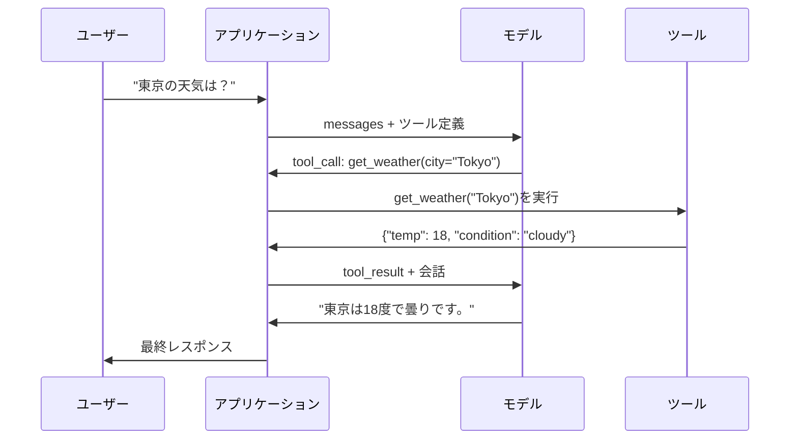

# ファンクションコーリングとツールの使用

> LLMは何もできない。テキストを生成する。それだけが機能の全てだ。天気を調べることも、データベースにクエリを投げることも、メールを送ることも、コードを実行することも、ファイルを読むこともできない。あなたが見てきた全ての「AIエージェント」は、どの関数を呼ぶかを示すJSONを生成するLLMだ——そして実際に呼び出すのはあなたのコードだ。モデルが脳だ。ツールが手だ。ファンクションコーリングはそれらをつなぐ神経系だ。

**関連レッスン:** フェーズ11·14（Model Context Protocol）——ツールを複数のホスト間で共有する場合は、インラインのファンクションコーリングからMCPサーバーに移行する。このレッスンはインラインのケースをカバーし、MCPはプロトコルのケースをカバーする。

## 学習目標

- ファンクションコーリングループを実装する：ツールスキーマの定義・モデルのtool-call JSONの解析・関数の実行・結果の返却
- モデルが確実に呼び出せる、明確な説明と型付きパラメーターを持つツールスキーマを設計する
- 複雑なクエリに答えるために複数のファンクションコールを連鎖させるマルチターンエージェントループを構築する
- ファンクションコーリングのエッジケースを処理する：並列ツールコール・エラーの伝播・無限ツールループの防止

## 問題

チャットボットを作る。ユーザーが聞く：「今の東京の天気は？」

モデルが返す：「リアルタイムの気象データにアクセスできませんが、季節から推測すると東京は15度前後だと思います...」

これは免責事項で包まれたハルシネーションだ。モデルは天気を知らない。永遠に知らないだろう。天気は毎時間変わる。モデルの訓練データは数ヶ月前のものだ。

正しい答えにはOpenWeatherMap APIを呼んで現在の気温を取得し、本当の数値を返す必要がある。モデルはAPIを呼べない。あなたのコードは呼べる。欠けているもの：モデルが「weather APIをこの引数で呼んでほしい」と伝え、あなたのコードがそれを実行して結果をフィードバックできる構造化プロトコルだ。

これがファンクションコーリングだ。モデルは呼び出す関数と引数を記述した構造化JSONを出力する。アプリケーションが関数を実行する。結果が会話に戻る。モデルは結果を使って最終的な回答を生成する。

ファンクションコーリングなしでは、LLMは百科事典だ。それがあれば、エージェントになる。

## 概念

### ファンクションコーリングループ

全てのツール使用のインタラクションは同じ5ステップのループに従う。



Step 1：ユーザーがメッセージを送る。Step 2：モデルはメッセージとツール定義（使用可能な関数を記述したJSON Schema）を受け取る。Step 3：テキストで応答する代わりに、モデルはツールコールを出力する——関数名と引数を含む構造化JSONオブジェクトだ。Step 4：あなたのコードが関数を実行して結果をキャプチャする。Step 5：結果がモデルに戻り、モデルは本当のデータで最終的な回答を生成できるようになる。

モデルは何も実行しない。何を呼ぶかとどの引数で呼ぶかを決めるだけだ。あなたのコードが実行者だ。

### ツール定義：JSON Schemaコントラクト

各ツールはモデルに関数が何をするか、どの引数を取るか、それらの型が何であるかを伝えるJSON Schemaによって定義される。

```json
{
  "type": "function",
  "function": {
    "name": "get_weather",
    "description": "Get current weather for a city. Returns temperature in Celsius and conditions.",
    "parameters": {
      "type": "object",
      "properties": {
        "city": {
          "type": "string",
          "description": "City name, e.g. 'Tokyo' or 'San Francisco'"
        },
        "units": {
          "type": "string",
          "enum": ["celsius", "fahrenheit"],
          "description": "Temperature units"
        }
      },
      "required": ["city"]
    }
  }
}
```

`description`フィールドは重要だ。モデルはそれを読んでいつどのようにツールを使うかを判断する。「gets weather」のような漠然とした説明は、「Get current weather for a city. Returns temperature in Celsius and conditions.」よりもツール選択の精度が下がる。descriptionはツール選択のためのプロンプトだ。

### プロバイダー比較

全ての主要プロバイダーがファンクションコーリングをサポートしているが、APIのインターフェースは異なる。

| プロバイダー | APIパラメーター | ツールコール形式 | 並列コール | 強制コール |
|----------|--------------|-----------------|---------------|----------------|
| OpenAI (GPT-5, o4) | `tools` | `tool_calls[].function` | あり（1ターンで複数） | `tool_choice="required"` |
| Anthropic (Claude 4.6/4.7) | `tools` | `content[].type="tool_use"` | あり（複数ブロック） | `tool_choice={"type":"any"}` |
| Google (Gemini 3) | `function_declarations` | `functionCall` | あり | `function_calling_config` |
| オープンウェイト（Llama 4・Qwen3・DeepSeek-V3） | Llama 4はネイティブ`tools`；その他はHermesまたはChatML | 混在 | モデル依存 | サポートされていれば`tool_choice`ベースのプロンプトまたはそれ以外 |

2026年までに3つのクローズドプロバイダーはほぼ同一のJSON Schemaベースのフォーマットに収束した。Llama 4はOpenAIの形状に合うネイティブの`tools`フィールドを搭載している。オープンウェイトのファインチューンはまだ様々で、Hermesフォーマットがサードパーティファインチューンでもっとも一般的だ。ホスト間で共有するツールには、インラインのファンクションコーリングよりMCP（フェーズ11·14）を優先する——サーバーは全てに対して同じだ。

### ツール選択：自動・必須・特定

モデルがいつツールを使うかを制御できる。

**自動**（デフォルト）：モデルはツールを呼ぶか直接応答するかを決める。「2+2は？」——直接応答する。「天気は？」——ツールを呼ぶ。

**必須**：モデルは少なくとも1つのツールを呼ばなければならない。ユーザーの意図がツールを必要とすることがわかっている場合に使う。モデルが調べる代わりに推測するのを防ぐ。

**特定の関数**：モデルに特定の関数を呼ばせる。`tool_choice={"type":"function", "function": {"name": "get_weather"}}`は、クエリに関わらずweatherツールが呼ばれることを保証する。ルーティングに使う——上流のロジックがすでにどのツールが必要かを決定した場合だ。

### 並列ファンクションコーリング

GPT-4oとClaudeは1ターンで複数の関数を呼べる。ユーザーが聞く：「東京とニューヨークの天気は？」モデルは2つのツールコールを同時に出力する：

```json
[
  {"name": "get_weather", "arguments": {"city": "Tokyo"}},
  {"name": "get_weather", "arguments": {"city": "New York"}}
]
```

あなたのコードは両方を（理想的には並列で）実行し、両方の結果を返し、モデルは1つの応答を統合する。これでラウンドトリップが2から1に減る。1クエリあたり5〜10のツールコールを持つエージェントでは、並列コーリングがレイテンシを60〜80%削減する。

### 構造化出力vsファンクションコーリング

レッスン03は構造化出力をカバーした。ファンクションコーリングは同じJSON Schemaの仕組みを使うが、異なる目的のためだ。

**構造化出力**：モデルに特定の形状でデータを生成させる。出力が最終的な成果物だ。例：テキストから製品情報を`{name, price, in_stock}`として抽出する。

**ファンクションコーリング**：モデルがアクションを実行する意図を宣言する。出力は中間ステップだ。例：`get_weather(city="Tokyo")`——モデルはアクションをリクエストしており、最終的な回答を生成しているのではない。

データ抽出が欲しいときは構造化出力を使う。モデルに外部システムとやり取りさせたいときはファンクションコーリングを使う。

### セキュリティ：守るべき必須ルール

ファンクションコーリングはLLMに与えられる最も危険な機能だ。モデルが何を実行するかを選択する。ツールセットにデータベースクエリが含まれていれば、モデルがクエリを構築する。シェルコマンドが含まれていれば、モデルがそれを書く。

**ルール1：モデルが生成したSQLを直接データベースに渡すな。** モデルはDROP TABLE・UNIONインジェクション・全行を返すクエリを生成することがある。常にパラメータ化する。常に検証する。常に操作のallowlistを使う。

**ルール2：関数をallowlistにする。** モデルはあなたが明示的に定義した関数しか呼べない。「名前で任意の関数を実行する」汎用ツールを作ってはならない。50の内部関数があるなら、ユーザーが必要とする5つだけを公開する。

**ルール3：引数を検証する。** モデルは`"; DROP TABLE users; --"`という都市名を渡すかもしれない。実行前に各引数を期待される型・範囲・形式に対して検証する。

**ルール4：ツールの結果をサニタイズする。** ツールが機密データ（APIキー・PII・内部エラー）を返す場合、モデルに送り返す前にフィルタリングする。モデルはツールの結果をそのままレスポンスに含める。

**ルール5：ツールコールのレート制限をかける。** ループ内のモデルは何百回もツールを呼ぶことがある。最大値を設定する（1会話あたり10〜20コールが妥当だ）。無限ループを断ち切る。

### エラーハンドリング

ツールは失敗する。APIはタイムアウトする。データベースがダウンする。ファイルが存在しない。モデルはツールが失敗したとき、そしてその理由を知る必要がある。

エラーは例外ではなく構造化したツール結果として返す：

```json
{
  "error": true,
  "message": "City 'Toky' not found. Did you mean 'Tokyo'?",
  "code": "CITY_NOT_FOUND"
}
```

モデルはこれを読んで引数を調整し、リトライする。モデルは構造化されたエラーメッセージから自己修正が得意だ。空のレスポンスや一般的な「何かがおかしくなった」エラーからの回復は苦手だ。

### MCP：Model Context Protocol

MCPはAnthropicのツール相互運用性のオープンスタンダードだ。全てのアプリケーションが独自のツールを定義する代わりに、MCPは普遍的なプロトコルを提供する：ツールはMCPサーバーで提供され、MCPクライアント（Claude Code・Cursor・あなたのアプリケーションなど）によって消費される。

1つのMCPサーバーが任意の互換クライアントにツールを公開できる。Postgres MCPサーバーはMCP互換の全てのエージェントにデータベースアクセスを提供する。GitHub MCPサーバーは全てのエージェントにリポジトリアクセスを提供する。ツールは一度定義されて、どこでも使われる。

MCPはファンクションコーリングにとってのHTTPがネットワーキングにとってのようなものだ。トランスポート層を標準化してツールをポータブルにする。

## 実装する

### Step 1: ツールレジストリの定義

ツール定義とその実装を保存するレジストリを構築する。各ツールにはJSON Schemaの定義（モデルが見るもの）とPython関数（あなたのコードが実行するもの）がある。

```python
import json
import math
import time
import hashlib


TOOL_REGISTRY = {}


def register_tool(name, description, parameters, function):
    TOOL_REGISTRY[name] = {
        "definition": {
            "type": "function",
            "function": {
                "name": name,
                "description": description,
                "parameters": parameters,
            },
        },
        "function": function,
    }
```

### Step 2: 5つのツールを実装する

計算機・天気検索・ウェブ検索シミュレーター・ファイルリーダー・コードランナーを構築する。

```python
def calculator(expression, precision=2):
    allowed = set("0123456789+-*/.() ")
    if not all(c in allowed for c in expression):
        return {"error": True, "message": f"Invalid characters in expression: {expression}"}
    try:
        result = eval(expression, {"__builtins__": {}}, {"math": math})
        return {"result": round(float(result), precision), "expression": expression}
    except Exception as e:
        return {"error": True, "message": str(e)}


WEATHER_DB = {
    "tokyo": {"temp_c": 18, "condition": "cloudy", "humidity": 72, "wind_kph": 14},
    "new york": {"temp_c": 22, "condition": "sunny", "humidity": 45, "wind_kph": 8},
    "london": {"temp_c": 12, "condition": "rainy", "humidity": 88, "wind_kph": 22},
    "san francisco": {"temp_c": 16, "condition": "foggy", "humidity": 80, "wind_kph": 18},
    "sydney": {"temp_c": 25, "condition": "sunny", "humidity": 55, "wind_kph": 10},
}


def get_weather(city, units="celsius"):
    key = city.lower().strip()
    if key not in WEATHER_DB:
        suggestions = [c for c in WEATHER_DB if c.startswith(key[:3])]
        return {
            "error": True,
            "message": f"City '{city}' not found.",
            "suggestions": suggestions,
            "code": "CITY_NOT_FOUND",
        }
    data = WEATHER_DB[key].copy()
    if units == "fahrenheit":
        data["temp_f"] = round(data["temp_c"] * 9 / 5 + 32, 1)
        del data["temp_c"]
    data["city"] = city
    return data


SEARCH_DB = {
    "python function calling": [
        {"title": "OpenAI Function Calling Guide", "url": "https://platform.openai.com/docs/guides/function-calling", "snippet": "Learn how to connect LLMs to external tools."},
        {"title": "Anthropic Tool Use", "url": "https://docs.anthropic.com/en/docs/tool-use", "snippet": "Claude can interact with external tools and APIs."},
    ],
    "MCP protocol": [
        {"title": "Model Context Protocol", "url": "https://modelcontextprotocol.io", "snippet": "An open standard for connecting AI models to data sources."},
    ],
    "weather API": [
        {"title": "OpenWeatherMap API", "url": "https://openweathermap.org/api", "snippet": "Free weather API with current, forecast, and historical data."},
    ],
}


def web_search(query, max_results=3):
    key = query.lower().strip()
    for db_key, results in SEARCH_DB.items():
        if db_key in key or key in db_key:
            return {"query": query, "results": results[:max_results], "total": len(results)}
    return {"query": query, "results": [], "total": 0}


FILE_SYSTEM = {
    "data/config.json": '{"model": "gpt-4o", "temperature": 0.7, "max_tokens": 4096}',
    "data/users.csv": "name,email,role\nAlice,alice@example.com,admin\nBob,bob@example.com,user",
    "README.md": "# My Project\nA tool-use agent built from scratch.",
}


def read_file(path):
    if ".." in path or path.startswith("/"):
        return {"error": True, "message": "Path traversal not allowed.", "code": "FORBIDDEN"}
    if path not in FILE_SYSTEM:
        available = list(FILE_SYSTEM.keys())
        return {"error": True, "message": f"File '{path}' not found.", "available_files": available, "code": "NOT_FOUND"}
    content = FILE_SYSTEM[path]
    return {"path": path, "content": content, "size_bytes": len(content), "lines": content.count("\n") + 1}


def run_code(code, language="python"):
    if language != "python":
        return {"error": True, "message": f"Language '{language}' not supported. Only 'python' is available."}
    forbidden = ["import os", "import sys", "import subprocess", "exec(", "eval(", "__import__", "open("]
    for pattern in forbidden:
        if pattern in code:
            return {"error": True, "message": f"Forbidden operation: {pattern}", "code": "SECURITY_VIOLATION"}
    try:
        local_vars = {}
        exec(code, {"__builtins__": {"print": print, "range": range, "len": len, "str": str, "int": int, "float": float, "list": list, "dict": dict, "sum": sum, "min": min, "max": max, "abs": abs, "round": round, "sorted": sorted, "enumerate": enumerate, "zip": zip, "map": map, "filter": filter, "math": math}}, local_vars)
        result = local_vars.get("result", None)
        return {"success": True, "result": result, "variables": {k: str(v) for k, v in local_vars.items() if not k.startswith("_")}}
    except Exception as e:
        return {"error": True, "message": f"{type(e).__name__}: {e}"}
```

### Step 3: 全ツールを登録する

```python
def register_all_tools():
    register_tool(
        "calculator", "Evaluate a mathematical expression. Supports +, -, *, /, parentheses, and decimals. Returns the numeric result.",
        {"type": "object", "properties": {"expression": {"type": "string", "description": "Math expression, e.g. '(10 + 5) * 3'"}, "precision": {"type": "integer", "description": "Decimal places in result", "default": 2}}, "required": ["expression"]},
        calculator,
    )
    register_tool(
        "get_weather", "Get current weather for a city. Returns temperature, condition, humidity, and wind speed.",
        {"type": "object", "properties": {"city": {"type": "string", "description": "City name, e.g. 'Tokyo' or 'San Francisco'"}, "units": {"type": "string", "enum": ["celsius", "fahrenheit"], "description": "Temperature units, defaults to celsius"}}, "required": ["city"]},
        get_weather,
    )
    register_tool(
        "web_search", "Search the web for information. Returns a list of results with title, URL, and snippet.",
        {"type": "object", "properties": {"query": {"type": "string", "description": "Search query"}, "max_results": {"type": "integer", "description": "Maximum results to return", "default": 3}}, "required": ["query"]},
        web_search,
    )
    register_tool(
        "read_file", "Read the contents of a file. Returns the file content, size, and line count.",
        {"type": "object", "properties": {"path": {"type": "string", "description": "Relative file path, e.g. 'data/config.json'"}}, "required": ["path"]},
        read_file,
    )
    register_tool(
        "run_code", "Execute Python code in a sandboxed environment. Set a 'result' variable to return output.",
        {"type": "object", "properties": {"code": {"type": "string", "description": "Python code to execute"}, "language": {"type": "string", "enum": ["python"], "description": "Programming language"}}, "required": ["code"]},
        run_code,
    )
```

### Step 4: ファンクションコーリングループを構築する

これがコアエンジンだ。モデルがどのツールを呼ぶかを決定するシミュレーション、ツールの実行、そして結果のフィードバックを行う。

```python
def simulate_model_decision(user_message, tools, conversation_history):
    msg = user_message.lower()

    if any(word in msg for word in ["weather", "temperature", "forecast"]):
        cities = []
        for city in WEATHER_DB:
            if city in msg:
                cities.append(city)
        if not cities:
            for word in msg.split():
                if word.capitalize() in [c.title() for c in WEATHER_DB]:
                    cities.append(word)
        if not cities:
            cities = ["tokyo"]
        calls = []
        for city in cities:
            calls.append({"name": "get_weather", "arguments": {"city": city.title()}})
        return calls

    if any(word in msg for word in ["calculate", "compute", "math", "what is", "how much"]):
        for token in msg.split():
            if any(c in token for c in "+-*/"):
                return [{"name": "calculator", "arguments": {"expression": token}}]
        if "+" in msg or "-" in msg or "*" in msg or "/" in msg:
            expr = "".join(c for c in msg if c in "0123456789+-*/.() ")
            if expr.strip():
                return [{"name": "calculator", "arguments": {"expression": expr.strip()}}]
        return [{"name": "calculator", "arguments": {"expression": "0"}}]

    if any(word in msg for word in ["search", "find", "look up", "google"]):
        query = msg.replace("search for", "").replace("look up", "").replace("find", "").strip()
        return [{"name": "web_search", "arguments": {"query": query}}]

    if any(word in msg for word in ["read", "file", "open", "cat", "show"]):
        for path in FILE_SYSTEM:
            if path.split("/")[-1].split(".")[0] in msg:
                return [{"name": "read_file", "arguments": {"path": path}}]
        return [{"name": "read_file", "arguments": {"path": "README.md"}}]

    if any(word in msg for word in ["run", "execute", "code", "python"]):
        return [{"name": "run_code", "arguments": {"code": "result = 'Hello from the sandbox!'", "language": "python"}}]

    return []


def execute_tool_call(tool_call):
    name = tool_call["name"]
    args = tool_call["arguments"]

    if name not in TOOL_REGISTRY:
        return {"error": True, "message": f"Unknown tool: {name}", "code": "UNKNOWN_TOOL"}

    tool = TOOL_REGISTRY[name]
    func = tool["function"]
    start = time.time()

    try:
        result = func(**args)
    except TypeError as e:
        result = {"error": True, "message": f"Invalid arguments: {e}"}

    elapsed_ms = round((time.time() - start) * 1000, 2)
    return {"tool": name, "result": result, "execution_time_ms": elapsed_ms}


def run_function_calling_loop(user_message, max_iterations=5):
    conversation = [{"role": "user", "content": user_message}]
    tool_definitions = [t["definition"] for t in TOOL_REGISTRY.values()]
    all_tool_results = []

    for iteration in range(max_iterations):
        tool_calls = simulate_model_decision(user_message, tool_definitions, conversation)

        if not tool_calls:
            break

        results = []
        for call in tool_calls:
            result = execute_tool_call(call)
            results.append(result)

        conversation.append({"role": "assistant", "content": None, "tool_calls": tool_calls})

        for result in results:
            conversation.append({"role": "tool", "content": json.dumps(result["result"]), "tool_name": result["tool"]})

        all_tool_results.extend(results)
        break

    return {"conversation": conversation, "tool_results": all_tool_results, "iterations": iteration + 1 if tool_calls else 0}
```

### Step 5: 引数の検証

実行前にtool callの引数をJSON Schemaに対して検証するバリデーターを構築する。

```python
def validate_tool_arguments(tool_name, arguments):
    if tool_name not in TOOL_REGISTRY:
        return [f"Unknown tool: {tool_name}"]

    schema = TOOL_REGISTRY[tool_name]["definition"]["function"]["parameters"]
    errors = []

    if not isinstance(arguments, dict):
        return [f"Arguments must be an object, got {type(arguments).__name__}"]

    for required_field in schema.get("required", []):
        if required_field not in arguments:
            errors.append(f"Missing required argument: {required_field}")

    properties = schema.get("properties", {})
    for arg_name, arg_value in arguments.items():
        if arg_name not in properties:
            errors.append(f"Unknown argument: {arg_name}")
            continue

        prop_schema = properties[arg_name]
        expected_type = prop_schema.get("type")

        type_checks = {"string": str, "integer": int, "number": (int, float), "boolean": bool, "array": list, "object": dict}
        if expected_type in type_checks:
            if not isinstance(arg_value, type_checks[expected_type]):
                errors.append(f"Argument '{arg_name}': expected {expected_type}, got {type(arg_value).__name__}")

        if "enum" in prop_schema and arg_value not in prop_schema["enum"]:
            errors.append(f"Argument '{arg_name}': '{arg_value}' not in {prop_schema['enum']}")

    return errors
```

### Step 6: デモを実行する

```python
def run_demo():
    register_all_tools()

    print("=" * 60)
    print("  Function Calling & Tool Use Demo")
    print("=" * 60)

    print("\n--- Registered Tools ---")
    for name, tool in TOOL_REGISTRY.items():
        desc = tool["definition"]["function"]["description"][:60]
        params = list(tool["definition"]["function"]["parameters"].get("properties", {}).keys())
        print(f"  {name}: {desc}...")
        print(f"    params: {params}")

    print(f"\n--- Argument Validation ---")
    validation_tests = [
        ("get_weather", {"city": "Tokyo"}, "Valid call"),
        ("get_weather", {}, "Missing required arg"),
        ("get_weather", {"city": "Tokyo", "units": "kelvin"}, "Invalid enum value"),
        ("calculator", {"expression": 123}, "Wrong type (int for string)"),
        ("unknown_tool", {"x": 1}, "Unknown tool"),
    ]
    for tool_name, args, label in validation_tests:
        errors = validate_tool_arguments(tool_name, args)
        status = "VALID" if not errors else f"ERRORS: {errors}"
        print(f"  {label}: {status}")

    print(f"\n--- Tool Execution ---")
    direct_tests = [
        {"name": "calculator", "arguments": {"expression": "(10 + 5) * 3 / 2"}},
        {"name": "get_weather", "arguments": {"city": "Tokyo"}},
        {"name": "get_weather", "arguments": {"city": "Mars"}},
        {"name": "web_search", "arguments": {"query": "python function calling"}},
        {"name": "read_file", "arguments": {"path": "data/config.json"}},
        {"name": "read_file", "arguments": {"path": "../etc/passwd"}},
        {"name": "run_code", "arguments": {"code": "result = sum(range(1, 101))"}},
        {"name": "run_code", "arguments": {"code": "import os; os.system('rm -rf /')"}},
    ]
    for call in direct_tests:
        result = execute_tool_call(call)
        print(f"\n  {call['name']}({json.dumps(call['arguments'])})")
        print(f"    -> {json.dumps(result['result'], indent=None)[:100]}")
        print(f"    time: {result['execution_time_ms']}ms")

    print(f"\n--- Full Function Calling Loop ---")
    test_queries = [
        "What's the weather in Tokyo?",
        "Calculate (100 + 250) * 0.15",
        "Search for MCP protocol",
        "Read the config file",
        "Run some Python code",
        "Tell me a joke",
    ]
    for query in test_queries:
        print(f"\n  User: {query}")
        result = run_function_calling_loop(query)
        if result["tool_results"]:
            for tr in result["tool_results"]:
                print(f"    Tool: {tr['tool']} ({tr['execution_time_ms']}ms)")
                print(f"    Result: {json.dumps(tr['result'], indent=None)[:90]}")
        else:
            print(f"    [No tool called -- direct response]")
        print(f"    Iterations: {result['iterations']}")

    print(f"\n--- Parallel Tool Calls ---")
    multi_city_query = "What's the weather in tokyo and london?"
    print(f"  User: {multi_city_query}")
    result = run_function_calling_loop(multi_city_query)
    print(f"  Tool calls made: {len(result['tool_results'])}")
    for tr in result["tool_results"]:
        city = tr["result"].get("city", "unknown")
        temp = tr["result"].get("temp_c", "N/A")
        print(f"    {city}: {temp}C, {tr['result'].get('condition', 'N/A')}")

    print(f"\n--- Security Checks ---")
    security_tests = [
        ("read_file", {"path": "../../etc/passwd"}),
        ("run_code", {"code": "import subprocess; subprocess.run(['ls'])"}),
        ("calculator", {"expression": "__import__('os').system('ls')"}),
    ]
    for tool_name, args in security_tests:
        result = execute_tool_call({"name": tool_name, "arguments": args})
        blocked = result["result"].get("error", False)
        print(f"  {tool_name}({list(args.values())[0][:40]}): {'BLOCKED' if blocked else 'ALLOWED'}")
```

## 使ってみる

### OpenAI ファンクションコーリング

```python
# from openai import OpenAI
#
# client = OpenAI()
#
# tools = [{
#     "type": "function",
#     "function": {
#         "name": "get_weather",
#         "description": "Get current weather for a city",
#         "parameters": {
#             "type": "object",
#             "properties": {
#                 "city": {"type": "string"},
#                 "units": {"type": "string", "enum": ["celsius", "fahrenheit"]}
#             },
#             "required": ["city"]
#         }
#     }
# }]
#
# response = client.chat.completions.create(
#     model="gpt-4o",
#     messages=[{"role": "user", "content": "Weather in Tokyo?"}],
#     tools=tools,
#     tool_choice="auto",
# )
#
# tool_call = response.choices[0].message.tool_calls[0]
# args = json.loads(tool_call.function.arguments)
# result = get_weather(**args)
#
# final = client.chat.completions.create(
#     model="gpt-4o",
#     messages=[
#         {"role": "user", "content": "Weather in Tokyo?"},
#         response.choices[0].message,
#         {"role": "tool", "tool_call_id": tool_call.id, "content": json.dumps(result)},
#     ],
# )
# print(final.choices[0].message.content)
```

OpenAIはtool callを`response.choices[0].message.tool_calls`として返す。各コールには結果を返すときに含める必要がある`id`がある。モデルはこのIDを使って結果をコールに対応させる。GPT-4oは1つのレスポンスで複数のtool callを返せる——全部を反復して実行する。

### Anthropic ツール使用

```python
# import anthropic
#
# client = anthropic.Anthropic()
#
# response = client.messages.create(
#     model="claude-sonnet-4-20250514",
#     max_tokens=1024,
#     tools=[{
#         "name": "get_weather",
#         "description": "Get current weather for a city",
#         "input_schema": {
#             "type": "object",
#             "properties": {
#                 "city": {"type": "string"},
#                 "units": {"type": "string", "enum": ["celsius", "fahrenheit"]}
#             },
#             "required": ["city"]
#         }
#     }],
#     messages=[{"role": "user", "content": "Weather in Tokyo?"}],
# )
#
# tool_block = next(b for b in response.content if b.type == "tool_use")
# result = get_weather(**tool_block.input)
#
# final = client.messages.create(
#     model="claude-sonnet-4-20250514",
#     max_tokens=1024,
#     tools=[...],
#     messages=[
#         {"role": "user", "content": "Weather in Tokyo?"},
#         {"role": "assistant", "content": response.content},
#         {"role": "user", "content": [{"type": "tool_result", "tool_use_id": tool_block.id, "content": json.dumps(result)}]},
#     ],
# )
```

Anthropicはtool callを`type: "tool_use"`のコンテンツブロックとして返す。ツールの結果は`type: "tool_result"`のユーザーメッセージに入る。重要な違い：Anthropicはツールパラメーター定義に`input_schema`を使い、OpenAIは`parameters`を使う。

### MCP統合

```python
# MCPサーバーは標準化されたプロトコルでツールを公開する。
# 任意のMCP互換クライアントがこれらのツールを発見して呼び出せる。
#
# 例：Postgres MCPサーバーへの接続
#
# from mcp import ClientSession, StdioServerParameters
# from mcp.client.stdio import stdio_client
#
# server_params = StdioServerParameters(
#     command="npx",
#     args=["-y", "@modelcontextprotocol/server-postgres", "postgresql://localhost/mydb"],
# )
#
# async with stdio_client(server_params) as (read, write):
#     async with ClientSession(read, write) as session:
#         await session.initialize()
#         tools = await session.list_tools()
#         result = await session.call_tool("query", {"sql": "SELECT count(*) FROM users"})
```

MCPはツールの実装をツールの消費から分離する。PostgresサーバーはsQLを知っている。GitHubサーバーはAPIを知っている。あなたのエージェントはただツールを発見して呼び出す——各インテグレーションのプロバイダー固有のコードは必要ない。

## 成果物を出す

このレッスンでは`outputs/prompt-tool-designer.md`を作成する——ツール定義を設計するための再利用可能なプロンプトテンプレートだ。ツールに何をさせたいかの説明を与えると、説明・型・制約を含む完全なJSON Schema定義を生成する。

また`outputs/skill-function-calling-patterns.md`も作成する——本番環境でのファンクションコーリングの実装に関する意思決定フレームワークで、ツール設計・エラーハンドリング・セキュリティ・プロバイダー固有のパターンをカバーする。

## 演習

1. **6つ目のツールを追加する：データベースクエリ。** インメモリテーブルを使ったSQLシミュレーションツールを実装する。ツールはテーブル名とフィルター条件を受け取る（生のSQLではない）。テーブル名がallowlistにあることと、フィルター演算子が`=`・`>`・`<`・`>=`・`<=`に制限されていることを検証する。マッチする行をJSONとして返す。

2. **エラーフィードバックによるリトライを実装する。** ツールコールが失敗した場合（例：都市が見つからない）、エラーメッセージをモデルの意思決定関数にフィードバックして引数を修正させる。各コールが何回リトライしたかを追跡する。ツールコールあたり最大3回のリトライを設定する。

3. **マルチステップエージェントを構築する。** いくつかのクエリはtool callの連鎖が必要だ：「configファイルを読んで設定されているモデルを教えてほしい、そしてそのモデルの価格をウェブ検索して。」モデルがツールが不要と判断するまでループを実行し、蓄積された結果を各決定ステップに渡す。無限ループを防ぐために10イテレーションに制限する。

4. **ツール選択の精度を測定する。** 期待されるツール名を持つ30のテストクエリを作成する。全30に対してあなたの意思決定関数を実行し、正しいツールを選択する割合を測定する。ツール間で最も混乱を引き起こすクエリを特定する。

5. **ツールコールのキャッシングを実装する。** 同じツールが60秒以内に同一の引数で呼ばれた場合、再実行する代わりにキャッシュされた結果を返す。`(tool_name, frozenset(args.items()))`でキー付けされた辞書を使う。20のクエリの会話全体でキャッシュヒット率を測定する。

## キーワード

| 用語 | 一般的な言い方 | 実際の意味 |
|------|----------------|----------------------|
| ファンクションコーリング | 「ツール使用」 | モデルが特定の引数で呼び出す関数を記述した構造化JSONを出力する——あなたのコードが実行し、モデルではない |
| ツール定義 | 「関数スキーマ」 | ツールの名前・目的・パラメーター・型を記述するJSON Schemaオブジェクト——モデルはこれを読んでいつどのようにツールを使うかを判断する |
| ツール選択 | 「コーリングモード」 | モデルがツールを呼ばなければならない（required）・呼んでもよい（auto）・特定のツールを呼ばなければならない（named）かを制御する |
| 並列コーリング | 「マルチツール」 | モデルが1ターンで複数のtool callを出力し、ラウンドトリップを削減する——GPT-4oとClaudeの両方がサポートする |
| ツール結果 | 「関数の出力」 | ツールを実行した戻り値で、モデルが本当のデータをレスポンスで使えるようにメッセージとして送り返される |
| 引数の検証 | 「入力チェック」 | ツールを実行する前にモデルが生成した引数が期待される型・範囲・制約に一致するかを検証する |
| MCP | 「ツールプロトコル」 | Model Context Protocol——Anthropicのツールをサーバーを通じて公開するオープンスタンダードで、任意の互換クライアントが発見して呼び出せる |
| エージェントループ | 「ReActループ」 | モデルがツールを決定し・コードがツールを実行し・結果がフィードバックされ、モデルが応答するのに十分な情報を持つまで繰り返す反復サイクル |
| ツールポイゾニング | 「ツール経由のプロンプトインジェクション」 | ツールの結果にモデルの動作を操作する指示が含まれる攻撃——全てのツール出力をサニタイズする |
| レート制限 | 「コール予算」 | 無限ループとAPIコストの暴走を防ぐために1会話あたりのtool callの最大数を設定する |

## 参考資料

- [OpenAI Function Calling Guide](https://platform.openai.com/docs/guides/function-calling) -- 並列コール・強制コーリング・構造化引数を含む、GPT-4oでのツール使用のための決定的リファレンス
- [Anthropic Tool Use Guide](https://docs.anthropic.com/en/docs/tool-use) -- input_schema・マルチツールレスポンス・tool_choice設定を含むClaudeのツール使用実装
- [Model Context Protocol Specification](https://modelcontextprotocol.io) -- サーバー/クライアントアーキテクチャを持つAIアプリケーション全体のツール相互運用性のオープンスタンダード
- [Schick et al., 2023 -- "Toolformer: Language Models Can Teach Themselves to Use Tools"](https://arxiv.org/abs/2302.04761) -- LLMが外部ツールをいつどのように呼ぶかを判断するように訓練する基礎的な論文
- [Patil et al., 2023 -- "Gorilla: Large Language Model Connected with Massive APIs"](https://arxiv.org/abs/2305.15334) -- 1,645のAPIで正確なAPI呼び出しのためにLLMをファインチューニングしてハルシネーションを削減する
- [Berkeley Function Calling Leaderboard](https://gorilla.cs.berkeley.edu/leaderboard.html) -- GPT-4o・Claude・Gemini・オープンモデル全体でファンクションコーリングの精度を比較するリアルタイムベンチマーク
- [Yao et al., "ReAct: Synergizing Reasoning and Acting in Language Models" (ICLR 2023)](https://arxiv.org/abs/2210.03629) -- 全てのtool callの外側にある、Thought-Action-Observationループ。このレッスンが終わる所でフェーズ14が引き継ぐ。
- [Anthropic -- Building effective agents (Dec 2024)](https://www.anthropic.com/research/building-effective-agents) -- 単一のtool-use primitiveから構築された5つの組み合わせ可能なパターン（プロンプトチェーニング・ルーティング・並列化・オーケストレーター-ワーカー・評価者-オプティマイザー）
