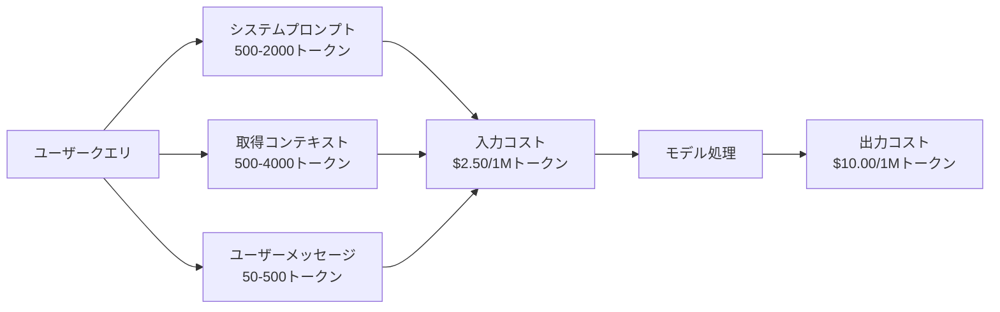
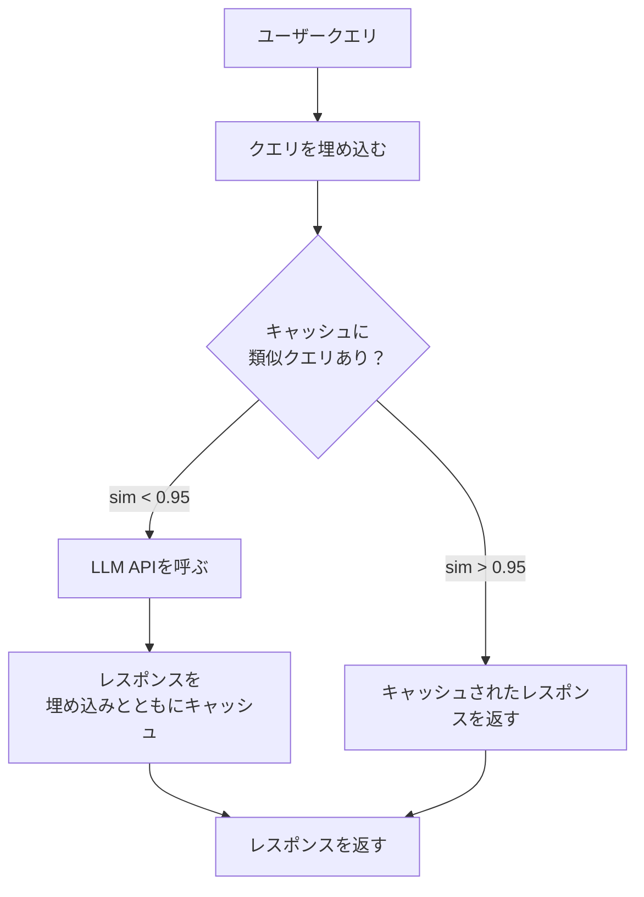
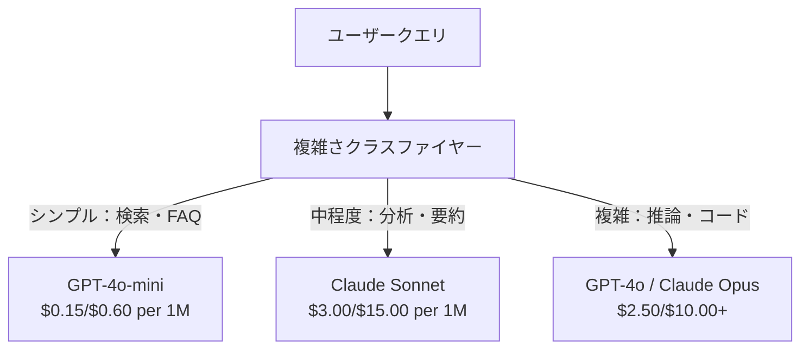

# キャッシング・レート制限・コスト最適化

> ほとんどのAIスタートアップは悪いモデルで死なない。悪いユニットエコノミクスで死ぬ。1回のGPT-4oコールは数セントのほんの一部だ。1日1万ユーザーがそれぞれ10回コールすると、入力トークンだけで$250かかる——1ドルも請求する前に。生き残る会社はすべてのAPIコールを関数呼び出しではなく金融取引として扱う会社だ。

**関連レッスン:** フェーズ11·15（プロンプトキャッシング）——このレッスンはアプリケーション層のキャッシング（セマンティックキャッシュ・正確ハッシュキャッシュ・モデルルーティング）をカバーする。レッスン15はプロバイダー層のプロンプトキャッシング（Anthropicのcache_control・OpenAIの自動・GeminiのCachedContent）をカバーする。両方を組み合わせると50〜95%のコスト削減になる。

## 学習目標

- 繰り返しまたは類似したクエリに対して新しいAPIコールをせずにキャッシュから提供するセマンティックキャッシングを実装する
- プロバイダー全体でリクエストごとのコストを計算し、トークンアウェアなレート制限と予算アラートを実装する
- プロンプト圧縮・モデルルーティング（高価対安価）・レスポンスキャッシングを持つコスト最適化層を構築する
- 異なるクエリタイプに対してexact match・セマンティック類似度・プレフィックスキャッシングを使用した階層キャッシング戦略を設計する

## 問題

RAGチャットボットを作る。美しく動く。ユーザーに愛される。

そして請求書が届く。

GPT-5は入力$5/Mトークン・出力$15/Mかかる。Claude Opus 4.7は入力$15/出力$75だ。Gemini 3 Proは入力$1.25/出力$5だ。GPT-5-miniは$0.25/$2だ。以下の価格は例示用で、常にプロバイダーの現在の価格ページを確認すること。

スタートアップを殺す計算：

- 1日1万のアクティブユーザー
- 1日1ユーザーあたり10クエリ
- 1クエリあたり1,000入力トークン（システムプロンプト + コンテキスト + ユーザーメッセージ）
- レスポンスあたり500出力トークン

**1日の入力コスト：** 10,000 x 10 x 1,000 / 1,000,000 x $2.50 = **$250/日**
**1日の出力コスト：** 10,000 x 10 x 500 / 1,000,000 x $10.00 = **$500/日**
**月間合計：** **$22,500/月**

それはLLMだけだ。エンベディング・ベクターデータベースホスティング・インフラを追加すると。チャットボットのために$30,000/月を見ることになる。

残酷な部分：これらのクエリの40〜60%はほぼ重複している。ユーザーは少し違う言葉で同じ質問をする。あなたのシステムプロンプト——全てのリクエストで同一——は毎回課金される。RAGで取得されたコンテキストドキュメントは同じトピックについて聞くユーザー間で繰り返される。

冗長な計算に全額を支払っている。

## 概念

### LLMコールのコスト解剖

全てのAPIコールには5つのコストコンポーネントがある。



システムプロンプトはサイレントキラーだ。全てのリクエストと一緒に送られる1,500トークンのシステムプロンプトは、そのプレフィックスだけで100万リクエストあたり$3.75かかる。1日100Kリクエストでは、$375/日——$11,250/月——は決して変わらないテキストのためだ。

### プロバイダーキャッシング：組み込みの割引

2026年には3つの主要プロバイダー全てがプロバイダー側のプロンプトキャッシングを提供しているが、仕組みは異なる。詳しくはフェーズ11·15を参照。

| プロバイダー | 仕組み | 割引 | 最小 | キャッシュ期間 |
|----------|-----------|----------|---------|----------------|
| Anthropic | 明示的なcache_controlマーカー | キャッシュヒットで90%（書き込み時に25%プレミアムを支払う） | 1,024トークン（Sonnet/Opus）・2,048（Haiku） | デフォルト5分；拡張1時間（2倍書き込みプレミアム） |
| OpenAI | 自動プレフィックスマッチング | キャッシュヒットで50% | 1,024トークン | 最大1時間のベストエフォート |
| Google Gemini | 明示的なCachedContent API | 〜75%削減（ストレージ追加） | 4,096（Flash）/ 32,768（Pro） | ユーザー設定可能なTTL |

**Anthropicのアプローチ**は明示的だ。`cache_control: {"type": "ephemeral"}`でプロンプトのセクションをマークする。最初のリクエストは25%の書き込みプレミアムを支払う。同じプレフィックスの後続リクエストは90%の割引を得る。通常$0.005かかる2,000トークンのシステムプロンプトはキャッシュヒット時には$0.000625になる。100Kリクエスト以上では、$437.50/日の節約だ。

**OpenAIのアプローチ**は自動だ。以前のリクエストにマッチする任意のプロンプトプレフィックスが50%の割引を得る。マーカー不要。トレードオフ：割引が少なく・コントロールが少ないが、実装の手間ゼロだ。

### セマンティックキャッシング：カスタム層

プロバイダーキャッシングは同一のプレフィックスにしか機能しない。セマンティックキャッシングはより難しいケースを処理する：同じ意味の異なるクエリ。

「返品ポリシーは？」と「商品を返品するには？」は異なる文字列だが同一の意図だ。セマンティックキャッシュは両方のクエリを埋め込み・コサイン類似度を計算し・類似度が閾値（通常0.92〜0.95）を超えればキャッシュされたレスポンスを返す。



埋め込みコストは無視できる。OpenAIのtext-embedding-3-smallは100万トークンあたり$0.02だ。キャッシュチェックはフルLLMコールと比べてほぼコストゼロだ。

### 正確キャッシング：ハッシュとマッチ

決定論的なコール（temperature=0・同じモデル・同じプロンプト）では、正確キャッシングはより単純で高速だ。フルプロンプトをハッシュし・キャッシュをチェックし・見つかれば返す。

これが完璧に機能する場合：
- システムプロンプト + 固定コンテキスト + 同一のユーザークエリ
- 同一のツール定義を持つファンクションコーリング
- 同じドキュメントが複数回処理されるバッチ処理

### レート制限：予算の保護

レート制限は公平性のためだけではない。生存のためだ。

**トークンバケットアルゴリズム：** 各ユーザーは秒あたりRのレートで補充されるNトークンのバケットを持つ。リクエストはバケットからトークンを消費する。バケットが空になればリクエストは拒否される。これはバースト（一度に全てのバケットを使う）を許可しながら平均レートRを強制する。

**ユーザーごとのクォータ：** ユーザーティアごとに日次/月次のトークン制限を設定する。

| ティア | 1日のトークン制限 | 最大リクエスト数/分 | モデルアクセス |
|------|------------------|------------------|-------------|
| 無料 | 50,000 | 10 | GPT-4o-miniのみ |
| Pro | 500,000 | 60 | GPT-4o・Claude Sonnet |
| Enterprise | 5,000,000 | 300 | 全モデル |

### モデルルーティング：適切な仕事に適切なモデル

全てのクエリがGPT-4oを必要とするわけではない。

「何時に閉まりますか？」は$10/M出力のモデルを必要としない。$0.60/M出力のGPT-4o-miniで完全に処理できる。$1.25/M出力のClaude Haikuでも処理できる。シンプルなクラスファイヤーは安価なクエリを安価なモデルに・複雑なクエリを高価なモデルにルーティングする。



うまくチューニングされたルーターはモデルコストだけで40〜70%を節約する。

### コスト追跡：お金の行き先を知る

測定しないものは最適化できない。全てのAPIコールを以下でログする：

- タイムスタンプ
- モデル名
- 入力トークン
- 出力トークン
- レイテンシ（ms）
- 計算コスト（$）
- ユーザーID
- キャッシュヒット/ミス
- リクエストカテゴリ

このデータはどの機能が高価で・どのユーザーが重いコンシューマーで・キャッシングがどこに最も影響するかを明らかにする。

### バッチング：大量割引

OpenAIのBatch APIは50%割引で非同期にリクエストを処理する。最大50,000のリクエストのバッチを送信すると、結果は24時間以内に返ってくる。

バッチングの用途：
- 夜間のドキュメント処理
- 大量分類
- eval実行
- データエンリッチメントパイプライン

用途外：リアルタイムのユーザー向けクエリ（レイテンシが重要）。

### 予算アラートとサーキットブレーカー

サーキットブレーカーは制限に達したときに支出を止める。これなしでは、バグや乱用が数時間で月次予算を使い果たすことがある。

3つの閾値を設定する：
1. **警告**（予算の70%）：アラートを送る
2. **スロットル**（予算の85%）：安価なモデルのみに切り替える
3. **停止**（予算の95%）：新しいリクエストを拒否し、キャッシュされたレスポンスのみを返す

### 最適化スタック

この順序でこれらのテクニックを適用する。各層が前の層に積み重なる。

| 層 | テクニック | 典型的な節約 | 実装の手間 |
|-------|-----------|----------------|----------------------|
| 1 | プロバイダープロンプトキャッシング | 30-50% | 低（キャッシュマーカーを追加） |
| 2 | 正確キャッシング | 10-20% | 低（ハッシュ + 辞書） |
| 3 | セマンティックキャッシング | 15-30% | 中（埋め込み + 類似度） |
| 4 | モデルルーティング | 40-70% | 中（クラスファイヤー） |
| 5 | レート制限 | 予算保護 | 低（トークンバケット） |
| 6 | プロンプト圧縮 | 10-30% | 中（プロンプト書き直し） |
| 7 | バッチング | 対象に50% | 低（Batch API） |

層1〜5を適用するRAGアプリは通常、$22,500/月から$4,000〜6,000/月にコストを削減する。それが滑走路を燃やすこととビジネスを構築することの違いだ。

### 実際の節約：最適化前後

10,000のDAUに対応するRAGチャットボットの実際の内訳だ。

| 指標 | 最適化前 | 最適化後 | 節約 |
|--------|--------------------|--------------------|---------|
| 月次LLMコスト | $22,500 | $5,200 | 77% |
| クエリあたりの平均コスト | $0.0075 | $0.0017 | 77% |
| キャッシュヒット率 | 0% | 52% | -- |
| miniにルーティングされるクエリ | 0% | 65% | -- |
| P95レイテンシ | 2,800ms | 900ms（キャッシュヒット：50ms） | 68% |
| 月次埋め込みコスト | $0 | $180 | （新しいコスト） |
| 月次総コスト | $22,500 | $5,380 | 76% |

セマンティックキャッシングの埋め込みコスト（$180/月）はキャッシュヒットの最初の1時間以内に元が取れる。

## 実装する

### Step 1: コスト計算機

主要モデルの現在の価格を知っているトークンコスト計算機を構築する。

```python
import hashlib
import time
import json
import math
from dataclasses import dataclass, field


MODEL_PRICING = {
    "gpt-4o": {"input": 2.50, "output": 10.00, "cached_input": 1.25},
    "gpt-4o-mini": {"input": 0.15, "output": 0.60, "cached_input": 0.075},
    "gpt-4.1": {"input": 2.00, "output": 8.00, "cached_input": 0.50},
    "gpt-4.1-mini": {"input": 0.40, "output": 1.60, "cached_input": 0.10},
    "gpt-4.1-nano": {"input": 0.10, "output": 0.40, "cached_input": 0.025},
    "o3": {"input": 2.00, "output": 8.00, "cached_input": 0.50},
    "o3-mini": {"input": 1.10, "output": 4.40, "cached_input": 0.55},
    "o4-mini": {"input": 1.10, "output": 4.40, "cached_input": 0.275},
    "claude-opus-4": {"input": 15.00, "output": 75.00, "cached_input": 1.50},
    "claude-sonnet-4": {"input": 3.00, "output": 15.00, "cached_input": 0.30},
    "claude-haiku-3.5": {"input": 0.80, "output": 4.00, "cached_input": 0.08},
    "gemini-2.5-pro": {"input": 1.25, "output": 10.00, "cached_input": 0.3125},
    "gemini-2.5-flash": {"input": 0.15, "output": 0.60, "cached_input": 0.0375},
}


def calculate_cost(model, input_tokens, output_tokens, cached_input_tokens=0):
    if model not in MODEL_PRICING:
        return {"error": f"Unknown model: {model}"}
    pricing = MODEL_PRICING[model]
    non_cached = input_tokens - cached_input_tokens
    input_cost = (non_cached / 1_000_000) * pricing["input"]
    cached_cost = (cached_input_tokens / 1_000_000) * pricing["cached_input"]
    output_cost = (output_tokens / 1_000_000) * pricing["output"]
    total = input_cost + cached_cost + output_cost
    return {
        "model": model,
        "input_tokens": input_tokens,
        "output_tokens": output_tokens,
        "cached_input_tokens": cached_input_tokens,
        "input_cost": round(input_cost, 6),
        "cached_input_cost": round(cached_cost, 6),
        "output_cost": round(output_cost, 6),
        "total_cost": round(total, 6),
    }
```

### Step 2: 正確キャッシュ

フルプロンプトをハッシュして同一のリクエストに対してキャッシュされたレスポンスを返す。

```python
class ExactCache:
    def __init__(self, max_size=1000, ttl_seconds=3600):
        self.cache = {}
        self.max_size = max_size
        self.ttl = ttl_seconds
        self.hits = 0
        self.misses = 0

    def _hash(self, model, messages, temperature):
        key_data = json.dumps({"model": model, "messages": messages, "temperature": temperature}, sort_keys=True)
        return hashlib.sha256(key_data.encode()).hexdigest()

    def get(self, model, messages, temperature=0.0):
        if temperature > 0:
            self.misses += 1
            return None
        key = self._hash(model, messages, temperature)
        if key in self.cache:
            entry = self.cache[key]
            if time.time() - entry["timestamp"] < self.ttl:
                self.hits += 1
                entry["access_count"] += 1
                return entry["response"]
            del self.cache[key]
        self.misses += 1
        return None

    def put(self, model, messages, temperature, response):
        if temperature > 0:
            return
        if len(self.cache) >= self.max_size:
            oldest_key = min(self.cache, key=lambda k: self.cache[k]["timestamp"])
            del self.cache[oldest_key]
        key = self._hash(model, messages, temperature)
        self.cache[key] = {
            "response": response,
            "timestamp": time.time(),
            "access_count": 1,
        }

    def stats(self):
        total = self.hits + self.misses
        return {
            "hits": self.hits,
            "misses": self.misses,
            "hit_rate": round(self.hits / total, 4) if total > 0 else 0,
            "cache_size": len(self.cache),
        }
```

### Step 3: セマンティックキャッシュ

クエリを埋め込んで類似度が閾値を超えた場合にキャッシュされたレスポンスを返す。

```python
def simple_embed(text):
    words = text.lower().split()
    vocab = {}
    for w in words:
        vocab[w] = vocab.get(w, 0) + 1
    norm = math.sqrt(sum(v * v for v in vocab.values()))
    if norm == 0:
        return {}
    return {k: v / norm for k, v in vocab.items()}


def cosine_similarity(a, b):
    if not a or not b:
        return 0.0
    all_keys = set(a) | set(b)
    dot = sum(a.get(k, 0) * b.get(k, 0) for k in all_keys)
    return dot


class SemanticCache:
    def __init__(self, similarity_threshold=0.85, max_size=500, ttl_seconds=3600):
        self.entries = []
        self.threshold = similarity_threshold
        self.max_size = max_size
        self.ttl = ttl_seconds
        self.hits = 0
        self.misses = 0

    def get(self, query):
        query_embedding = simple_embed(query)
        now = time.time()
        best_match = None
        best_sim = 0.0
        for entry in self.entries:
            if now - entry["timestamp"] > self.ttl:
                continue
            sim = cosine_similarity(query_embedding, entry["embedding"])
            if sim > best_sim:
                best_sim = sim
                best_match = entry
        if best_match and best_sim >= self.threshold:
            self.hits += 1
            best_match["access_count"] += 1
            return {"response": best_match["response"], "similarity": round(best_sim, 4), "original_query": best_match["query"]}
        self.misses += 1
        return None

    def put(self, query, response):
        if len(self.entries) >= self.max_size:
            self.entries.sort(key=lambda e: e["timestamp"])
            self.entries.pop(0)
        self.entries.append({
            "query": query,
            "embedding": simple_embed(query),
            "response": response,
            "timestamp": time.time(),
            "access_count": 1,
        })

    def stats(self):
        total = self.hits + self.misses
        return {
            "hits": self.hits,
            "misses": self.misses,
            "hit_rate": round(self.hits / total, 4) if total > 0 else 0,
            "cache_size": len(self.entries),
        }
```

### Step 4: レート制限機能

ユーザーごとのクォータを持つトークンバケットのレート制限。

```python
class TokenBucketRateLimiter:
    def __init__(self):
        self.buckets = {}
        self.tiers = {
            "free": {"capacity": 50_000, "refill_rate": 500, "max_requests_per_min": 10},
            "pro": {"capacity": 500_000, "refill_rate": 5_000, "max_requests_per_min": 60},
            "enterprise": {"capacity": 5_000_000, "refill_rate": 50_000, "max_requests_per_min": 300},
        }

    def _get_bucket(self, user_id, tier="free"):
        if user_id not in self.buckets:
            tier_config = self.tiers.get(tier, self.tiers["free"])
            self.buckets[user_id] = {
                "tokens": tier_config["capacity"],
                "capacity": tier_config["capacity"],
                "refill_rate": tier_config["refill_rate"],
                "last_refill": time.time(),
                "request_timestamps": [],
                "max_rpm": tier_config["max_requests_per_min"],
                "tier": tier,
                "total_tokens_used": 0,
            }
        return self.buckets[user_id]

    def _refill(self, bucket):
        now = time.time()
        elapsed = now - bucket["last_refill"]
        refill = int(elapsed * bucket["refill_rate"])
        if refill > 0:
            bucket["tokens"] = min(bucket["capacity"], bucket["tokens"] + refill)
            bucket["last_refill"] = now

    def check(self, user_id, tokens_needed, tier="free"):
        bucket = self._get_bucket(user_id, tier)
        self._refill(bucket)
        now = time.time()
        bucket["request_timestamps"] = [t for t in bucket["request_timestamps"] if now - t < 60]
        if len(bucket["request_timestamps"]) >= bucket["max_rpm"]:
            return {"allowed": False, "reason": "rate_limit", "retry_after_seconds": 60 - (now - bucket["request_timestamps"][0])}
        if bucket["tokens"] < tokens_needed:
            deficit = tokens_needed - bucket["tokens"]
            wait = deficit / bucket["refill_rate"]
            return {"allowed": False, "reason": "token_limit", "tokens_available": bucket["tokens"], "retry_after_seconds": round(wait, 1)}
        return {"allowed": True, "tokens_available": bucket["tokens"]}

    def consume(self, user_id, tokens_used, tier="free"):
        bucket = self._get_bucket(user_id, tier)
        bucket["tokens"] -= tokens_used
        bucket["request_timestamps"].append(time.time())
        bucket["total_tokens_used"] += tokens_used

    def get_usage(self, user_id):
        if user_id not in self.buckets:
            return {"error": "User not found"}
        b = self.buckets[user_id]
        return {
            "user_id": user_id,
            "tier": b["tier"],
            "tokens_remaining": b["tokens"],
            "capacity": b["capacity"],
            "total_tokens_used": b["total_tokens_used"],
            "utilization": round(b["total_tokens_used"] / b["capacity"], 4) if b["capacity"] else 0,
        }
```

### Step 5: コストトラッカー

全てのコールをログして累計を計算する。

```python
class CostTracker:
    def __init__(self, monthly_budget=1000.0):
        self.logs = []
        self.monthly_budget = monthly_budget
        self.alerts = []

    def log_call(self, model, input_tokens, output_tokens, cached_input_tokens=0, latency_ms=0, user_id="anonymous", cache_status="miss"):
        cost = calculate_cost(model, input_tokens, output_tokens, cached_input_tokens)
        entry = {
            "timestamp": time.time(),
            "model": model,
            "input_tokens": input_tokens,
            "output_tokens": output_tokens,
            "cached_input_tokens": cached_input_tokens,
            "latency_ms": latency_ms,
            "cost": cost["total_cost"],
            "user_id": user_id,
            "cache_status": cache_status,
        }
        self.logs.append(entry)
        self._check_budget()
        return entry

    def _check_budget(self):
        total = self.total_cost()
        pct = total / self.monthly_budget if self.monthly_budget > 0 else 0
        if pct >= 0.95 and not any(a["level"] == "stop" for a in self.alerts):
            self.alerts.append({"level": "stop", "message": f"Budget 95% consumed: ${total:.2f}/${self.monthly_budget:.2f}", "timestamp": time.time()})
        elif pct >= 0.85 and not any(a["level"] == "throttle" for a in self.alerts):
            self.alerts.append({"level": "throttle", "message": f"Budget 85% consumed: ${total:.2f}/${self.monthly_budget:.2f}", "timestamp": time.time()})
        elif pct >= 0.70 and not any(a["level"] == "warning" for a in self.alerts):
            self.alerts.append({"level": "warning", "message": f"Budget 70% consumed: ${total:.2f}/${self.monthly_budget:.2f}", "timestamp": time.time()})

    def total_cost(self):
        return round(sum(e["cost"] for e in self.logs), 6)

    def cost_by_model(self):
        by_model = {}
        for e in self.logs:
            m = e["model"]
            if m not in by_model:
                by_model[m] = {"calls": 0, "cost": 0, "input_tokens": 0, "output_tokens": 0}
            by_model[m]["calls"] += 1
            by_model[m]["cost"] = round(by_model[m]["cost"] + e["cost"], 6)
            by_model[m]["input_tokens"] += e["input_tokens"]
            by_model[m]["output_tokens"] += e["output_tokens"]
        return by_model

    def cache_savings(self):
        cache_hits = [e for e in self.logs if e["cache_status"] == "hit"]
        if not cache_hits:
            return {"saved": 0, "cache_hits": 0}
        saved = 0
        for e in cache_hits:
            full_cost = calculate_cost(e["model"], e["input_tokens"], e["output_tokens"])
            saved += full_cost["total_cost"]
        return {"saved": round(saved, 4), "cache_hits": len(cache_hits)}

    def summary(self):
        if not self.logs:
            return {"total_calls": 0, "total_cost": 0}
        total_latency = sum(e["latency_ms"] for e in self.logs)
        cache_hits = sum(1 for e in self.logs if e["cache_status"] == "hit")
        return {
            "total_calls": len(self.logs),
            "total_cost": self.total_cost(),
            "avg_cost_per_call": round(self.total_cost() / len(self.logs), 6),
            "avg_latency_ms": round(total_latency / len(self.logs), 1),
            "cache_hit_rate": round(cache_hits / len(self.logs), 4),
            "cost_by_model": self.cost_by_model(),
            "cache_savings": self.cache_savings(),
            "budget_remaining": round(self.monthly_budget - self.total_cost(), 2),
            "budget_utilization": round(self.total_cost() / self.monthly_budget, 4) if self.monthly_budget > 0 else 0,
            "alerts": self.alerts,
        }
```

### Step 6: モデルルーター

処理できる最安価なモデルにクエリをルーティングする。

```python
SIMPLE_KEYWORDS = ["what time", "hours", "address", "phone", "price", "return policy", "hello", "hi", "thanks", "yes", "no"]
COMPLEX_KEYWORDS = ["analyze", "compare", "explain why", "write code", "debug", "architect", "design", "trade-off", "evaluate"]


def classify_complexity(query):
    q = query.lower()
    if len(q.split()) <= 5 or any(kw in q for kw in SIMPLE_KEYWORDS):
        return "simple"
    if any(kw in q for kw in COMPLEX_KEYWORDS):
        return "complex"
    return "medium"


def route_model(query, tier="pro"):
    complexity = classify_complexity(query)
    routing_table = {
        "simple": {"free": "gpt-4.1-nano", "pro": "gpt-4o-mini", "enterprise": "gpt-4o-mini"},
        "medium": {"free": "gpt-4o-mini", "pro": "claude-sonnet-4", "enterprise": "claude-sonnet-4"},
        "complex": {"free": "gpt-4o-mini", "pro": "gpt-4o", "enterprise": "claude-opus-4"},
    }
    model = routing_table[complexity].get(tier, "gpt-4o-mini")
    return {"query": query, "complexity": complexity, "model": model, "tier": tier}
```

### Step 7: デモを実行する

```python
def simulate_llm_call(model, query):
    input_tokens = len(query.split()) * 4 + 500
    output_tokens = 150 + (len(query.split()) * 2)
    latency = 200 + (output_tokens * 2)
    return {
        "model": model,
        "response": f"[Simulated {model} response to: {query[:50]}...]",
        "input_tokens": input_tokens,
        "output_tokens": output_tokens,
        "latency_ms": latency,
    }


def run_demo():
    print("=" * 60)
    print("  Caching, Rate Limiting & Cost Optimization Demo")
    print("=" * 60)

    print("\n--- Model Pricing ---")
    for model, pricing in list(MODEL_PRICING.items())[:6]:
        cost_1k = calculate_cost(model, 1000, 500)
        print(f"  {model}: ${cost_1k['total_cost']:.6f} per 1K in + 500 out")

    print("\n--- Cost Comparison: 100K Requests ---")
    for model in ["gpt-4o", "gpt-4o-mini", "claude-sonnet-4", "claude-haiku-3.5"]:
        cost = calculate_cost(model, 1000 * 100_000, 500 * 100_000)
        print(f"  {model}: ${cost['total_cost']:.2f}")

    print("\n--- Anthropic Cache Savings ---")
    no_cache = calculate_cost("claude-sonnet-4", 2000, 500, 0)
    with_cache = calculate_cost("claude-sonnet-4", 2000, 500, 1500)
    saving = no_cache["total_cost"] - with_cache["total_cost"]
    print(f"  Without cache: ${no_cache['total_cost']:.6f}")
    print(f"  With 1500 cached tokens: ${with_cache['total_cost']:.6f}")
    print(f"  Savings per call: ${saving:.6f} ({saving/no_cache['total_cost']*100:.1f}%)")

    exact_cache = ExactCache(max_size=100, ttl_seconds=300)
    semantic_cache = SemanticCache(similarity_threshold=0.75, max_size=100)
    rate_limiter = TokenBucketRateLimiter()
    tracker = CostTracker(monthly_budget=100.0)

    print("\n--- Exact Cache ---")
    messages_1 = [{"role": "user", "content": "What is the return policy?"}]
    result = exact_cache.get("gpt-4o-mini", messages_1, 0.0)
    print(f"  First lookup: {'HIT' if result else 'MISS'}")
    exact_cache.put("gpt-4o-mini", messages_1, 0.0, "You can return items within 30 days.")
    result = exact_cache.get("gpt-4o-mini", messages_1, 0.0)
    print(f"  Second lookup: {'HIT' if result else 'MISS'} -> {result}")
    result = exact_cache.get("gpt-4o-mini", messages_1, 0.7)
    print(f"  With temp=0.7: {'HIT' if result else 'MISS (non-deterministic, skip cache)'}")
    print(f"  Stats: {exact_cache.stats()}")

    print("\n--- Semantic Cache ---")
    test_queries = [
        ("What is the return policy?", "Items can be returned within 30 days with receipt."),
        ("How do I return an item?", None),
        ("What are your store hours?", "We are open 9am-9pm Monday through Saturday."),
        ("When does the store open?", None),
        ("Tell me about quantum computing", "Quantum computers use qubits..."),
        ("Explain quantum mechanics", None),
    ]
    for query, response in test_queries:
        cached = semantic_cache.get(query)
        if cached:
            print(f"  '{query[:40]}' -> CACHE HIT (sim={cached['similarity']}, original='{cached['original_query'][:40]}')")
        elif response:
            semantic_cache.put(query, response)
            print(f"  '{query[:40]}' -> MISS (stored)")
        else:
            print(f"  '{query[:40]}' -> MISS (no match)")
    print(f"  Stats: {semantic_cache.stats()}")

    print("\n--- Rate Limiting ---")
    for i in range(12):
        check = rate_limiter.check("user_1", 1000, "free")
        if check["allowed"]:
            rate_limiter.consume("user_1", 1000, "free")
        status = "OK" if check["allowed"] else f"BLOCKED ({check['reason']})"
        if i < 5 or not check["allowed"]:
            print(f"  Request {i+1}: {status}")
    print(f"  Usage: {rate_limiter.get_usage('user_1')}")

    print("\n--- Model Routing ---")
    routing_queries = [
        "What time do you close?",
        "Summarize this quarterly earnings report",
        "Analyze the trade-offs between microservices and monoliths",
        "Hello",
        "Write code for a binary search tree with deletion",
    ]
    for q in routing_queries:
        route = route_model(q, "pro")
        print(f"  '{q[:50]}' -> {route['model']} ({route['complexity']})")

    print("\n--- Full Pipeline: Before vs After Optimization ---")
    queries = [
        "What is the return policy?",
        "How do I return something?",
        "What are your hours?",
        "When do you open?",
        "Explain the difference between TCP and UDP",
        "Compare TCP vs UDP protocols",
        "Hello",
        "What is your phone number?",
        "Write a Python function to sort a list",
        "Analyze the pros and cons of serverless architecture",
    ]

    print("\n  [Before: no caching, single model (gpt-4o)]")
    tracker_before = CostTracker(monthly_budget=1000.0)
    for q in queries:
        result = simulate_llm_call("gpt-4o", q)
        tracker_before.log_call("gpt-4o", result["input_tokens"], result["output_tokens"], latency_ms=result["latency_ms"], cache_status="miss")
    before = tracker_before.summary()
    print(f"  Total cost: ${before['total_cost']:.6f}")
    print(f"  Avg cost/call: ${before['avg_cost_per_call']:.6f}")
    print(f"  Avg latency: {before['avg_latency_ms']}ms")

    print("\n  [After: caching + routing + rate limiting]")
    exact_c = ExactCache()
    semantic_c = SemanticCache(similarity_threshold=0.75)
    tracker_after = CostTracker(monthly_budget=1000.0)

    for q in queries:
        messages = [{"role": "user", "content": q}]
        cached = exact_c.get("gpt-4o", messages, 0.0)
        if cached:
            tracker_after.log_call("gpt-4o-mini", 0, 0, latency_ms=5, cache_status="hit")
            continue
        sem_cached = semantic_c.get(q)
        if sem_cached:
            tracker_after.log_call("gpt-4o-mini", 0, 0, latency_ms=15, cache_status="hit")
            continue
        route = route_model(q)
        result = simulate_llm_call(route["model"], q)
        tracker_after.log_call(route["model"], result["input_tokens"], result["output_tokens"], latency_ms=result["latency_ms"], cache_status="miss")
        exact_c.put(route["model"], messages, 0.0, result["response"])
        semantic_c.put(q, result["response"])

    after = tracker_after.summary()
    print(f"  Total cost: ${after['total_cost']:.6f}")
    print(f"  Avg cost/call: ${after['avg_cost_per_call']:.6f}")
    print(f"  Avg latency: {after['avg_latency_ms']}ms")
    print(f"  Cache hit rate: {after['cache_hit_rate']:.0%}")

    if before["total_cost"] > 0:
        savings_pct = (1 - after["total_cost"] / before["total_cost"]) * 100
        print(f"\n  SAVINGS: {savings_pct:.1f}% cost reduction")
        print(f"  Latency improvement: {(1 - after['avg_latency_ms'] / before['avg_latency_ms']) * 100:.1f}% faster")

    print("\n--- Budget Alerts Demo ---")
    alert_tracker = CostTracker(monthly_budget=0.01)
    for i in range(5):
        alert_tracker.log_call("gpt-4o", 5000, 2000, latency_ms=500)
    print(f"  Total spent: ${alert_tracker.total_cost():.6f} / ${alert_tracker.monthly_budget}")
    for alert in alert_tracker.alerts:
        print(f"  ALERT [{alert['level'].upper()}]: {alert['message']}")

    print("\n--- Cost Breakdown by Model ---")
    multi_tracker = CostTracker(monthly_budget=500.0)
    for _ in range(50):
        multi_tracker.log_call("gpt-4o-mini", 800, 200, latency_ms=150)
    for _ in range(30):
        multi_tracker.log_call("claude-sonnet-4", 1500, 500, latency_ms=400)
    for _ in range(10):
        multi_tracker.log_call("gpt-4o", 2000, 800, latency_ms=600)
    for _ in range(10):
        multi_tracker.log_call("claude-opus-4", 3000, 1000, latency_ms=1200)
    breakdown = multi_tracker.cost_by_model()
    for model, data in sorted(breakdown.items(), key=lambda x: x[1]["cost"], reverse=True):
        print(f"  {model}: {data['calls']} calls, ${data['cost']:.6f}, {data['input_tokens']:,} in / {data['output_tokens']:,} out")
    print(f"  Total: ${multi_tracker.total_cost():.6f}")

    print("\n" + "=" * 60)
    print("  Demo complete.")
    print("=" * 60)


if __name__ == "__main__":
    run_demo()
```

## 使ってみる

### Anthropicプロンプトキャッシング

```python
# import anthropic
#
# client = anthropic.Anthropic()
#
# response = client.messages.create(
#     model="claude-sonnet-4-20250514",
#     max_tokens=1024,
#     system=[
#         {
#             "type": "text",
#             "text": "You are a helpful customer support agent for Acme Corp...",
#             "cache_control": {"type": "ephemeral"},
#         }
#     ],
#     messages=[{"role": "user", "content": "What is the return policy?"}],
# )
#
# print(f"Input tokens: {response.usage.input_tokens}")
# print(f"Cache creation tokens: {response.usage.cache_creation_input_tokens}")
# print(f"Cache read tokens: {response.usage.cache_read_input_tokens}")
```

最初のコールはキャッシュに書き込む（25%プレミアム）。同じシステムプロンプトのプレフィックスを持つ以降の全コールはキャッシュから読み込む（90%割引）。キャッシュは5分間続き、ヒットのたびにタイマーをリセットする。

### OpenAI自動キャッシング

```python
# from openai import OpenAI
#
# client = OpenAI()
#
# response = client.chat.completions.create(
#     model="gpt-4o",
#     messages=[
#         {"role": "system", "content": "You are a helpful customer support agent..."},
#         {"role": "user", "content": "What is the return policy?"},
#     ],
# )
#
# print(f"Prompt tokens: {response.usage.prompt_tokens}")
# print(f"Cached tokens: {response.usage.prompt_tokens_details.cached_tokens}")
# print(f"Completion tokens: {response.usage.completion_tokens}")
```

OpenAIは自動的にキャッシュする。最近のリクエストにマッチする1,024以上のトークンの任意のプロンプトプレフィックスは50%の割引を得る。コード変更不要——動作していることを確認するためにレスポンスの`prompt_tokens_details.cached_tokens`を確認するだけだ。

### OpenAI Batch API

```python
# import json
# from openai import OpenAI
#
# client = OpenAI()
#
# requests = []
# for i, query in enumerate(queries):
#     requests.append({
#         "custom_id": f"request-{i}",
#         "method": "POST",
#         "url": "/v1/chat/completions",
#         "body": {
#             "model": "gpt-4o-mini",
#             "messages": [{"role": "user", "content": query}],
#         },
#     })
#
# with open("batch_input.jsonl", "w") as f:
#     for r in requests:
#         f.write(json.dumps(r) + "\n")
#
# batch_file = client.files.create(file=open("batch_input.jsonl", "rb"), purpose="batch")
# batch = client.batches.create(input_file_id=batch_file.id, endpoint="/v1/chat/completions", completion_window="24h")
# print(f"Batch ID: {batch.id}, Status: {batch.status}")
```

Batch APIは全てのトークンに一律50%の割引を与える。結果は24時間以内に届く。非リアルタイムのワークロードに最適：評価・データラベリング・大量要約。

### Redisを使った本番環境のセマンティックキャッシュ

```python
# import redis
# import numpy as np
# from openai import OpenAI
#
# r = redis.Redis()
# client = OpenAI()
#
# def get_embedding(text):
#     response = client.embeddings.create(model="text-embedding-3-small", input=text)
#     return response.data[0].embedding
#
# def semantic_cache_lookup(query, threshold=0.95):
#     query_emb = np.array(get_embedding(query))
#     keys = r.keys("cache:emb:*")
#     best_sim, best_key = 0, None
#     for key in keys:
#         stored_emb = np.frombuffer(r.get(key), dtype=np.float32)
#         sim = np.dot(query_emb, stored_emb) / (np.linalg.norm(query_emb) * np.linalg.norm(stored_emb))
#         if sim > best_sim:
#             best_sim, best_key = sim, key
#     if best_sim >= threshold and best_key:
#         response_key = best_key.decode().replace("cache:emb:", "cache:resp:")
#         return r.get(response_key).decode()
#     return None
```

本番環境では、線形スキャンをベクターインデックス（Redis Vector Search・Pinecone・またはpgvector）に置き換える。線形スキャンは1,000エントリ未満で機能する。それ以上ではO(log n)ルックアップのためにANN（近似最近傍）を使う。

## 成果物を出す

このレッスンでは`outputs/prompt-cost-optimizer.md`を作成する——LLMアプリケーションを分析して予測される節約とともに特定のコスト最適化を推奨する再利用可能なプロンプト。

また`outputs/skill-cost-patterns.md`も作成する——ユースケースに適したキャッシング戦略・レート制限設定・モデルルーティングルールを選ぶための意思決定フレームワーク。

## 演習

1. **セマンティックキャッシュにLRU退避を実装する。** 最古から順の退避をLeast Recently Usedに置き換える。各エントリの最終アクセス時間を追跡し、キャッシュがいっぱいのときに最も古いアクセス時間のエントリを退避する。100クエリで2つの戦略のヒット率を比較する。

2. **コスト予測ツールを構築する。** APIコールのログ（CostTrackerのログ）が与えられたら、過去7日間の平均に基づいて月次コストを予測する。平日/週末のパターンを考慮する。予測月次コストが予算を20%以上超える場合にアラートをトリガーする。

3. **階層的なセマンティックキャッシングを実装する。** 2つの類似度閾値を使う：高信頼のヒットには0.98（すぐに返す）・中信頼のヒットには0.90（免責事項付きで返す：「似た以前の質問に基づいて...」）。各ヒットがどのティアから来たかを追跡し、ユーザー満足度の違いを測定する。

4. **モデルルーティングクラスファイヤーを構築する。** キーワードベースのクラスファイヤーを埋め込みベースのものに置き換える。50のラベル付きクエリ（シンプル/中程度/複雑）を埋め込み、次に最も近いラベル付き例を見つけることで新しいクエリを分類する。20クエリのテストセットで分類精度を測定する。

5. **段階的なサーキットブレーカーを実装する。** 予算の70%で警告をログする。85%で全ルーティングを自動的に最安価なモデル（gpt-4o-mini）に切り替える。95%でキャッシュされたレスポンスのみを提供し新しいクエリを拒否する。$1.00の予算に対して1,000リクエストをシミュレートして各閾値が正しくトリガーされることを確認する。

## キーワード

| 用語 | 一般的な言い方 | 実際の意味 |
|------|----------------|----------------------|
| プロンプトキャッシング | 「システムプロンプトをキャッシュする」 | 繰り返されるプロンプトのプレフィックスが割引を得るプロバイダーレベルのキャッシング（Anthropic 90%・OpenAI 50%）——OpenAIはコード変更不要、Anthropicは明示的なマーカーが必要 |
| セマンティックキャッシング | 「スマートキャッシング」 | クエリを埋め込み・過去のクエリとの類似度を計算し・類似度が閾値を超えればキャッシュされたレスポンスを返す——exact matchが見逃す言い換えを捕捉する |
| 正確キャッシング | 「ハッシュキャッシング」 | フルプロンプト（モデル + メッセージ + 温度）をハッシュして同一の入力に対してキャッシュされたレスポンスを返す——temperature=0の決定論的なコールにのみ機能する |
| トークンバケット | 「レート制限機能」 | 各ユーザーが秒あたりRのレートで補充されるNトークンのバケットを持つアルゴリズム——平均レートRを強制しながらNまでのバーストを許可する |
| モデルルーティング | 「ケチルーティング」 | シンプルなクエリを安価なモデル（GPT-4o-mini・Haiku）に・複雑なクエリを高価なモデル（GPT-4o・Opus）に送るクラスファイヤーを使う——モデルコストを40〜70%節約する |
| コスト追跡 | 「メータリング」 | 全てのAPIコールをモデル・トークン・レイテンシ・コスト・ユーザーIDとともにログしてお金がどこに行くかと、どの機能が高価かを正確に把握する |
| サーキットブレーカー | 「キルスイッチ」 | 支出が予算制限に近づいたときにサービスを自動的に劣化させる（安価なモデル・キャッシュのみ）またはリクエストを完全に停止する |
| Batch API | 「大量割引」 | 50%割引でのOpenAIの非同期処理——最大50,000のリクエストを送信し、24時間以内に結果を得る |
| プロンプト圧縮 | 「トークンダイエット」 | 意味を保ちながらより少ないトークンを使うようにシステムプロンプトとコンテキストを書き直す——短いプロンプトはコストが低くてパフォーマンスも良いことが多い |
| キャッシュヒット率 | 「キャッシュ効率」 | LLMを呼ぶ代わりにキャッシュから提供されるリクエストの割合——本番チャットボットでは40〜60%が典型で、コストに比例して節約できる |

## 参考資料

- [Anthropic Prompt Caching Guide](https://docs.anthropic.com/en/docs/build-with-claude/prompt-caching) -- AnthropicのPrompt Cachingの公式ドキュメントで、明示的なcache_controlマーカー・価格・キャッシュライフタイムの動作をカバー
- [OpenAI Prompt Caching](https://platform.openai.com/docs/guides/prompt-caching) -- OpenAIの自動キャッシング・usageフィールドでキャッシュヒットを確認する方法・最小プレフィックス長
- [OpenAI Batch API](https://platform.openai.com/docs/guides/batch) -- 非同期処理で50%割引・JSONLフォーマット・24時間完了ウィンドウ・50Kリクエスト制限
- [GPTCache](https://github.com/zilliztech/GPTCache) -- 複数の埋め込みバックエンド・ベクターストア・退避ポリシーをサポートするオープンソースのセマンティックキャッシングライブラリ
- [Martian Model Router](https://docs.withmartian.com) -- 各クエリを処理できる最安価なモデルを自動的に選択する本番モデルルーティング
- [Not Diamond](https://www.notdiamond.ai) -- プロバイダー間のコスト/品質トレードオフを最適化するためにトラフィックパターンから学習するMLベースのモデルルーター
- [Helicone](https://www.helicone.ai) -- プロキシ層としてコスト追跡・キャッシング・レート制限・予算アラートを持つLLM observabilityプラットフォーム
- [Dean & Barroso, "The Tail at Scale" (CACM 2013)](https://research.google/pubs/the-tail-at-scale/) -- レイテンシ・スループット・TTFT/TPOTパーセンタイル・ヘッジされたリクエスト；「P95を満たしつつ最安価なモデルを選ぶ」背後にあるコストモデル
- [Kwon et al., "Efficient Memory Management for Large Language Model Serving with PagedAttention" (SOSP 2023)](https://arxiv.org/abs/2309.06180) -- vLLMの論文；ページドKVキャッシュ + 継続的バッチングがナイーブなサーバーをスループットで24倍上回る理由、「キャッシングとコスト」の下にあるインフラ層
- [Dao et al., "FlashAttention-2: Faster Attention with Better Parallelism and Work Partitioning" (ICLR 2024)](https://arxiv.org/abs/2307.08691) -- プロンプトキャッシングと直交するカーネルレベルのコスト削減；コストカーブの全体像にはspeculative decodingとGQAと並べて読む
