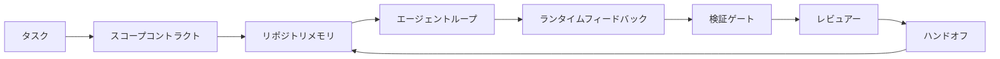

# エージェントワークベンチエンジニアリング：有能なモデルがそれでも失敗する理由

> 有能なモデルだけでは十分ではない。信頼性の高いエージェントにはワークベンチが必要だ：指示、ステート、スコープ、フィードバック、検証、レビュー、ハンドオフ。これらを取り除いたら、フロンティアモデルでも出荷に危険な結果を出す。


## 学習目標

- モデルの能力と実行の信頼性を切り離す。
- エージェントが出荷できるかどうかを決める7つのワークベンチ表面を挙げる。
- 小さなリポジトリタスクでのプロンプトのみの実行とワークベンチ誘導の実行を比較する。
- 各欠落した表面を引き起こした症状に対応づける失敗モードレポートを作成する。

## 問題

フロンティアモデルを実際のリポジトリに投入して、入力バリデーションを追加するよう指示する。4つのファイルを開き、もっともらしいコードを書き、成功を宣言して停止する。テストを実行する。2つが失敗する。バリデーションとは無関係な3番目のファイルが触られている。エージェントが何を前提としたか、最初に何を試みたか、何が残っているかの記録がない。

モデルはPythonについて間違っていなかった。作業について間違っていた。何が「完了」にカウントされるか、どこに書き込みが許可されているか、どのテストが権威があるか、次のセッションがどのように引き継ぐべきかを知らなかった。

これはモデルのバグではない。ワークベンチのバグだ。エージェントの周りの表面が、1回きりの生成を信頼性の高い、再開可能なエンジニアリングに変える部品を欠いている。

## コンセプト

ワークベンチとは、タスク中にモデルをラップする動作環境だ。7つの表面がある：

| 表面 | 運ぶもの | 欠けている時の失敗 |
|------|----------|------------------|
| 指示 | 起動ルール、禁止アクション、完了の定義 | エージェントが「出荷」の意味を推測する |
| ステート | 現在のタスク、触れたファイル、ブロッカー、次のアクション | 各セッションがゼロから再開される |
| スコープ | 許可されたファイル、禁止されたファイル、受け入れ基準 | 編集が無関係なコードに漏れる |
| フィードバック | ループにキャプチャされた実際のコマンド出力 | エージェントが400に成功を宣言する |
| 検証 | テスト、リント、スモーク実行、スコープチェック | 「良さそう」がmainに届く |
| レビュー | 異なる役割での2回目のパス | ビルダーが自分の宿題を採点する |
| ハンドオフ | 何が変わったか、なぜ、何が残っているか | 次のセッションがすべてを再発見する |

ワークベンチはモデルから独立している。モデルを交換してもサーフェスは保持できる。サーフェスを交換しても信頼性は保持できない。



ループはチャット履歴ではなく、ステートファイルで閉じる。チャットは揮発性だ。リポジトリが記録のシステムだ。

### ワークベンチとプロンプトエンジニアリング

プロンプティングは今回のターンで何が欲しいかをモデルに伝える。ワークベンチはターンをまたいでセッションをまたいで作業を行う方法をモデルに伝える。エージェント失敗のほとんどの話は、プロンプトエンジニアリングの衣をまとったワークベンチの失敗だ。

### ワークベンチとフレームワーク

フレームワークはランタイム（LangGraph、AutoGen、Agents SDK）を提供する。ワークベンチはそのランタイムの中でエージェントが作業する場所を提供する。両方が必要だ。このミニトラックは後者についてだ。

### ベンダー分類ではなくプリミティブから推論する

今「ハーネスエンジニアリング」についての多くの記事がある。Addy Osmani、OpenAI、Anthropic、LangChain、Martin Fowler、MongoDB、HumanLayer、Augment Code、Thoughtworks、walkingLabsのawesome listや、MediumとHacker Newsの記事が継続的に出ている。ハーネスの境界、スコープ、語彙について意見が異なる。どちらかの側につく必要はない。7つの表面はUXレイヤーだ；すべてのワークベンチの下には、どんな信頼性の高いバックエンドも支える同じ分散システムプリミティブがある。

一瞬、エージェントラベルを外してみよう。エージェント実行は時間、プロセス、マシンをまたぐ計算だ。それを信頼性のあるものにするには、あらゆるプロダクションシステムが必要とする同じプリミティブが必要だ。

| プリミティブ | 何であるか | エージェントに対して何を運ぶか |
|-------------|----------|---------------------------|
| 関数 | 型付きハンドラー。可能な限りピュア。入力と出力を所有する。 | ツール呼び出し、ルールチェック、検証ステップ、モデル呼び出し |
| ワーカー | 1つ以上の関数とライフサイクルを所有する長命プロセス | ビルダー、レビュアー、ベリファイア、MCPサーバー |
| トリガー | 関数を呼び出すイベントソース | エージェントループティック、HTTPリクエスト、キューメッセージ、クーロン、ファイル変更、フック |
| ランタイム | 何がどこで実行されるか、タイムアウトとリソースを決める境界 | Claude CodeのプロセS、LangGraphのランタイム、ワーカーコンテナ |
| HTTP / RPC | 呼び出し元とワーカーの間のワイヤー | ツール呼び出しプロトコル、MCPリクエスト、モデルAPI |
| キュー | トリガーとワーカーの間のデュラブルバッファ；バックプレッシャー、リトライ、べき等性 | タスクボード、フィードバックログ、レビューインボックス |
| セッション永続性 | クラッシュ、再起動、モデル交換を生き残るステート | `agent_state.json`、チェックポイント、KVストア、リポジトリ自体 |
| 認可ポリシー | 誰がどのスコープでどの関数を呼び出せるか | 許可/禁止ファイル、承認境界、MCPケイパビリティリスト |

7つのワークベンチ表面をそれらのプリミティブにマッピングする。

- **指示** — ポリシー + 関数メタデータ。ルールはチェック（関数）だ。ルーター（`AGENTS.md`）はランタイムの起動に添付されたポリシーだ。
- **ステート** — セッション永続性。ランタイムが各ステップで読むキー付きストア。ファイル、KV、DB；永続性の意味論が重要で、ストレージバックエンドは重要でない。
- **スコープ** — タスクごとの認可ポリシー。許可/禁止グロブはACLだ。必要な承認は許可格子だ。
- **フィードバック** — キューに書き込まれた呼び出しログ。すべてのシェル呼び出しはレコードで、デュラブルで、再現可能だ。
- **検証** — 関数。入力に対して決定論的。タスク終了時にトリガーされる。失敗時はクローズドだ。
- **レビュー** — ビルダーの成果物に対して読み取り専用の認可を持ち、レビューレポートに対して書き込み専用の認可を持つ別ワーカー。
- **ハンドオフ** — セッション終了トリガーによって出力されるデュラブルレコード。次のセッションの起動トリガーがそれを読む。

エージェントループ自体は、イベント（ユーザーメッセージ、ツール結果、タイマーティック）を消費し、関数（モデル、そしてモデルが選ぶツール）を呼び出し、レコード（ステート、フィードバック）を書き込み、トリガー（検証、レビュー、ハンドオフ）を出力するワーカーだ。謎はない；ジョブプロセッサーと同じ形状だ。

### 流通しているパターン、プリミティブに翻訳

人気のあるハーネスパターンはすべて8つのプリミティブに還元できる。翻訳表：

| ベンダーまたはコミュニティパターン | 実際は何か |
|------------------------------------|-----------|
| Ralph Loop（Claude Code、Codex、agentic_harnessの本）— エージェントが早期に停止しようとする時、新しいコンテキストウィンドウに元の意図を再注入する | タスクをクリーンなコンテキストで再エンキューするトリガー；セッション永続性が目標を前に運ぶ |
| Plan / Execute / Verify（PEV） | 3つのワーカー、役割ごと1つ、ステートとフェーズ間のキューで通信 |
| ハーネスとコンピューターの分離（OpenAI Agents SDK、2026年4月）— コントロールプレーンを実行プレーンから分離 | コントロールプレーン/データプレーンの再表明。エージェントラベルより数十年先行 |
| Open Agent Passport（OAP、2026年3月）— 実行前に宣言的ポリシーに対してすべてのツール呼び出しに署名と監査 | 署名済み監査キュー付きの事前アクションワーカーによって強制される認可ポリシー |
| ガイドとセンサー（Birgitta Böckeler / Thoughtworks）— フィードフォワードルール + フィードバックオブザーバビリティ | 認可ポリシー + 検証関数 + オブザーバビリティトレース |
| プログレッシブコンパクション、5段階（Claude Code逆エンジニアリング、2026年4月） | バジェット内に収めるためセッション永続性をクーロンのように実行するステート管理ワーカー |
| フック/ミドルウェア（LangChain、Claude Code）— モデルとツール呼び出しをインターセプト | ランタイムの呼び出しパスにラップされたトリガー + 関数 |
| プログレッシブ開示付きMarkdownスキルの（Anthropic、Flue） | 関数のメタデータがジャスト・イン・タイムでコンテキストにロードされる関数レジストリ |
| サンドボックスエージェント（Codex、Sandcastle、Vercel Sandbox） | コンピュートプレーン：分離されたファイルシステム、ネットワーク、ライフサイクルを持つランタイム |
| MCPサーバー | 安定したRPCでケイパビリティリストを認可として持つ関数を公開するワーカー |

その表のすべてのエントリは、エージェントコミュニティが分散システムで既に名前を持っていたプリミティブに到達し、新しい名前をつけている。マーケティングには有用なラベルだが、エンジニアリングの語彙としては有用でない。

### 領収書が実際に何を言っているか

ハーネス優先の主張には今や数字がある。知っておく価値がある。なぜなら「より賢いモデルを待てばいい」に対する唯一の誠実な反論でもあるからだ。

- Terminal Bench 2.0 — 同じモデル、ハーネス変更で、コーディングエージェントがトップ30圏外からランク5位に上昇した（LangChain、『エージェントハーネスの解剖』）。
- Vercel — エージェントのツールの80%を削除；成功率が80%から100%に向上（MongoDB）。
- Harvey — ハーネス最適化のみで法務エージェントが精度を2倍以上に向上（MongoDB）。
- 企業AIエージェントプロジェクトの88%がプロダクションに到達できない。失敗はランタイムに集中し、推論には集中しない（preprints.org、『言語エージェントのハーネスエンジニアリング』、2026年3月）。
- 3つの人気オープンソースフレームワークにまたがる2025年ベンチマーク研究でタスク完了率が約50%と報告；長コンテキストWebAgentが長コンテキスト条件で40〜50%から10%以下に崩壊し、主に無限ループと目標喪失が原因（2026年初頭に広く報告された）。

教訓は「ハーネスが永遠に勝つ」ではない。モデルは時間とともにハーネストリックを吸収する。教訓は、今日、重要なエンジニアリングはモデルの周りにあり、モデルの内部にはなく、その負荷を担うプリミティブはあらゆるプロダクションシステムが常に必要としてきたものと同じだ。

### ベンダーの書き物が止まるところ

ここは遠慮する必要がない部分だ。

- LangChainの『エージェントハーネスの解剖』は11のコンポーネントを列挙する — プロンプト、ツール、フック、サンドボックス、オーケストレーション、メモリ、スキル、サブエージェント、ランタイム「ダムループ」。キュー、デプロイ単位としてのワーカー、トリガー意味論、別個の関心としてのセッション永続性、認可ポリシーには名前をつけない。ハーネスをデプロイするシステムとしてではなく、設定するオブジェクトとして扱う。
- Addy Osmaniの『エージェントハーネスエンジニアリング』は`Agent = Model + Harness`とラチェットパターンというフレームに着地するが、ハーネスが何から構成されているかを言わない。スタンスのように読めるが、仕様ではない。
- AnthropicとOpenAIは表面に最も深く入り込むが、自社ランタイムの中にとどまる。2026年4月のAgents SDKの「ハーネスとコンピューターの分離」発表は、コントロールプレーン/データプレーン分割を明示的に支持する最初のベンダー記事だ。それはプリミティブなアイデアであり、新しいものではない。
- agentic_harnessの本はハーネスをconfigオブジェクトとして扱い（Jaymin Westの『Agentic Engineering』第6章）、その最も力強い行は「ハーネスはエージェントシステムにおける主要なセキュリティ境界だ」というものだ。それは単に認可ポリシーを言い換えたものだ。
- Hacker Newsのスレッドは同じ場所に到達し続ける。2026年4月のスレッド『エージェントハーネスはサンドボックスの外に属する』は、ハーネスが「コンテキストに基づいてアクセスを認可するハイパーバイザーのように外側に座るべき」と主張している。それはまた、別個のプレーンとしての認可ポリシーだ。

これらの記事のどれにも反対する必要はなく、ギャップに気づけばいい。これらは既に存在するシステムのUX記述を書いている。私たちはシステムを書いている。システムが正しく構築されたとき、7つの表面はプリミティブから生じる。間違って構築されたとき、どんなに`AGENTS.md`を磨いても欠けているキューは修正されない。

だから「ハーネスエンジニアリング」を他の場所で聞いた時は、プリミティブに翻訳する。プロンプトとルールはポリシーと関数だ。スキャフォールディングはランタイムだ。ガードレールは認可+検証だ。フックはトリガーだ。メモリはセッション永続性だ。Ralph Loopは再エンキューだ。サブエージェントはワーカーだ。サンドボックスはコンピュートプレーンだ。語彙が変わる；エンジニアリングは変わらない。ワークベンチはエージェント向けUX；ハーネスは、次のベンダー再フレームを生き残る意味において、関数、ワーカー、トリガー、ランタイム、キュー、永続性、ポリシーが正しくつながれたものだ。

## 実装する

`code/main.py` が小さなリポジトリタスクを2回実行する。最初はプロンプトのみ、次に7つの表面を組み込んで。同じモデル、同じタスク。スクリプトはプロンプトのみの実行で欠落していた表面を数え、失敗モードレポートを出力する。

リポジトリタスクは意図的に小さい：1ファイルのFastAPIスタイルハンドラーに入力バリデーションを追加し、合格するテストを書く。

実行：

```
python3 code/main.py
```

出力：2つの実行の並べて表示ログ、プロンプトのみの実行をまとめた`failure_modes.json`、ワークベンチ実行の1行判定。

エージェントは小さなルールベースのスタブ；ポイントはモデルではなく表面だ。このミニトラックの残りで各表面を実際の再利用可能な成果物として再構築する。

## 使ってみる

3つの場所でワークベンチ表面が実際に存在している：

- **Claude Code、Codex、Cursor。** `AGENTS.md`と`CLAUDE.md`が指示表面。スラッシュコマンドがスコープ。フックが検証。
- **LangGraph、OpenAI Agents SDK。** チェックポイントとセッションストアがステート表面。ハンドオフがハンドオフ表面。
- **実際のリポジトリのCI。** テスト、リント、型チェックが検証。PRテンプレートがハンドオフ。CODEOWNERSがレビュー。

ワークベンチエンジニアリングは、各チームが再発見するのではなく、それらの表面を明示的で再利用可能にする規律だ。

## 成果物を出す

`outputs/skill-workbench-audit.md` は既存のリポジトリの7つのワークベンチ表面を監査し、欠落、部分的、健全なものを報告するポータブルスキルだ。任意のエージェント設定のそばに置けば、何を最初に修正すべきかを教えてくれる。

## 演習

1. すでにエージェントを実行しているリポジトリを選ぶ。7つの表面を0（欠落）から2（健全）でスコアリングする。最も弱い表面は何か？
2. `main.py`を拡張して、プロンプトのみの実行が偽の「成功」主張も出力するようにする。検証ゲートがそれをキャッチしたことを確認する。
3. 自分の製品のための8番目の表面を追加する。既存の7つのいずれかに崩壊しない理由を正当化する。
4. 余分なファイル書き込みをハルシネーションする別のスタブエージェントでスクリプトを再実行する。どの表面が最初にキャッチするか？
5. フェーズ14・26の5つの業界での反復する失敗モードを7つの表面にマッピングする。各表面はどのモードを吸収するよう設計されているか？

## キーワード

| 用語 | 一般的な言い方 | 実際の意味 |
|------|----------------|------------|
| ワークベンチ | 「セットアップ」 | 作業を信頼性のあるものにするモデルの周りのエンジニアリングされた表面 |
| 表面 | 「ドキュメント」または「スクリプト」 | エージェントが毎ターン読み書きする名前付き、機械可読の入力 |
| 記録のシステム | 「ノート」 | チャット履歴がなくなった時エージェントが真実として扱うファイル |
| 完了の定義 | 「受け入れ」 | エージェントが偽造できない客観的なファイルバックのチェックリスト |
| ワークベンチ監査 | 「リポジトリ準備チェック」 | 作業開始前に欠落部分をフラグする7つの表面に対するパス |

## 参考資料

これらをデータポイントとして読み、権威として読まないこと。それぞれが部分的な分類だ。採用するかどうかを決める前に、すべての概念をプリミティブ（関数、ワーカー、トリガー、ランタイム、HTTP/RPC、キュー、永続性、ポリシー）に翻訳すること。

ベンダーのフレーミング：

- [Addy Osmani、エージェントハーネスエンジニアリング](https://addyosmani.com/blog/agent-harness-engineering/) — `Agent = Model + Harness`とラチェットパターン；インフラは薄い
- [LangChain、エージェントハーネスの解剖](https://blog.langchain.com/the-anatomy-of-an-agent-harness/) — 11コンポーネント；キュー、デプロイ、認可が欠けている
- [OpenAI、ハーネスエンジニアリング：エージェントファーストな世界でのCodexの活用](https://openai.com/index/harness-engineering/) — Codexチームのランタイム周辺の表面
- [OpenAI、Codexエージェントループの展開](https://openai.com/index/unrolling-the-codex-agent-loop/) — 関数呼び出しの`while`に還元されたエージェントループ
- [Anthropic、長時間実行エージェントの効果的なハーネス](https://www.anthropic.com/engineering/effective-harnesses-for-long-running-agents) — 特定ランタイム内の長期表面
- [Anthropic、長時間実行アプリケーション開発のハーネス設計](https://www.anthropic.com/engineering/harness-design-long-running-apps) — 応用設計ノート
- [LangChain Deep Agentsハーネスケイパビリティ](https://docs.langchain.com/oss/python/deepagents/harness) — ランタイム設定表面

有用な詳細を持つ実践者の記事：

- [Martin Fowler / Birgitta Böckeler、コーディングエージェントユーザーのためのハーネスエンジニアリング](https://martinfowler.com/articles/harness-engineering.html) — ガイド（フィードフォワード）+ センサー（フィードバック）；最もクリーンな制御理論フレーミング
- [HumanLayer、スキル問題：コーディングエージェントのハーネスエンジニアリング](https://www.humanlayer.dev/blog/skill-issue-harness-engineering-for-coding-agents) — 「モデルの問題ではなく、設定の問題だ」
- [MongoDB、エージェントハーネス：なぜLLMがエージェントシステムの最小部分か](https://www.mongodb.com/company/blog/technical/agent-harness-why-llm-is-smallest-part-of-your-agent-system) — 領収書：Vercel 80%→100%、Harvey 2x精度、Terminal Bench Top30→Top5
- [Augment Code、AIコーディングエージェントのハーネスエンジニアリング](https://www.augmentcode.com/guides/harness-engineering-ai-coding-agents) — 制約優先のウォークスルー
- [Sequoiaポッドキャスト、Harrison ChaseのコンテキストエンジニアリングでLong-Horizonエージェント](https://sequoiacap.com/podcast/context-engineering-our-way-to-long-horizon-agents-langchains-harrison-chase/) — モデルよりランタイムの懸念

書籍、論文、リファレンス実装：

- [Jaymin West、Agentic Engineering — 第6章：ハーネス](https://www.jayminwest.com/agentic-engineering-book/6-harnesses) — ハーネスをセキュリティの主要境界として扱う書籍
- [preprints.org、言語エージェントのハーネスエンジニアリング（2026年3月）](https://www.preprints.org/manuscript/202603.1756) — 制御/エージェンシー/ランタイムとしての学術的フレーミング
- [walkinglabs/awesome-harness-engineering](https://github.com/walkinglabs/awesome-harness-engineering) — コンテキスト、評価、オブザーバビリティ、オーケストレーションにまたがるキュレーションリーディングリスト
- [ai-boost/awesome-harness-engineering](https://github.com/ai-boost/awesome-harness-engineering) — 代替キュレーションリスト（ツール、評価、メモリ、MCP、権限）
- [andrewgarst/agentic_harness](https://github.com/andrewgarst/agentic_harness) — Redisバックの本番対応リファレンス実装と評価スイート
- [HKUDS/OpenHarness](https://github.com/HKUDS/OpenHarness) — 組み込みパーソナルエージェントを持つオープンエージェントハーネス

Hacker Newsスレッド（合意ではなく不一致のために読む価値がある）：

- [HN：長時間実行エージェントの効果的なハーネス](https://news.ycombinator.com/item?id=46081704)
- [HN：1午後で15のLLMをコーディングで改善した。ハーネスだけが変わった](https://news.ycombinator.com/item?id=46988596)
- [HN：エージェントハーネスはサンドボックスの外に属する](https://news.ycombinator.com/item?id=47990675) — 別個のプレーンとしての認可を主張

このカリキュラム内の相互参照：

- フェーズ14・23 — OpenTelemetry GenAI規約：センサー文献が指摘するオブザーバビリティレイヤー
- フェーズ14・26 — 7つの表面が吸収するよう設計された失敗モードカタログ
- フェーズ14・27 — 認可ポリシープリミティブにあるプロンプトインジェクション防御
- フェーズ14・29 — プロダクションランタイム（キュー、イベント、クーロン）：このレッスンのプリミティブがデプロイメントで使われる場所
