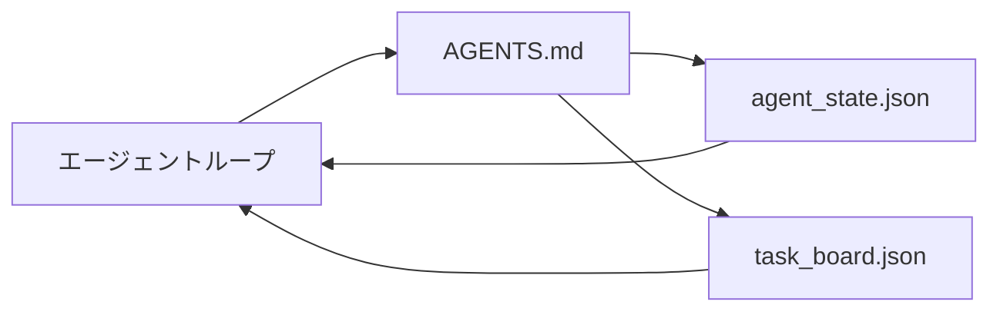

# 最小エージェントワークベンチ

> 最小限の有用なワークベンチは3つのファイルだ：ルートの指示ルーター、ステートファイル、タスクボード。それ以外はすべてその上に積み重なる。リポジトリがこの3つを持てないなら、どのモデルも救ってくれない。


## 学習目標

- 最小実行可能ワークベンチを形成する3つのファイルを定義する。
- 短いルートルーターが長いモノリシックな`AGENTS.md`より優れている理由を説明する。
- エージェントが毎ターン読み、最後に書き込めるステートファイルを構築する。
- チャット履歴なしでマルチセッション作業を乗り切るタスクボードを構築する。

## 問題

ほとんどのチームは3000行の`AGENTS.md`を書いてワークベンチを完成させようとする。モデルはそれをロードし、要約できない部分を無視し、常に失敗していた表面で失敗し続ける。

必要なのは逆だ。関連する時にのみより深いファイルにエージェントをルーティングする小さなルートファイル。エージェントが行動する前に読んで、後に書き込むデュラブルなステート。進行中のもの、ブロックされているもの、次に何があるかを示すタスクボード。

3つのファイル。それぞれに仕事がある。それぞれが後で実際のシステムに進化するのに十分な機械可読性を持つ。

## コンセプト



### AGENTS.mdはルーターであり、マニュアルではない

良い`AGENTS.md`は短い。エージェントを以下に向ける：

- ステートファイル（どこにいるか）。
- タスクボード（何が残っているか）。
- より深いルール（`docs/agent-rules.md`の下）。
- 検証コマンド（それが機能するかどうかを知る方法）。

それ以上はすべて、必要な時だけロードされる深いドキュメントに行く。長いマニュアルは無視される。短いルーターは従われる。

### agent_state.jsonが記録のシステム

ステートが運ぶもの：アクティブなタスクid、触れたファイル、立てた仮定、ブロッカー、次のアクション。エージェントは毎ターンそれを読む。次のセッションはチャットを再生する代わりにそれを読む。

ステートはチャット履歴が信頼できないのでファイルに存在する。セッションが死ぬ。会話がトリミングされる。ファイルはそうならない。

### task_board.jsonがキュー

タスクボードはすべてのタスクをステータス`todo | in_progress | done | blocked`とともに運ぶ。ステートが空の時にエージェントが引き出すキューであり、エージェントが軌道に乗っているかどうかを知りたい時に読むキューだ。

ボード上のタスクはid、ゴール、オーナー（`builder`、`reviewer`、または`human`）、受け入れ基準を持つ。ボードは意図的に小さい：1画面を超えたら、ボードの問題ではなく計画の問題がある。

### 3つのファイルは床であり、天井ではない

後のレッスンでスコープコントラクト、フィードバックランナー、検証ゲート、レビュアーチェックリスト、ハンドオフパケットが追加される。ここの3つのファイルはそれらすべてが前提とするものだ。

## 実装する

`code/main.py` が空のリポジトリに最小ワークベンチを書き込み、以下を実行する1回のエージェントターンをデモする：

1. `agent_state.json`を読む。
2. ステートが空ならば`task_board.json`から次のタスクを引き出す。
3. スコープ内の単一ファイルに触れる。
4. 更新されたステートを書き戻す。

実行：

```
python3 code/main.py
```

スクリプトは自分自身の横に`workdir/`を作り、3つのファイルを配置し、1ターン実行してdiffを出力する。2回目の実行で最初のターンが止まった場所から次のターンが続く様子を見る。

## 使ってみる

プロダクションエージェント製品の中で、同じ3つのファイルが異なる名前で登場する：

- **Claude Code：** ルーター用の`AGENTS.md`または`CLAUDE.md`、ステート用の`.claude/state.json`スタイルのストア、ボード用のフック。
- **Codex / Cursor：** ルーター用のワークスペースルール、ステート用のセッションメモリ、ボード用のチャットサイドバーのキューに入ったタスク。
- **カスタムPythonエージェント：** 今書いたのと同じファイル。

名前が変わる。形状は変わらない。

## 実際の本番パターン

最小ワークベンチは、3つのパターンを積み重ねることで実際のモノリポに生き残る。それらは独立している；リポジトリが実際に必要なものを選ぶ。

**最近勝ち優先のネストされた`AGENTS.md`。** OpenAIは主要リポジトリ全体に88の`AGENTS.md`ファイルを出荷し、サブコンポーネントごとに1つある。Codex、Cursor、Claude Code、Copilotはすべて作業ファイルからリポジトリルートに向かって歩き、途中で見つけたすべての`AGENTS.md`を連結する。サブディレクトリファイルがルートファイルを拡張する。Codexは拡張ではなく置き換えるために`AGENTS.override.md`を追加する；オーバーライドメカニズムはCodex固有のため、クロスツール作業では避ける。Augment Codeの測定が重要な行だ：最良の`AGENTS.md`ファイルがHaikuからOpusへのアップグレードに相当する品質ジャンプを与える；最悪のものはファイルなしより出力を悪化させる。

**拒否すべきアンチパターン（カバレッジのように見えても）。** 矛盾する指示がエージェントをインタラクティブモードから貪欲モードにサイレントにドロップする（ICLR 2026 AMBIG-SWE：48.8%→28%解決率）；平坦に積み重ねるのではなく優先度を番号付けする。強制コマンドなしの検証不可能なスタイルルール（「Googleのタイルに従う」）でエージェントにコンプライアンスを発明させる；すべてのスタイルルールを正確なlintコマンドとペアにする。コマンドよりスタイルを先に置くと検証パスが埋もれる；コマンドを先に、スタイルを最後に。人間のためにエージェントのために書かずコンテキストバジェットを浪費する；簡潔さは機能だ。

**クロスツールシンリンク。** 単一のルートファイルとシンリンク（`ln -s AGENTS.md CLAUDE.md`、`ln -s AGENTS.md .github/copilot-instructions.md`、`ln -s AGENTS.md .cursorrules`）で、すべてのコーディングエージェントが同じ真実のソースを保つ。Nxの`nx ai-setup`が単一の設定からClaude Code、Cursor、Copilot、Gemini、Codex、OpenCodeにわたってこれを自動化する。

## 成果物を出す

`outputs/skill-minimal-workbench.md` が任意の新しいリポジトリのために3つのファイルのワークベンチを生成する：プロジェクトに合わせた`AGENTS.md`ルーター、正しいキーを持つ`agent_state.json`、現在のバックログでシードされた`task_board.json`。

## 演習

1. `agent_state.json`に`last_run`タイムスタンプを追加する。オペレーターが確認しない限りファイルが24時間以上古い場合は実行を拒否する。
2. タスクボードに`priority`フィールドを追加して、プラーが常に最高優先度の`todo`を選ぶように変更する。
3. `task_board.json`をJSON Linesに移行してバージョン管理でdiffがクリーンになるようにする。
4. `AGENTS.md`が80行を超えるか存在しないファイルを参照する場合に失敗する`lint_workbench.py`を書く。
5. 3つのファイルのうちどれを失うと最も痛いか決める。それを擁護する。

## キーワード

| 用語 | 一般的な言い方 | 実際の意味 |
|------|----------------|------------|
| ルーター | `AGENTS.md` | エージェントをより深いドキュメントとファイルに向ける短いルートファイル |
| ステートファイル | 「ノート」 | エージェントがどこにいるかの機械可読レコード、毎ターン書き込まれる |
| タスクボード | 「バックログ」 | ステータス、オーナー、受け入れを持つ作業のJSONキュー |
| 記録のシステム | 「真実のソース」 | チャットがなくなった時にワークベンチが権威として扱うファイル |

## 参考資料

- [agents.md — オープンスペック](https://agents.md/) — Cursor、Codex、Claude Code、Copilot、Gemini、OpenCodeに採用
- [Augment Code、良いAGENTS.mdはモデルのアップグレード。悪いものはドキュメントなしより悪い](https://www.augmentcode.com/blog/how-to-write-good-agents-dot-md-files) — 測定された品質ジャンプ
- [Blake Crosley、AGENTS.mdパターン：実際にエージェント動作を変えるもの](https://blakecrosley.com/blog/agents-md-patterns) — 経験的に機能するもの、しないもの
- [Datadog Frontend、AGENTS.mdでモノリポのAIエージェントを誘導する](https://dev.to/datadog-frontend-dev/steering-ai-agents-in-monorepos-with-agentsmd-13g0) — 実際のネスト優先度
- [Nx Blog、AIエージェントにモノリポで作業する方法を教える](https://nx.dev/blog/nx-ai-agent-skills) — 6ツールにわたる単一ソース生成
- [The Prompt Shelf、AGENTS.mdベストプラクティス：構造、スコープ、実例](https://thepromptshelf.dev/blog/agents-md-best-practices/) — レビューを生き残るセクション順序
- [Anthropic、Claude Codeサブエージェントとセッションストア](https://docs.anthropic.com/en/docs/agents-and-tools/claude-code/sub-agents)
- フェーズ14・31 — この最小が吸収する失敗モード
- フェーズ14・34 — このレッスンがプレビューするデュラブルステートスキーマ
