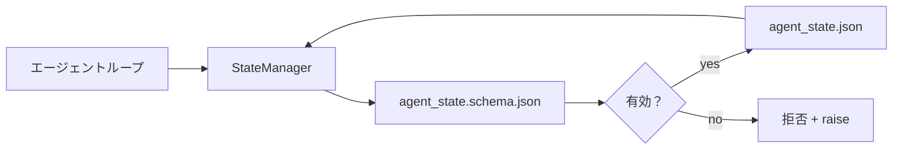

# リポジトリメモリとデュラブルステート

> チャット履歴は揮発性だ。リポジトリはデュラブルだ。ワークベンチはエージェントステートをバージョン管理されたファイルに保存するので、次のセッション、次のエージェント、次のレビュアーがすべて同じ真実のソースから読む。


## 学習目標

- リポジトリメモリに何が属し、チャット履歴に何が属するかを定義する。
- `agent_state.json`と`task_board.json`のJSONスキーマを作成する。
- ステートをアトミックにロード、検証、変更、永続化するステートマネージャーを構築する。
- スキーマを使用してワークベンチを破壊する前に不正な書き込みを拒否する。

## 問題

エージェントがセッションを終了する。チャットが閉じる。次のセッションが開く。どこから始めるかを聞く。モデルは「ファイルを確認させてください」と言い、古いノートを読み、すでに完了している作業をやり直す。あるいはさらに悪い場合、ファイルが終わっていることを誰も教えなかったので、完成したファイルを書き直す。

ワークベンチの修正はリポジトリメモリだ：ステートはリポジトリのJSONファイルに存在し、スキーマの下で書かれ、アトミックに永続化され、コードレビューでdiffフレンドリーだ。チャットは一時的なフィード；リポジトリが記録のシステムだ。

## コンセプト



### リポジトリメモリに何が属するか

| 属するもの | 属さないもの |
|----------|------------|
| アクティブなタスクid | 生のチャットトランスクリプト |
| このセッションで触れたファイル | トークンレベルの推論トレース |
| エージェントが立てた仮定 | 「ユーザーが苛立っているようだった」 |
| 未解決のブロッカー | サンプルされた補完 |
| 次のアクション | ベンダー固有のモデルid |

テストはデュラビリティだ：これはCIの再実行で3ヶ月後に役立つか？ はいならリポジトリ。いいえならテレメトリー。

### スキーマファーストのステート

JSONスキーマがコントラクトだ。なしでは、すべてのエージェントが新しいフィールドを発明し、すべてのレビュアーが新しい形状を学び、すべてのCIスクリプトが過去のバージョンを特殊扱いしなければならない。あれば、不正な書き込みが拒否される書き込みだ。

スキーマがカバーするもの：

- 必須キー。
- 許可された`status`値。
- 禁止値（例：配列に対する`null`）。
- パターン制約（タスクidは`T-\d{3,}`にマッチする）。
- 移行のためのバージョンフィールド。

### アトミック書き込み

ステート書き込みは部分的な失敗を生き残る必要がある：テンプファイルに書き込み、fsync、ターゲットの上にリネーム。ステートファイルが真実のソースだ；半分書かれたものはファイルなしより悪い。

### 移行

スキーマが変わる時、スキーマバンプの横に移行スクリプトを出荷する。ステートファイルは`schema_version`フィールドを持つ；マネージャーは移行できないバージョンのファイルのロードを拒否する。

## 実装する

`code/main.py` が実装するもの：

- `agent_state.schema.json`と`task_board.schema.json`。
- 標準ライブラリのみのバリデーター（JSONスキーマのサブセット：required、type、enum、pattern、items）。
- アトミックtemp-and-rename書き込みを持つ`StateManager.load`、`StateManager.update`、`StateManager.commit`。
- ステートを変更、永続化、再ロードして往復を証明するデモ。

実行：

```
python3 code/main.py
```

スクリプトが`workdir/agent_state.json`と`workdir/task_board.json`を書き込み、2ターンにわたってそれらを変更し、各ステップで検証されたステートを出力する。

## 実際の本番パターン

4つのパターンがレッスンの最小限をマルチエージェントモノリポが生き残れるものに変える。

**アトミックtemp-and-renameはオプションではない。** 2026年3月のHiveプロジェクトバグレポートが失敗モードを明確に文書化している：`state.json`が`write_text()`で書き込まれ、例外がキャッチされてサイレントに無視された。部分的な書き込みにより、セッションがシグナルなしで壊れたステートに対して再開する。修正は常に：`tempfile.mkstemp`をターゲットと同じディレクトリに、書き込み、`fsync`、`os.replace`（POSIXとWindowsでのアトミックリネーム）。このレッスンの`atomic_write`がまさにそれを行う。

**すべての非べき等ツール呼び出しにべき等性キー。** エージェントがツールを呼び出した後、結果をチェックポイントする前にクラッシュした場合、リカバリーがツール呼び出しを再試行する。読み取りには安全；メール、DBインサート、ファイルアップロードには危険。パターン：実行前にすべてのツール呼び出しIDを`pending_calls.jsonl`にログする。再試行時にIDを確認；存在する場合、呼び出しをスキップしてキャッシュされた結果を使用。AnthropicとLangChainの両方が2026年のガイダンスでこれを指摘している；LangGraphのチェックポインターが同じ理由で保留中の書き込みを永続化する。

**ステートから大きなアーティファクトを分離する。** CSV、長いトランスクリプト、生成されたファイルを`agent_state.json`に保存しない。アーティファクトを別のファイルとして保存（またはオブジェクトストレージにアップロード）し、ステートにはパスだけを保持する。チェックポイントが小さく速く保たれる；アーティファクトが独立して成長する。

**監査のためのイベントソーシング、再開のためのスナップショット。** すべての変更時にイベントログ（`state.events.jsonl`）に追記；定期的に`state.json`にスナップショットする。再開はスナップショットを読み、スナップショットのタイムスタンプ後のイベントを再生する。これはより多くのディスクを消費するが、エージェントの決定を逐語的に再生できる——長期実行のデバッグに不可欠。Postgresが内部的にWALに使う同じ形状。

**スキーマ移行または拒否してロードしない。** `schema_version`整数がコントラクトだ。マネージャーが未知のバージョンのファイルをロードする時、読むことを拒否する。スキーマバンプの横に移行スクリプトを出荷する；`tools/migrate_state.py`がすべての起動時にべき等に実行する。

## 使ってみる

プロダクションでは：

- **LangGraphチェックポインター。** 同じアイデア、異なるストレージ。チェックポインターがグラフステートをSQLite、Postgres、またはカスタムバックエンドに永続化する。このレッスンが教えるスキーマは、チェックポインターが死んで手動でステートを読む必要がある時に使うものだ。
- **Lettaメモリブロック。** 構造化スキーマを持つ永続ブロック（フェーズ14・08）。ステートの同じ規律が長期実行ペルソナにスコープされている。
- **OpenAI Agents SDKセッションストア。** プラガブルバックエンド、スキーマ対応。このレッスンのステートファイルがローカルファイルバックエンドだ。

## 成果物を出す

`outputs/skill-state-schema.md` がプロジェクト固有のJSONスキーマペア（ステート + ボード）、アトミック書き込みにワイヤーされたPython `StateManager`、次のスキーマバンプがワークベンチを壊さないように移行スキャフォールドを生成する。

## 演習

1. `last_human_touch`タイムスタンプを追加する。人間の編集から5秒以内のエージェント書き込みを拒否する。
2. `oneOf`をサポートするようにバリデーターを拡張して、タスクが異なる必須フィールドを持つビルドタスクまたはレビュータスクのどちらかになれるようにする。
3. `schema_version`フィールドを追加して、v1からv2への移行を書く（`blockers`を`risks`に名前変更）。
4. ストレージバックエンドをローカルファイルからSQLiteに移動する。`StateManager` APIを同一に保つ。
5. 50ミリ秒の書き込みレースで同じステートファイルに対して2つのエージェントを実行する。何がおかしくなって、アトミックリネームがどう救うか？

## キーワード

| 用語 | 一般的な言い方 | 実際の意味 |
|------|----------------|------------|
| リポジトリメモリ | 「ノートファイル」 | スキーマの下でリポジトリの追跡されたファイルに保存されたステート |
| スキーマファースト | 「入力を検証する」 | ライターの前にコントラクトを定義し、ドリフトを拒否 |
| アトミック書き込み | 「単にリネームする」 | テンプに書き込み、fsync、リネームして部分的な失敗が破壊できないように |
| 移行 | 「スキーマバンプ」 | vNステートをv(N+1)ステートに変えるスクリプト |
| 記録のシステム | 「真実のソース」 | ワークベンチが権威として扱うアーティファクト |

## 参考資料

- [JSONスキーマ仕様](https://json-schema.org/specification.html)
- [LangGraphチェックポインター](https://langchain-ai.github.io/langgraph/concepts/persistence/)
- [Lettaメモリブロック](https://docs.letta.com/concepts/memory)
- [Fast.io、AIエージェントステートチェックポイント：実践ガイド](https://fast.io/resources/ai-agent-state-checkpointing/) — べき等性を持つスキーマファーストチェックポイント
- [Fast.io、AIエージェントワークフローステート永続性：2026年ベストプラクティス](https://fast.io/resources/ai-agent-workflow-state-persistence/) — 並行制御、TTL、イベントソーシング
- [Hive Issue #6263 — アトミックでないstate.jsonの書き込みがサイレントに無視される](https://github.com/aden-hive/hive/issues/6263) — 実際のプロジェクトでの失敗モード
- [eunomia、チェックポイント/リストアシステム：進化、技術、AIエージェントへの応用](https://eunomia.dev/blog/2025/05/11/checkpointrestore-systems-evolution-techniques-and-applications-in-ai-agents/) — OSの歴史からエージェントに適用されるCRプリミティブ
- [Indium、2026年の長期実行AIエージェントの7つのステート永続化戦略](https://www.indium.tech/blog/7-state-persistence-strategies-ai-agents-2026/)
- [Microsoft Agent Framework、コンパクション](https://learn.microsoft.com/en-us/agent-framework/agents/conversations/compaction) — ベンダーチェックポイントマネージャー
- フェーズ14・08 — メモリブロックとスリープタイムコンピュート
- フェーズ14・32 — このレッスンがスキーマ化する3ファイル最小限
- フェーズ14・40 — 同じスキーマから読むハンドオフパケット
