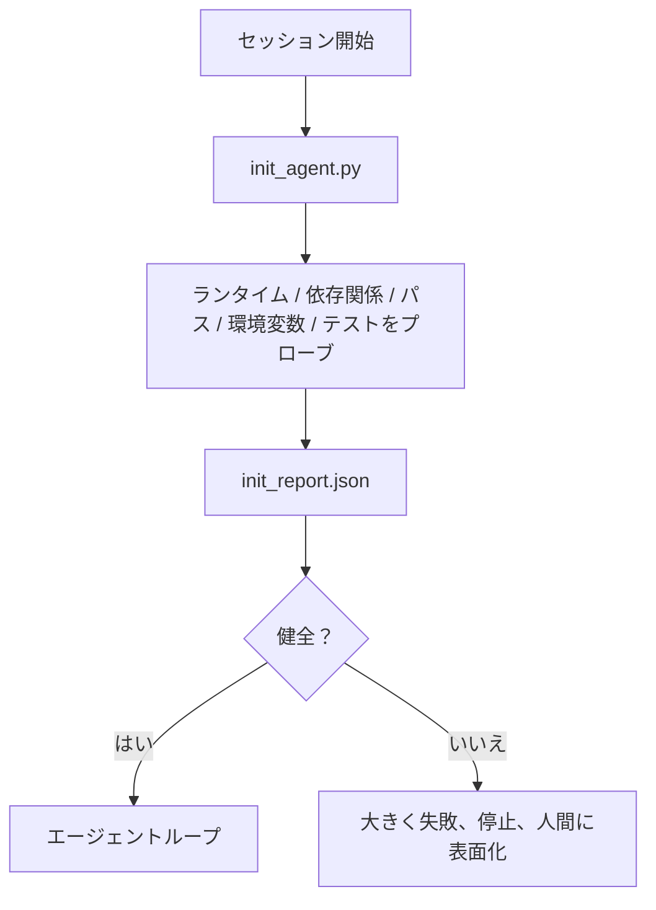

# エージェントの初期化スクリプト

> コールドスタートするすべてのセッションは税を払う。エージェントが同じファイルを読み、同じプローブを再試行し、同じパスを再発見する。初期化スクリプトはその税を一度だけ払い、答えをステートに書き込む。


## 学習目標

- エージェントがセッションごとに絶対にやり直すべきでない作業を特定する。
- ランタイム、依存関係、リポジトリの健全性をプローブする決定論的な初期化スクリプトを構築する。
- エージェントがチェックを再実行する代わりにそれを読めるようにプローブ結果を永続化する。
- 初期化が失敗した時に大きく、速く、1箇所で失敗する。

## 問題

セッションを開く。エージェントがPythonバージョンを推測する。テストコマンドを推測する。エントリーポイントを見つけるためにリポジトリルートを5回リストする。インストールされていないパッケージをインポートしようとする。設定ファイルの場所をユーザーに聞く。本当の編集をする頃には、セットアップ作業に1万トークンが費やされている。

修正は、エージェントが他の何かをする前に実行し、起動時にエージェントが読む`init_report.json`を書く1つの初期化スクリプトだ。

## コンセプト



### 初期化スクリプトがプローブするもの

| プローブ | 重要な理由 |
|--------|----------|
| ランタイムバージョン | 間違ったPythonまたはNodeバージョンはサイレントな間違いバージョンのバグを意味する |
| 依存関係の可用性 | 今キャッチするコストは後でキャッチするコストの10倍 |
| テストコマンド | エージェントは検証方法を知らなければならない；コマンドが欠けているとワークベンチが壊れている |
| リポジトリパス | ハードコードされたパスはドリフトする；一度解決してピン止め |
| 環境変数 | `OPENAI_API_KEY`の欠落は失敗表面であり、ランタイムの謎ではない |
| ステート + ボードの鮮度 | クラッシュしたセッションからの古いステートはフットガン |
| 最後の既知良好コミット | セッション終了時のハンドオフdiffのアンカー |

### 大きく失敗、速く失敗、1箇所で失敗

プローブの失敗は停止して人間に表面化することを意味する。「エージェントが解決するだろう」はない。初期化のポイントはワークベンチが壊れている時に開始を拒否することだ。

### べき等

連続して2回実行する。2回目の実行はタイムスタンプを除いてno-opであるべきだ。べき等性によってスクリプトをCI、フック、またはpre-taskスラッシュコマンドに組み込める。

### 初期化対起動ルール

ルール（フェーズ14・33）は行動するために何が真である必要があるかを説明する。初期化はそれらのルールがチェックできることを確立するスクリプトだ。初期化なしのルールは「注意して」になる。ルールなしの初期化は洗練された失敗になる。

## 実装する

`code/main.py` が`init_agent.py`を実装する：

- 5つのプローブ：Pythonバージョン、`importlib.util.find_spec`による列挙された依存関係、テストコマンドの解決可能性、必要な環境変数、ステートファイルの鮮度。
- 各プローブが`(name, status, detail)`を返す。
- スクリプトがプローブの完全セットで`init_report.json`を書き、ブロック重大度のプローブが失敗した場合はゼロ以外で終了する。

実行：

```
python3 code/main.py
```

スクリプトがプローブのテーブルを出力し、`init_report.json`を書き、ハッピーパスではゼロで、失敗したプローブのリストで非ゼロで終了する。

## 実際の本番パターン

3つのパターンが有用な初期化スクリプトとセレモニーを分ける。

**最後の既知良好コミットアンカリング。** 現在のコミットを最後の成功マージで書かれた`LKG`ファイルに対してプローブする。diffがバジェット（デフォルト50ファイル）を超えた場合、開始を拒否して人間に新しいベースラインを批准させる。これはCloudflareのAIコードレビューがレビュアーエージェントをスコープするために使用するものだ：すべてのレビューセッションが同じ最後の既知良好に対してアンカーし、セッションをまたいでドリフトを複合させない。

**TTL付きロックファイル。** 最初の成功したプローブパスの後に`prereqs.lock`を書く。後続の実行はN時間（デフォルト24時間）ロックを信頼し、依存関係マニフェストハッシュが一致する場合は高価なプローブをスキップする。初期化スクリプトが最初にロックを読む；新鮮でマニフェストハッシュが一致する場合はショートサーキット。Dockerがレイヤーキャッシュに使うのと同じパターン：べき等プローブ + コンテンツハッシュ = スキップ。

**ホットパスにネットワークなし、LLMなし、驚きなし。** 初期化プローブは決定論的な配管だ。失敗を分類するためにLLMを呼び出すか、ライセンスをチェックするために外部サービスにヒットするプローブはプローブではなくワークフローだ。プローブがドライランで3秒以上かかる場合、それをワークベンチの臭いとして扱い、初期化から移動するか結果をキャッシュする。

## 使ってみる

プロダクションでは：

- **Claude Codeフック。** `pre-task`フックが初期化スクリプトを呼び出し、失敗した場合にエージェントの起動を拒否する。
- **GitHub Actions。** `setup-agent`ジョブが初期化スクリプトを実行；エージェントジョブがそれに依存する。
- **Dockerエントリーポイント。** エージェントコンテナが初期化スクリプトをエージェントランタイムのexecの前に実行；ログが失敗時に表面化する。

初期化スクリプトは特定のフレームワークを呼び出さないのでポータブルだ。Bash、Make、またはタスクファイルがすべてそれをラップできる。

## 成果物を出す

`outputs/skill-init-script.md` がプロジェクトにインタビューし、セットアップ作業をプローブに分類し、プロジェクト固有の`init_agent.py`とエージェントステップの前に実行するCIワークフローを出力する。

## 演習

1. 現在のコミットを最後の既知良好コミットに対してdiffするプローブを追加し、50以上のファイルが変わった場合は開始を拒否する。
2. スクリプトが`prereqs.lock`ファイルを書き、ロックが7日以上古い場合は開始を拒否するようにする。
3. 欠落した開発依存関係を自動インストールするが、承認なしにランタイム依存関係を絶対に変更しない`--fix`フラグを追加する。
4. プローブをハードコードされた関数からYAMLレジストリに移動する。トレードオフを擁護する。
5. プローブごとのタイミングバジェットを追加する。3秒以上実行するプローブはワークベンチの臭いだ。

## キーワード

| 用語 | 一般的な言い方 | 実際の意味 |
|------|----------------|------------|
| プローブ | 「チェック」 | `(name, status, detail)`を返す決定論的関数 |
| 初期化レポート | 「セットアップ出力」 | プローブ結果とともにステートの横に書かれたJSON |
| べき等 | 「安全に再実行」 | 連続した2回の実行がタイムスタンプを除いて同一のレポートを生成する |
| 大きく失敗 | 「飲み込まない」 | 停止して人間に表面化；サイレントフォールバックなし |
| セットアップ税 | 「ブートストラップコスト」 | エージェントが明白なことを再発見するためにセッションごとに費やすトークン |

## 参考資料

- [Anthropic、長時間実行エージェントの効果的なハーネス](https://www.anthropic.com/engineering/effective-harnesses-for-long-running-agents)
- [GitHub Actions、セットアップのためのコンポジットアクション](https://docs.github.com/en/actions/sharing-automations/creating-actions/creating-a-composite-action)
- [microservices.io、GenAI開発プラットフォーム：ガードレール](https://microservices.io/post/architecture/2026/03/09/genai-development-platform-part-1-development-guardrails.html) — 初期化としてのpre-commit + CIチェック
- [Augment Code、AGENTS.mdの構築方法（2026）](https://www.augmentcode.com/guides/how-to-build-agents-md) — 初期化の期待
- [Codex Blog、Codex CLIコンテキストコンパクション](https://codex.danielvaughan.com/2026/03/31/codex-cli-context-compaction-architecture/) — コンパクション対応初期化としてのセッション開始
- フェーズ14・33 — このスクリプトが有効にするルールセット
- フェーズ14・34 — このスクリプトがシードするステートファイル
- フェーズ14・38 — 初期化スクリプトが供給する検証ゲート
- フェーズ14・40 — 初期化レポートの最後の既知良好を消費するハンドオフ
