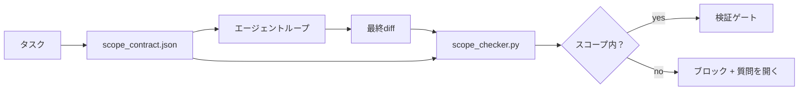

# スコープコントラクトとタスク境界

> モデルは作業がどこで終わるかを知らない。スコープコントラクトはタスクごとのファイルで、作業がどこで始まり、どこで終わり、溢れた場合にどうロールバックするかを示す。コントラクトは「スコープ内にとどまれ」を願いからチェックに変える。


## 学習目標

- エージェントがタスク開始時に読み、ベリファイアがタスク終了時に読むスコープコントラクトを書く。
- 許可されたファイル、禁止されたファイル、受け入れ基準、ロールバック計画、承認境界を指定する。
- コントラクトに対してdiffを比較してスコープ違反をフラグするスコープチェッカーを実装する。
- スコープクリープを可視化し、自動化し、レビュー可能にする。

## 問題

エージェントがクリープする。タスクは「ログインバグを修正する」だ。diffがログインルート、メールヘルパー、データベースドライバー、README、リリーススクリプトに触れる。各タッチにはその瞬間にもっともらしい理由があった。合わせてレビューされたものとは異なる変更だ。

スコープクリープはエージェント作業で最も監視されていない失敗モードだ。なぜならエージェントが各ステップを誠実に語るから。修正はより厳格なプロンプトではない。修正は何が約束されたかを言い、結果を約束と比較するチェックを持つディスク上のコントラクトだ。

## コンセプト



### スコープコントラクトに入るもの

| フィールド | 目的 |
|---------|-----|
| `task_id` | ボードのタスクにリンク |
| `goal` | レビュアーが検証できる1文 |
| `allowed_files` | エージェントが書き込めるグロブ |
| `forbidden_files` | エージェントが間違えても触ってはならないグロブ |
| `acceptance_criteria` | 完了を証明するテストコマンドまたはアサーション行 |
| `rollback_plan` | 停止が必要な場合にオペレーターが実行できる1段落 |
| `approvals_required` | スコープ外で明示的な人間の承認が必要なアクション |

`forbidden_files`のないコントラクトは不完全だ。ネガティブスペースがコントラクトの半分だ。

### パスではなくグロブ

実際のリポジトリはファイルを移動する。コントラクトをグロブ（`app/**/*.py`、`tests/test_signup*.py`）にピン止めして、セッション間のリファクタリングでコントラクトが無効にならないようにする。

### ロールバックはスコープの一部

ロールバック方法をリストアップすることで、コントラクト作成者が何がうまくいかないかを考えることを強制する。ロールバックできないコントラクトは承認されるべきコントラクトではない。

### スコープチェックはdiffチェック

エージェントがdiffを書く。チェッカーがdiff、許可されたグロブ、禁止されたグロブ、実行された受け入れコマンドのリストを読む。各違反は検証ゲートが拒否できるタグ付きファインディングだ。

### スコープの2つの高度：フィーチャーリストとタスクコントラクト

スコープコントラクトは1つのタスクを境界付ける。プロジェクトを境界付けない。エージェントはログイン修正のコントラクト内に完全にとどまり、次のターンで、プロジェクトには設定ページ、ダークモードトグル、ルーターのリライトも必要と決める可能性がある。コントラクトはどの作業がプロジェクトのスコープ内かを聞かれたことはなく、どのファイルがタスクのスコープ内かだけを聞かれた。

その2番目の高度には独自のプリミティブが必要だ：エージェントがセッション開始時に読む`feature_list.json`。これはプロジェクトバックログを機械可読な順序付けされたファイルとして持つ。エージェントは`status`が`todo`の正確に1つのフィーチャーを選び、そのidをアクティブスコープコントラクトに書き込み、同じセッションで2番目のフィーチャーを開始することを禁じられる。「一度に1フィーチャー」はエージェントが合理化して通過できるプロンプトの行ではなくなり、ディスクから読み取る値となり、ゲートが強制するチェックになる。

```json
{
  "project": "knowledge-base",
  "active": "import-pdf",
  "features": [
    { "id": "import-pdf",   "status": "in_progress", "goal": "PDFをライブラリにインポートする",        "done_when": "pytest tests/test_import.py && サンプルPDFがライブラリビューに表示される" },
    { "id": "full-text-search", "status": "todo",     "goal": "ドキュメントテキストを検索してヒットをランク付け",   "done_when": "クエリがスニペット付きのランク付けされた結果を返す" },
    { "id": "cite-answers", "status": "todo",         "goal": "回答がソースの引用を持つ",        "done_when": "すべての回答が少なくとも1つのクリック可能な引用をレンダリングする" }
  ]
}
```

| フィールド | 目的 |
|---------|-----|
| `active` | 現在のセッションが触れる可能性がある唯一のフィーチャー；空の場合は1つを選んで設定する |
| `features[].id` | スコープコントラクトの`task_id`がポイントする安定したスラッグ |
| `features[].status` | `todo`、`in_progress`、`done`、`blocked`；一度に1つの`in_progress`のみ |
| `features[].goal` | レビュアーが検証できる1文 |
| `features[].done_when` | `in_progress`を`done`に変える受け入れ行 |

2つのルールがリストを装飾的ではなく機能的にする。第一に、「`in_progress`は最大1つ」の不変条件はそれ自体が起動チェック（フェーズ14・33）だ：リストが2つを示したら、人間が解決するまでセッションが開始を拒否する。第二に、フィーチャーリストはチャットメッセージではなくファイルだ。なぜならチャットはコンテキストから外れてスクロールし、ファイルはセッションをまたいでエージェントをまたいで永続するから。ハンドオフ（フェーズ14・40）が完成したフィーチャーのステータスを`done`に書き戻すので、次のセッションは何が残っているかを再推論する代わりに正確なボードを開く。

コントラクトとリストは最小権限で組み合わさる：タスクコントラクトの`allowed_files`はアクティブフィーチャーが触れるものの内側に存在しなければならず、その外側には存在してはならない。

## 実装する

`code/main.py` が実装するもの：

- `scope_contract.json`スキーマ（JSONスキーマのサブセット、グロブ配列）。
- 触れたファイルのリストと実行されたコマンドのリストを`RunSummary`に変えるdiffパーサー。
- コントラクトに対して`(violations, in_scope, off_scope)`を返す`scope_check`。
- 2つのデモ実行：スコープ内にとどまるもの、クリープするもの。チェッカーが正確なファイルと理由でクリープをフラグする。

実行：

```
python3 code/main.py
```

出力：コントラクト、2つの実行、実行ごとの判定、保存された`scope_report.json`。

## 実際の本番パターン

「スペックスマクシング」（エージェントを呼び出す前にYAMLでスコープコントラクト）を実行する実践者が、エージェントを変えずに3週間でラビットホール率が52%から21%に下がったと報告している。コントラクトが作業をし、モデルがしたのではない。3つのパターンが利益を持続させる。

**バイナリ失敗ではなく違反バジェット。** `agent-guardrails`（Claude Code、Cursor、Windsurf、CodexがMCP経由で使うOSSマージゲート）がタスクごとに`violationBudget`を出荷する：バジェット内のマイナースコープスリップは警告として表面化；バジェットを超えた時のみマージゲートが拒否する。`violationSeverity: "error" | "warning"`とペアにする。バジェットは出荷するゲートとそれを嫌いになったチームに無効化されるゲートの違いだ。

**パスファミリーによる重大度の非対称性。** `docs/**`へのスコープ外書き込みは通常`warn`；`scripts/**`、`migrations/**`、`config/prod/**`へのスコープ外書き込みは常に`block`。この非対称性はコントラクトに存在しなければならず、ランタイムにではない。なぜならプロジェクト固有でタスクごとに変わるから。

**ファイルバジェットの次にタイムと集ネットワークバジェット。** `time_budget_minutes`フィールドがウォールクロックを境界付ける；ランタイムが再承認なしに続けることを拒否する。ホスト名の`network_egress`許可リストがエージェントがタスクの一部でなかった外部APIを静かにヒットすることを防ぐ。これらもスコープの次元だ；ファイルグロブは必要だが十分ではない。

**マルチコントラクトのマージ意味論（最小権限）。** 2つのスコープコントラクトが適用される時（例：プロジェクト全体コントラクト + タスク固有コントラクト）、マージは：`allowed_files`を**交差**する（両方のコントラクトがパスを許可しなければならない）、`forbidden_files`を**結合**する（どちらかが禁止できる）、`time_budget_minutes`は最も制限的（min）、`approvals_required`が累積する。`network_egress`は強制なしで`None`、すべて拒否で`[]`、許可リストで`[...]`；マージ下では`None`が他方に従い、2つのリストが交差し、すべて拒否が維持される。コントラクトスキーマにこれを述べてマージが機械的でレビュー可能になるようにする。

## 使ってみる

プロダクションパターン：

- **Claude Codeスラッシュコマンド。** `/scope`コマンドがコントラクトを書き、セッションコンテキストとしてピン止めする。サブエージェントが行動する前にコントラクトを読む。
- **GitHub PR。** PRボディまたはチェックインされたアーティファクトとしてコントラクトをJSON ファイルとしてプッシュする。CIがマージdiffに対してスコープチェッカーを実行する。
- **LangGraphインタラプト。** スコープ違反がインタラプトをトリガーする；ハンドラーがコントラクトを成長させるかエージェントを後退させるかを人間に聞く。

コントラクトはタスクと共に移動する。タスクが終了すると、コントラクトは`outputs/scope/closed/`の下にアーカイブされる。

## 成果物を出す

`outputs/skill-scope-contract.md` がタスクの説明のスコープコントラクトと、すべてのエージェントdiffでCIで実行されるグロブ対応チェッカーを生成する。

## 演習

1. 許可された外部ホストをリストする`network_egress`フィールドを追加する。他のホストに触れる実行を拒否する。
2. `docs/**`でソフト失敗し、`scripts/**`でハード失敗するようにチェッカーを拡張する。非対称性を正当化する。
3. 静的ルールセット（LLMなし）を使って`goal`フィールドから`allowed_files`を導出するようにコントラクトを作る。最初のエッジケースで何がうまくいかないか？
4. `time_budget_minutes`を追加してウォールクロックを超えたら続けることを拒否する。
5. 同じdiffに対して2つのコントラクトを実行する。両方が適用される時の正しいマージ意味論は何か？

## キーワード

| 用語 | 一般的な言い方 | 実際の意味 |
|------|----------------|------------|
| スコープコントラクト | 「タスクブリーフ」 | 許可/禁止ファイル、受け入れ、ロールバックをリストするタスクごとのJSON |
| スコープクリープ | 「他にも触れた...」 | コントラクト外のファイルが同じタスクで変わった |
| ロールバック計画 | 「元に戻せる」 | 停止のための1段落のオペレーターランブック |
| 承認境界 | 「承認が必要」 | 明示的な人間の承認が必要なコントラクトに記載されたアクション |
| diffチェック | 「パス監査」 | 触れたファイルをコントラクトのグロブと比較する |

## 参考資料

- [LangGraph人間介入インタラプト](https://langchain-ai.github.io/langgraph/concepts/human_in_the_loop/)
- [OpenAI Agents SDKツール承認ポリシー](https://platform.openai.com/docs/guides/agents-sdk)
- [logi-cmd/agent-guardrails — マージゲートとスコープバリデーション](https://github.com/logi-cmd/agent-guardrails) — 違反バジェット、重大度層
- [Dev|Journal、コントラクトテストでAIエージェント設定ドリフトを防ぐ](https://earezki.com/ai-news/2026-05-05-i-built-a-tiny-ci-tool-to-keep-ai-agent-configs-from-drifting-in-my-repo/) — 外部依存なしの`--strict`モード
- [アジェンティックコーディングはトラップではない（プロダクションログ）](https://dev.to/jtorchia/agentic-coding-is-not-a-trap-i-answered-the-viral-hn-post-with-my-own-production-logs-33d9) — スペックスマクシングの実績：52%→21%
- [OpenCode権限グロブ](https://opencode.ai/docs/agents/) — 権限ごとの細粒度スコープ
- [Knostic、AIコーディングエージェントのセキュリティ：脅威モデルと保護戦略](https://www.knostic.ai/blog/ai-coding-agent-security) — 最小権限の一部としてのスコープ
- [Augment Code、AI Specテンプレート](https://www.augmentcode.com/guides/ai-spec-template) — 3層境界システム（must/ask/never）
- フェーズ14・27 — スコープロックとペアになるプロンプトインジェクション防御
- フェーズ14・33 — このコントラクトがタスクごとに特化するルールセット
- フェーズ14・38 — チェッカーがレポートする検証ゲート
