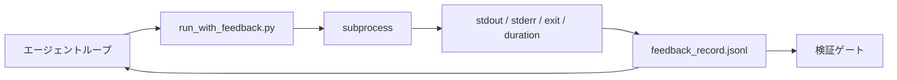

# ランタイムフィードバックループ

> コマンドの実際の出力を見ないエージェントは推測する。フィードバックランナーはstdout、stderr、終了コード、タイミングを次のターンが読める構造化レコードにキャプチャする。そうするとエージェントは自分の事実の予測ではなく事実に反応する。


## 学習目標

- ランタイムフィードバックとオブザーバビリティテレメトリーを区別する。
- シェルコマンドをラップして構造化レコードを永続化するフィードバックランナーを構築する。
- 大きな出力を決定論的にトランケートしてループをトークンバジェット内に保つ。
- フィードバックが欠けている時にループの前進を拒否する。

## 問題

エージェントが「今テストを実行しています」と言う。次のメッセージが「すべてのテストが合格した」と言う。現実はテストが実行されていない。エージェントが出力を想像したか、コマンドを実行して結果を読まなかったか、結果を読んで失敗行をサイレントにトランケートした。

フィードバックランナーがそのギャップを取り除く。すべてのコマンドがランナーを通る。すべてのレコードがコマンド、キャプチャされたstdoutとstderr、終了コード、ウォールクロック時間、1行のエージェントノートを持つ。エージェントが次のターンにレコードを読む。検証ゲートがタスク終了時にレコードを読む。

## コンセプト



### フィードバックレコードに入るもの

| フィールド | 重要な理由 |
|---------|----------|
| `command` | シェル展開の驚きのない正確なargv |
| `stdout_tail` | 最後のN行、決定論的トランケーション |
| `stderr_tail` | 最後のN行、stdoutとは別 |
| `exit_code` | 明確な成功シグナル |
| `duration_ms` | 遅いプローブと暴走プロセスを表面化する |
| `started_at` | 再生のためのタイムスタンプ |
| `agent_note` | エージェントが期待することについて書く1行 |

### トランケーションは決定論的

50MBのログがループを破壊する。ランナーは`...truncated N lines...`マーカーで先頭と末尾をトランケートし、決定論的なので同じ出力が常に同じレコードを生成する。サンプリングなし；エージェントが見る必要がある部分（最終エラー、最終サマリー）は末尾に存在する。

### フィードバック対テレメトリー

テレメトリー（フェーズ14・23、OTel GenAI規約）は時間をまたいで実行をレビューする人間オペレーター向けだ。フィードバックはこの実行の次のターン向けだ。フィールドを共有するが、異なる保持期間を持つ異なるファイルに存在する。

### フィードバックなしに前進を拒否

ランナーがキャプチャ終了前にエラーになった場合、レコードは`exit_code: null`と`error: <reason>`を持つ。エージェントループは`null`終了で成功を主張することを拒否しなければならない。終了なし、進歩なし。

## 実装する

`code/main.py` が実装するもの：

- `run_with_feedback(command, agent_note)`は`subprocess.run`をラップし、stdout/stderr/exit/durationをキャプチャし、決定論的にトランケートし、`feedback_record.jsonl`に追記する。
- JSONLをPythonリストにストリームする小さなローダー。
- 3つのコマンド（成功、失敗、遅い）を実行して最後のレコードをコマンドごとに出力するデモ。

実行：

```
python3 code/main.py
```

出力：`feedback_record.jsonl`に追記された3つのフィードバックレコード、それぞれの最後の1つがインラインに出力される。再実行をまたいでファイルをテールしてループが蓄積される様子を見る。

## 実際の本番パターン

3つのパターンがランナーを出荷に十分なほど強固にする。

**書き込み時のリダクション、読み取り時ではない。** stdoutまたはstderrに触れるすべてのレコードがシークレットを漏らす可能性がある。ランナーはJSONLの追記前にリダクションパスを出荷する：`^Bearer `、`password=`、`api[_-]?key=`、`AKIA[0-9A-Z]{16}`（AWS）、`xox[baprs]-`（Slack）にマッチする行をストリップする。読み取り時のリダクションはフットガンだ；ディスク上のファイルが攻撃者が到達するものだ。プロダクションランタイムで観察されたシークレット形式に対してリダクションパターンを四半期ごとに監査する。

**シングルファイルではなくローテーションポリシー。** `feedback_record.jsonl`をファイルごとに1MBでキャップ；オーバーフロー時は`.1`、`.2`にローテートし、`.5`を削除する。エージェントのループは現在のファイルだけを読むのでランタイムコストが境界付けられる。CIアーティファクトストレージが完全なローテートセットを取得する。ローテーションなしでファイルがすべてのローダー呼び出しのボトルネックになる。

**リトライチェーンのための親コマンドid。** すべてのレコードが`command_id`を取得する；リトライが前の試みを指す`parent_command_id`を持つ。レビュアーの「失敗した試み」リスト（フェーズ14・40）と検証ゲートの監査が両方チェーンをたどる。このリンクなしでは、リトライが独立した成功のように見え、監査が失敗履歴を隠す。

## 使ってみる

プロダクションパターン：

- **Claude Code Bashツール。** ツールがすでにstdout、stderr、exit、durationをキャプチャする。このレッスンのランナーはすべてのエージェント製品のためのフレームワーク非依存の同等物だ。
- **LangGraphノード。** レコードがグラフステートの外に永続するようにランナーで任意のシェルノードをラップする。
- **CIログ。** JSONLをCIアーティファクトストアにパイプ；レビュアーがセッションを再実行せずに任意のコマンドを再生できる。

ランナーはすべてのフレームワーク移行を生き残る薄いラッパーだ。なぜならレコードの形状を所有するから。

## 成果物を出す

`outputs/skill-feedback-runner.md` が正しいトランケーションバジェット、ワークベンチにワイヤーされたJSONLライター、エージェントが毎ターン読むローダーを持つプロジェクト固有の`run_with_feedback.py`を生成する。

## 演習

1. レコードごとに`cwd`フィールドを追加して異なるディレクトリから実行された同じコマンドを区別できるようにする。
2. `^Bearer `または`password=`にマッチする行をストリップする`redaction`ステップを追加する。フィクスチャレコードでテストする。
3. `feedback_record.jsonl`の総サイズを`.1`、`.2`ファイルへのローテーションで1MBにキャップする。ローテーションポリシーを擁護する。
4. リトライチェーンが見えるように`parent_command_id`を追加する：どのコマンドが次のコマンドが消費した入力を生成したか。
5. 最新の非ゼロexitを強調表示する小さなTUIにJSONLをパイプする。レビューで有用であるためにTUIが示さなければならない8つの主要機能。

## キーワード

| 用語 | 一般的な言い方 | 実際の意味 |
|------|----------------|------------|
| フィードバックレコード | 「実行ログ」 | コマンド、出力、exit、durationを持つ構造化JSONLエントリー |
| テールトランケーション | 「ログをトリム」 | レコードがトークンバジェットに収まるよう決定論的な先頭+末尾キャプチャ |
| Nullで拒否 | 「欠落データでブロック」 | `exit_code`がnullの時ループが前進してはならない |
| エージェントノート | 「期待タグ」 | エージェントが結果を読む前に書く1行の予測 |
| テレメトリー分割 | 「2つのログファイル」 | 次のターンのためのフィードバック、オペレーターのためのテレメトリー |

## 参考資料

- [OpenTelemetry GenAIセマンティック規約](https://opentelemetry.io/docs/specs/semconv/gen-ai/)
- [Anthropic、長時間実行エージェントの効果的なハーネス](https://www.anthropic.com/engineering/effective-harnesses-for-long-running-agents)
- [Guardrails AI x MLflow — 決定論的セーフティ、PII、品質バリデーター](https://guardrailsai.com/blog/guardrails-mlflow) — リグレッションテストとしてのリダクションパターン
- [Aport.io、2026年最良AIエージェントガードレール：事前アクション認可の比較](https://aport.io/blog/best-ai-agent-guardrails-2026-pre-action-authorization-compared/) — pre/post-toolキャプチャ
- [Andrii Furmanets、2026年AIエージェント：ツール、メモリ、評価、ガードレールの実践的アーキテクチャ](https://andriifurmanets.com/blogs/ai-agents-2026-practical-architecture-tools-memory-evals-guardrails) — オブザーバビリティ表面
- フェーズ14・23 — テレメトリー側のOTel GenAI規約
- フェーズ14・24 — エージェントオブザーバビリティプラットフォーム（Langfuse、Phoenix、Opik）
- フェーズ14・33 — 完了を宣言する前にフィードバックを要求するルール
- フェーズ14・38 — JSONLを読む検証ゲート
