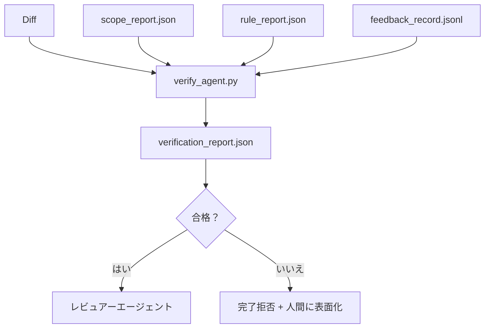

# 検証ゲート

> エージェントは自分の作業を完了とマークできない。検証ゲートはスコープコントラクト、フィードバックログ、ルールレポート、diffを読んで1つの質問に答える：このタスクは実際に完了しているか？ ゲートがノーと言えば、チャットが何と言おうとタスクは完了していない。


## 学習目標

- 検証ゲートをワークベンチアーティファクトに対する決定論的関数として定義する。
- ルールレポート、スコープレポート、フィードバックレコード、diffを1つの判定に組み合わせる。
- レビュアーエージェントとCIの両方が読める`verification_report.json`を出力する。
- 例外なしにブロック重大度の失敗でタスクの前進を拒否する。

## 問題

エージェントが成功を宣言しやすすぎる。3つの失敗形状が支配する：

- 「良さそうだ。」モデルが自分のdiffを読んで正しいと判断した。
- 「テストが合格した。」自信を持って言った。テストが実際に実行されたという記録はない。
- 「受け入れが満たされた。」受け入れ基準が「完了に似た何か」を意味するほど緩やかに解釈された。

ワークベンチの修正はエージェントがすでに生成したアーティファクトを読んで判定を下す単一の検証ゲートだ。ゲートは決定論的だ。ゲートはバージョン管理にある。ゲートはCIに組み込まれている。エージェントはそれを買収できない。

## コンセプト



### ゲートがチェックするもの

| チェック | ソースアーティファクト | 重大度 |
|--------|-----------------|-------|
| すべての受け入れコマンドが実行された | `feedback_record.jsonl` | block |
| すべての受け入れコマンドがゼロで終了した | `feedback_record.jsonl` | block |
| スコープチェックに禁止書き込みがない | `scope_report.json` | block |
| スコープチェックにスコープ外書き込みがない | `scope_report.json` | block または warn |
| すべてのブロック重大度ルールが合格する | `rule_report.json` | block |
| フィードバックに`null`終了コードがない | `feedback_record.jsonl` | block |
| 触れたファイルが`scope.allowed_files`にマッチする | 両方 | warn |

`warn`ファインディングが判定に注釈をつける；`block`ファインディングが`passed: true`を防ぐ。

### 確率論的ではなく決定論的

ゲートは同じアーティファクトセットに対して毎回同じ判定を生成しなければならない。LLMジャッジなし。LLMジャッジはレビュアー側（フェーズ14・39）に属し、そこでは目標がステータスではなく定性評価だ。

### 1つのレポート、1つのパス

ゲートはタスクの終了ごとに1つの`verification_report.json`を`outputs/verification/<task_id>.json`に出力する。CIが同じパスを消費する。異なるパスを持つ複数のゲートが真実のソースを分岐させる。

### 例外なしに拒否

ブロック重大度のファインディングはエージェントがオーバーライドできない。人間だけが`override_reason`と`overridden_by`ユーザーidを記録してオーバーライドできる。オーバーライドは署名された変更であり、エージェントの決定ではない。

## 実装する

`code/main.py` が実装するもの：

- 各入力アーティファクトのローダー、すべてローカルでスタブ化してレッスンが自己完結するように。
- `verify(task_id, artifacts) -> VerdictReport`ピュア関数。
- チェックごとの結果と最終合格/不合格を表示するプリンター。
- 3つのタスクシナリオのデモ：クリーンな合格、スコープクリープ、欠落した受け入れ。

実行：

```
python3 code/main.py
```

出力：3つの判定レポート、それぞれスクリプトの横に保存される。

## 実際の本番パターン

4つのパターンがゲートを「別のlintジョブ」から「決定的なエッジ」に高める。

**単一ゲートではなく多層防御。** Pre-commitフック → CIステータスチェック → pre-toolの認可フック → pre-mergeゲート。各レイヤーが決定論的なので1つのレイヤーの失敗が次のレイヤーでキャッチされる。microservices.ioの2026年3月のプレイブックが明示的だ：pre-commitフックはモデル側スキルとは異なりエージェントが指示に従うことに依存しないため回避不可能だ。検証ゲートはCIとpre-mergeレイヤーに座る。

**決定論的チェックによる防御、ニュアンスのみのモデルジャッジ。** Anthropicの2026年ハイブリッドノームのペアリング：検証可能な報酬（ユニットテスト、スキーマチェック、終了コード）が「コードが問題を解決したか？」に答える——LLMルーブリックが「コードは読みやすく、安全で、スタイルに合っているか？」に答える。ゲートが最初のクラスを実行；レビュアー（フェーズ14・39）が2番目を実行する。それらを混在させるとシグナルが崩壊する。

**Slackスレッドではなく署名されたオーバーライドログ。** すべてのオーバーライドが`outputs/verification/overrides.jsonl`に行を出力する：タイムスタンプ、ファインディングコード、理由、署名ユーザー、現在のHEADコミット。ランタイムが署名のないオーバーライドを拒否；監査証跡がgit追跡される。これはオーバーライドポリシーとオーバーライドシアターの違いだ。

**一流のチェックとしてのカバレッジフロア。** `coverage_report.json`が`coverage_floor`（デフォルト80%）チェックを供給する。測定されたカバレッジがフロアを下回るか、前回のマージのフロアを1パーセントポイント以上下回ると、ゲートが失敗する。このチェックなしでは、エージェントが失敗するテストを静かに削除し、検証レポートがグリーンのままになる。

**`--strict`モードがwarnをblockに昇格させる。** リリースブランチ、出荷をブロックするPR、またはポストインシデントのトリアージには、`--strict`がすべての警告をハード失敗にする。フラグはブランチごとにオプトイン；デフォルトのグローバルではない。なぜならstrict-on-everythingが日常のフローを侵食するから。

## 使ってみる

プロダクションパターン：

- **CIステップ。** `verify_agent`ジョブがエージェントの最終アーティファクトに対してゲートを実行する。マージ保護が`passed: true`なしに拒否する。
- **Pre-handoffフック。** エージェントランタイムがハンドオフドキュメントを生成する前にゲートを呼び出す。グリーン判定なし、ハンドオフなし。
- **手動トリアージ。** エージェントが成功を主張して人間が疑う時にオペレーターがレポートを読む。

ゲートはワークベンチフローの決定的なエッジだ。他のすべての表面がその上流にある。

## 成果物を出す

`outputs/skill-verification-gate.md` がゲートを特定のプロジェクトに組み込む：どの受け入れコマンドが供給するか、どのルールがブロック重大度か、どのスコープ外書き込みが許容されるか、オーバーライド監査ログがどう保存されるか。

## 演習

1. `coverage_floor`チェックを追加する：テストコマンドが少なくとも80%のカバレッジレポートを生成しなければならない。フロアをどのアーティファクトが運ぶかを決める。
2. すべての`warn`を`block`に昇格させる`--strict`モードをサポートする。strictモードが正しいデフォルトであるケースをドキュメント化する。
3. ゲートがJSONに加えてMarkdownサマリーを生成するようにする。どのフィールドがサマリーに属するかを擁護する。
4. `time_since_last_human_touch`チェックを追加する：人間のキーストロークの60秒以内に編集されたファイルはスコープ外フラグから免除される。
5. 自分の製品からの実際のエージェントdiffにゲートを実行する。どのファインディングが本物でどれがノイズか？ゲートはどこで成長する必要があるか？

## キーワード

| 用語 | 一般的な言い方 | 実際の意味 |
|------|----------------|------------|
| 検証ゲート | 「物事を止めるチェック」 | 合格/不合格判定を生成するワークベンチアーティファクトに対する決定論的関数 |
| ブロック重大度 | 「ハード失敗」 | `passed: true`を防ぎ署名されたオーバーライドを必要とするファインディング |
| オーバーライドログ | 「なぜ通したか」 | 理由とユーザーidを持つ署名されたエントリー、レビューで監査される |
| 受け入れコマンド | 「証拠」 | そのゼロ終了が「完了」を意味するシェルコマンド |
| 1つのレポートパス | 「真実のソース」 | `outputs/verification/<task_id>.json`、CIと人間の両方が消費する |

## 参考資料

- [Anthropic、長時間実行アプリケーション開発のハーネス設計](https://www.anthropic.com/engineering/harness-design-long-running-apps)
- [OpenAI Agents SDKガードレール](https://platform.openai.com/docs/guides/agents-sdk/guardrails)
- [microservices.io、GenAI開発プラットフォーム：ガードレール](https://microservices.io/post/architecture/2026/03/09/genai-development-platform-part-1-development-guardrails.html) — pre-commitとCIの間の多層防御
- [ICMD、2026年アジェンティックAI Opsのプレイブック](https://icmd.app/article/the-2026-playbook-for-agentic-ai-ops-guardrails-costs-and-reliability-at-scale-1776661990431) — 承認ゲートラダー（ドラフト → 承認 → しきい値以下の自動）
- [型チェックコンプライアンス：決定論的ガードレール（arXiv 2604.01483）](https://arxiv.org/pdf/2604.01483) — 決定論的ゲートの上限としてのLean 4
- [logi-cmd/agent-guardrails — マージゲートスペック](https://github.com/logi-cmd/agent-guardrails) — スコープ + ミューテーションテストゲート
- [Guardrails AI x MLflow](https://guardrailsai.com/blog/guardrails-mlflow) — CIスコアラーとしての決定論的バリデーター
- [Akira、アジェンティックシステムのリアルタイムガードレール](https://www.akira.ai/blog/real-time-guardrails-agentic-systems) — pre/post-toolゲート
- フェーズ14・27 — プロンプトインジェクション防御（ゲートの敵対的ペア）
- フェーズ14・36 — このゲートが強制するスコープコントラクト
- フェーズ14・37 — このゲートがスコアリングするフィードバックログ
- フェーズ14・39 — ゲートがハンドオフするレビュアーエージェント
