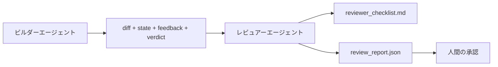

# レビュアーエージェント：ビルダーとマーカーを分離する

> コードを書いたエージェントはそれを採点できない。レビュアーは異なるシステムプロンプト、異なる目標、ビルダーが生成したすべてのものへの読み取り専用アクセスを持つ2番目のループだ。ビルダーとレビュアーのギャップに信頼性のほとんどが存在する。


## 学習目標

- 同じエージェントが自分の作業を信頼性高くレビューできない理由を述べる。
- ビルダーのアーティファクトを消費し構造化レビューレポートを出力するレビュアーエージェントループを構築する。
- 感覚ではなく特定の次元を採点するレビュアールーブリックを作成する。
- 人間のレビューステップが実際のアーティファクトから始まるようにレビュアーをワークベンチに組み込む。

## 問題

エージェントにバグを修正するよう頼む。4つのファイルを編集し、テストを実行し、完了を報告する。検証ゲート（フェーズ14・38）が受け入れが実行されてスコープが保持されたことを確認する。ゲートが`passed: true`と言う。マージする。2日後、修正がバグの間違った半分を解決したことを発見する。

受け入れは必要条件だが十分ではない。レビュアーは受け入れが答えられない質問をする：これは正しい問題を解決したか？ フラグを立てずにスコープを拡大したか？ 疑問視されるべき仮定をドキュメント化したか？ 次のセッションが引き継げる状態にワークベンチを残したか？

## コンセプト



### レビュアールーブリック

5つの次元、それぞれ0〜2でスコアリング。

| 次元 | 質問 |
|-----|-----|
| 問題フィット | 変更はステートされたタスクを解決したか、近くのタスクではなく？ |
| スコープ規律 | 編集はコントラクトに限定されたか、またはコントラクトは意図的に成長したか？ |
| 仮定 | すべての隠れた仮定がどこかにレビュー可能として書かれているか？ |
| 検証品質 | 受け入れコマンドは実際にゴールを証明しているか、またはより弱いバージョンを証明したか？ |
| ハンドオフ準備 | 次のセッションが現在のステートからクリーンに引き継げるか？ |

10点満点。7点未満の実行はソフト失敗；5点未満はハード失敗。

### レビュアーは別のロールであり、別のモデルではない

ビルダーと同じモデルでレビュアーを実行できる。規律はロールの分離だ：異なるシステムプロンプト、異なる入力、diffへの書き込みアクセスなし。姿勢の変化がシグナルの変化だ。

### レビュアーはdiffを編集できない

レビュアーはdiff、ステート、フィードバック、判定を読む。レポートを書く。diffにパッチを当てない。レポートが「これを修正する」と言えば、次のビルダーターンが修正する；レビュアーはレビューに戻る。ロールを混在させるとギャップが消える。

### レビュアールーブリック対検証ゲート

ゲート（フェーズ14・38）は決定論的事実をチェックする：受け入れは実行されたか、ルールは合格したか、スコープは保持されたか。レビュアーは定性的判断をする：これは正しい作業だったか、ドキュメント化されているか、ハンドオフは使えるか。両方が必要だ。

## 実装する

`code/main.py` が実装するもの：

- レビュアーが読むアーティファクトをバンドルする`ReviewerInputs`データクラス。
- 次元ごとに1つのルーブリックスコアラー。各関数はレッスン向けに決定論的でスタブグレード；実際の実装はLLMを呼び出す。
- 5つのスコア、合計、判定（`pass`、`soft_fail`、`hard_fail`）を持つ`review_report.json`ライター。
- 2つのデモケース：クリーンな変更と「テストは正しい、問題は間違い」変更。

実行：

```
python3 code/main.py
```

出力：2つのレビューレポートがディスクに書かれ、次元スコアのコンソールテーブル。

## 実際の本番パターン

領収書：Cloudflareの2026年4月のAIコードレビューシステムが30日で5,169リポジトリの48,095マージリクエストにわたる131,246レビュー実行をした。中央値レビューが3分39秒で完了した。最大7人の専門家レビュアー（セキュリティ、パフォーマンス、コード品質、ドキュメント、リリース管理、コンプライアンス、エンジニアリングCodex）がReview Coordinatorの下で並列実行し、ファインディングを重複排除して重大度を判断した。最上位モデルはコーディネーター専用；専門家はより安価な層で実行。

4つのパターンがこれをスケールで機能させる。

**1つの大きなレビュアーではなく専門家プール。** 5次元のルーブリックを持つ1人のレビュアーがソロリポジトリに機能する。コードベースにセキュリティクリティカル、パフォーマンスクリティカル、ドキュメント表面がある時は、より小さなプロンプトを持つ専門家に分割する。コーディネーターが重複排除をする；専門家が完全なルーブリックを実行しない。モデル層の分離が生じる：安価な専門家、高価なコーディネーター。

**最適化としてではなく設計要件としてのバイアス軽減。** LLMジャッジは4つの信頼できるバイアスを示す（Adnan Masood、2026年4月）：ポジションバイアス（GPT-4が(A,B)対(B,A)の順序で約40%不一致）、詳細バイアス（より長い出力への約15%スコアインフレーション）、自己好み（ジャッジが同じモデルファミリーの出力を好む）、権威（ジャッジが既知の著者への言及を過大評価する）。軽減：両方の順序を評価して一貫した勝ちのみカウント；簡潔さを明示的に報酬する1〜4スケールを使う；モデルファミリーをまたいでジャッジをローテートする；スコアリング前に著者名を削除する。

**感覚ではなくキャリブレーションセット。** 正しい判定が既知の10〜20タスクの過去のセット。すべてのプロンプト変更でレビュアーを実行する。過去のレコードとの合意が80%を下回ったら、レビュアーを出荷する前にルーブリックを修正する。これはすべてのチームが最終的に再発見するもの；最初から始めた方が良い。

**ゲートとのハイブリッドノーム。** 検証ゲート（フェーズ14・38）が決定論的チェックを処理する（受け入れは実行されたか、テストは合格したか、スコープは保持されたか）。レビュアーがセマンティックチェックを処理する（これは正しい作業だったか、仮定はドキュメント化されているか、ハンドオフは使えるか）。Anthropicの2026年ガイダンスはこの分割を明示的にしている：ゲートがすでに証明することをレビュアーに再実行させないこと。

## 使ってみる

プロダクションパターン：

- **Claude Codeサブエージェント。** ビルダーがタスクを閉じた後にレビュアーサブエージェントが実行する。PRのコメントにルーブリックスコアを投稿する。
- **OpenAI Agents SDKハンドオフ。** ビルダーがタスク完了時にレビュアーにハンドオフする。レビュアーがファインディングのリストで戻るか人間に上げることができる。
- **2モデルペアリング。** ビルダーがより速い安価なモデルで実行。レビュアーが小さいコンテキストに集中した強いモデルで実行し、判断に焦点を当てる。

レビュアーはワークベンチが人間がすべてのレビューをできない時に成長させる2番目の目だ。

## 成果物を出す

`outputs/skill-reviewer-agent.md` がプロジェクト固有のレビュアールーブリック、ビルダーのアーティファクトにワイヤーされたレビュアーエージェントスタブ、人間のレビューが白紙ではなく書かれたレポートから始まるように検証ゲートとの統合を生成する。

## 演習

1. 自分の製品ドメインに特定の6番目の次元を追加する。既存の5つに吸収されない理由を擁護する。
2. 2つの異なるシステムプロンプト（簡潔、詳細）でレビュアーを実行する。どちらが人間が読む可能性が高いレポートを生成するか？
3. 次元ごとに`confidence`フィールドを追加する。最も低い次元のconfidenceが0.6未満の時はレポートの出荷を拒否する。
4. キャリブレーションセットを構築する：正しい判定が既知の10個の過去のタスク終了。それらに対してレビュアーを実行する。どこで過去のレコードと一致しないか？
5. 「より多くの証拠を求める」余裕を追加する：レビュアーがスコアリング前にビルダーに特定のテスト実行を求めることができる。ループしないための正しいバックオフは何か？

## キーワード

| 用語 | 一般的な言い方 | 実際の意味 |
|------|----------------|------------|
| レビュアールーブリック | 「チェックリスト」 | 次元ごとに書かれた質問を持つ5次元の0〜2スコアリング |
| ソフト失敗 | 「改訂が必要」 | 合計7点未満；ビルダーが対処するファインディングを取得 |
| ハード失敗 | 「拒否」 | 合計5点未満または任意の次元が0；停止して人間に表面化 |
| ロールの分離 | 「異なるプロンプト」 | 同じモデルが両方の役割を果たせる；規律は入力と姿勢にある |
| Confidenceフロア | 「低シグナルレポートを出荷しない」 | ルーブリックが不確かな時は判定を出力しないこと |

## 参考資料

- [OpenAI Agents SDKハンドオフ](https://platform.openai.com/docs/guides/agents-sdk/handoffs)
- [Anthropic Claude Codeサブエージェント](https://docs.anthropic.com/en/docs/agents-and-tools/claude-code/sub-agents)
- [Cloudflare、AIコードレビューのスケールでのオーケストレーション](https://blog.cloudflare.com/ai-code-review/) — 7専門家 + コーディネーターアーキテクチャ、30日で131k実行
- [Agent-as-a-Judge：エージェントでエージェントを評価する（OpenReview / ICLR）](https://openreview.net/forum?id=DeVm3YUnpj) — DevAIベンチマーク、366の階層的ソリューション要件
- [Adnan Masood、ルーブリックベースの評価とLLM-as-a-Judge：方法論、バイアス、経験的検証](https://medium.com/@adnanmasood/rubric-based-evals-llm-as-a-judge-methodologies-and-empirical-validation-in-domain-context-71936b989e80) — 4つのバイアスと軽減
- [MLflow、LLM-as-a-Judge評価](https://mlflow.org/llm-as-a-judge) — 分離されたビルダー/評価者のプロダクションツール
- [LangChain、人間の修正でLLM-as-a-Judgeをキャリブレートする方法](https://www.langchain.com/articles/llm-as-a-judge) — キャリブレーションセットのワークフロー
- [Evidently AI、LLM-as-a-judge：完全ガイド](https://www.evidentlyai.com/llm-guide/llm-as-a-judge)
- [Arize、LLM as a Judge — プライマーとプリビルト評価者](https://arize.com/llm-as-a-judge/)
- フェーズ14・05 — Self-RefineとCRITIC（単一エージェント自己レビューベースライン）
- フェーズ14・30 — 評価駆動エージェント開発（キャリブレーションセットジェネレーター）
- フェーズ14・38 — レビュアーが読む検証ゲート
- フェーズ14・40 — レビュアーレポートを供給するハンドオフパケット
