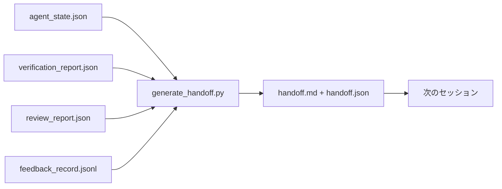

# マルチセッションハンドオフ

> セッションは終わる。作業は終わらない。ハンドオフパケットは「エージェントが1時間作業した」を「次のセッションが最初の1分から生産的になる」に変えるアーティファクトだ。後回しではなく意図的に作れ。


## 学習目標

- すべてのハンドオフパケットが必要とする7つのフィールドを特定する。
- 散文を手書きすることなくワークベンチアーティファクトからハンドオフを生成する。
- 大きなフィードバックログをハンドオフサイズのサマリーに削減する。
- 次のセッションの最初のアクションを決定論的にする。

## 問題

セッションが終わる。エージェントが「良い、進展があった」と言う。次のセッションが開く。次のエージェントが「どこで止まったか？」と聞く。最初のエージェントの回答は消えている。次のエージェントが再発見し、同じコマンドを再実行し、人間に同じ質問を再び聞き、前のセッションの最後30秒を取り戻すために30分費やす。

悪いハンドオフのコストはタスクの存続期間中、毎セッションで支払われる。修正はセッション終了時に自動生成されるパケットだ：何が変わったか、なぜか、何が試みられたか、何が失敗したか、何が残っているか、次回最初に何をするか。

## コンセプト



### すべてのハンドオフが持つ7つのフィールド

| フィールド | 答える質問 |
|-----------|----------|
| `summary` | 何が行われたかの1段落 |
| `changed_files` | 一目でわかるdiff |
| `commands_run` | 実際に実行されたもの |
| `failed_attempts` | 試みられたことと機能しなかった理由 |
| `open_risks` | 次のセッションを噛む可能性があるもの（重大度付き） |
| `next_action` | 次のセッションが取る最初の具体的なステップ |
| `verdict_pointer` | 検証 + レビューレポートへのパス |

`next_action`フィールドが荷重を担う。`next_action`以外すべてを持つハンドオフはステータスレポートであり、ハンドオフではない。

### ハンドオフは生成されるものであり、書かれるものではない

手書きのハンドオフは大変な日にスキップされるハンドオフだ。ジェネレーターがワークベンチアーティファクトを読んでパケットを出力する。エージェントの仕事はサマリーを書くことではなく、ジェネレーターが要約できる状態にワークベンチを残すことだ。

### 2つの形式：人間が読めるものとマシンが読めるもの

`handoff.md`は人間が読むもの。`handoff.json`は次のエージェントがロードするもの。両方が同じソースアーティファクトから来る。それらが乖離した場合、JSONが勝つ。

### フィードバックログのトリミング

完全な`feedback_record.jsonl`は何百ものエントリーがあるかもしれない。ハンドオフは最後のKエントリーと非ゼロ終了のすべてのエントリーのみを持つ。次のセッションが必要なら完全なログをロードするが、パケットは小さいままだ。

### クリーンな状態を残す

ハンドオフは作業を説明する。クリーンな状態は作業を再開可能にする。それらは同じではない。完璧な`handoff.md`は、次のセッションが半分適用されたdiff、エージェントが忘れた一時ファイル、迷子のブランチ、実行前にエラーになるテストに開くなら無価値だ。次のエージェントはビルドする代わりに最初の10分を前のエージェントの後片付けに費やし、タスクの存続期間中毎セッションでコストが積み重なる。

だから、フィーチャーが機能してもセッションは終わらない。ジェネレーターが要約でき次のセッションが信頼できる状態にワークベンチがある時に終わる。クリーンアップはハンドオフの前に実行される独自のフェーズであり、習慣ではなくチェックだ。なぜなら習慣は大変な日にスキップされるものだから。

| チェック | クリーンの意味 | 汚いとブロックされる理由 |
|---------|-------------|---------------------|
| ワーキングツリー | すべての変更がコミットされているか注記付きで明示的にスタッシュされている | 半分適用されたdiffが次のエージェントには意図的な作業に見える |
| 一時アーティファクト | `*.tmp`、スクラッチディレクトリ、デバッグプリント、コメントアウトブロックが残っていない | 迷子のファイルがdiffと次のエージェントのメンタルモデルを汚染する |
| テスト | グリーン、またはレッドで失敗が`open_risks`に名前が付けられている | サイレントなレッドテストは次のセッションが踏む罠だ |
| フィーチャーボード | `feature_list.json`のステータスが現実を反映している（フェーズ14・36） | 古いボードが次のセッションをすでに完了した作業に送る |
| ブランチ | 期待されるブランチにいて、デタッチされたHEADがなく、孤立ブランチがない | 間違ったブランチは次のセッションの最初のコミットが間違った場所に着くことを意味する |

クリーンアップフェーズはブロックする問題の`clean_state.json`を出力する；空のリストがパケットを書く前にハンドオフジェネレーターがアサートする前提条件だ。汚いツリーの上に構築されたハンドオフはハンドオフではなく、転送されたmessだ。2つのアーティファクトがペアになる：クリーンアップがワークベンチが残すのが安全であることを証明し、ハンドオフが次のセッションがどこから始まるかを知っていることを証明する。

## 実装する

`code/main.py`が実装するもの：

- ステート、判定、レビュー、フィードバックを1つの`WorkbenchSnapshot`に集めるローダー。
- `generate_handoff(snapshot) -> (markdown, payload)`関数。
- 最後のKフィードバックエントリーとすべての非ゼロ終了を選ぶフィルター。
- スクリプトの隣に`handoff.md`と`handoff.json`を書くデモラン。

実行：

```
python3 code/main.py
```

出力：印刷されたハンドオフ本文とディスクの両方のファイル。

## 実際の本番パターン

Codex CLI、Claude Code、OpenCodeはそれぞれ異なるコンパクションストーリーを出荷する；構造化ハンドオフパケットはすべての3つの上に座る。

**コンパクション戦略は異なる；パケットスキーマは異ならない。** Codex CLIのPOST /v1/responses/compactはサーバーサイドの不透明なAESブロブ（OpenAIモデルの高速パス）；フォールバックは`_summary`ユーザーロールメッセージとして追加されるローカル「ハンドオフサマリー」。Claude Codeはコンテキストの95%で5ステージのプログレッシブコンパクションを実行する。OpenCodeはタイムスタンプベースのメッセージ非表示と5見出しのLLMサマリーを行う。3つの異なるメカニズム、同じニーズ：圧縮を生き残るものをポータブルなアーティファクトにシリアライズする。パケットがそのアーティファクトだ。

**フレッシュセッションハンドオフはコンパクションではない。** コンパクションはセッションを延長する；ハンドオフはセッションをクリーンに閉じて次を開始する。Hermes Issue #20372フレーミング（2026年4月）は正しい：インプレス圧縮が劣化し始めたら、エージェントはコンパクトなハンドオフを書き、セッションを終了し、フレッシュコンテキストで再開すべきだ。パケットがその移行を安価にするものだ。間違いはクオリティが崩壊するまで圧縮し続けること；修正は早くクリーンなハンドオフのためにバジェットを取ることだ。

**ブランチとトピックごとに1つのアクティブなハンドオフ。** マルチエージェント調整は悪いモデル出力よりも古いハンドオフで失敗する。常に`branch`、`last_known_good_commit`、`active | superseded | archived`の`status`を含める。古いハンドオフはアーカイブされる；アクティブなもののみが次のセッションを駆動する。これがノートとしてのハンドオフとステートとしてのハンドオフの違いだ。

**壁の前ではなく50-75%のコンテキストで締める。** 手書きパターンプレイブック（CLAUDE.md + HANDOVER.md）は95%ではなくコンテキストバジェットの50-75%でセッションが終わる時に最良の結果を報告する。コンパクションアーティファクトがソースステートを汚染する前にパケットジェネレーターがクリーンに実行する。コンテキストがそのままの間は書くのが安価；モデルがすでに位置を失い始めたら高価だ。

## 使ってみる

プロダクションパターン：

- **セッション終了フック。** ランタイムがユーザーがチャットを閉じた時にジェネレーターを起動する。パケットが`outputs/handoff/<session_id>/`に入る。
- **PRテンプレート。** ジェネレーターのmarkdownはPR本文でもある。レビュアーは5つの他のファイルを開かずに読む。
- **クロスエージェントハンドオフ。** 1つの製品でビルドし（Claude Code）、別の製品で続ける（Codex）。パケットが共通言語だ。

パケットは小さく、規則的で、生産が安価だ。コスト節約はすべてのセッションで積み重なる。

## 成果物を出す

`outputs/skill-handoff-generator.md`がプロジェクトのアーティファクトパスにチューニングされたジェネレーター、それを実行するセッション終了フック、次のエージェントが起動時に読む`handoff.json`スキーマを生成する。

## 演習

1. ビルダーがログしたがレビュアーが1以上にスコアしなかったすべての仮定を表面化する`assumptions_to_validate`フィールドを追加する。
2. 失敗したランと合格したランで異なるフィードバックサマリーをトリミングする。非対称性を擁護する。
3. 「人間への質問」リストを含める。質問がパケットに入る対チャットメッセージに入る閾値は何か？
4. ジェネレーターを冪等にする：2回実行すると同じパケットが生成される。それが成り立つためには何が安定している必要があるか？
5. 「次のセッションの前提条件」セクションを追加して、次のセッションが行動する前にロードしなければならないアーティファクトを正確にリストアップする。

## キーワード

| 用語 | 一般的な言い方 | 実際の意味 |
|------|----------------|------------|
| ハンドオフパケット | 「セッションサマリー」 | 7つのフィールドを運ぶ生成されたアーティファクト、markdownとJSONの両方 |
| ネクストアクション | 「最初に何をするか」 | 次のセッションを開始する1つの具体的なステップ |
| フィードバックトリム | 「ログサマリー」 | 最後のKレコードと非ゼロ終了のすべてのエントリー |
| ステータスレポート | 「何をしたか」 | `next_action`が欠けているドキュメント；有用だがハンドオフではない |
| 判定ポインタ | 「レシート」 | トレーサビリティのための検証 + レビューレポートへのパス |

## 参考資料

- [Anthropic、長時間実行エージェントのための効果的なハーネス](https://www.anthropic.com/engineering/effective-harnesses-for-long-running-agents)
- [OpenAI Agents SDKハンドオフ](https://platform.openai.com/docs/guides/agents-sdk/handoffs)
- [Codex Blog、Codex CLIコンテキストコンパクション：アーキテクチャ、設定、長いセッションの管理](https://codex.danielvaughan.com/2026/03/31/codex-cli-context-compaction-architecture/) — POST /v1/responses/compactとローカルフォールバック
- [Justin3go、重いメモリを脱ぎ捨てる：Codex、Claude Code、OpenCodeでのコンテキストコンパクション](https://justin3go.com/en/posts/2026/04/09-context-compaction-in-codex-claude-code-and-opencode) — 3ベンダーのコンパクション比較
- [JD Hodges、Claudeハンドオフプロンプト：セッション間でコンテキストを保持する方法（2026年）](https://www.jdhodges.com/blog/ai-session-handoffs-keep-context-across-conversations/) — CLAUDE.md + HANDOVER.md、50-75%コンテキストバジェット
- [Mervin Praison、マルチエージェントコーディングセッションでのハンドオフの管理：連続性を失わずにフレッシュコンテキスト](https://mer.vin/2026/04/managing-handoffs-in-multi-agent-coding-sessions-fresh-context-without-losing-continuity/) — 分散システムフレーミング
- [Hermes Issue #20372 — 圧縮がリスクになる時の自動フレッシュセッションハンドオフ](https://github.com/NousResearch/hermes-agent/issues/20372)
- [Hermes Issue #499 — コンテキストコンパクションクオリティオーバーホール](https://github.com/NousResearch/hermes-agent/issues/499) — Codex CLIでのハンドオフ志向プロンプト
- [Microsoft Agent Framework、コンパクション](https://learn.microsoft.com/en-us/agent-framework/agents/conversations/compaction)
- [OpenCode、コンテキスト管理とコンパクション](https://deepwiki.com/sst/opencode/2.4-context-management-and-compaction)
- [LangChain、エージェントのコンテキストエンジニアリング](https://www.langchain.com/blog/context-engineering-for-agents)
- フェーズ14・34 — ジェネレーターが読むステートファイル
- フェーズ14・38 — パケットが指す検証判定
- フェーズ14・39 — パケットにバンドルされるレビュアーレポート
