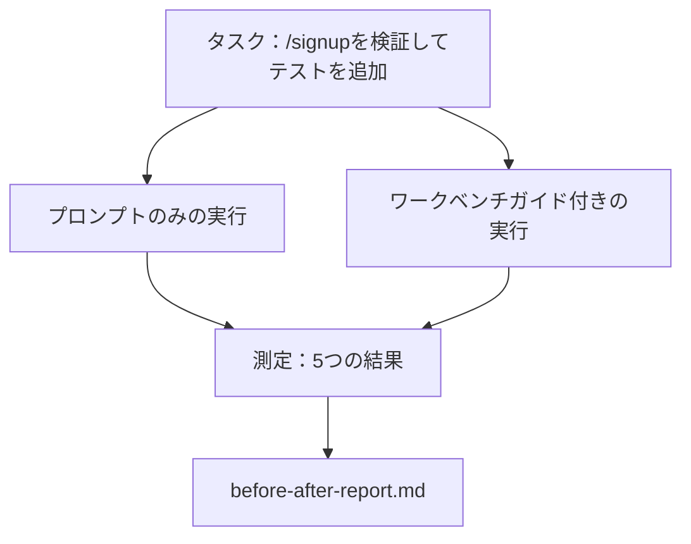

# 実際のリポジトリでのワークベンチ

> 11レッスンのサーフェスは実際のコードベースとの接触を生き延びなければ無価値だ。このレッスンは同じタスクを小さなサンプルアプリで2回実行する：プロンプトのみ対ワークベンチガイド付き。数字が論じる。


## 学習目標

- 7つのワークベンチサーフェスを小さなアプリケーションで一緒にまとめる。
- 同じタスクを2回実行して（プロンプトのみとワークベンチガイド付き）5つの結果を測定する。
- ビフォー/アフターレポートを読んで、どのサーフェスが最大のレバレッジを与えたかを決める。
- 「でも私のモデルは十分に良い」という反論に対してワークベンチを擁護する。

## 問題

おもちゃのタスクでのデモは誰も納得させない。ワークベンチへのケースは、実際的なリポジトリでの実際的なタスクが少ない失敗、少ないリバート、次のセッションが使えるパケットでプロダクションに着地する時に作られる。

このレッスンはその実際的なリポジトリを出荷して同じタスクを両方のパイプラインで実行する。結果は懐疑的な人に渡せるビフォー/アフターレポートだ。

## コンセプト



### サンプルアプリ

`sample_app/`の最小限のFastAPIスタイルハンドラー：

- まだ検証のない`/signup`を持つ`app.py`。
- 1つのハッピーパステストを持つ`test_app.py`。
- 禁止ゾーンの餌として`README.md`と`scripts/release.sh`。

### タスク

> `/signup`に入力検証を追加する：8文字未満のパスワードを拒否し、型付きエラーエンベロープで422を返す。新しい動作を証明するテストを追加する。

### 2つのパイプライン

プロンプトのみ：

1. READMEを読む。
2. `app.py`を読む。
3. ファイルを編集する。
4. 完了を宣言する。

ワークベンチガイド付き：

1. 初期化スクリプトを実行する（レッスン35）。
2. スコープコントラクトを読む（レッスン36）。
3. ステートを読む（レッスン34）。
4. 許可されたファイルのみを編集する。
5. フィードバックランナー経由で受け入れコマンドを実行する（レッスン37）。
6. 検証ゲートを実行する（レッスン38）。
7. レビュアーを実行する（レッスン39）。
8. ハンドオフを生成する（レッスン40）。

### 測定される5つの結果

| 結果 | 重要な理由 |
|-----|----------|
| `tests_actually_run` | ほとんどの「テストが合格した」という主張は検証不可能だ |
| `acceptance_met` | ゴールを証明するテストが実行されたテストでなければならない |
| `files_outside_scope` | スコープクリープが支配的なサイレント失敗だ |
| `handoff_quality` | 次のセッションがこれに対してコストを支払うか恩恵を受ける |
| `reviewer_total` | ゲートの上の定性的判断 |

## 実装する

`code/main.py`が同じサンプルアプリフィクスチャに対して2つのパイプラインをオーケストレートする。両方のパイプラインはスクリプト化されている（ループにLLMなし）ので測定が再現可能だ。スクリプトは比較を`before-after-report.md`と`comparison.json`に書く。

実行：

```
python3 code/main.py
```

出力：パイプラインごとの結果のコンソールテーブル、スクリプトの隣に保存されたMarkdownレポート、それをチャートしたい人向けのJSON。

## 実際の本番パターン

懐疑的な人の質問は「ワークベンチは実際にどれだけ助けるか？」だ。2026年の数字は説明よりはるかに多くを言う。

**同じモデルでTerminal BenchトップTop-30からTop-5に。** LangChainの*エージェントハーネスの解剖*（2026年4月）：コーディングエージェントがハーネスのみを変えてTerminal Bench 2.0でトップ30圏外からランク5に飛び上がった。同じモデル。異なるサーフェス。25ランクのデルタ。

**Vercelがツールを削除することで80%から100%に。** Vercelはエージェントのツールの80%を削除することで成功率が80%から100%になったと報告した。より小さいツールサーフェス、より鋭いスコープ、失敗する方法が少ない。ネガティブスペースが勝つ。

**Harveyがハーネスのみで2倍の精度。** 法律エージェントがモデル変更なしでハーネス最適化を通じて精度を2倍以上に高めた。

**エンタープライズAIエージェントプロジェクトの88%がプロダクションに到達しない。** preprints.orgの*言語エージェントのハーネスエンジニアリング*論文（2026年3月）が失敗をランタイムに辿る、推論ではなく：古いステート、壊れやすいリトライ、肥大化したコンテキスト、中間的な間違いからの貧しい回復。

**長コンテキスト崩壊。** WebAgentベースライン40-50%の成功率が長コンテキスト条件下で10%未満に下落し、ほとんどが無限ループとゴール喪失から。ラルフループとハンドオフパケットはそれを吸収するために存在する。

**フォルスネガティブは依然として存在する。** 単一ステップの事実タスク、1行のlint、フォーマッター実行、モデルが逐語的に記憶しているもの——これらはプロンプトのみで速く実行される。ベンチマークはワークベンチがやり過ぎとフレーミングされないように誠実にそれらを列挙すべきだ。

教訓は「ハーネスが常に勝つ」ではない。モデルは時間とともにハーネスのトリックを吸収する。教訓は今日、エンジニアリング負荷が7つのサーフェスにあり、数字がそれを証明するということだ。

## 使ってみる

このレッスンは次の時に引用するケースファイルだ：

- 誰かがすべてのPRが`agent-rules.md`とスコープコントラクトを持つ理由を聞く時。
- チームが「このスプリントだけ」検証ゲートを外したい時。
- 新しいエージェント製品が起動して実際に時間を節約するかどうかのポータブルなベンチマークが必要な時。

数字は説明よりも遠くまで伝わる。

## 成果物を出す

`outputs/skill-workbench-benchmark.md`は、プロジェクト自身のサンプルアプリに対して任意のエージェント製品を両方のパイプラインで実行して5つの結果を報告するポータブルな評価ハーネスだ。

## 演習

1. 6番目の結果を追加する：最初の意味のある編集までの時間。どうクリーンに測定するか？
2. 自分のコードベースの実際の2日目のタスクで比較を実行する。ワークベンチの数字はどこで滑るか？
3. 「フォルスネガティブ」パスを追加する：プロンプトのみの方が速いタスクとワークベンチのオーバーヘッドが実際のコストになるタスク。それでもワークベンチを保持することを擁護する。
4. スクリプト化された「エージェント」を実際のLLM呼び出しに置き換える。どの結果がよりノイジーになるか？
5. 非エンジニア向けの1ページのサマリーを作成する。何がカットを生き延びるか？

## キーワード

| 用語 | 一般的な言い方 | 実際の意味 |
|------|----------------|------------|
| サンプルアプリ | 「おもちゃのリポジトリ」 | 小さいが7つのすべてのサーフェスを使うのに十分現実的 |
| パイプライン | 「ワークフロー」 | エージェントが従うサーフェスの読み取り/書き込みの順序付きシーケンス |
| ビフォー/アフターレポート | 「レシート」 | 懐疑的な人に渡すアーティファクト |
| フォルスネガティブ | 「ワークベンチのやり過ぎ」 | プロンプトのみが速いタスク；誠実に列挙することが有用だ |
| ワークベンチベンチマーク | 「信頼性スコア」 | 自分のコードベースで比較を実行するポータブルなハーネス |

## 参考資料

- [LangChain、エージェントハーネスの解剖](https://blog.langchain.com/the-anatomy-of-an-agent-harness/) — Terminal Bench Top-30からTop-5のレシート
- [MongoDB、エージェントハーネス：LLMがエージェントシステムの最小部分である理由](https://www.mongodb.com/company/blog/technical/agent-harness-why-llm-is-smallest-part-of-your-agent-system) — VercelとHarveyの数字
- [preprints.org、言語エージェントのハーネスエンジニアリング](https://www.preprints.org/manuscript/202603.1756) — 88%のエンタープライズ失敗率、ランタイムの根本原因
- [HN：1つの午後に15のLLMコーディングを改善する。ハーネスのみが変わった](https://news.ycombinator.com/item?id=46988596) — 15のモデルで再現
- [Cloudflare、スケールでのAIコードレビューのオーケストレーション](https://blog.cloudflare.com/ai-code-review/) — 30日で131kのレビュー実行、プロダクション中
- [Anthropic、効果的なエージェントの構築](https://www.anthropic.com/research/building-effective-agents)
- フェーズ14・32から14・40 — このレッスンがエンドツーエンドで使うサーフェス
- フェーズ14・19 — SWE-bench、GAIA、AgentBenchこのレッスンが補完するマクロベンチマーク
- フェーズ14・30 — 同じハーネスがプラグインする評価駆動エージェント開発
