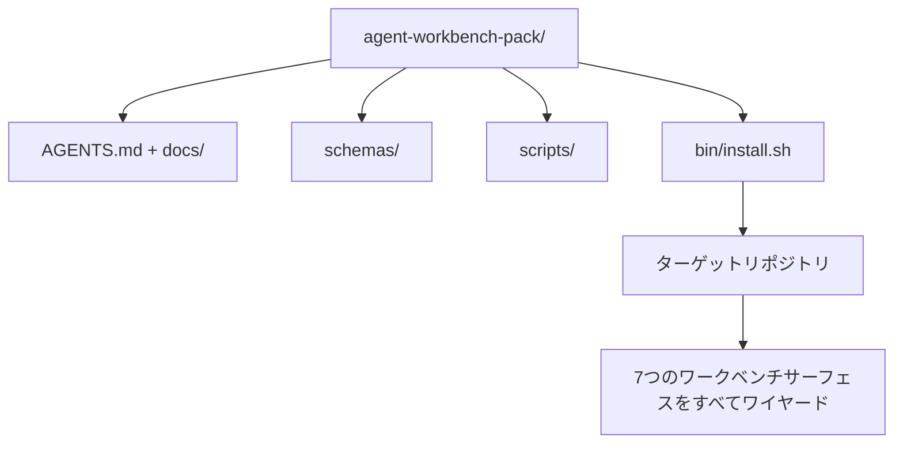

# カプストーン：再利用可能なエージェントワークベンチパックを出荷する

> ミニトラックはどんなリポジトリにもドロップできるパックで終わる。11レッスンのサーフェスを`cp -r`して翌朝にはエージェントが信頼性高く動作しているディレクトリに圧縮。カプストーンがこのカリキュラムが取引するアーティファクトだ。


## 学習目標

- 7つのワークベンチサーフェスを1つのドロップインディレクトリにパッケージ化する。
- 新しいリポジトリが既知の良いベースラインを取得できるようにスキーマ、スクリプト、テンプレートをピン留めする。
- パックを冪等的に展開する単一のインストーラースクリプトを追加する。
- パックに何が残るか、何が残らないかを決め、それぞれのカットを擁護する。

## 問題

Googleドキュメント、チャット履歴、3つの半記憶のスクリプトに住むワークベンチは四半期ごとに再構築されるワークベンチだ。修正はバージョン管理されたパック：サーフェス、スキーマ、スクリプト、ワンコマンドインストーラーを持つリポジトリまたはディレクトリだ。

このレッスンを`outputs/agent-workbench-pack/`がディスクに出荷されて`bin/install.sh`が任意のターゲットリポジトリにドロップできる状態で終える。

## コンセプト



### パックレイアウト

```
outputs/agent-workbench-pack/
├── AGENTS.md
├── docs/
│   ├── agent-rules.md
│   ├── reliability-policy.md
│   ├── handoff-protocol.md
│   └── reviewer-rubric.md
├── schemas/
│   ├── agent_state.schema.json
│   ├── task_board.schema.json
│   └── scope_contract.schema.json
├── scripts/
│   ├── init_agent.py
│   ├── run_with_feedback.py
│   ├── verify_agent.py
│   └── generate_handoff.py
├── bin/
│   └── install.sh
└── README.md
```

### 何が残るか、何が残らないか

残るもの：

- サーフェススキーマ。それらがコントラクトだ。
- 上記の4つのスクリプト。それらがランタイムだ。
- 4つのドキュメント。それらがルールとルーブリックだ。

残らないもの：

- プロジェクト固有のタスク。タスクはターゲットリポジトリのボードに属し、パックではない。
- ベンダーSDK呼び出し。パックはフレームワーク非依存だ。
- オンボーディングの散文。パックはチームの既存のオンボーディングの隣に住み、その中にではない。

### インストーラー

短い`bin/install.sh`（または`bin/install.py`）：

1. `--force`なしに既存のパックの上にインストールすることを拒否する。
2. パックをターゲットリポジトリにコピーする。
3. `.github/workflows/`が存在すればCIをワイヤーする。
4. 次のステップを印刷する：ボードを埋める、受け入れコマンドを設定する、initスクリプトを実行する。

### バージョン管理

パックは`VERSION`ファイルを持つ。マイグレーションを必要とするスキーマバンプとスクリプト変更がメジャーをバンプする。ドキュメントのみの変更がパッチをバンプする。ターゲットリポジトリの`agent_state.json`がどのパックバージョンで初期化されたかを記録する。

## 実装する

`code/main.py`がパックをレッスンの隣の`outputs/agent-workbench-pack/`にアセンブルし、このミニトラックの前のレッスンからのスキーマとスクリプト、すでに書いたドキュメントでシードする。

実行：

```
python3 code/main.py
```

スクリプトはサーフェスをコピーしてピン留めし、READMEを書き、パックツリーを印刷し、ゼロで終了する。再実行は冪等だ。

## 実際の本番パターン

パックはフォーク、更新、友好的でないアップストリームを生き延びる時にのみ価値がある。4つのパターンがそれを機能させる。

**`VERSION`はコントラクトであり、マーケティングではない。** メジャーバンプはステートマイグレーションを必要とする。マイナーバンプはチェッカーの再実行を必要とする。パッチバンプはドキュメントのみだ。インストーラーはすべてのインストールでターゲットリポジトリに`.workbench-version`を書く；`lint_pack.py`はターゲットのロックがパックの`VERSION`と一致しないなら出荷を拒否する。これが`npm`、`Cargo`、`pyproject.toml`が10年の変化を生き延びる方法だ；エージェントについて何もルールを変えない。

**クロスツール配布のための単一ソース。** Nxは1つの`nx ai-setup`を出荷し、単一の設定から`AGENTS.md`、`CLAUDE.md`、`.cursor/rules/`、`.github/copilot-instructions.md`、MCPサーバーを展開する。パックは同じことをすべきだ；インストーラーがシンボリックリンク（`ln -s AGENTS.md CLAUDE.md`）を出力して単一の真実のソースがすべてのコーディングエージェントにファンアウトする。1つのツールを別のツールよりサポートするためにパックをフォークすることは失敗モードだ。

**非trivialなステートで拒否する`uninstall.sh`。** パックのアンインストールはユーザーの`agent_state.json`、`task_board.json`、`outputs/`を削除してはならない。アンインストーラーはスキーマ、スクリプト、ドキュメント、`AGENTS.md`（`--keep-agents-md`オプトアウト付き）を削除し、ステートファイルにコミットされていない変更がある場合は進むことを拒否する。ステートはユーザーのものだ；パックはそれを所有しない。

**スキルとして発行可能。SkillKitスタイルの配布。** パックはSkillKitスキルとして出荷される：`skillkit install agent-workbench-pack`が単一のソースから32のAIエージェントにわたって展開する。パックリポジトリが真実のソース；SkillKitが配布チャンネル。ベンダーロックインが崩壊する；7つのサーフェスは同じままだ。

## 使ってみる

パックが出荷される3つの場所：

- **リポジトリにドロップするディレクトリとして。** `cp -r outputs/agent-workbench-pack /path/to/repo`。
- **公開テンプレートリポジトリとして。** `VERSION`がドリフトを制御してフォーク・カスタマイズ。
- **SkillKitスキルとして。** エージェント製品にワイヤーされて単一のコマンドで展開。

パックがレシピだ。各インストールが1人前だ。

## 成果物を出す

`outputs/skill-workbench-pack.md`がプロジェクトにチューニングされたパックを生成する：チームの履歴に鋭くなったルール、リポジトリにマッチしたスコープグロブ、1つのドメイン固有のエントリーで拡張されたルーブリック次元。

## 演習

1. オプションの5番目のドキュメントがどれが正規パックへのプロモーションに値するかを決める。カットを擁護する。
2. インストーラーを`--dry-run`フラグを持つPythonとして書き直す。bashに対するエルゴノミクスを比較する。
3. ステートファイルに非trivialな履歴がある場合はパックを安全に削除して拒否する`bin/uninstall.sh`を追加する。何が非trivialとしてカウントされるか？
4. パックが`VERSION`からドリフトした場合に失敗する`lint_pack.py`を追加する。パック自身のリポジトリのCIにワイヤーする。
5. 手作りワークベンチからこのパックへのマイグレーションランブックを作成する。ダウンタイムを最小化する操作の順序は何か？

## キーワード

| 用語 | 一般的な言い方 | 実際の意味 |
|------|----------------|------------|
| ワークベンチパック | 「スターターキット」 | 7つのすべてのサーフェスを持つバージョン管理されたディレクトリ |
| インストーラー | 「セットアップスクリプト」 | パックを冪等的に展開する`bin/install.sh` |
| パックバージョン | 「VERSION」 | スキーマ/スクリプト変更にはメジャーバンプ、ドキュメントのみにはパッチ |
| ドロップインパック | 「cp -rして始める」 | 1日目からリポジトリごとのカスタマイズなしで機能するパック |
| フォーク可能テンプレート | 「GitHubテンプレート」 | GitHubの「このテンプレートを使う」でクローンできる公開リポジトリ |

## 参考資料

- フェーズ14・31から14・41 — このパックがバンドルするすべてのサーフェス
- [SkillKit](https://github.com/rohitg00/skillkit) — 32のAIエージェントにわたってこのスキルをインストール
- [Nx Blog、モノリポでAIエージェントの作業方法を教える](https://nx.dev/blog/nx-ai-agent-skills) — 6つのツールにわたる単一ソースジェネレーター
- [agents.md — オープンスペック](https://agents.md/) — パックのルーターが実装しなければならないもの
- [HKUDS/OpenHarness](https://github.com/HKUDS/OpenHarness) — パック相当のリファレンス実装
- [andrewgarst/agentic_harness](https://github.com/andrewgarst/agentic_harness) — evalスイート付きRedisバックのリファレンス
- [Augment Code、良いAGENTS.mdはモデルアップグレードだ](https://www.augmentcode.com/blog/how-to-write-good-agents-dot-md-files) — パックドキュメントの品質バー
- [Anthropic、長時間実行エージェントのための効果的なハーネス](https://www.anthropic.com/engineering/effective-harnesses-for-long-running-agents)
- [Anthropic、長時間実行アプリケーション開発のハーネス設計](https://www.anthropic.com/engineering/harness-design-long-running-apps)
- フェーズ14・30 — パックの検証ゲートを消費する評価駆動エージェント開発
- フェーズ14・41 — このパックが改善するビフォー/アフターベンチマーク
