# 通信プロトコル

> 同じ言語を話せないエージェントはチームではない。虚空に向かって叫ぶ赤の他人だ。


## 学習目標

- MCPツールの発見と呼び出しを実装し、エージェントが外部サーバーが公開するツールを使用できるようにする
- A2Aエージェントカードとタスクエンドポイントを構築し、あるエージェントが別のエージェントにHTTP経由で作業を委任できるようにする
- MCP（ツールアクセス）、A2A（エージェント間）、ACP（エンタープライズ監査）、ANP（分散信頼）を比較し、どのプロトコルがどの問題を解決するかを説明する
- エージェントがMCP経由でツールを発見しA2A経由でタスクを委任する単一システムで複数のプロトコルを統合する

## 問題

システムを複数のエージェントに分割した。リサーチャー、コーダー、レビュアー。それぞれ個々の仕事は優れている。しかし今、実際に互いに通信させる必要がある。

最初の試みは明白だ：文字列を渡し回す。リサーチャーはテキストのかたまりを返し、コーダーはできる限り解析する。コーダーがリサーチサマリーを誤解するまでは機能する。または2つのエージェントがデッドロックして互いを待つまで。あるいは別のチームが構築したエージェントとコラボレーションする必要が生じるまで。突然「単に文字列を渡せばいい」が崩壊する。

これが通信プロトコルの問題だ。エージェントが情報を交換する方法の共有コントラクトなしでは、マルチエージェントシステムは脆く、監査不可能で、自分が書いた数体のエージェントを超えてスケールできない。

AIエコシステムは4つのプロトコルで応答した。それぞれが問題の異なるスライスを解決する：

- **MCP** - ツールアクセスのため
- **A2A** - エージェント間コラボレーションのため
- **ACP** - エンタープライズ監査可能性のため
- **ANP** - 分散アイデンティティと信頼のため

このレッスンは深く掘り下げる。各仕様から実際のワイアフォーマットを読み、動作する実装を構築し、4つすべてを統合システムに接続する。

## 概念

### プロトコルの全体像

これら4つのプロトコルをレイヤーとして考える。それぞれが異なる問いに答える：

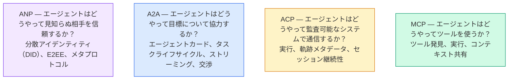

これらは競合するものではない。異なるレベルで異なる問題を解決する。

### MCP（概要）

MCPはフェーズ13で詳しくカバーしている。簡単な概要：MCPはLLMが外部ツールやデータソースに接続する方法を標準化する。エージェント（クライアント）がサーバーによって公開されたツールを発見・呼び出す**クライアント・サーバー**プロトコルだ。

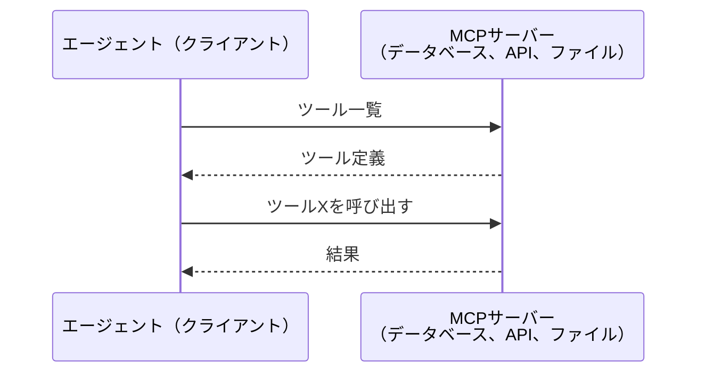

MCPは**エージェント対ツール**通信だ。エージェント同士が話すのを助けるものではない。

### A2A（Agent2Agentプロトコル）

**作成者：** Google（現在はLinux Foundationの`lf.a2a.v1`）
**仕様バージョン：** 1.0.0
**問題：** 自律エージェントはどうやって協力し、交渉し、タスクを委任するか？

A2Aは**ピアツーピアエージェントコラボレーション**のためのプロトコルだ。MCPがエージェントをツールに接続するのに対して、A2Aはエージェントを他のエージェントに接続する。各エージェントは既知のURLに**エージェントカード**を公開し、他のエージェントがそれを発見し、交渉し、タスクを委任する。

#### A2Aの仕組み

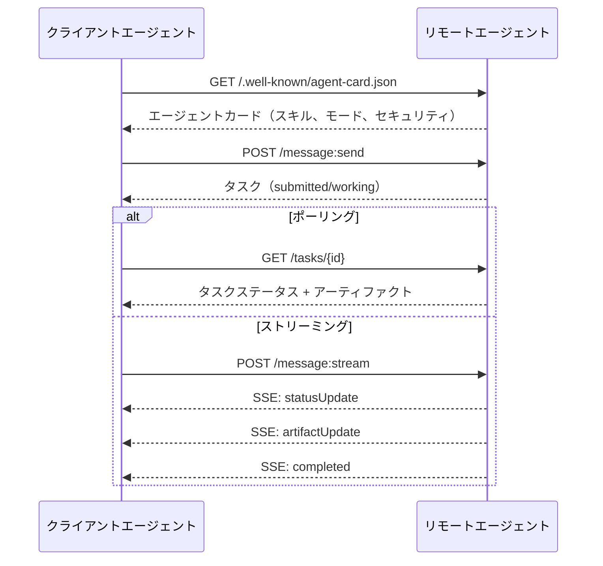

#### 実際のエージェントカード

実際に使われているA2Aエージェントカードの例。`GET /.well-known/agent-card.json`で提供される：

```json
{
  "name": "Research Agent",
  "description": "Searches documentation and summarizes findings",
  "version": "1.0.0",
  "supportedInterfaces": [
    {
      "url": "https://research-agent.example.com/a2a/v1",
      "protocolBinding": "JSONRPC",
      "protocolVersion": "1.0"
    },
    {
      "url": "https://research-agent.example.com/a2a/rest",
      "protocolBinding": "HTTP+JSON",
      "protocolVersion": "1.0"
    }
  ],
  "provider": {
    "organization": "Your Company",
    "url": "https://example.com"
  },
  "capabilities": {
    "streaming": true,
    "pushNotifications": false
  },
  "defaultInputModes": ["text/plain", "application/json"],
  "defaultOutputModes": ["text/plain", "application/json"],
  "skills": [
    {
      "id": "web-research",
      "name": "Web Research",
      "description": "Searches the web and synthesizes findings",
      "tags": ["research", "search", "summarization"],
      "examples": ["Research the latest changes in React 19"]
    },
    {
      "id": "doc-analysis",
      "name": "Documentation Analysis",
      "description": "Reads and analyzes technical documentation",
      "tags": ["docs", "analysis"],
      "inputModes": ["text/plain", "application/pdf"],
      "outputModes": ["application/json"]
    }
  ],
  "securitySchemes": {
    "bearer": {
      "httpAuthSecurityScheme": {
        "scheme": "Bearer",
        "bearerFormat": "JWT"
      }
    }
  },
  "security": [{ "bearer": [] }]
}
```

注目すべき点：
- **スキル**はエージェントができることだ。各スキルにはID、タグ、対応する入出力MIMEタイプがある。これがクライアントエージェントがリモートエージェントがリクエストを処理できるかどうかを判断する方法だ。
- **supportedInterfaces**は複数のプロトコルバインディングをリストする。単一エージェントがJSON-RPC、REST、gRPCを同時に話せる。
- **Security**はカードに組み込まれている。クライアントはリクエストを一つも送る前に必要な認証を把握している。

#### タスクライフサイクル

タスクはA2Aにおける作業の中心単位だ。定義された状態を移行する：

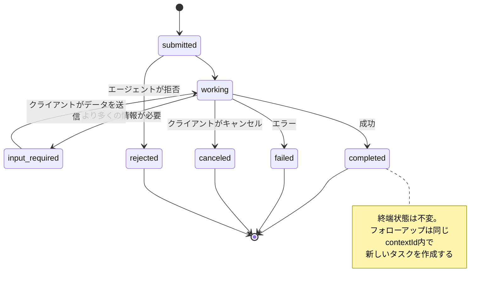

全8状態（仕様は`UNSPECIFIED`もセンチネルとして定義しているがここでは省略）：

| 状態 | 終端か？ | 意味 |
|---|---|---|
| `TASK_STATE_SUBMITTED` | No | 受理されたが処理未開始 |
| `TASK_STATE_WORKING` | No | 積極的に処理中 |
| `TASK_STATE_INPUT_REQUIRED` | No | エージェントがクライアントからの追加情報を必要とする |
| `TASK_STATE_AUTH_REQUIRED` | No | 認証が必要 |
| `TASK_STATE_COMPLETED` | Yes | 正常終了 |
| `TASK_STATE_FAILED` | Yes | エラーで終了 |
| `TASK_STATE_CANCELED` | Yes | 完了前にキャンセルされた |
| `TASK_STATE_REJECTED` | Yes | エージェントがタスクを拒否した |

タスクが終端状態に達すると、不変となる。これ以上のメッセージなし。フォローアップは同じ`contextId`内で新しいタスクを作成する。

#### ワイアフォーマット

A2AはJSON-RPC 2.0を使用する。実際のメッセージ交換の例：

**クライアントがタスクを送信：**
```json
{
  "jsonrpc": "2.0",
  "id": 1,
  "method": "SendMessage",
  "params": {
    "message": {
      "messageId": "msg-001",
      "role": "ROLE_USER",
      "parts": [{ "text": "Research React 19 compiler features" }]
    },
    "configuration": {
      "acceptedOutputModes": ["text/plain", "application/json"],
      "historyLength": 10
    }
  }
}
```

**エージェントがタスクで応答：**
```json
{
  "jsonrpc": "2.0",
  "id": 1,
  "result": {
    "task": {
      "id": "task-abc-123",
      "contextId": "ctx-xyz-789",
      "status": {
        "state": "TASK_STATE_COMPLETED",
        "timestamp": "2026-03-27T10:30:00Z"
      },
      "artifacts": [
        {
          "artifactId": "art-001",
          "name": "research-results",
          "parts": [{
            "data": {
              "findings": [
                "React 19 compiler auto-memoizes components",
                "No more manual useMemo/useCallback needed",
                "Compiler runs at build time, not runtime"
              ]
            },
            "mediaType": "application/json"
          }]
        }
      ]
    }
  }
}
```

**SSE経由のストリーミング：**
```text
POST /message:stream HTTP/1.1
Content-Type: application/json
A2A-Version: 1.0

data: {"task":{"id":"task-123","status":{"state":"TASK_STATE_WORKING"}}}

data: {"statusUpdate":{"taskId":"task-123","status":{"state":"TASK_STATE_WORKING","message":{"role":"ROLE_AGENT","parts":[{"text":"Searching documentation..."}]}}}}

data: {"artifactUpdate":{"taskId":"task-123","artifact":{"artifactId":"art-1","parts":[{"text":"partial findings..."}]},"append":true,"lastChunk":false}}

data: {"statusUpdate":{"taskId":"task-123","status":{"state":"TASK_STATE_COMPLETED"}}}
```

### ACP（エージェント通信プロトコル）

**作成者：** IBM / BeeAI
**仕様バージョン：** 0.2.0（OpenAPI 3.1.1）
**状態：** Linux Foundation下でA2Aにマージ中
**問題：** 完全な監査可能性、セッション継続性、軌跡追跡でエージェントはどうやって通信するか？

ACPは**エンタープライズプロトコル**だ。多くのサマリーが主張するものとは異なり、ACPはJSON-LDを使用しない。OpenAPIで定義されたシンプルなREST/JSON APIだ。特徴的なのは**TrajectoryMetadata**：すべてのエージェントレスポンスが、それを生成した推論ステップとツール呼び出しの詳細なログを伝えることができる。

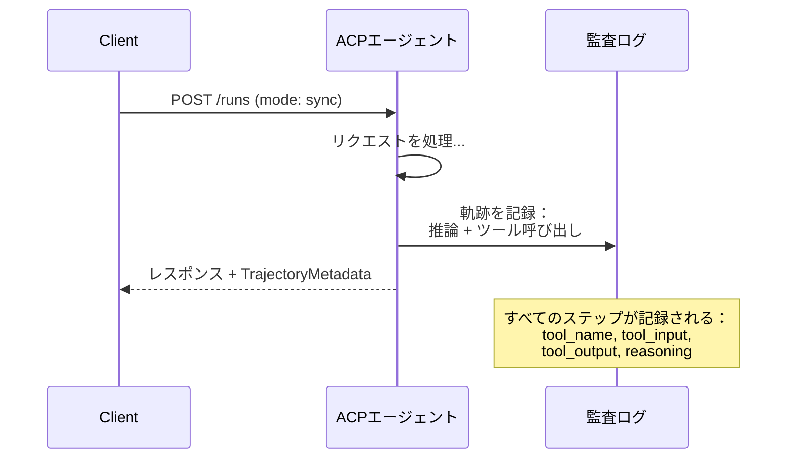

#### ACPにおけるエージェント発見

ACPは4つの発見方法を定義している：

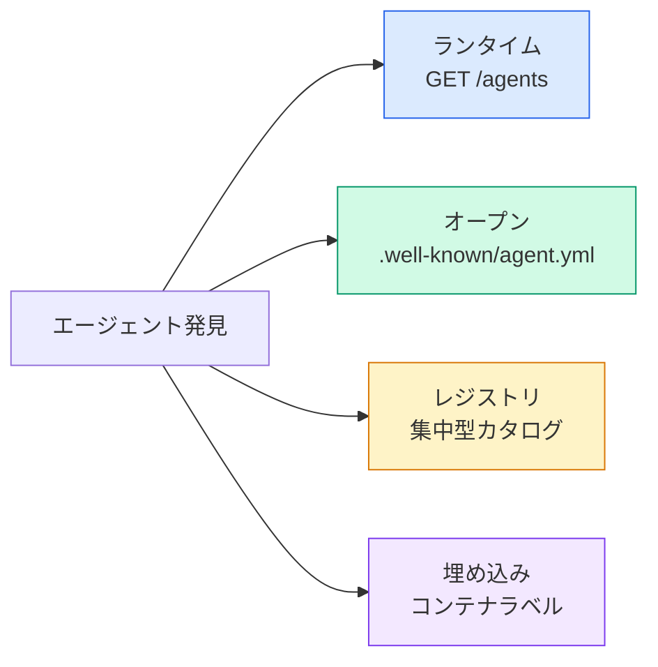

**AgentManifest**はA2Aのエージェントカードよりもシンプルだ：

```json
{
  "name": "summarizer",
  "description": "Summarizes documents with source citations",
  "input_content_types": ["text/plain", "application/pdf"],
  "output_content_types": ["text/plain", "application/json"],
  "metadata": {
    "tags": ["summarization", "RAG"],
    "framework": "BeeAI",
    "capabilities": [
      {
        "name": "Document Summarization",
        "description": "Condenses long documents into key points"
      }
    ],
    "recommended_models": ["llama3.3:70b-instruct-fp16"],
    "license": "Apache-2.0",
    "programming_language": "Python"
  }
}
```

#### 実行ライフサイクル

ACPは「タスク」の代わりに「実行」を使用する。実行は3つのモードを持つエージェント実行だ：

| モード | 動作 |
|---|---|
| `sync` | ブロッキング。レスポンスに完全な結果が含まれる。 |
| `async` | すぐに202を返す。ステータスを`GET /runs/{id}`でポーリングする。 |
| `stream` | SSEストリーム。エージェントが作業する中でイベントが発火する。 |

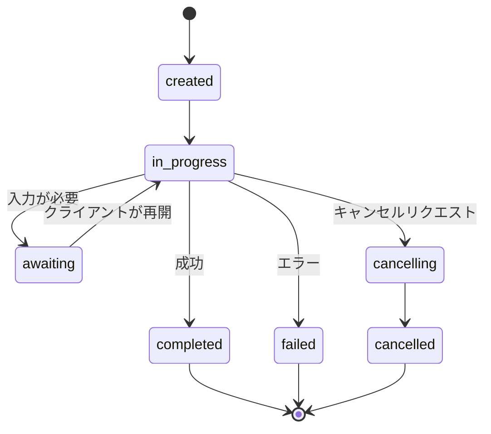

#### TrajectoryMetadata（監査証跡）

これがACPの主要な差別化要素だ。すべてのメッセージパートは、エージェントが何をしたかを正確に示すメタデータを含めることができる：

```json
{
  "role": "agent/researcher",
  "parts": [
    {
      "content_type": "text/plain",
      "content": "The weather in San Francisco is 72F and sunny.",
      "metadata": {
        "kind": "trajectory",
        "message": "I need to check the weather for this location",
        "tool_name": "weather_api",
        "tool_input": { "location": "San Francisco, CA" },
        "tool_output": { "temperature": 72, "condition": "sunny" }
      }
    }
  ]
}
```

規制のある業界ではこれは金だ。すべての回答に証明可能な推論チェーンが付いてくる：どのツールが呼び出され、どの入力が使用され、どの出力が受け取られたか。ブラックボックスなし。

ACPはソース帰属のための**CitationMetadata**もサポートする：

```json
{
  "kind": "citation",
  "start_index": 0,
  "end_index": 47,
  "url": "https://weather.gov/sf",
  "title": "NWS San Francisco Forecast"
}
```

### ANP（エージェントネットワークプロトコル）

**作成者：** オープンソースコミュニティ（GaoWei Changが創設）
**リポジトリ：** [github.com/agent-network-protocol/AgentNetworkProtocol](https://github.com/agent-network-protocol/AgentNetworkProtocol)
**問題：** 異なる組織のエージェントは中央権威なしにどうやって互いを信頼するか？

ANPは**分散アイデンティティプロトコル**だ。W3Cの分散識別子（DID）とエンドツーエンド暗号化を使って信頼を構築する。A2Aで既知のエンドポイントを通じてエージェントを発見するのとは異なり、ANPはエージェントが暗号的に自分のアイデンティティを証明できるようにする。

ANPには3つのレイヤーがある：

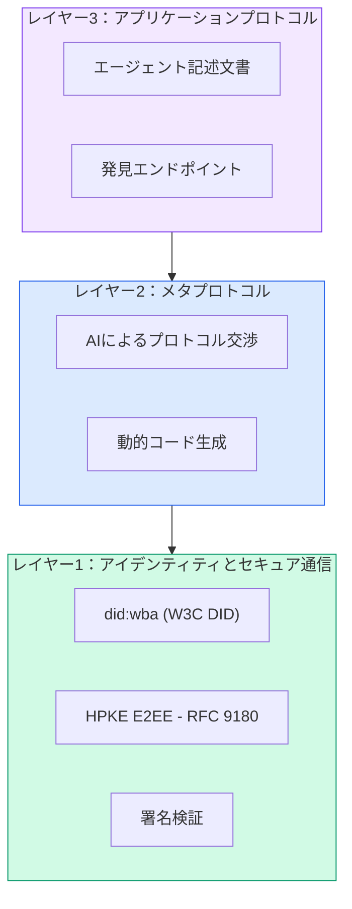

#### DIDドキュメント（実際の構造）

ANPは`did:wba`（ウェブベースエージェント）というカスタムDIDメソッドを使用する。DID `did:wba:example.com:user:alice`は`https://example.com/user/alice/did.json`に解決される：

```json
{
  "@context": [
    "https://www.w3.org/ns/did/v1",
    "https://w3id.org/security/suites/jws-2020/v1",
    "https://w3id.org/security/suites/secp256k1-2019/v1"
  ],
  "id": "did:wba:example.com:user:alice",
  "verificationMethod": [
    {
      "id": "did:wba:example.com:user:alice#key-1",
      "type": "EcdsaSecp256k1VerificationKey2019",
      "controller": "did:wba:example.com:user:alice",
      "publicKeyJwk": {
        "crv": "secp256k1",
        "x": "NtngWpJUr-rlNNbs0u-Aa8e16OwSJu6UiFf0Rdo1oJ4",
        "y": "qN1jKupJlFsPFc1UkWinqljv4YE0mq_Ickwnjgasvmo",
        "kty": "EC"
      }
    },
    {
      "id": "did:wba:example.com:user:alice#key-x25519-1",
      "type": "X25519KeyAgreementKey2019",
      "controller": "did:wba:example.com:user:alice",
      "publicKeyMultibase": "z9hFgmPVfmBZwRvFEyniQDBkz9LmV7gDEqytWyGZLmDXE"
    }
  ],
  "authentication": [
    "did:wba:example.com:user:alice#key-1"
  ],
  "keyAgreement": [
    "did:wba:example.com:user:alice#key-x25519-1"
  ],
  "humanAuthorization": [
    "did:wba:example.com:user:alice#key-1"
  ],
  "service": [
    {
      "id": "did:wba:example.com:user:alice#agent-description",
      "type": "AgentDescription",
      "serviceEndpoint": "https://example.com/agents/alice/ad.json"
    }
  ]
}
```

注目すべき点：
- **鍵の分離**が強制される。署名鍵（secp256k1）は暗号鍵（X25519）から分離される。
- **`humanAuthorization`**はANP固有のものだ。これらの鍵は使用前に明示的な人間の承認（生体認証、パスワード、HSM）が必要だ。資金移動などの高リスク操作はこのパスを通る。
- **`keyAgreement`**鍵はHPKEエンドツーエンド暗号化（RFC 9180）に使用される。
- **service**セクションはエージェント記述文書へのリンク。

#### ANPにおける信頼の仕組み

ANPはウェブオブトラストや承認グラフを使用しない。信頼は双方向でインタラクションごとに検証される：

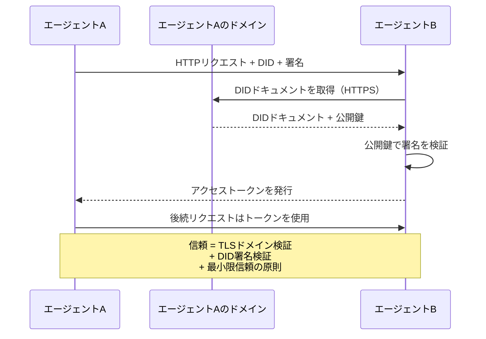

信頼は3つのソースから来る：
1. **ドメインレベルTLS** がDIDドキュメントホストを検証する
2. **DID暗号署名** がエージェントのアイデンティティを検証する
3. **最小限信頼の原則** が最小限の権限のみを付与する

ゴシップベースの信頼伝播やPageRankスコアリングはない。各エージェントをそのDIDを通じて直接検証する。

#### メタプロトコル交渉

これがANPの最も新しい機能だ。異なるエコシステムの2つのエージェントが出会うとき、事前合意されたデータフォーマットは不要だ。自然言語で交渉する：

```json
{
  "action": "protocolNegotiation",
  "sequenceId": 0,
  "candidateProtocols": "I can communicate using:\n1. JSON-RPC with hotel booking schema\n2. REST with OpenAPI 3.1 spec\n3. Natural language over HTTP",
  "modificationSummary": "Initial proposal",
  "status": "negotiating"
}
```

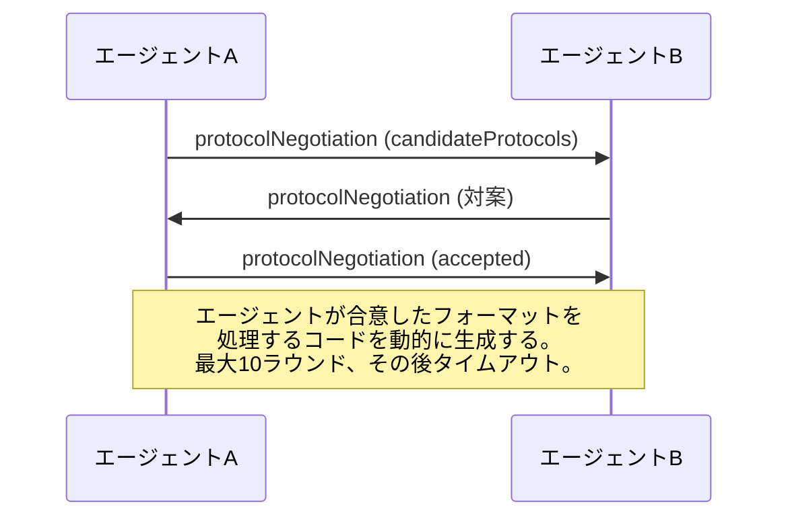

エージェントは（最大10ラウンド）フォーマットに合意するまでやり取りし、それを処理するコードを動的に生成する。ステータス値：`negotiating`、`rejected`、`accepted`、`timeout`。

これにより、互いに見たことのない2つのエージェントが、誰かが共有スキーマを事前定義することなく通信する方法を見つけ出せる。

### 比較（修正済み）

| | MCP | A2A | ACP | ANP |
|---|---|---|---|---|
| **作成者** | Anthropic | Google / Linux Foundation | IBM / BeeAI | コミュニティ |
| **仕様フォーマット** | JSON-RPC | JSON-RPC / REST / gRPC | OpenAPI 3.1（REST） | JSON-RPC |
| **主な用途** | エージェント対ツール | エージェント対エージェント | エージェント対エージェント | エージェント対エージェント |
| **発見** | ツール一覧 | `/.well-known/agent-card.json` | `GET /agents`、`/.well-known/agent.yml` | `/.well-known/agent-descriptions`、DIDサービスエンドポイント |
| **アイデンティティ** | 暗黙的（ローカル） | セキュリティスキーム（OAuth、mTLS） | サーバーレベル | W3C DID（`did:wba`）とE2EE |
| **監査証跡** | なし | 基本的（タスク履歴） | TrajectoryMetadata（ツール呼び出し、推論） | 正式に未定義 |
| **ステートマシン** | なし | 9タスク状態 | 7実行状態 | なし |
| **ストリーミング** | なし | SSE | SSE | トランスポート非依存 |
| **ユニーク機能** | ツールスキーマ | エージェントカード + スキル | 軌跡監査証跡 | メタプロトコル交渉 |
| **最適な用途** | ツール＆データ | 動的コラボレーション | 規制産業 | 組織間信頼 |
| **状態** | 安定 | 安定（v1.0） | A2Aにマージ中 | 積極的開発中 |

### 組み合わせ方

これらのプロトコルは相互排他的ではない。現実のエンタープライズシステムは複数を使用する：

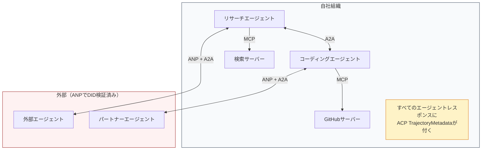

- **MCP** は各エージェントをそのツールに接続する
- **A2A** はエージェント間のコラボレーションを扱う（内部および外部）
- **ACP** は監査可能性のためにレスポンスを軌跡メタデータでラップする
- **ANP** は自分たちが管理しないエージェントの身元確認を提供する

## 実装する

### ステップ1：コアメッセージ型

すべてのマルチエージェントシステムはメッセージフォーマットから始まる。実際のプロトコルが使用するものにマッピングする型を定義する：

```typescript
import crypto from "node:crypto";

type MessageRole = "user" | "agent";

type MessagePart =
  | { kind: "text"; text: string }
  | { kind: "data"; data: unknown; mediaType: string }
  | { kind: "file"; name: string; url: string; mediaType: string };

type TrajectoryEntry = {
  reasoning: string;
  toolName?: string;
  toolInput?: unknown;
  toolOutput?: unknown;
  timestamp: number;
};

type AgentMessage = {
  id: string;
  role: MessageRole;
  parts: MessagePart[];
  trajectory?: TrajectoryEntry[];
  replyTo?: string;
  timestamp: number;
};

function createMessage(
  role: MessageRole,
  parts: MessagePart[],
  replyTo?: string
): AgentMessage {
  return {
    id: crypto.randomUUID(),
    role,
    parts,
    replyTo,
    timestamp: Date.now(),
  };
}

function textMessage(role: MessageRole, text: string): AgentMessage {
  return createMessage(role, [{ kind: "text", text }]);
}
```

注目：`MessagePart`はマルチモーダル（テキスト、構造化データ、ファイル）で、実際のA2AとACP仕様と同様だ。`TrajectoryEntry`は推論チェーンをキャプチャし、ACPのTrajectoryMetadataと一致する。

### ステップ2：A2Aエージェントカードとレジストリ

実際のA2A仕様に合ったエージェント発見を構築する：

```typescript
type Skill = {
  id: string;
  name: string;
  description: string;
  tags: string[];
  inputModes: string[];
  outputModes: string[];
};

type AgentCard = {
  name: string;
  description: string;
  version: string;
  url: string;
  capabilities: {
    streaming: boolean;
    pushNotifications: boolean;
  };
  defaultInputModes: string[];
  defaultOutputModes: string[];
  skills: Skill[];
};

class AgentRegistry {
  private cards: Map<string, AgentCard> = new Map();

  register(card: AgentCard) {
    this.cards.set(card.name, card);
  }

  discoverBySkillTag(tag: string): AgentCard[] {
    return [...this.cards.values()].filter((card) =>
      card.skills.some((skill) => skill.tags.includes(tag))
    );
  }

  discoverByInputMode(mimeType: string): AgentCard[] {
    return [...this.cards.values()].filter(
      (card) =>
        card.defaultInputModes.includes(mimeType) ||
        card.skills.some((skill) => skill.inputModes.includes(mimeType))
    );
  }

  resolve(name: string): AgentCard | undefined {
    return this.cards.get(name);
  }

  listAll(): AgentCard[] {
    return [...this.cards.values()];
  }
}
```

これはシンプルな名前から機能へのマップよりもはるかにリッチだ。スキルタグ、入力MIMEタイプ、名前でエージェントを発見できる。実際のA2A仕様がサポートしているものと同様だ。

### ステップ3：A2Aタスクライフサイクル

完全なタスクステートマシンを構築する：

```typescript
type TaskState =
  | "submitted"
  | "working"
  | "input-required"
  | "auth-required"
  | "completed"
  | "failed"
  | "canceled"
  | "rejected";

const TERMINAL_STATES: TaskState[] = [
  "completed",
  "failed",
  "canceled",
  "rejected",
];

type TaskStatus = {
  state: TaskState;
  message?: AgentMessage;
  timestamp: number;
};

type Artifact = {
  id: string;
  name: string;
  parts: MessagePart[];
};

type Task = {
  id: string;
  contextId: string;
  status: TaskStatus;
  artifacts: Artifact[];
  history: AgentMessage[];
};

type TaskEvent =
  | { kind: "statusUpdate"; taskId: string; status: TaskStatus }
  | {
      kind: "artifactUpdate";
      taskId: string;
      artifact: Artifact;
      append: boolean;
      lastChunk: boolean;
    };

type TaskHandler = (
  task: Task,
  message: AgentMessage
) => AsyncGenerator<TaskEvent>;

class TaskManager {
  private tasks: Map<string, Task> = new Map();
  private handlers: Map<string, TaskHandler> = new Map();
  private listeners: Map<string, ((event: TaskEvent) => void)[]> = new Map();

  registerHandler(agentName: string, handler: TaskHandler) {
    this.handlers.set(agentName, handler);
  }

  subscribe(taskId: string, listener: (event: TaskEvent) => void) {
    const existing = this.listeners.get(taskId) ?? [];
    existing.push(listener);
    this.listeners.set(taskId, existing);
  }

  async sendMessage(
    agentName: string,
    message: AgentMessage,
    contextId?: string
  ): Promise<Task> {
    const handler = this.handlers.get(agentName);
    if (!handler) {
      const task = this.createTask(contextId);
      task.status = {
        state: "rejected",
        timestamp: Date.now(),
        message: textMessage("agent", `No handler for ${agentName}`),
      };
      return task;
    }

    const task = this.createTask(contextId);
    task.history.push(message);
    task.status = { state: "submitted", timestamp: Date.now() };

    this.processTask(task, handler, message).catch((err) => {
      task.status = {
        state: "failed",
        timestamp: Date.now(),
        message: textMessage("agent", String(err)),
      };
    });
    return task;
  }

  getTask(taskId: string): Task | undefined {
    return this.tasks.get(taskId);
  }

  cancelTask(taskId: string): boolean {
    const task = this.tasks.get(taskId);
    if (!task || TERMINAL_STATES.includes(task.status.state)) return false;
    task.status = { state: "canceled", timestamp: Date.now() };
    this.emit(taskId, {
      kind: "statusUpdate",
      taskId,
      status: task.status,
    });
    return true;
  }

  private createTask(contextId?: string): Task {
    const task: Task = {
      id: crypto.randomUUID(),
      contextId: contextId ?? crypto.randomUUID(),
      status: { state: "submitted", timestamp: Date.now() },
      artifacts: [],
      history: [],
    };
    this.tasks.set(task.id, task);
    return task;
  }

  private async processTask(
    task: Task,
    handler: TaskHandler,
    message: AgentMessage
  ) {
    task.status = { state: "working", timestamp: Date.now() };
    this.emit(task.id, {
      kind: "statusUpdate",
      taskId: task.id,
      status: task.status,
    });

    try {
      for await (const event of handler(task, message)) {
        if (TERMINAL_STATES.includes(task.status.state)) break;

        if (event.kind === "statusUpdate") {
          task.status = event.status;
        }
        if (event.kind === "artifactUpdate") {
          const existing = task.artifacts.find(
            (a) => a.id === event.artifact.id
          );
          if (existing && event.append) {
            existing.parts.push(...event.artifact.parts);
          } else {
            task.artifacts.push(event.artifact);
          }
        }
        this.emit(task.id, event);
      }
    } catch (err) {
      task.status = {
        state: "failed",
        timestamp: Date.now(),
        message: textMessage("agent", String(err)),
      };
      this.emit(task.id, {
        kind: "statusUpdate",
        taskId: task.id,
        status: task.status,
      });
    }
  }

  private emit(taskId: string, event: TaskEvent) {
    for (const listener of this.listeners.get(taskId) ?? []) {
      listener(event);
    }
  }
}
```

これは実際のA2Aタスクライフサイクルを実装している：submitted、working、input-required、終端状態。ハンドラーはイベント（ステータス更新とアーティファクトチャンク）をyieldする非同期ジェネレーターで、SSEストリーミングモデルに一致する。

### ステップ4：ACPスタイルの監査証跡

軌跡追跡で通信をラップする：

```typescript
type AuditEntry = {
  runId: string;
  agentName: string;
  input: AgentMessage[];
  output: AgentMessage[];
  trajectory: TrajectoryEntry[];
  status: "created" | "in-progress" | "completed" | "failed" | "awaiting";
  startedAt: number;
  completedAt?: number;
  sessionId?: string;
};

class AuditableRunner {
  private log: AuditEntry[] = [];
  private handlers: Map<
    string,
    (input: AgentMessage[]) => Promise<{
      output: AgentMessage[];
      trajectory: TrajectoryEntry[];
    }>
  > = new Map();

  registerAgent(
    name: string,
    handler: (input: AgentMessage[]) => Promise<{
      output: AgentMessage[];
      trajectory: TrajectoryEntry[];
    }>
  ) {
    this.handlers.set(name, handler);
  }

  async run(
    agentName: string,
    input: AgentMessage[],
    sessionId?: string
  ): Promise<AuditEntry> {
    const entry: AuditEntry = {
      runId: crypto.randomUUID(),
      agentName,
      input: structuredClone(input),
      output: [],
      trajectory: [],
      status: "created",
      startedAt: Date.now(),
      sessionId,
    };
    this.log.push(entry);

    const handler = this.handlers.get(agentName);
    if (!handler) {
      entry.status = "failed";
      return entry;
    }

    entry.status = "in-progress";
    try {
      const result = await handler(input);
      entry.output = structuredClone(result.output);
      entry.trajectory = structuredClone(result.trajectory);
      entry.status = "completed";
      entry.completedAt = Date.now();
    } catch (err) {
      entry.status = "failed";
      entry.trajectory.push({
        reasoning: `Error: ${String(err)}`,
        timestamp: Date.now(),
      });
      entry.completedAt = Date.now();
    }
    return entry;
  }

  getFullAuditLog(): AuditEntry[] {
    return structuredClone(this.log);
  }

  getAuditLogForAgent(agentName: string): AuditEntry[] {
    return structuredClone(
      this.log.filter((e) => e.agentName === agentName)
    );
  }

  getAuditLogForSession(sessionId: string): AuditEntry[] {
    return structuredClone(
      this.log.filter((e) => e.sessionId === sessionId)
    );
  }

  getTrajectoryForRun(runId: string): TrajectoryEntry[] {
    const entry = this.log.find((e) => e.runId === runId);
    return entry ? structuredClone(entry.trajectory) : [];
  }
}
```

すべてのエージェント実行が完全な監査エントリを生成する：何が入り、何が出て、その間のツール呼び出しと推論ステップの完全な軌跡。エージェント別、セッション別、または個々の実行別にクエリできる。

### ステップ5：ANPスタイルのアイデンティティ検証

DIDベースのアイデンティティと検証を構築する：

```typescript
type VerificationMethod = {
  id: string;
  type: string;
  controller: string;
  publicKeyDer: string;
};

type DIDDocument = {
  id: string;
  verificationMethod: VerificationMethod[];
  authentication: string[];
  keyAgreement: string[];
  humanAuthorization: string[];
  service: { id: string; type: string; serviceEndpoint: string }[];
};

type AgentIdentity = {
  did: string;
  document: DIDDocument;
  privateKey: crypto.KeyObject;
  publicKey: crypto.KeyObject;
};

class IdentityRegistry {
  private documents: Map<string, DIDDocument> = new Map();

  publish(doc: DIDDocument) {
    this.documents.set(doc.id, doc);
  }

  resolve(did: string): DIDDocument | undefined {
    return this.documents.get(did);
  }

  verify(did: string, signature: string, payload: string): boolean {
    const doc = this.documents.get(did);
    if (!doc) return false;

    const authKeyIds = doc.authentication;
    const authKeys = doc.verificationMethod.filter((vm) =>
      authKeyIds.includes(vm.id)
    );

    for (const key of authKeys) {
      const publicKey = crypto.createPublicKey({
        key: Buffer.from(key.publicKeyDer, "base64"),
        format: "der",
        type: "spki",
      });
      const isValid = crypto.verify(
        null,
        Buffer.from(payload),
        publicKey,
        Buffer.from(signature, "hex")
      );
      if (isValid) return true;
    }
    return false;
  }

  requiresHumanAuth(did: string, operationKeyId: string): boolean {
    const doc = this.documents.get(did);
    if (!doc) return false;
    return doc.humanAuthorization.includes(operationKeyId);
  }
}

function createIdentity(domain: string, agentName: string): AgentIdentity {
  const did = `did:wba:${domain}:agent:${agentName}`;
  const { publicKey, privateKey } = crypto.generateKeyPairSync("ed25519");

  const publicKeyDer = publicKey
    .export({ format: "der", type: "spki" })
    .toString("base64");

  const keyId = `${did}#key-1`;
  const encKeyId = `${did}#key-x25519-1`;

  const document: DIDDocument = {
    id: did,
    verificationMethod: [
      {
        id: keyId,
        type: "Ed25519VerificationKey2020",
        controller: did,
        publicKeyDer,
      },
      {
        id: encKeyId,
        type: "X25519KeyAgreementKey2019",
        controller: did,
        publicKeyDer,
      },
    ],
    authentication: [keyId],
    keyAgreement: [encKeyId],
    humanAuthorization: [],
    service: [
      {
        id: `${did}#agent-description`,
        type: "AgentDescription",
        serviceEndpoint: `https://${domain}/agents/${agentName}/ad.json`,
      },
    ],
  };

  return { did, document, privateKey, publicKey };
}

function signPayload(identity: AgentIdentity, payload: string): string {
  return crypto
    .sign(null, Buffer.from(payload), identity.privateKey)
    .toString("hex");
}
```

これは実際のANPアイデンティティモデルを反映している：エージェントは認証、鍵合意、人間承認鍵を別々に持つDIDドキュメントを持つ。`IdentityRegistry`はDID解決をシミュレートする（本番環境ではエージェントのドメインへのHTTPフェッチになる）。

### ステップ6：プロトコルゲートウェイ

4つすべてのプロトコルを統合システムに接続する：

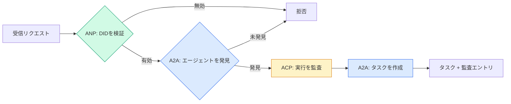

```typescript
class ProtocolGateway {
  private registry: AgentRegistry;
  private taskManager: TaskManager;
  private auditRunner: AuditableRunner;
  private identityRegistry: IdentityRegistry;

  constructor(
    registry: AgentRegistry,
    taskManager: TaskManager,
    auditRunner: AuditableRunner,
    identityRegistry: IdentityRegistry
  ) {
    this.registry = registry;
    this.taskManager = taskManager;
    this.auditRunner = auditRunner;
    this.identityRegistry = identityRegistry;
  }

  async delegateTask(
    fromDid: string,
    signature: string,
    targetAgent: string,
    message: AgentMessage,
    sessionId?: string
  ): Promise<{ task: Task; audit: AuditEntry } | { error: string }> {
    if (!this.identityRegistry.verify(fromDid, signature, message.id)) {
      return { error: "Identity verification failed" };
    }

    const card = this.registry.resolve(targetAgent);
    if (!card) {
      return { error: `Agent ${targetAgent} not found in registry` };
    }

    const audit = await this.auditRunner.run(
      targetAgent,
      [message],
      sessionId
    );
    const task = await this.taskManager.sendMessage(targetAgent, message);

    return { task, audit };
  }

  discoverAndDelegate(
    fromDid: string,
    signature: string,
    skillTag: string,
    message: AgentMessage
  ): Promise<{ task: Task; audit: AuditEntry } | { error: string }> {
    const candidates = this.registry.discoverBySkillTag(skillTag);
    if (candidates.length === 0) {
      return Promise.resolve({
        error: `No agents found with skill tag: ${skillTag}`,
      });
    }
    return this.delegateTask(
      fromDid,
      signature,
      candidates[0].name,
      message
    );
  }
}
```

ゲートウェイは1回の呼び出しで4つのことを行う：
1. **ANP**：DID署名経由で呼び出し元のアイデンティティを検証する
2. **A2A**：ターゲットエージェントを発見してケイパビリティを確認する
3. **ACP**：軌跡を持つ監査証跡で実行をラップする
4. **A2A**：完全なライフサイクル追跡でタスクを作成する

### ステップ7：すべてを接続する

```typescript
async function protocolDemo() {
  const registry = new AgentRegistry();
  registry.register({
    name: "researcher",
    description: "Searches and summarizes findings",
    version: "1.0.0",
    url: "https://researcher.local/a2a/v1",
    capabilities: { streaming: true, pushNotifications: false },
    defaultInputModes: ["text/plain"],
    defaultOutputModes: ["text/plain", "application/json"],
    skills: [
      {
        id: "web-research",
        name: "Web Research",
        description: "Searches the web",
        tags: ["research", "search", "summarization"],
        inputModes: ["text/plain"],
        outputModes: ["application/json"],
      },
    ],
  });
  registry.register({
    name: "coder",
    description: "Writes code from specs",
    version: "1.0.0",
    url: "https://coder.local/a2a/v1",
    capabilities: { streaming: false, pushNotifications: false },
    defaultInputModes: ["text/plain", "application/json"],
    defaultOutputModes: ["text/plain"],
    skills: [
      {
        id: "code-gen",
        name: "Code Generation",
        description: "Generates code",
        tags: ["coding", "generation"],
        inputModes: ["text/plain", "application/json"],
        outputModes: ["text/plain"],
      },
    ],
  });

  const taskManager = new TaskManager();
  const auditRunner = new AuditableRunner();

  const researchTrajectory: TrajectoryEntry[] = [];

  taskManager.registerHandler(
    "researcher",
    async function* (task, message) {
      yield {
        kind: "statusUpdate" as const,
        taskId: task.id,
        status: { state: "working" as const, timestamp: Date.now() },
      };

      researchTrajectory.push({
        reasoning: "Searching for React 19 documentation",
        toolName: "web_search",
        toolInput: { query: "React 19 compiler features" },
        toolOutput: {
          results: ["react.dev/blog/react-19", "github.com/react/react"],
        },
        timestamp: Date.now(),
      });

      researchTrajectory.push({
        reasoning: "Extracting key findings from search results",
        toolName: "doc_analysis",
        toolInput: { url: "react.dev/blog/react-19" },
        toolOutput: {
          summary:
            "React 19 compiler auto-memoizes, no manual useMemo needed",
        },
        timestamp: Date.now(),
      });

      yield {
        kind: "artifactUpdate" as const,
        taskId: task.id,
        artifact: {
          id: crypto.randomUUID(),
          name: "research-results",
          parts: [
            {
              kind: "data" as const,
              data: {
                findings: [
                  "React 19 compiler auto-memoizes components",
                  "No more manual useMemo/useCallback needed",
                  "Compiler runs at build time, not runtime",
                ],
                sources: ["react.dev/blog/react-19"],
              },
              mediaType: "application/json",
            },
          ],
        },
        append: false,
        lastChunk: true,
      };

      yield {
        kind: "statusUpdate" as const,
        taskId: task.id,
        status: { state: "completed" as const, timestamp: Date.now() },
      };
    }
  );

  auditRunner.registerAgent("researcher", async () => ({
    output: [
      textMessage("agent", "React 19 compiler auto-memoizes components"),
    ],
    trajectory: researchTrajectory,
  }));

  const identityRegistry = new IdentityRegistry();

  const coderIdentity = createIdentity("coder.local", "coder");
  const researcherIdentity = createIdentity("researcher.local", "researcher");

  identityRegistry.publish(coderIdentity.document);
  identityRegistry.publish(researcherIdentity.document);

  const gateway = new ProtocolGateway(
    registry,
    taskManager,
    auditRunner,
    identityRegistry
  );

  console.log("=== Protocol Demo ===\n");

  console.log("1. Agent Discovery (A2A)");
  const researchAgents = registry.discoverBySkillTag("research");
  console.log(
    `   Found ${researchAgents.length} agent(s):`,
    researchAgents.map((a) => a.name)
  );

  console.log("\n2. Identity Verification (ANP)");
  const message = textMessage("user", "Research React 19 compiler features");
  const signature = signPayload(coderIdentity, message.id);
  const verified = identityRegistry.verify(
    coderIdentity.did,
    signature,
    message.id
  );
  console.log(`   Coder DID: ${coderIdentity.did}`);
  console.log(`   Signature verified: ${verified}`);

  console.log("\n3. Task Delegation (A2A + ACP + ANP)");
  const result = await gateway.delegateTask(
    coderIdentity.did,
    signature,
    "researcher",
    message,
    "session-001"
  );

  if ("error" in result) {
    console.log(`   Error: ${result.error}`);
    return;
  }

  console.log(`   Task ID: ${result.task.id}`);
  console.log(`   Task state: ${result.task.status.state}`);
  console.log(`   Artifacts: ${result.task.artifacts.length}`);

  console.log("\n4. Audit Trail (ACP)");
  console.log(`   Run ID: ${result.audit.runId}`);
  console.log(`   Status: ${result.audit.status}`);
  console.log(`   Trajectory steps: ${result.audit.trajectory.length}`);
  for (const step of result.audit.trajectory) {
    console.log(`     - ${step.reasoning}`);
    if (step.toolName) {
      console.log(`       Tool: ${step.toolName}`);
    }
  }

  console.log("\n5. Full Audit Log");
  const fullLog = auditRunner.getFullAuditLog();
  console.log(`   Total runs: ${fullLog.length}`);
  for (const entry of fullLog) {
    const duration = entry.completedAt
      ? `${entry.completedAt - entry.startedAt}ms`
      : "in-progress";
    console.log(`   ${entry.agentName}: ${entry.status} (${duration})`);
  }
}

protocolDemo().catch((err) => {
  console.error("Protocol demo failed:", err);
  process.exitCode = 1;
});
```

## うまくいかないこと

プロトコルはハッピーパスを解決する。本番環境で壊れるものを示す：

**スキーマドリフト。** エージェントAが`application/json`出力を宣伝するエージェントカードを公開する。しかしJSONスキーマがバージョン間で変わる。エージェントBが古いフォーマットを解析してゴミを受け取る。修正：スキルと出力スキーマをバージョン管理する。A2A仕様がこの理由でエージェントカードの`version`をサポートしている。

**ステートマシン違反。** エージェントハンドラーが`completed`イベントをyieldし、その後さらにアーティファクトをyieldしようとする。タスクは不変だ。コードがサイレントにアップデートを破棄するかスローする。修正：yieldする前に終端状態をチェックする。上記の`TaskManager`が終端状態後の`break`でこれを強制している。

**信頼解決の失敗。** エージェントAがエージェントBのDIDを検証しようとするが、エージェントBのドメインがダウンしている。DIDドキュメントを取得できない。フェイルオープン（未検証エージェントを受け入れる）するか、フェイルクローズド（すべてを拒否する）するか？ANPは最小限信頼の原則でフェイルクローズドを推奨する。

**軌跡の肥大化。** ACP軌跡ログは強力だが高コストだ。実行ごとに200のツール呼び出しを行う複雑なエージェントは巨大な監査エントリを生成する。修正：設定可能な詳細レベルで軌跡をログする。コンプライアンスのためにツール名とIOを記録し、規制外のワークロードでは推論ステップをスキップする。

**発見のサンダリングハード。** 50のエージェントが起動時に同時に`GET /agents`をクエリする。修正：TTL付きでエージェントカードをキャッシュし、発見間隔をずらし、ポーリングの代わりにプッシュベースの登録を使用する。

## 使ってみる

### 実際の実装

**A2A**が最も成熟している。Googleの[公式仕様](https://github.com/google/A2A)はLinux Foundation下でオープンソース。PythonとTypeScriptのSDKがある。エージェントが動的な発見とコラボレーションを必要とする場合はここから始める。

**ACP**はA2Aにマージ中。IBM の[BeeAIプロジェクト](https://github.com/i-am-bee/acp)がREST優先の代替としてACPを作成したが、軌跡メタデータのコンセプトはA2Aエコシステムに吸収されている。A2Aをトランスポートとして使っても、ACPパターン（軌跡ログ、実行ライフサイクル）を使う。

**ANP**は最も実験的だ。[コミュニティリポジトリ](https://github.com/agent-network-protocol/AgentNetworkProtocol)にPython SDK（AgentConnect）がある。メタプロトコル交渉のコンセプトは本当に新しい。組織間エージェントデプロイメントで注目する価値がある。

**MCP**はすでにフェーズ13でカバーしている。エージェントにツールを使わせたければ、MCPが標準だ。

### 適切なプロトコルの選択

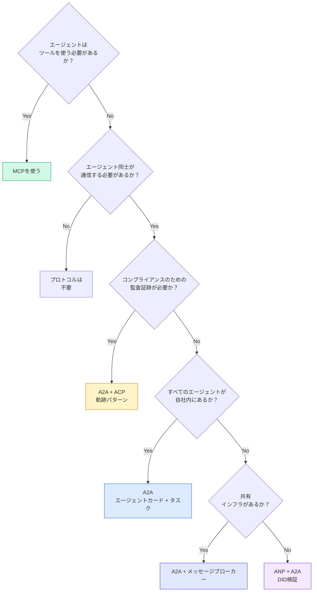

## 成果物を出す

このレッスンの成果物：
- `code/main.ts` -- 4つのプロトコルパターンすべての完全な実装
- `outputs/prompt-protocol-selector.md` -- システムのプロトコルを選択するためのプロンプト

## 演習

1. **マルチホップタスク委任。** エージェントハンドラーが他のエージェントにサブタスクを委任できるように`TaskManager`を拡張する。リサーチャーはタスクを受け取り、「検索」と「要約」サブタスクを2つの専門エージェントに委任し、両方の完了を待ち、結果を自分のアーティファクトにマージする。

2. **ストリーミング監査証跡。** `AuditableRunner`をストリーミングモードに対応させる。完全な結果を待つ代わりに、軌跡エントリが追加されるにつれてリアルタイムで`AuditEntry`更新をyieldする。監査スナップショットを生成する非同期ジェネレーターを使う。

3. **DIDローテーション。** `IdentityRegistry`に鍵ローテーションを追加する。エージェントは`previousDid`参照を維持しながら、更新された鍵を持つ新しいDIDドキュメントを公開できるべきだ。猶予期間中、検証者は現在の鍵と前の鍵両方の署名を受け入れるべきだ。

4. **プロトコル交渉。** ANPのメタプロトコルコンセプトを実装する。2つのエージェントが候補フォーマット（例：「JSON-RPCで話せる」vs「RESTが好き」）を含む`protocolNegotiation`メッセージを交換する。最大3ラウンド後、フォーマットに合意するかタイムアウトする。合意したフォーマットによって使用する`TaskManager`または`AuditableRunner`が決まる。

5. **レート制限された発見。** 設定可能なTTLを持つエージェントカードルックアップをキャッシュし、エージェントごとに1秒あたりの発見クエリを制限する`RateLimitedRegistry`ラッパーを追加する。起動時に互いを発見する100エージェントのサンダリングハードをシミュレートし、差異を測定する。

## キーワード

| 用語 | よく言われること | 実際の意味 |
|------|----------------|----------------------|
| MCP | 「AIツールのプロトコル」 | エージェントがツールを発見・使用するためのクライアント・サーバープロトコル。エージェント対ツール、エージェント対エージェントではない。 |
| A2A | 「Googleのエージェントプロトコル」 | Linux Foundation下のエージェントコラボレーションのためのピアツーピアプロトコル。エージェントカードによる発見、9状態タスクライフサイクル、SSE経由ストリーミング。JSON-RPC、REST、gRPCバインディングをサポート。 |
| ACP | 「エンタープライズエージェントメッセージング」 | TrajectoryMetadataを持つエージェント実行のためのIBM/BeeAIのREST API：すべてのレスポンスが推論とツール呼び出しの完全なチェーンを持つ。A2Aにマージ中。 |
| ANP | 「分散エージェントアイデンティティ」 | 暗号アイデンティティのための`did:wba`（DID）、E2EEのためのHPKE、互いに見たことのないエージェントのためのAIによるメタプロトコル交渉を使うコミュニティプロトコル。 |
| エージェントカード | 「エージェントの名刺」 | `/.well-known/agent-card.json`のJSONドキュメントでスキル、サポートするMIMEタイプ、セキュリティスキーム、プロトコルバインディングを説明する。 |
| DID | 「分散ID」 | エージェント自身のドメインにホストされた暗号的に検証可能なアイデンティティのW3C標準。ANPは`did:wba`メソッドを使用する。 |
| TrajectoryMetadata | 「監査レシート」 | すべてのエージェントレスポンスに推論ステップ、ツール呼び出し、その入出力を添付するACPのメカニズム。 |
| メタプロトコル | 「エージェントが話し方を交渉する」 | エージェントが自然言語を使ってデータフォーマットに動的に合意し、処理するコードを生成するANPのアプローチ。 |
| タスク | 「作業単位」 | 提出から完了まで作業を追跡するA2Aのステートフルオブジェクト。終端状態では不変。 |

## 参考資料

- [Google A2A specification](https://github.com/google/A2A) -- 公式仕様とSDK（v1.0.0、Linux Foundation）
- [IBM/BeeAI ACP specification](https://github.com/i-am-bee/acp) -- エージェント実行と軌跡メタデータのOpenAPI 3.1仕様
- [Agent Network Protocol](https://github.com/agent-network-protocol/AgentNetworkProtocol) -- DIDベースのアイデンティティ、E2EE、メタプロトコル交渉
- [Model Context Protocol docs](https://modelcontextprotocol.io/) -- AnthropicのMCP仕様（フェーズ13でカバー）
- [W3C Decentralized Identifiers](https://www.w3.org/TR/did-core/) -- ANPの基盤となるアイデンティティ標準
- [RFC 9180 (HPKE)](https://www.rfc-editor.org/rfc/rfc9180) -- ANPがE2EEに使う暗号化スキーム
- [FIPA Agent Communication Language](http://www.fipa.org/specs/fipa00061/SC00061G.html) -- 現代エージェントプロトコルの学術的前身
