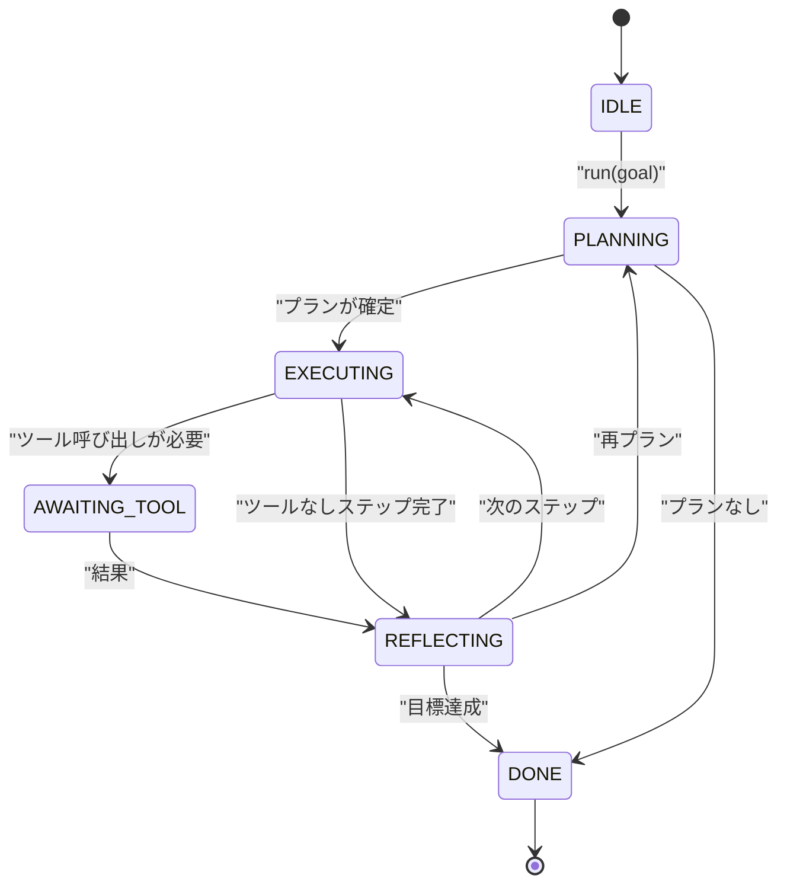

# エージェントハーネスのループコントラクト

> ハーネスこそがエージェントだ。モデルはコプロセッサーだ。このレッスンでは、あらゆるモデルを接続できるループコントラクトを確立する。


## 学習目標
- 明示的な遷移を持つ決定論的ステートマシンとしてエージェントハーネスループを定義する。
- オペレーターがポリシー、テレメトリー、ガードレールを組み込む10個のライフサイクルフックトピックを実装する。
- ループが制御を呼び出し元に返し、新しい入力で再開する2つのプルポイントを定義する。
- 超過時に部分的な状態を漏洩することなく、セッションごとの予算（ターン、ツール呼び出し、ウォールクロック）を適用する。
- ダウンストリームのUIとトレーサーがループを直接検査せずにサブスクライブできるよう、11種類のイベントタイプの型付きストリームを発行する。

## フレーム

40ターン無人で動作するコーディングエージェントはチャットループではない。それはオペレーターが傍受できるノードと監査できるエッジを持つステートマシンだ。コントラクトを書き下ろせば、モデル、ツール、またはポリシーの交換はリファクタリングではなくなる。登録呼び出しになる。

このレッスンでそのコントラクトを構築する。6つの状態、10個のフックトピック、2つのプルポイント、11種類のイベントタイプ、予算エンベロープを命名する。ハーネスの他のすべて（ツールレジストリ、JSON-RPCトランスポート、ディスパッチャー、プランナー）がこの形に差し込まれる。

## 状態

ループには6つの状態がある。5つはアクティブ。1つはターミナル。



`IDLE`が唯一の合法的なエントリポイントだ。`DONE`が唯一の合法的な出口だ。`AWAITING_TOOL`がプルポイントを生成する唯一の状態だ。他のすべての遷移は内部だ。

ステートマシンは決定論的だ。同じイベントログが与えられると、ハーネスは同じ状態に再入する。この特性があるため、モデルを再呼び出しせずにデバッグのためにセッションを再生できる。

## フックトピック

フックはループへのオペレーターのシームだ。ハーネスは10個のトピックを発火する。各トピックは任意の数のサブスクライバーを受け付ける。サブスクライバーは登録順に発火する。サブスクライバーはペイロードを変更したり、ターンを中断するために例外を発生させたり、次のステップをスキップするためにセンチネルを返したりできる。

```text
before_plan         after_plan
before_tool_call    after_tool_call
before_step         after_step
on_error
on_pause
on_budget_exceeded
on_complete
```

この形はClaude Code、Cursor、OpenCodeが2025年中頃に収束したものを反映している。名前は機能的であり、ブランド名ではない。`rm -rf`をブロックするフックは`before_tool_call`に存在する。OpenTelemetryスパンを送信するフックは`after_step`に存在する。一時停止したセッションを再開するフックは`on_pause`に存在する。

## プルポイント

ループは2回制御を返す。最初は、ツール結果なしに進行できないとき`AWAITING_TOOL`で。2番目は、予算が枯渇したかフックが明示的に人間レビューを要求したとき`on_pause`で。

プルポイントは例外ではない。リターンだ。呼び出し元はハーネスの状態を検査し、ハーネスが要求したものをフェッチし、`resume(payload)`を呼び出す。ハーネスは停止したところから再開する。これはPythonのジェネレーターと同じ形だ。プルポイント上のトランスポートはあなたの選択だ。TUIではキープレス。MCPではtools/call。キューではジョブポール。

## イベントストリーム

ループはコントラクトの特定のポイントで型付きストリームにイベントを追加する。ストリームは追加のみで、サブスクライバーは任意のオフセットから再生できる。実装された11種類のイベントタイプは:

- `session.start` — `run(goal)`が呼び出されたときに1回発行
- `plan.draft` — プランナーが草案プランを返したときに発行
- `plan.commit` — 草案がアクティブプランとしてコミットされた後に発行
- `step.start` — 各実行ステップの開始時に発行
- `step.end` — 各実行ステップの終了時に発行
- `tool.call` — ツールを必要とするステップが呼び出し元に制御を返したときに発行
- `tool.result` — ツール結果とともに再開時に発行
- `tool.error` — エラーとともに再開時またはフックが呼び出しを中断したときに発行
- `budget.warn` — 予算制限に達したときに発行
- `session.pause` — ループが一時停止（予算またはフック）で返したときに発行
- `session.complete` — ループが`DONE`に達したときに1回発行

イベントはフックペイロードを複製しない。フックは命令的（変更、中断）。イベントは観察的（記録、送信）。それらを直交するものとして扱う。

## 予算エンベロープ

セッションは3つの制限を持つ。ターン数、ツール呼び出し数、ウォールクロック秒。各ターンでターンが1つ増加する。各ツール呼び出しでツール呼び出しが1つ増加する。ウォールクロックはすべての状態遷移でチェックされる。いずれかの制限に達すると、ループは`on_budget_exceeded`を発火し、`budget.warn`を発行し、次のプルポイントで予算超過の理由とともに`IDLE`に遷移する。

予算はキルスイッチではない。返却だ。呼び出し元は予算を拡張して再開するか、セッションを閉じるかを決定する。

## このレッスンがしないこと

モデルを呼び出さない。実際のツールを登録しない。トランスポートを実装しない。それらは次の4つのレッスンだ。このレッスンは次の4つがリライトなしに差し込めるようにコントラクトを確定する。

`main.py`の決定論的プランナーはスタンドインだ。3ステップのハードコードされたプランを返し、そのうち2つはツール結果を必要とする。要点はループであり、プランではない。

## コードの読み方

`HarnessLoop`がメインクラスだ。状態を保持し、フックを発火し、イベントを発行する。`Budget`が制限を追跡する。`Event`がストリーム上の型付きエンベロープだ。`HookRegistry`がディスパッチテーブルだ。`_transition`が状態を変更する唯一の関数なので、ステートマシンの不変条件は1か所に存在する。

`main.py`をトップダウンで読む。次に`code/tests/test_loop.py`を読む。テストはすべての遷移とすべてのフック発火順序をピン留めする。

## さらに深めるために

プロダクションでハーネスを構築する最も難しい部分はステートマシンではない。コントラクトを適用可能にすることだ。コントラクトはプランナーのホットリロードに耐えなければならない。不正なJSONを返すツールに耐えなければならない。40ターンのセッションの3分の2まで進んだ`before_tool_call`で例外を発生させるフックに耐えなければならない。このレッスンのテストはそれらの失敗モードを演習する。実行する。壊す。ケースを追加する。

次のレッスンでツールレジストリが追加される。その後、JSON-RPCトランスポート。その後、ディスパッチャー。レッスン24までに、このファイルのループは実際の予算が適用された実際のツールに対して実際のプランを実行している。
