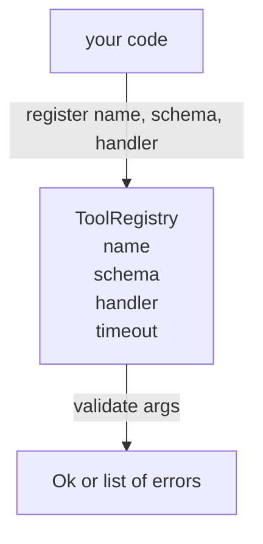

# スキーマ検証付きツールレジストリ

> エージェントが検証できないツールは、エージェントが呼び出せないツールだ。ツールを構築する前にレジストリとスキーマチェッカーを構築する。


## 学習目標
- ディスパッチャーが1度問い合わせて以後信頼できる、ツール名→スキーマ→ハンドラーの型付きレジストリを保持する。
- ツール呼び出しが実際に使用するキーワードの90%をカバーするJSON Schema 2020-12のサブセットを実装する。
- モデルが1回のラウンドトリップで自己修正できるよう、json-pointer形式の正確なエラーパスを返す。
- サイレントな上書きがプロダクションのツールカタログがドリフトする原因のため、明示的なオーバーライドなしに再登録を拒否する。
- バリデーターをピュア（I/Oなし、時間なし、グローバルなし）に保ち、再生ログで再実行できるようにする。

## レジストリがツールより先に来る理由

2026年のコーディングエージェントは、モデルが単一のコンテキストウィンドウに収めることができるよりも多くの登録済みツールを持つ。非自明なハーネスは200のツールを登録し、任意のターンで10から40を表示する。レジストリは「どのツールが存在するか」「その引数はどのような形か」「どのハンドラーを呼び出すか」の3つの答えの真実の源泉だ。この3つの答えが確定されれば、ハーネスの残りの部分は推測をやめられる。

避けたい間違いは、スキーマなしでハンドラーを出荷すること、または検証なしでスキーマを出荷することだ。両方とも一般的だ。両方とも次の層（レッスン23のディスパッチャー）を、唯一の失敗モードがハンドラーからのスタックトレースである推測ゲームにする。

## ツールレコードの形

```text
ToolRecord
  name        : str          (ユニーク、ドットで区切られた小文字英数字とアンダースコアのセグメント、例: snake_case.segment.case)
  description : str          (1行、モデルに表示)
  schema      : dict         (JSON Schema 2020-12サブセット)
  handler     : Callable     (asyncまたはsync、Anyを返す)
  idempotent  : bool         (ディスパッチャーがリトライ決定に使用)
  timeout_ms  : int          (ツールごとのディスパッチャーのデフォルトを上書き)
```

スキーマはバリデーターが触れる唯一のフィールドだ。ハンドラーはそれに対して不透明だ。意図的に分離している。スキーマはデータだ。ハンドラーはコードだ。それらを混在させると、ハンドラー内に検証ロジックを置きたくなり、それが止めたいバグだ。

## JSON Schema 2020-12サブセット

完全な2020-12仕様は論文だ。8つのキーワードが必要だ。

```text
type           string / number / integer / boolean / object / array / null
properties     プロパティ名 -> スキーマのマップ
required       プロパティ名のリスト
enum           許可されるプリミティブ値のリスト
minLength      整数、文字列に適用
maxLength      整数、文字列に適用
pattern        ECMA-262互換正規表現、文字列に適用
items          すべての配列要素に適用されるスキーマ
```

これはツールAPIが実際に必要とするものをカバーするのに十分だ。追加していないキーワード（oneOf、anyOf、allOf、$ref、条件文）はプロダクションスキーマでは有効だが、バリデーターをサイクルを持つツリーウォーカーにする。レジストリを構築しており、JSON Schemaエンジンではない。

## Json pointerエラーパス

検証が失敗すると、バリデーターはエラーのリストを返す。各エラーは入力へのjson-pointerパスを持つ。ポインターはプロパティ名と配列インデックスのスラッシュ接頭辞付きシーケンスだ。

```text
{"a": {"b": [1, 2, "x"]}}
                    ^
                    /a/b/2
```

モデルは文章よりエラーパスをよく読む。スキーマが`args.user.email`を要求してモデルが整数を渡した場合、エラーは`/user/email`と`expected_type: string`であるべきだ。モデルは自然言語のラウンドなしに次の呼び出しでそれを修正する。

## 登録とオーバーライド

`register(name, schema, handler, **opts)`はデフォルトで再登録を拒否する。呼び出し元は置き換えるために`override=True`を渡す必要がある。これは運用上のハイジーンだ。コードベースの2つの部分が同じツール名を黙って登録することは、プロダクションで見つけるのに1週間かかるようなバグだ。

レジストリは3つの読み取りメソッドを公開する。`get(name)`はレコードを返すか例外を発生させる。`validate(name, args)`は`Ok`またはエラーのリストを返す。`names()`は登録順にツール名を返す。

## バリデーターの正体

スキーマツリー上の単一パス、再帰的だ。ピュアだ。ハンドラーを呼び出さない。型を強制しない（文字列`"42"`は数値スキーマをパスしない）。黙って切り詰めない。

セキュリティ境界ではない。悪意のあるハンドラーは検証がパスした後でも誤動作する可能性がある。レッスン23のディスパッチャーがタイムアウトとサンドボックス層を追加する。レジストリは形状を追加する。

## 形



## コードの読み方

`code/main.py`は`ToolRegistry`、`ToolRecord`、`ValidationError`、8つのバリデーター関数を定義する。バリデーターは`schema["type"]`でディスパッチする（または`enum`を持つスキーマを型なしの列挙チェックとして扱う）。各型バリデーターは空のリストまたは`ValidationError`のリストを返す。トップレベルウォーカーはエラーを連結し、降りるときにパスセグメントを先頭に付加する。

`code/tests/test_registry.py`は登録、オーバーライド、検証成功、パス付きの検証失敗、サブセット内のすべてのキーワードをカバーする。

## さらに深めるために

このレッスンが完了したら必要になる2つの拡張は、ローカル定義ブロックに対する`$ref`解決と、厳密な形状のための`additionalProperties: false`だ。どちらも小さい。ツールカタログが50を超えて成長するにつれて、どちらも追加するのが一般的だ。ファイルを1回の読み取りに収めるためにレッスンから除外した。

次のレッスン（22）は、このレジストリをモデルクライアントに公開するJSON-RPC stdioトランスポートを構築する。その次のレッスン（23）は、タイムアウトとリトライを持つディスパッチャーの背後に両方をラップする。
