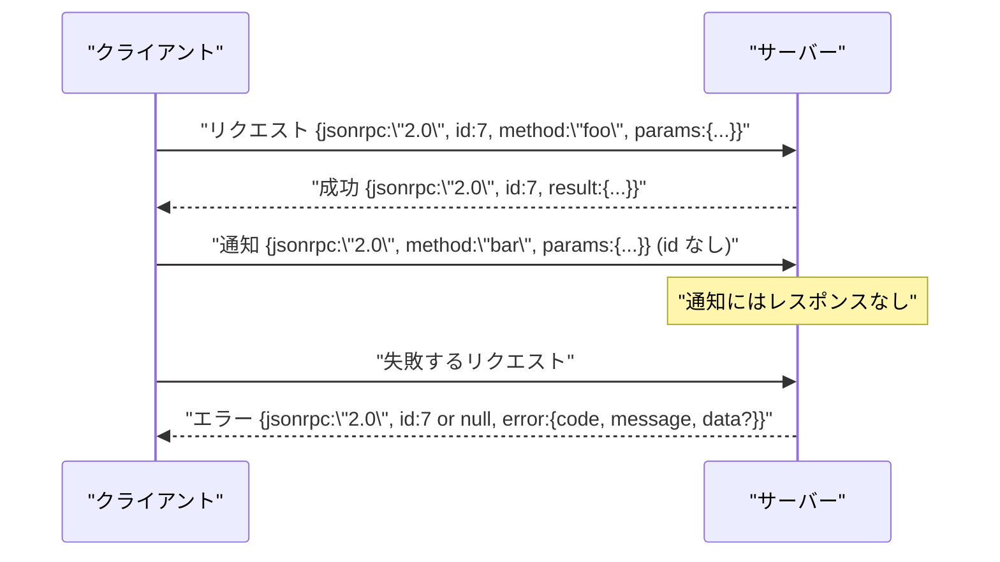

# 改行区切りstdio上のJSON-RPC 2.0

> モデルクライアントとツールサーバー間のトランスポートはstdio上のJSON-RPCだ。一度手動で実装することで、すべてのフレーミング層が何のために使われているかを理解できる。


## 学習目標
- stdinとstdoutを通じた改行区切りJSONとしてフレーミングされたJSON-RPC 2.0を話す。
- 5つの標準エラーコード（-32700、-32600、-32601、-32602、-32603）をマップし、適切なセマンティクスで表面化する。
- 新しいエンベロープキーを発明せずにリクエスト、レスポンス、通知、バッチを区別する。
- ストリームの残りを汚染せずに1行に1つのパースエラーを処理する。
- レッスンが子プロセスを生成せずに実行できるよう、io.BytesIOを使用したセルフターミネーティングデモを構築する。

## JSON-RPCが共通語であり続ける理由

2026年のコーディングエージェントは単一のセッションで最大12のツールサーバーと通信する。各サーバーは別のプロセスまたはリモートエンドポイントだ。ワイヤフォーマットは2013年から変わっていない。JSON-RPC 2.0は2ページの仕様だ。代替案（gRPC、コールごとのHTTP、カスタムバイナリ）はすべてJSON-RPCにないトレードオフを課すため生き残っている: それらはストリーミングかバッチングかトランスポート結合のどれかを選ぶ。JSON-RPCはstdio、ソケット、ウェブソケット、HTTPにわたって対称的で、クライアントは仕様を尊重すれば見たことのないサーバーを動かせる。

このレッスンはstdioバリアントを構築する。改行区切りJSON。各リクエストは1行。各レスポンスは1行。トランスポート境界は`\n`。

## ワイヤの形

4つのエンベロープ形式が存在する。2つはクライアントが話す。2つはサーバーが話す。



通知には`id`がない。サーバーはそれに応答してはならない。サーバーが通知にレスポンスを返すと、クライアントはそれをコールサイトに関連付ける方法がない。この1つのルールがフレーミングの数学をシンプルに保つ。

バッチはリクエストまたは通知のJSON配列だ。サーバーはレスポンスの配列で返し、任意の順序で、通知以外のエントリごとに1つ。バッチのすべてのエントリが通知の場合、サーバーは何も送り返さない。

## 5つのエラーコード

```text
-32700  Parse error      JSONをパースできなかった
-32600  Invalid Request  エンベロープの形が間違っている
-32601  Method not found
-32602  Invalid params
-32603  Internal error
```

-32000から-32099のコードはサーバー定義のエラー用に予約されている。他はすべてアプリケーション定義だ。レッスンは5つに留める。ハンドラーが例外を発生させると、トランスポートはそれを`data.exception`に例外クラス名を持つ-32603としてラップする。

パースエラーには特別なルールがある。レスポンスの`id`は`null`で、リクエストがidを抽出するほど十分にパースされなかったからだ。

## 改行フレーミングとBytesIOデモ

トランスポートは一度に1行ずつ読む。行は`\n`を含むバイト列だ。行をパースできない場合、トランスポートは`id: null`の-32700レスポンスを書き込んで継続する。ストリームは汚染されない。次の行は新鮮にパースされる。

レッスンのために`io.BytesIO`のペアをstdinとstdoutとしてラップする。サーバーはEOFまでリクエストを読み、各々のレスポンスを書き込み、返る。クライアントはレスポンスを読み返す。プロセス生成なし。タイムアウトなし。Pythonの`io`インターフェースが同じ`.readline()`と`.write()`コントラクトを提示するため、トランスポートの動作は実際のサブプロセスパイプと同一だ。

## メソッドディスパッチ

トランスポートはどのメソッドが存在するかを知らない。ハーネスが提供するcallable `handler(method, params)`に引き渡す。ハンドラーは結果を返すか例外を発生させる。3つの例外クラスが特定のコードを表面化する。

```text
MethodNotFound -> -32601
InvalidParams  -> -32602
Anything else  -> -32603 with exception name in data
```

トランスポートはツールレジストリを見ない。レジストリはハンドラーの背後にある。これが望むレイヤリングだ。トランスポートはJSON-RPCを話す。レジストリはツールの形を話す。ディスパッチャー（レッスン23）がそれらをつなぎ合わせる。

## エラー時のストリーム動作

```text
client writes              server reads             server writes
---------------            -----------              -------------
{...valid request...}      parses ok                {...response, id matches...}
{...broken json...         parse fails              {id:null, error: -32700}
{...valid request...}      parses ok                {...response, id matches...}
{...missing method...}     invalid envelope         {id:X, error: -32600}
```

壊れたJSON行はループを止めない。欠落した`method`フィールドはループを止めない。ハンドラーの例外はループを止めない。トランスポートはEOFまで読み続ける。

## 通知と非対称フロー

通知はファイアアンドフォーゲットだ。ハーネスは通知を進捗イベント、キャンセルシグナル、ログラインに使用する。通知は、長時間実行のツールが各々のラウンドトリップなしにステータス更新をストリームする方法だ。

レッスンは1つのアウトバウンド通知ヘルパー`write_notification`を実装する。サーバーはリクエストが処理中に進捗を発行するためにそれを使用する。デモはパターンを示す: リクエストが来て、ハンドラーが2つの進捗通知を発行し、最終レスポンスを書き込む。

## コードの読み方

`code/main.py`は`StdioTransport`、パースヘルパー（`parse_request`）、3つの書き込みヘルパー（`write_response`、`write_error`、`write_notification`）、ディスパッチループ`serve`を定義する。エラーコード定数はモジュールスコープにある。

`code/tests/test_transport.py`は5つのエラーコード、通知（レスポンスなし）、バッチ（配列入力、配列出力、通知スキップ）、壊れたJSON（パースエラーの後に継続）、ハンドラーが呼び出し中に通知を書く非対称フローをカバーする。

## さらに深めるために

このトランスポートはそれ以降のレッスンには十分だ。プロダクションのトランスポートは3つのものを追加する。転送に耐える相関idフィールド（`id`は既にそれだが、メッシュでは外部のトレースidも必要）。キャンセルチャネル（処理中の呼び出しのidを持つ`$/cancelRequest`のような通知）。同じソケットがJSON-RPCとStreamable HTTPの両方を話せるようにするコンテンツタイプのネゴシエーションハンドシェイク。それらのどれもワイヤを変えない。メタデータを追加するだけだ。
