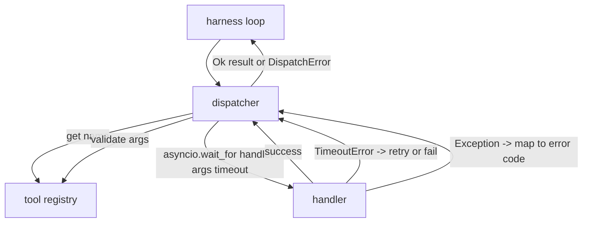
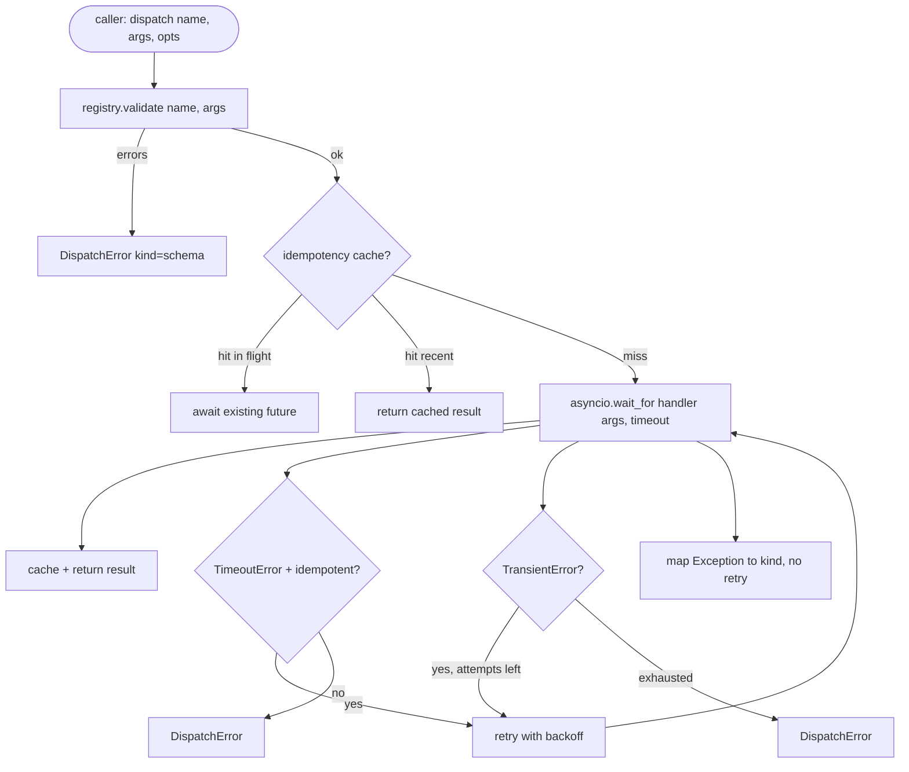

# 関数呼び出しディスパッチャー

> ディスパッチャーは、ハーネスがスキーマで約束したすべての対価を払う場所だ。タイムアウト、リトライ、重複排除、エラーマッピング。すべて1つのシームに。


## 学習目標
- ループを止めるのではなく型付きエラーを返す、呼び出しごとのタイムアウトでツールハンドラーをラップする。
- 最大試行回数とジッターを持つ指数バックオフリトライを適用する。
- 遅い元のリクエストとリトライが競合して2回実行されないよう、冪等性キーでリトライを重複排除する。
- ハーネスループがすでに理解している単一のエラーエンベロープにハンドラーの例外とトランスポートの障害をマップする。
- 40ツール呼び出しのファンアウトがイベントループを枯渇させないよう、並列ディスパッチを同時実行制限でバインドする。

## ディスパッチャーの位置

ハーネスループ（レッスン20）とツールレジストリ（レッスン21）の間。トランスポート（レッスン22）がループを供給する。ループがツール呼び出しをディスパッチャーに渡す。ディスパッチャーはレジストリを呼び出し、ハンドラーを実行し、結果またはJSON-RPC形状のエラーエンベロープを返す。



ディスパッチャーがタイマー、リトライ、冪等性について知る唯一の層だ。ループは知らない。レジストリは知らない。ハンドラーは知らない。その分離が要点だ。

## タイムアウト

各ツールにはデフォルトのタイムアウトがある。レジストリレコードは`timeout_ms`を持つ。ディスパッチャーはハーネスが渡すとき呼び出しごとのオーバーライドから上書きする。`asyncio.wait_for`を使用する。タイムアウト時、ハンドラータスクはキャンセルされ、ディスパッチャーは`DispatchError(kind="timeout")`を返す。

タイムアウトはデフォルトで非冪等ツールに対して再試行可能なエラーではない。タイムアウトした`db.write`はコミットしたかもしれないし、しないかもしれない。再試行は書き込みを重複させる。ディスパッチャーはレジストリレコードの`idempotent`フラグを尊重する。冪等ツールはリトライする。非冪等ツールはしない。

## 指数バックオフによるリトライ

リトライポリシーは最大3回の試行だ。バックオフはジッター付きの指数だ。

```text
attempt 1  -> delay 0
attempt 2  -> delay 0.1s * (1 + random[0..0.5])
attempt 3  -> delay 0.4s * (1 + random[0..0.5])
```

`timeout`と`transient`エラーのみがリトライする。`schema`エラー、`not_found`、`internal`エラーはリトライしない。スキーマエラーは決定論的だ。リトライしても結果は変わらず予算を消費するだけだ。

リトライループはハーネスからの予算を尊重する。呼び出し元の予算に残りゼロのツール呼び出しがある場合、ディスパッチャーは最初の試行で失敗し`kind="budget_exceeded"`を返す。

## 冪等性キーの重複排除

元のリクエストがまだ処理中のときに発火するリトライは実際のプロダクションバグだ。最初の呼び出しが4.9秒でハングする（タイムアウト直前）。リトライが5秒で発火する。今、2つのリクエストが同じバックエンドに対して競合する。ツールが`payments.charge`の場合、2回課金した。

ディスパッチャーはオプションの`idempotency_key`を受け付ける。同じキーが処理中のとき呼び出しが到着すると、ディスパッチャーは処理中のfutureで待機してその結果を返す。キャッシュは遅いリトライを吸収するために完了後60秒間キーを保持する。

キーは呼び出し元の責任だ。ハーネスはプランナーから導出する: `f"{step_id}:{tool_name}:{hash(args)}"`。ディスパッチャーはキーを発明しない。引数だけからキーを導出すると、意味的に異なる2つの呼び出しが同じに見えるからだ。

## エラーエンベロープ

失敗したディスパッチは単一の形を返す。

```text
DispatchError
  kind        : "timeout" | "transient" | "schema" | "not_found" | "internal" | "budget_exceeded"
  message     : str
  attempts    : int
  jsonrpc_code: int   (one of -32601, -32602, -32603)
```

ハーネスループは`kind`を次の状態にマップする。`schema`と`not_found`は`on_error`に行き、リプランをトリガーする。`timeout`と`transient`は`on_error`に行き、試行回数によってリプランするかしないかが決まる。`budget_exceeded`は`on_budget_exceeded`をトリガーする。

## ファンアウトの同時実行制限

`gather(*calls)`はすべてのコルーチンを同時に実行する。40のツール呼び出しで、40のオープンソケットまたは40のサブプロセスパイプになる。ほとんどのバックエンドは1つのクライアントからの40の並列接続を好まない。

ディスパッチャーはセマフォで`gather`をラップする。デフォルトの同時実行制限は8だ。各呼び出しはディスパッチ前にセマフォを取得し、完了時に解放する。呼び出し元は`gather`形状の出力を見るが、実際のスケジューリングは制限される。

## 1回の呼び出しのフロー



## コードの読み方

`code/main.py`は`Dispatcher`、`DispatchError`、`TransientError`を定義する。ディスパッチャーは構築時にレジストリを受け取る。async `dispatch(name, args, ...)`が唯一のエントリポイントだ。呼び出しごとのタイムアウトは`asyncio.wait_for`を使用して`_run_with_retries`内でインラインに適用される。`gather_bounded(calls)`は同時実行制限で多くのディスパッチを実行する。

`code/tests/test_dispatcher.py`はタイムアウトの発火、transientでのリトライ、スキーマエラーでのリトライなし、冪等性の重複排除（同じキーを持つ2つの並列呼び出しが1つのハンドラー呼び出しに集約される）、同時実行制限（セマフォの動作）をカバーする。

テストは`asyncio.sleep(0)`と決定論的な`Counter`ベースのハンドラーを使用するため、ミリ秒で終了し、ウォールクロックのタイミングに依存しない。

## さらに深めるために

プロダクションのディスパッチャーが追加する2つの拡張。まず、すべての遷移での構造化ログ（ループのイベントストリームが既にそれを提供しているが、ディスパッチャーも`dispatch.attempt`と`dispatch.retry`イベントを発行すべきだ）。次に、サーキットブレーカー: ウィンドウ内にN回失敗した後、ツールはクールダウン期間を得て、ハンドラーを試みる代わりに`kind="circuit_open"`で即座に返す。どちらもこのディスパッチャーのコントラクトを変えずに上に積み上げられる。

レッスン24がディスパッチャーをプランアンドエグゼキュートエージェントに接着し、4つの部品すべてが動作しているのを見られる。
