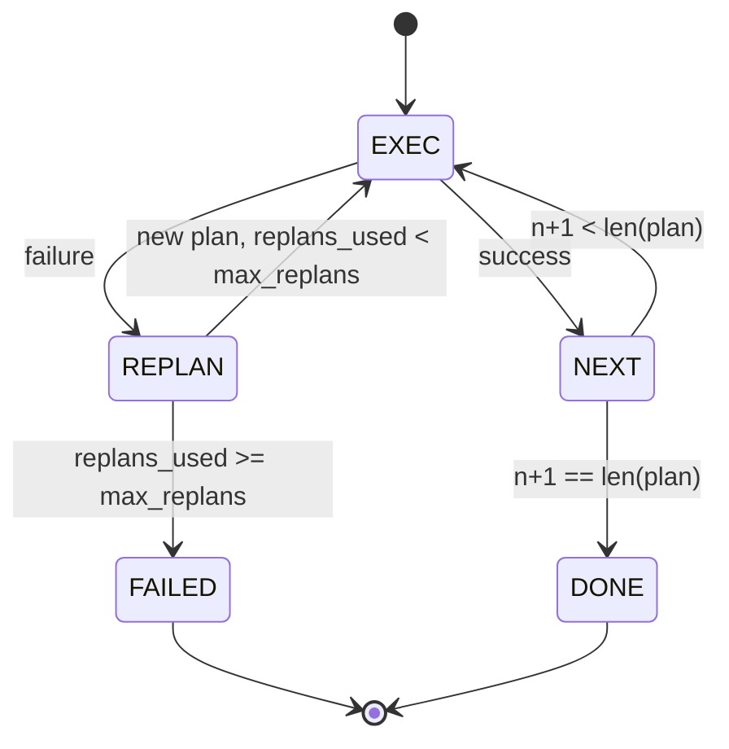

# プランアンドエグゼキュートの制御フロー

> 失敗を生き延びられないプランはスクリプトだ。リプランできるスクリプトはエージェントだ。まずリプランナーを構築する。


## 学習目標
- エグゼキューターが進捗と結果を推論できるよう、プランを型付きステップの順序リストとして表現する。
- 失敗の制御された引き継ぎをプランナーに戻しながら、ステップを順番に実行する。
- 次のプランが情報に基づくよう、コンテキスト内に前のエラーを含めた現在のカーソルからリプランする。
- ダウンストリームのトレーサーやUIがプランが変わった理由を示せるよう、各改訂でプランの差分を発行する。
- 2つの予算を適用する: ハードなステップ上限とハードなリプラン上限。

## プランアンドエグゼキュート、思考の連鎖ではなく

思考の連鎖エージェントはトークンを発行し、ループにツール呼び出しの終わりを推測させる。プランアンドエグゼキュートエージェントは最初に構造化されたプランを発行し、次に各ステップを決定論的に実行する。プランはハーネスが内部検査できるデータだ。実行はハーネスがディスパッチャーを通じてそのデータを実行することだ。

2つのピース。プランを生成するプランナー。プランを実行するエグゼキューター。エグゼキューターが失敗にぶつかったときに何が起こるかが興味深い作業だ。3つの選択肢:

```text
1. Abort         (失敗を返し、エラーを表面化する)
2. Skip          (ステップを失敗とマークし、残りを続ける)
3. Replan        (エラーをプランナーに渡し、カーソルから新しいプランを得る)
```

リプランがスクリプトをエージェントに変えるものだ。

## ステップの形

```text
Step
  id              : int           (プランの改訂内で単調)
  tool_name       : str
  args            : dict
  expected_outcome: str           (プランナーの述べた成功条件)
  result          : Any | None
  error           : str | None
```

`expected_outcome`はプランナーがステップと一緒に発行する短い文だ。エグゼキューターによって強制されない。2つのことのためにある: リプランナーはプランを改訂するときに読む；イベントストリームはそれを発行し、トレーサーが「このステップはXをするはずだった」と示せる。

## プランナーの形

```python
def planner(goal: str, history: list[Step], last_error: str | None) -> list[Step]:
    ...
```

ピュア関数だ。`goal`はユーザーの目標だ。`history`は既に実行されたステップ（結果とエラーが埋められた）だ。`last_error`は最初の呼び出しではNoneで、その後のすべての呼び出しでは最後の失敗メッセージだ。プランナーはカーソルから始まる次のプランを返す。

プランナーはエグゼキューターを知らない。リトライを知らない。タイムアウトを知らない。プランを生成する。それだけだ。

## エグゼキューター

エグゼキューターは小さなステートマシンだ。各ステップはディスパッチャーを通じて実行される。結果は3つのうちの1つだ: 成功、失敗・リプラン可能、失敗・致命的。リプラン可能な失敗はプランナーに引き継がれる。致命的な失敗（予算超過、リプラン上限到達）は`FAILED`セッション結果を返す。



## 改訂時のプランの差分

失敗後にプランナーが新しいプランを返すとき、エグゼキューターは3つのフィールドを持つ`plan.diff`イベントを発行する。

```text
removed: 古いプランにあって新しいプランにないステップIDのリスト
added  : 古いプランにない新しいプランのステップIDのリスト
revised: tool_nameまたはargsが変わったステップIDのリスト
```

トレーサーやUIはこれを削除されたステップの取り消し線と追加されたステップのハイライトとしてレンダリングできる。要点はdiff形式ではない。改訂が目に見えるイベントであり、サイレントな書き直しではないことだ。

## 2つの予算、両方ともハード

`max_steps`はリプランを含むセッション全体のステップ実行の合計をキャップする。デフォルトは12だ。2回リプランしてそれぞれ3ステップ追加する線形5ステッププランは16回の実行になり予算を超える。エグゼキューターはリプランを拒否してFAILEDを返す。

`max_replans`は最初のプランの後にプランナーが呼び出される回数をキャップする。デフォルトは5だ。これがより重要な制限だ。同じ壊れたプランを5回返すプランナーは、ステップ予算が捕まえるまでそうでなければループし続ける。リプランをキャップすることで失敗をより速くし、理由をより明確にする。

## このレッスンの決定論的プランナー

このレッスンではモデルを呼び出さない。レッスンは`last_error`に基づいてプランを選ぶ決定論的プランナーを出荷する。

```text
last_error is None    -> 4ステッププランを発行
last_error matches X  -> Xを回避する3ステッププランを発行
last_error matches Y  -> 優雅に諦める2ステッププランを発行
otherwise             -> [] を返す（リプランするものがないことを示す）
```

これはエグゼキューターの動作をすべての遷移パスでテストするのに十分だ: 成功、1回リプラン、2回リプラン、リプラン枯渇、ステップ予算枯渇。

## 結果の形

```text
SessionResult
  status      : "completed" | "failed"
  reason      : str     ("goal_met" | "step_budget" | "replan_budget" | "no_plan")
  history     : list[Step]
  revisions   : list[PlanDiff]
  events      : list[Event]
```

レッスン20のハーネスループはこれを直接読める。レッスン23のディスパッチャーは各ステップを実行する。レッスン21のレジストリは各ステップのargsを検証する。レッスン22のトランスポートはこのフロー全体をJSON-RPC経由でモデルクライアントに公開する。

## コードの読み方

`code/main.py`は`PlanExecuteAgent`、`Step`、`PlanDiff`、`SessionResult`、決定論的プランナーを定義する。エグゼキューターは`SessionResult`を返す単一の`run(goal)`メソッドだ。プランの差分はステップIDと`(tool_name, args)`タプルを比較することで計算される。

`code/tests/test_agent.py`は線形の成功、1回リプランする途中のプラン失敗、`failed:replan_budget`を返すリプラン枯渇、ステップ予算枯渇、プランdiffイベント形式をカバーする。

## さらに深めるために

実際のモデルに接続したら欲しくなる2つの拡張。まず、部分プランキャッシング: プランが6ステップのうち最初の3ステップで成功し、失敗した場合、最初の3ステップを再実行したくない。エグゼキューターはすでにhistoryを保持しているので、プランナーはそれを読むだけでいい。次に、並列ブランチ: 現在のエグゼキューターは厳密に順番だ。独立したブランチを発行するプランナー（`next_step`の代わりに`gather_step`）はディスパッチャー経由で2つのツール呼び出しを同時に実行できる。

どちらも実際の複雑さを追加する。どちらも線形エグゼキューターが確立された後に追加しやすい。それがこのレッスンがするものだ。
