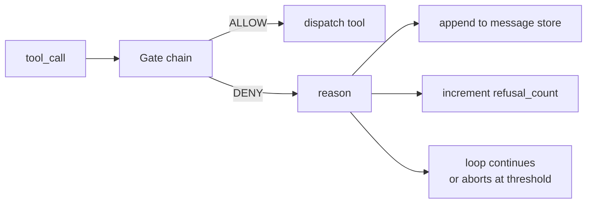
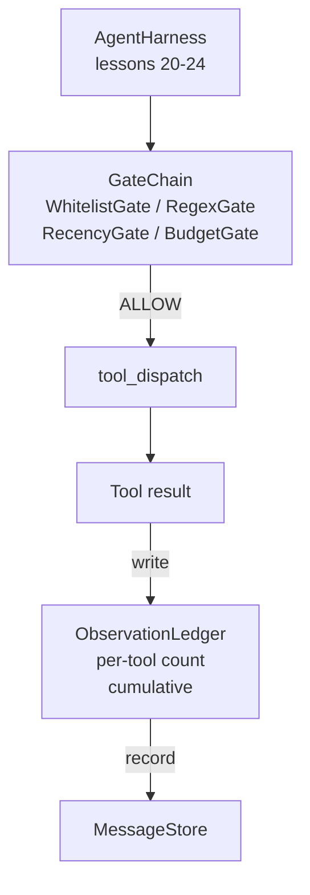

# キャップストーンレッスン25: 検証ゲートと観察予算

> 検証層のないエージェントハーネスは、トレンチコートを着た願い事だ。このレッスンでは、ツール呼び出しが許可されるべきかどうかを決定し、エージェントがその出力のどれだけ見ることができるかを決定し、エージェントが読みすぎたためにループを止めなければならないときを決定する決定論的ゲートチェーンを構築する。チェーンはいくつかの小さな名前付きゲートと、モデルに表示されたすべてのトークンを追跡する観察台帳の関数だ。


## 学習目標

- 決定論的な`evaluate(call)`メソッドを持つ`VerificationGate`プロトコルを構築する。
- ショートサーキットセマンティクスを持つチェーンに予算、再近接性、ホワイトリスト、正規表現ゲートを合成する。
- ツールとターンでキーされた`ObservationLedger`を通じてすべての観察を追跡する。
- 累積観察予算が超過する場合にツール呼び出しを拒否する。
- ダウンストリームの観察可能性が取り込める構造化された`GateDecision`レコードを表面化する。

## 問題

エージェントハーネスがモデルに自由にツールを呼び出させると、実際の使用の最初の1時間以内に3種類のバグが現れる。

最初は無制限の観察だ。200K行のリポジトリ上のgrepは次のターンに50万トークンの出力をダンプする。モデルはキロバイトごとに1つのマッチを見て、残りのコンテキストは無駄になる。トークンの請求は大きく、エージェントはタスクにより悪くなる。

2番目は古い再近接性だ。長時間実行のタスクは50のツール呼び出しを蓄積する。モデルはターン3からの最初のread_fileをライブ状態かのように再読する。ターン47で行われた編集はプロンプトビルダーが最初の観察を先にシリアライズしたため現れない。

3番目は権限のクリープだ。リサーチタスクが`web_search`を呼び出すことから始まり、モデルがツール名を発明してハーネスが許可デフォルトになったため、どういうわけか`shell`を実行してしまう。誰かがトレースを読む頃には、/tmpにジャンクファイルが座っていてプライベートAPIに対してcurlが実行されている。

検証ゲートはノーと言うハーネスコンポーネントだ。モデルではない。審判ではない。ALLOWまたは理由付きDENYを返す`(call, history, ledger)`の決定論的関数だ。理由はログに記録される。モデルに伝えられる。ループは続くか中断する。

## コンセプト



ゲートは`evaluate(call, ctx) -> GateDecision`メソッドを持つ何でもだ。チェーンは順序リストだ。評価は最初のDENYでショートサーキットする。順序が重要: 安価な構造的ゲートが高価なトークンカウントゲートより先に実行される。

このレッスンは4つのゲートを出荷する:

- `WhitelistGate`。許可されたツール名は明示的なセットだ。外のものはすべて拒否される。これが最も安価なゲートで最初に実行される。
- `RegexGate`。ツールの引数が正規表現に対してマッチされる。`rm -rf`を含むシェル呼び出しや内部IPへのHTTP呼び出しを拒否するのに便利だ。呼び出しペイロードに対してピュアだ。
- `RecencyGate`。モデルは最後のNターンからの観察のみを見る。古い観察はマスクされる。ゲートはすでに古くなった観察ウィンドウを延長するツール呼び出しを拒否する。
- `BudgetGate`。セッション全体でモデルが読んだ累積トークンには上限がある。台帳が上限に達したと言うと、それ以降のすべてのツール呼び出しが拒否される。

観察台帳は記帳だ。成功したすべてのツール呼び出しは1行を書く: ツール名、ターン、発行されたトークン、累積。台帳は2つの質問に答える: モデルはセッション全体でどれだけ見たか、ツールXはどれだけ見たか。予算ゲートは最初を読む。演習として書くツールごとの予算ゲートは2番目を読む。

## アーキテクチャ



ハーネスはチェーンに聞く。チェーンは頷くか拒否する。頷くと、ツールが実行され、台帳が刻み、結果がメッセージストアに追加される。拒否すると、モデルにシステムメッセージとして拒否が渡され、ループはリトライするか中断するかを決定する。

## 構築するもの

実装は単一の`main.py`とテストだ。

1. `Observation`と`ToolCall`データクラスがワイヤ形状を定義する。
2. `ObservationLedger`は`(turn, tool, tokens)`行を記録し`cumulative()`と`per_tool(name)`に答える。
3. `GateDecision`は`(allow, reason, gate_name)`を持つ。
4. `VerificationGate`はプロトコルだ。各ゲートは`evaluate(call, ctx)`を実装する。
5. `GateChain`は順序リストをラップする。各ゲートを呼び出し、最初のDENYを返すか、すべてのゲートがパスすればALLOWを返す。
6. デモは小さな合成エージェントループを実行する。3ターン。3番目のターンが予算ゲートをトリップし、ループがゼロ以外の拒否カウントでクリーンな拒否を報告する。

トークンカウンターは意図的に愚かな`len(text) // 4`ヒューリスティックだ。このレッスンの要点はゲートの配線であり、トークナイザーではない。プロダクションでは本物のトークナイザーを差し込む。

## チェーンの順序が重要な理由

DENYはALLOWより安価だ。`WhitelistGate`はO(1)ハッシュルックアップで実行される。`RegexGate`はO(pattern * argv)で実行される。`RecencyGate`はメッセージストアの小さなスライスを読む。`BudgetGate`は台帳全体を読む。拒否された呼び出しが高価な作業をする前にショートサーキットするよう、コストの昇順に並べる。

ブラスト半径によっても並べる。ホワイトリストが最も強い主張だ: このツールはコントラクトにない。正規表現ゲートが次だ: この引数はコントラクトにない。再近接性が次に来る: ハーネスはまだ気にするが呼び出しは構造的に合法だ。予算は最後だ。なぜなら定義上、他のすべてがパスしたときだけ発火するから。

## トラックAの残りとの合成方法

前のレッスンでループ、ツールレジストリ、メッセージストア、プロンプトビルダー、モデルルーターが提供された。このレッスンはモデルとツールの間の層を追加する。レッスン26はゲートチェーンがALLOWと言った後にディスパッチャーがツール呼び出しを渡すサンドボックスを出荷する。レッスン27は拒否カウントを品質シグナルとして記録する評価ハーネスを出荷する。レッスン28はゲートの決定をOpenTelemetryスパンに接続する。レッスン29はすべてを動作するコーディングエージェントに統合する。

## 実行方法

```bash
cd phases/19-capstone-projects/25-verification-gates-observation-budget
python3 code/main.py
python3 -m pytest code/tests/ -v
```

デモはターンごとのトレースを出力し、すべてのゲートの決定を含み、ゼロで終了する。テストは台帳、各ゲートを単独で、チェーンのショートサーキット、合成ループのエンドツーエンドをカバーする。
