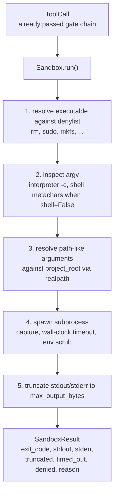
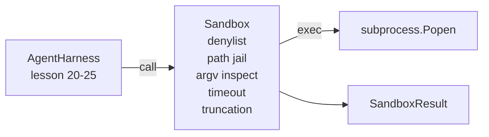

# キャップストーンレッスン26: デナイリストとパスジェイルを持つサンドボックスランナー

> 検証ゲートがツール呼び出しを実行すべきかどうかを決定する。サンドボックスは実行時に何が起こるかを決定する。このレッスンでは、危険な実行ファイルを拒否し、危険なargv形状を拒否し、すべてのファイルパスをプロジェクトルートにジェイルし、過大なサイズの出力を切り詰め、ウォールクロックタイムアウトでランアウェイプロセスを終了させるサブプロセスランナーを出荷する。これはモデルとオペレーティングシステムの間にある2つの層の2番目だ。


## 学習目標

- タイムアウト、キャプチャ、切り詰めを持つ`subprocess.run`をラップする`Sandbox`クラスを構築する。
- デナイリストに対して名前でコマンドを拒否し、argvインスペクターに対して構造で拒否する。
- 宣言されたプロジェクトルートの外に解決されるパス引数を拒否する。
- シェルモードがオフのときシェルメタキャラクターを拒否する。
- ダウンストリームの観察可能性と評価ハーネスが取り込める構造化された`SandboxResult`を返す。

## 問題

シェルアウトできるコーディングエージェントは、バックドアをインストールし、鍵を流出させ、開発者のラップトップを壊し、1ターンでクラウドの請求を積み上げられる。最もコストの低い防御はシェルを与えないことだ。2番目にコストの低いのは、正確なパターンのリストにノーと言うサンドボックスだ。

エージェントのトレースには3種類の失敗が繰り返し現れる。

最初は危険な実行ファイルだ。パスの問題を修正するプレッシャー下のモデルは`sudo`、`chmod -R 777`、`rm -rf`、`mkfs`、`dd`を試みる。これらのどれもエージェントの実行には属さない。デナイリストはそれらを名前とエイリアスでキャッチする。

2番目はargvのトリックだ。シェルがないと言われたモデルは、インタープリター経由で攻撃をパイプする: `python3 -c "import os; os.system('rm -rf /')"`, `bash -c '...'`, `node -e '...'`, `perl -e '...'`。サンドボックスは`-c`のようなフラグを持つインタープリターの実行はすべてステップを追加したシェル呼び出しだと知る必要がある。

3番目はパスエスケープだ。モデルは`./src/main.py`を読むように言われ、代わりに`../../etc/passwd`を読む。サンドボックスは`os.path.realpath`を通じてすべてのパス引数を解決してプレフィックスをアサートすることでジェイルする。

サンドボックスはオペレーティングシステムの意味でのセキュリティ境界ではない。コード実行を持つ決意した攻撃者はまだ脱出できる。サンドボックスは開発時のガードレールだ: 一般的な失敗モードを大きな音にして、エージェントが単純な無能さからダメージを与えるのを止める。

## コンセプト



サンドボックスには4つの拒否軸がある: 名前、argv、パス、構造。各軸は呼び出しのピュア関数で、まだサブプロセスはない。サブプロセスはすべての軸がパスした後にのみ生成される。

`SandboxResult`の終了コードは慣例的なものだ: 0が成功、0以外が失敗、プラスdenyに対する3つのセンチネルコード（-100）、timed_out（-101）、truncated（終了コードは本物だが、フラグが設定される）。ダウンストリームのレッスンはstderrを解析せずにこの構造化された結果を読む。

## アーキテクチャ



デナイリストは実行ファイルのベース名のfrozensetだ。エイリアス（`/bin/rm`、`/usr/bin/rm`）はすべて同じベース名に解決される。argvインスペクターはインタープリターの形を知っている: argv[0]がインタープリターで後の引数のいずれかが`-c`や`-e`で始まるargvはすべて拒否される。シェルメタキャラクター（`;`、`|`、`&`、`>`、`<`、バックティック、`$()`）は呼び出しが明示的にシェルを要求しないとき拒否を引き起こす。

パスジェイルが最も微妙な部分だ。サンドボックスは構築時に`project_root`を受け付ける。パスのような引数（`/`を含むか既存のファイルに一致する）はすべて`os.path.realpath`を通じて正規化され、プロジェクトルートのrealpathに対してチェックされる。解決されたターゲットがルートの下にない場合、拒否。シンボリックリンクエスケープ試行（プロジェクトルート内のルートの外を指すシンボリックリンク）はリテラルパスではなくrealpathをチェックすることでブロックされる。

## 構築するもの

実装は`main.py`とテストディレクトリだ。

1. `SandboxResult`データクラス: exit_code、stdout、stderr、truncated、timed_out、denied、reason、duration_ms。
2. `SandboxConfig`データクラス: project_root、max_output_bytes、timeout_seconds、denylist、interpreter_block。
3. `Sandbox`クラス: `run(argv, *, shell=False, cwd=None)`は`SandboxResult`を返す。
4. 内部拒否ヘルパー: `_check_executable_denylist`、`_check_argv_interpreter`、`_check_shell_metachars`、`_check_path_jail`。
5. 明確な`truncated`フラグとキャプチャされたストリームのマーカー行を持つ出力切り詰め。
6. 下部のデモ: 合法的な呼び出しと敵対的な呼び出しのシーケンス。各々が結果とともに表示される。

サンドボックスはデフォルトで`shell=False`と`capture_output=True`で`subprocess.run`を使用する。ウォールクロックタイムアウトは`timeout`引数を使用し、`TimeoutExpired`ではサンドボックスがプロセスグループを終了させてSandboxResultを合成する。

## これが本物のサンドボックスではない理由

レッスンのサンドボックスはネームスペース、cgroup、seccomp、gVisor、Firecracker、またはカーネルレベルの分離を使用しない。サブプロセスができることはすべてサンドボックスができる。保護は構造的だ: エージェントは最も一般的な危険な呼び出しを拒否され、大きな音の拒否が黙って実行される代わりに観察可能性に入る。

プロダクションのエージェントでは上に積み重ねる: 非特権Dockerコンテナ内で実行、マイクロVM内で実行、ケーパビリティを落とす、プロジェクトルートを読み取り専用でスクラッチディレクトリを読み書きでマウント、メモリとCPUにulimitを設定、環境を既知の安全なホワイトリストにスクラブ。レッスン29がその一部を行う。オペレーティングシステムの分離はこのレッスンのスコープ外だ。

## 実行方法

```bash
cd phases/19-capstone-projects/26-sandbox-runner-denylist
python3 code/main.py
python3 -m pytest code/tests/ -v
```

デモは一時ディレクトリを作成し、クリーンなファイルをドロップし、呼び出しのバッテリーを実行する。合法的な呼び出しは成功する。拒否された呼び出しは`denied=True`と理由を持つSandboxResultを返す。タイムアウトは`timed_out=True`を返す。切り詰めは`truncated=True`を設定する。デモは結果のJSONテーブルを出力してゼロで終了する。

## トラックAの残りとの合成方法

レッスン25がゲートチェーンを生成した。レッスン26はゲートALLOW後に実行されるエグゼキューターだ。レッスン27の評価ハーネスはサンドボックスの結果をタスクごとの期待される終了コードと比較する。レッスン28は各`Sandbox.run`呼び出しの周りに`gen_ai.tool.execution`スパンを発行する。レッスン29のエンドツーエンドデモは実際のコーディングエージェントを両層を通じて接続する。
