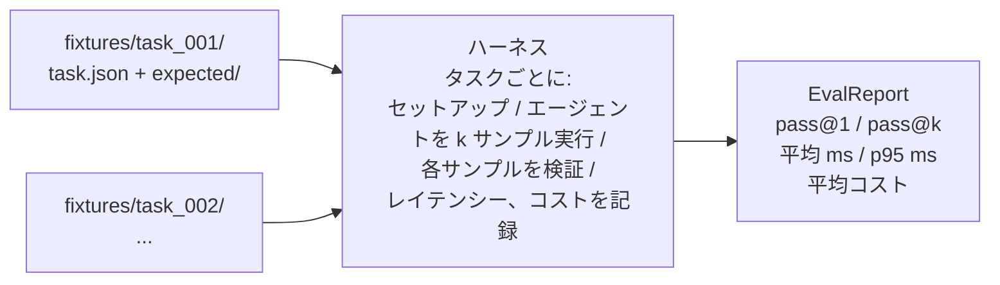
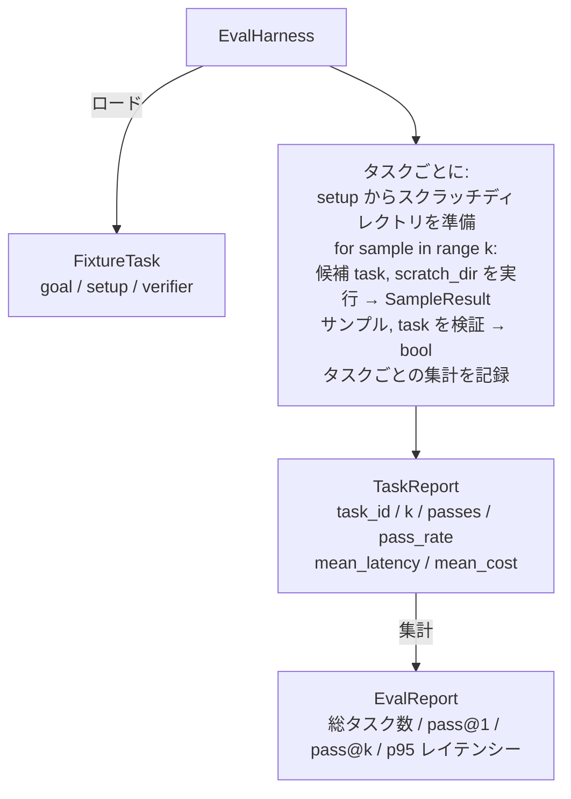

# キャップストーンレッスン27: フィクスチャータスクを持つ評価ハーネス

> コーディングエージェントはそれを測定するタスクのスイートと同じだけ良い。このレッスンでは、フィクスチャータスクのフォルダを取り、各々を候補エージェントを通じて実行し、決定論的なベリファイアーを通じてパスまたは失敗をスコアリングし、結果をpass@1、pass@k、平均レイテンシー、平均コストに集約する評価ハーネスを構築する。ハーネスはリグレッションとリファクタリングを区別できる真実の源泉だ。


## 学習目標

- フィクスチャータスクをゴール、セットアップ、ベリファイアーの3つ組として定義する。
- タスクごとに複数のサンプル実行をスコアリングし、pass@1とpass@kを計算する。
- レイテンシーとコストを平均と95パーセンタイルのメトリクスに集約する。
- 決定論的ベリファイアー（ファイル差分、終了コード、正規表現マッチ）を再利用可能な関数に組み込む。
- リグレッション追跡スクリプトが取り込める構造化されたJSONレポートを発行する。

## 問題

評価ハーネスなしに構築されたエージェントのベンチマークには3つの失敗モードが現れる。

最初は未検証のパスだ。エージェントはバグを修正したと言い、人間はdiffを一瞥し、スイートはグリーンとマークされ、3週間後にリグレッションテストが同じバグを表面化する。エージェントは実際に何も修正せずに合理的に推論していた。

2番目は未検出のリグレッションだ。プロンプトテンプレートへの変更がエージェントを大きなタスクで4%良くし、静かなタスクで14%悪くする。ゴールドセットとタスクごとのスコアなしでは、リグレッションはmainに乗り込み、顧客が苦情を言うときにのみ表面化する。

3番目はタスクごとのドリフトだ。評価は月曜日に100タスクで実行され、金曜日には95タスクで実行されたのは、誰かが5つのフィクスチャーの名前を変えたからだ。パス率は5%の改善のように見える。違う。

ハーネスはこれらの失敗を事実に変えるプログラムだ。すべてのフィクスチャーを、毎回、再現可能な順序で、真または偽を決定論的チェックで返すベリファイアーに対して実行する。

## コンセプト



`FixtureTask`は小さなJSONファイルとオプションの`expected/`ディレクトリだ。JSONは`id`、`goal`（エージェントに供給されるプロンプト）、`setup`ブロック（スクラッチディレクトリにドロップするファイル）、`verifier`ブロックを宣言する。ベリファイアーブロックはハーネスのベリファイアーレジストリ内の関数を名前で指定し、その引数を提供する。

3つのベリファイアー形状が有用なタスクの大半をカバーする。

最初は`file_equals`だ。エージェントの実行後、名前付きファイルを期待されたコンテンツと比較する。「このバグをこの正確な方法で修正する」タスクをキャッチする。

2番目は`regex_match`だ。名前付きファイルのコンテンツが正規表現に対してマッチされる。多くの許容される解決策がある「関数が存在してXを返さなければならない」タスクをキャッチする。

3番目は`shell_exit_zero`だ。ハーネスはシェルコマンドを（レッスン26のサンドボックスを通じて）実行し、コマンドがゼロで終了した場合にのみタスクをパスする。「テストが通らなければならない」タスクをキャッチする。

ハーネスは各タスクを`k`回実行する。Pass@kは`1 - (1 - p)^k`（pは経験的なパス率）；ハーネスはバリアンスを発見できるよう生のカウントも報告する。レイテンシーはサンプルごとのウォールクロックだ。コストはエージェントが自己報告するもの（トークン数、USD、または両方）；ハーネスはサンプル全体で合計し、タスクごとと集計の数値を提示する。

## アーキテクチャ



候補はcallable: `Callable[[FixtureTask, str], SampleResult]`だ。ハーネスは`tempfile.mkdtemp()`を通じてスクラッチディレクトリを作成し、そのパスをプレーン文字列として渡す。ハーネスは候補がどのように動作するかを気にしない。候補は決定論的なパッチアプライアー（ハーネスのセルフテストに便利）、本物のLLMエージェント、ファザーになれる。コントラクトはSampleResultだ。

## 構築するもの

`main.py`が出荷するもの:

1. `FixtureTask`データクラス。
2. `SampleResult`データクラス: success_self_reported、latency_ms、cost_units、edits。
3. `TaskReport`、`EvalReport`データクラス（`to_dict()`付き）。
4. `VerifierRegistry`はベリファイアー名を関数にマップする。ビルトインベリファイアー: file_equals、regex_match、shell_exit_zero。
5. `EvalHarness`クラス。タスクのディレクトリを候補に対して実行する。EvalReportを返す。
6. `tasks/`にバンドルされた5つのフィクスチャータスク:
   - `fizzbuzz`のオフバイワン
   - `factorial`の欠落したreturn
   - エラーメッセージのタイポ
   - 空の関数本体
   - リンクリスト走査のオフバイワン
7. ハーネスがpass@1 = 1.0のクリーンなパスを実証するために使用する決定論的な参照候補（`apply_known_fixes`）。
8. デモはEvalReport JSONを出力してゼロで終了する。

フィクスチャータスクは`tasks/`のJSONファイルと`tasks/<id>/buggy/`と`tasks/<id>/expected/`のペアソースファイルとしてバンドルされる。ハーネスはbuggyをスクラッチディレクトリにコピーし、候補に渡し、expectedに対して検証する。

## pass@kのみでなくpass@1も使う理由

実際のLLMエージェントは確率的だ。0.6のpass@1は失敗のように見える。0.95のpass@5はエージェントがほとんどの時間正しい答えを得るが早いサンプルで間違った選択をしていると言う。修正はサンプリングとランク付けであり、常によりトレーニングではない。pass@kがそれを目に見えるものにする。

pass@kはpass@1と一緒に報告される。なぜならpass@kは20回に1回だけ正しい答えを得るモデルを強く見せるから；pass@1はファーストアテンプトの床にアンカーする。ハーネスは両方を示す。

## トラックAの残りとの合成方法

レッスン25がゲートチェーンを生成した。レッスン26がサンドボックスを生成した。ハーネスはすべての`shell_exit_zero`ベリファイアーにサンドボックスを使用する。レッスン28が各ハーネス実行をOTelトレースにラップする。レッスン29がバンドルされたフィクスチャーの1つに対してエンドツーエンドデモを実行し、参照候補のpass@1 = 1.0をアサートする。

## 実行方法

```bash
cd phases/19-capstone-projects/27-eval-harness-fixture-tasks
python3 code/main.py
python3 -m pytest code/tests/ -v
```

デモはEvalReportをJSON形式で、pass@1、pass@5、平均レイテンシー、タスクごとの内訳を含めて出力する。終了コードはゼロだ。テストはベリファイアー関数、pass@k数学、フィクスチャーロード、バンドルされた参照候補に対するハーネスのエンドツーエンドをカバーする。
