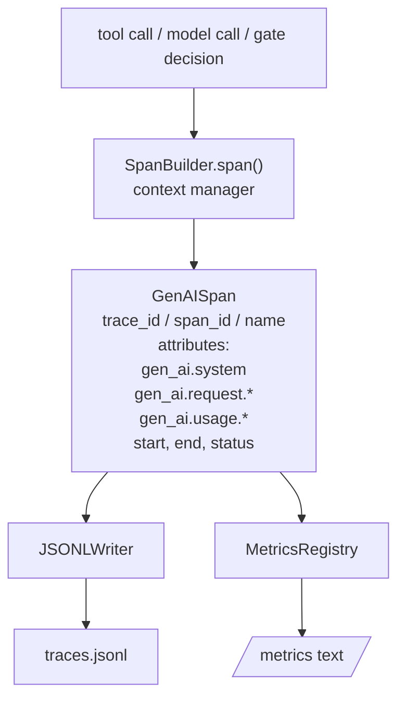
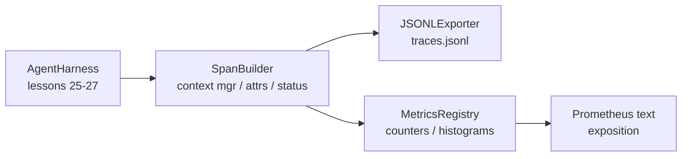

# キャップストーンレッスン28: OTel GenAIスパンとPrometheusメトリクスによる可観測性

> 可観測性のないエージェントハーネスはお金がかかるブラックボックスだ。このレッスンでは、OpenTelemetry GenAIセマンティック規約に準拠したレコードを発行し、1スパン1行でJSONLinesファイルに書き込み、Prometheusテキスト形式でカウンターとヒストグラムを公開するスパンビルダーを手動実装する。全体がstdlib Pythonでオフラインで実行される。


## 学習目標

- OpenTelemetry GenAIセマンティック規約に形作られたスパンデータクラスを構築する。
- 自己完結した1スパン1行を書くJSONLエクスポーターを実装する。
- ラベルとPrometheusテキスト形式の公開でカウンターとヒストグラムを構築する。
- 期間、ステータス、例外を記録するスパンコンテキストマネージャーで任意のcallableをラップする。
- 発行されたスパンが`json.loads`を通じてラウンドトリップしてスペック形状と一致することを確認する。

## 問題

プロダクションのコーディングエージェントはターンごとに3種類のアーティファクトを生成する: モデル呼び出し、ツール実行、検証ゲートの決定。これらのどれも構造化されたテレメトリーなしでは役立たない。

最初の失敗モードはトレースの欠如だ。火曜日に何かがうまくいかなかったが、唯一の記録は500行のチャットログだ。どのツールが実行されたか、どれくらいかかったか、プロンプトに何トークン入ったか、ゲートが何かを拒否したかの記録がない。エージェントの作者は推測しなければならない。

2番目の失敗モードはパースできないトレースだ。ハーネスはスパンを書いたが、独自のアドホックなフィールド名を使った。Grafana、Honeycomb、Jaeger、またはローカルCLIにあるものは何も読めない。チームのスタックにある既存のツールはスパンが非標準のため無駄になる。

3番目の失敗モードは集約されていないメトリクスだ。トレース内の1つの遅いツール呼び出しを見ることができるが、「過去1時間のread_file呼び出しのp95レイテンシーは何か？」に答えられない。メトリクスがなく、トレースしかないから。

OpenTelemetry GenAIセマンティック規約はまさにこのために存在する。LLMフレームワーク全体のスパンエミッターが共有する標準属性の小さなセットを定義する。ハーネスがそれらの属性を書けば、すべてのOTel互換バックエンドが読める。

## コンセプト



ハーネスのすべての操作がスパンを生成する。スパンはトレースID（エージェント呼び出し全体）、スパンID（この1つの操作）、名前（例: `gen_ai.chat`、`gen_ai.tool.execution`）、GenAI規約に従う属性、開始と終了時刻、ステータスを持つ。

GenAI規約はこれらの属性キーを標準化する: `gen_ai.system`（どのプロバイダーか、例: `anthropic`、`openai`）、`gen_ai.request.model`（モデルID）、`gen_ai.request.max_tokens`、`gen_ai.usage.input_tokens`、`gen_ai.usage.output_tokens`、`gen_ai.response.model`、`gen_ai.response.id`、`gen_ai.operation.name`、プラスツール固有のキー`gen_ai.tool.name`と`gen_ai.tool.call.id`。

エクスポーターはJSONLを書く。1行に1つのJSONオブジェクト。ダウンストリームのツールがストリーム、grep、インポートできる最もシンプルな形式だ。本物のOTelエクスポーターはOTLP gRPCを話す；レッスンのJSONLエクスポーターはオフラインの同等物で、すべてのワークステーションでゼロで終了する。

メトリクスはトレースの隣に存在する。カウンターは各ツール呼び出しで増加する: `tools_called_total{tool="read_file"}`。ヒストグラムは観察されたレイテンシーを記録する: `tool_latency_ms{tool="read_file"}`。どちらもPrometheusのテキスト公開形式にシリアライズされ、これがプルベースのメトリクスの事実上の標準だ。

## アーキテクチャ



スパンビルダーは`span(name, attrs)`メソッドを持つ小さなクラスで、コンテキストマネージャーを返す。コンテキストマネージャーはエンター時に開始時刻を記録し、エグジット時に終了時刻を記録し、例外が発生した場合に添付し、完成したスパンをエクスポーターにプッシュする。

メトリクスレジストリは2つのdictだ。カウンターは`{(name, frozen_labels): int}`。ヒストグラムはリスト内に生のサンプルを保持し、公開時にPrometheusのヒストグラムバケットにシリアライズされる。

## 構築するもの

`main.py`が出荷するもの:

1. `GenAISpan`データクラス: trace_id、span_id、parent_span_id、name、attributes、start_unix_nano、end_unix_nano、status、status_message、events。
2. `SpanBuilder`クラス（`span(name, attrs, parent=None)`コンテキストマネージャー）。
3. `JSONLExporter`クラス（1行を追加する`export(span)`）。
4. `Counter`と`Histogram`クラス、プラス`MetricsRegistry`。
5. テキスト形式の出力を生成する`prometheus_exposition(registry)`。
6. スパンを発行してメトリクスを更新する`wrap_tool_call(name)`デコレーター。
7. デモ: 完全なエージェント呼び出しを合成する（ツールスパンを囲むgen_ai.chatスパン）、traces.jsonlを書き込む、Prometheus公開を出力する、ゼロで終了する。

スパンIDとトレースIDは16バイトの16進数文字列で、`os.urandom`から生成される。これはOTelのW3Cトレースコンテキストと一致する。エクスポーターは決して例外を発生させない；I/Oエラーは表面化されるがハーネスは実行し続ける。

ヒストグラムは固定バケットセット（ミリ秒単位のレイテンシーのOTelデフォルト: 5、10、25、50、100、250、500、1000、2500、5000、10000、+Inf）を持つ。サンプルはリストとして保存され、公開時にバケットごとのカウントがオンデマンドで計算される。

## opentelemetry-sdkの代わりに手動実装する理由

OTelのPython SDKは本物の依存関係だ。また数千行のコード、OTLPエクスポーターの複数プロセス、レッスン予算を圧倒するランタイムコストもある。手動実装バージョンはワイヤフォーマットを教える。プロダクションでは同じ属性を本物のSDKに接続し、OTLPエクスポーター、バッチ処理、リソース検出を無料で得る。

規約は安定している。レッスンが発行するワイヤフォーマットは2030年もパースし続ける。OTelはGenAI属性名を決して壊さない；新しいものを追加するだけだ。

## トラックAの残りとの合成方法

レッスン25がゲートチェーンを生成した。レッスン26がサンドボックスを生成した。レッスン27が評価ハーネスを生成した。レッスン28が3つすべてを観察可能にする。レッスン29はエンドツーエンドデモのすべてのステップをスパンにラップし、最後にPrometheusテキストを出力する。

## 実行方法

```bash
cd phases/19-capstone-projects/28-observability-otel-traces
python3 code/main.py
python3 -m pytest code/tests/ -v
```

デモはレッスンの作業ディレクトリに`traces.jsonl`を発行し（終了時にクリーンアップ）、3スパンのサンプルを出力し、カウンターとヒストグラムのPrometheus公開を出力する。テストはスパンがラウンドトリップでシリアライズすること、正規のGenAI属性が存在すること、カウンターが正しく増加すること、ヒストグラムの公開が期待されるバケットカウントを含むことを確認する。
