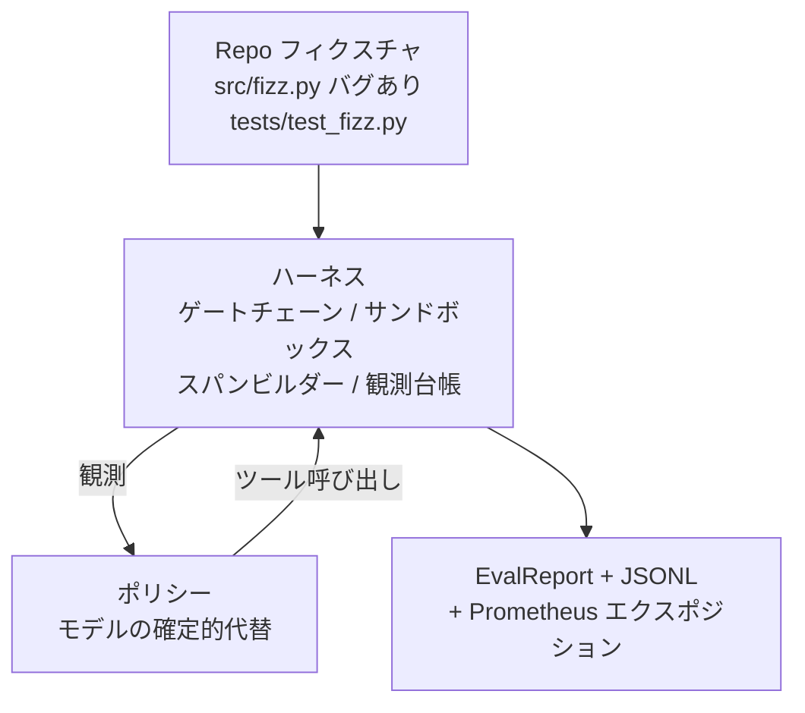
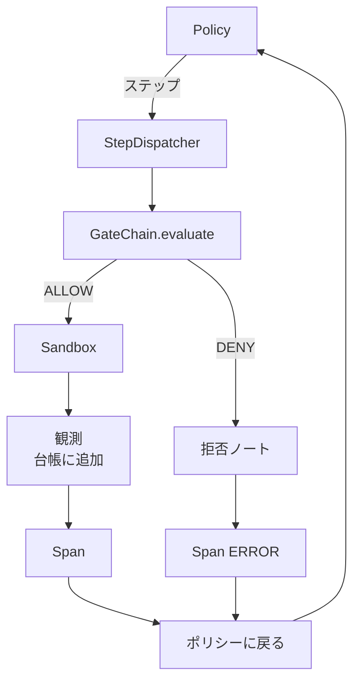

# キャップストーン レッスン29: ハーネス上のエンドツーエンドコーディングエージェント

> トラックAの成果。このレッスンでは、ゲートチェーン・サンドボックス・evalハーネス・OTelスパンを一つの動作するコーディングエージェントに統合します。エージェントは確定的なポリシーであり、LLMではありません。これによりレッスンの再現性が確保され、ハーネスこそが本質だったことが示されます。コントラクトは同一です：実際のモデルはポリシーのシームに差し込めます。


## 学習目標

- ゲートチェーン・サンドボックス・evalハーネス・スパンビルダーを単一のエージェントループに組み合わせる。
- `read_file`、`run_tests`、`write_file` を使ってフィクスチャのバグを修正する確定的ポリシーを実装する。
- エンドツーエンドの実行全体でグローバルステップバジェットと観測トークンバジェットを適用する。
- 完全なOTel GenAIトレースとPrometheusメトリクスをフル実行分として出力する。
- エージェントが合法的なツールへのゲート拒否ゼロで12ステップ以内にフィクスチャを解決することを確認する。

## 問題

多くのエージェントデモは単独で動作します：サンドボックス単体、evalハーネス単体、スパンエミッタ単体。個別にはうまく動きます。組み合わせると継ぎ目が露わになります。

ゲートチェーンはALLOWと判定するが、サンドボックスはチェーンが想定しなかった理由で拒否する。evalハーネスはpassを記録するが、OTelスパンはエージェントが使用したと主張するツールをゲートが拒否したことを示している。Prometheusカウンタは1回だけインクリメントすべきところを2回インクリメントされる。観測バジェットを超えたのにエージェントが動き続けるのは、バジェットがチェーンで追跡されてサンドボックスは知らなかったからだ。

このレッスンはトラック全体の統合テストです。エージェントは順番に4つのことをしなければなりません：プロジェクトを読む、テストを実行する、テスト失敗からバグを特定する、修正を書く、テストを再実行する、そして停止する。全ての操作がゲートチェーンを通過します。全てのツール実行がサンドボックスを通過します。全てのステップがスパンにラップされます。evalハーネスが最後に全体をスコア付けします。

## コンセプト



エージェントのポリシーはステートマシンです。5つの状態があります。

`SURVEY`: エージェントはプロジェクトのリストを読みます。次の状態はRUN_TESTSです。

`RUN_TESTS`: エージェントはテストコマンドを実行します。テストがパスすれば、ステートマシンは成功で停止します。そうでなければ次の状態はINSPECTです。

`INSPECT`: エージェントは失敗したソースファイルを読みます。次の状態はFIXです。

`FIX`: エージェントは修正されたファイルを書きます。次の状態はVERIFYです。

`VERIFY`: エージェントは再びテストコマンドを実行します。テストがパスすれば、成功で停止します。そうでなければ失敗で停止します。

各状態は1つのツール呼び出しに対応します。各ツール呼び出しはゲートチェーンを通過します。ツール呼び出しが拒否された場合、エージェントはトレースに拒否を報告して停止します。

フィクスチャのバグは `fizz.py` のオフバイワンです。確定的ポリシーはテスト失敗メッセージから正規表現でバグを検出し、修正されたファイルを出力します。ポリシーをLLMに置き換えてもハーネスのコントラクトは変わりません。

## アーキテクチャ



このレッスンは自己完結しています。各前レッスンのプリミティブは `main.py` に最小スケールで再実装されています（ゲート、サンドボックス、台帳、スパン）。そのため兄弟モジュールをインポートせずにレッスンが実行できます。名前はレッスン25-28と完全に一致しており、概念的なマッピングが明確です。

## 作成するもの

`main.py` に含まれるもの：

1. レッスン25-28と同じ名前でコピーされた最小ハーネスプリミティブ：`GateChain`、`Sandbox`、`ObservationLedger`、`SpanBuilder`、`MetricsRegistry`。
2. `CodingAgentPolicy` クラス：5つの状態を持つステートマシン。
3. `Repo` ヘルパー：バンドルされたバグ付きフィクスチャを持つスクラッチディレクトリを準備。
4. `AgentRun` クラス：ポリシーを駆動し、ハーネスを通じてディスパッチし、`AgentRunReport` を返す。
5. バンドルされたフィクスチャ（`fixture_repo/`）：src/fizz.py、tests/test_fizz.py、evalハーネス用のexpected/ツリー。
6. デモ：ポリシーをエンドツーエンドで実行し、ステップバイステップのトレースを出力し、パスをアサートし、メトリクスを出力。

バンドルされたフィクスチャはレッスン27のタスク構造と同じ形状です：バグのあるファイルとテストファイル。テスト失敗メッセージには確定的ポリシーが修正を特定するのに十分な情報が含まれています。実際のLLMは同じ作業をより遅く、より広い想起で行いますが、ハーネスの期待値は変わりません。

## ポリシーがLLMでない理由

実際のLLMにはAPIキー、ネットワーク呼び出し、検証不可能な確率的性質が必要です。ハーネスこそがこのレッスンで重要な部分です。確定的ポリシーを使うことで、レッスンは外部依存ゼロで任意の開発者ラップトップ上で実行でき、テストスイートが正確なステップ数をアサートできます。

レッスンのポリシーは、LLMエージェントが行うことの厳密な部分集合です。ポリシーはリポジトリを読み、失敗したテストを見て、行を特定し、修正を出力します。LLMは同じループを同じハーネスコントラクトで実行します。ブックキーピングは同一です。

## デモがアサートすること

エンドツーエンドデモは終了時に5つのことをアサートし、テストスイートはそれらをプログラマティックに再アサートします。

ポリシーは12ステップ以内にフィクスチャを解決した。

観測バジェットは一度も超過しなかった。

合法的なツールへのゲート拒否がゼロ件だった。（エージェントは拒否されたツール名を発明しなかった。）

全てのステップに対応するスパンがtraces.jsonlに存在する。

Prometheusエクスポジションに `tools_called_total{tool="read_file"}` エントリと `tool_latency_ms` ヒストグラムが含まれる。

## トラックAの他の部分との統合

このレッスンは統合です。レッスン25はゲートチェーンを書きました。レッスン26はサンドボックスを書きました。レッスン27はevalハーネスを書きました。レッスン28はオブザーバビリティを書きました。レッスン29はそれらがシステムとして機能することを証明します。実際のエージェントハーネスはここから拡張されます：確定的ポリシーをモデルに交換し、バンドルされたフィクスチャを実際のリポジトリタスクに交換し、JSONLエクスポータをOTLPに交換します。

## 実行方法

```bash
cd phases/19-capstone-projects/29-end-to-end-coding-task-demo
python3 code/main.py
python3 -m pytest code/tests/ -v
```

デモはステップバイステップのトレース、最終evalレポート、Prometheusエクスポジションを出力します。終了コードはゼロです。テストはポリシーの状態遷移、合成ツール呼び出しでのゲート拒否、バンドルされたフィクスチャ上のエンドツーエンド実行、ステップバジェット不変条件をカバーします。
