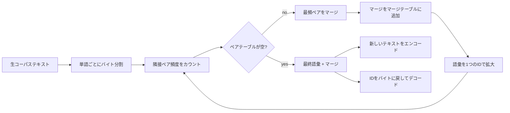
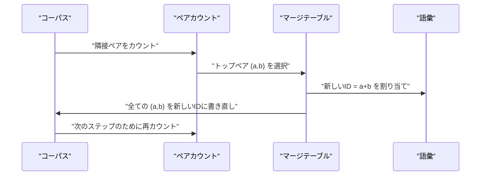

# スクラッチからのBPEトークナイザー

> バイトを入力してIDを出力し、IDを同じバイトに戻す。全ての現代テストモデルが今も使い続けるトークナイザーを構築します。

## 学習目標
- 最も頻繁に隣接するシンボルペアを繰り返しマージすることで、生テキストコーパスからバイトペアエンコーディング語彙を訓練する。
- 確定的なマージテーブルを実装し、新しいテキストに適用してサブワードIDのストリームを生成する。
- 任意のUTF-8入力をIDに変換し、情報損失なく元に戻す。
- 特殊トークン（`<|endoftext|>`、`<|pad|>`）を予約・保護して、訓練とデコードでも維持されるようにする。
- バイトレベルのアルファベットが汎用トークナイザーの適切な基盤である理由を説明する。

## フレーム

言語モデルはテキストを見ません。整数を見ます。文字列を整数のリストに変換してから戻すマップがトークナイザーです。このレイヤーを間違えると、訓練実行の全ての損失曲線が間違ったものを測定することになります。

汎用テキストモデルに対するサブワードトークナイザーの主流ファミリーはバイトペアエンコーディング（BPE）です。アイデアはシンプルです。既知のアルファベットから始める。訓練コーパスで最も頻繁に出現する隣接シンボルペアを見つける。それを新しいシンボルにマージする。語彙が目標サイズに達するまで繰り返す。新しいテキストのエンコードは同じマージリストを同じ順番で再利用します。

バイトレベル変種を構築します。アルファベットはUnicodeコードポイントではなく256個の生バイトです。この選択により、トークナイザーは未知トークンへのフォールバックなしに任意のUTF-8入力を処理できます。

## パイプライン

訓練側と推論側はマージテーブルを共有します。その共有がコントラクトです。推論時にマージ順序を変えると、異なるIDのストリームをデコードすることになります。

## バイトアルファベット

最初の256個のIDは生バイト0x00から0xFFのために予約されています。これにより、マージが行われる前に全ての入力文字列を語彙で表現できることが保証されます。バイトブロックの後、特殊トークンのために小さな範囲を予約します。訓練ループはそれらのIDをマージ対象として提案することはありません。なぜなら、事前トークン化されたストリームからそれらを完全に除外するからです。

事前トークナイザーは、訓練がそれを見る前にコーパスを空白と句読点の境界で分割します。その分割なしに、BPEマージステップは喜んで単語境界をまたぐマージを学習し、語彙は一般的なフレーズ全体で埋まってしまいます。分割があることで、マージは単語内に留まり、結果が汎化されます。

## 訓練ループ

各訓練ステップでループは3つのことをします。コーパスの全ての単語を走査して、各隣接ペアが何回出現するかを、その単語自体の出現頻度で重み付けしてカウントします。最も高いカウントのペアを選びます。そのペアの全ての出現を、語彙の次の空きスロットのIDを持つ単一の新しいシンボルに書き直します。そしてマージを記録します。

各ステップのコストは、シンボルシーケンスのリストとして表現されたコーパスのサイズに線形です。100万単語で目標語彙10000IDの場合、マージが適用されるにつれてシンボルシーケンスが縮小するため、ループは数秒で完了します。

## 新しいテキストのエンコード

推論はマージカウンタを呼び出しません。学習されたのと同じ順序でマージテーブルを適用します。新しい単語について、エンコーダはバイト分割から始めます。現在のシーケンスで最も低いランクのマージ（適用される最も早いもの）をスキャンします。そのマージを実行します。再びスキャンします。テーブル内のいかなるマージも現在のシーケンスに適用できなくなったらループ終了。

ランク順の適用は、エンコードを確定的にし、同じ入力に対して訓練動作と一致させるプロパティです。最初に学習されたマージはテーブルの先頭に座り、最初に適用されます。同じ位置に2つのマージが適用できる場合、低いランクのものが勝ちます。

## 特殊トークン

特殊トークンはバイトストリームが決して生成できないIDです。手動で予約します。このレッスンには2つで十分です。

- `<|endoftext|>` は事前訓練中にドキュメントを区切ります。モデルに「新しいドキュメントがここから始まる、前のドキュメントのコンテキストが漏れないようにせよ」と伝えます。
- `<|pad|>` は短いシーケンスを埋めて、バッチが矩形テンソルになれるようにします。損失マスクは訓練中にそれを隠します。

エンコーダは入力に特殊トークンを許可するフラグを受け入れます。フラグがオフの場合、文字列 `<|endoftext|>` と `<|pad|>` はそれを構成するバイトとしてトークン化されます。フラグがオンの場合、リテラル文字列はその予約IDにマップされ、いかなるマージの対象にもなりません。

## ラウンドトリップ保証

エンコードしてからデコードすると、入力バイトが正確に返されます。デコーダは順番に全IDのバイト展開を連結します。全IDは生バイトか2つの既知IDの連結なので、再帰的な展開は常に生バイトで終了します。デコードはそのバイトが綴るUTF-8文字列を返します。

このレッスンのテストスイートは、未知の文章、Unicodeの絵文字を含む文章、リテラルの `<|endoftext|>` トークンを含む文章でそのプロパティを確認します。

## このレッスンがしないこと

最大の本番トークナイザー方式の正規表現駆動の事前トークナイザーを構築しません。ここの事前トークナイザーは空白と句読点の小さな分割です。小さな訓練コーパスで合理的なマージを生成するのに十分で、残りのレッスンチェーンとのコントラクトは同じです。次のレッスンはトークナイザーをブラックボックスとして扱い、その上にスライディングウィンドウデータセットを構築します。

ペアカウンタを並列化しません。数千単語のコーパス上でPythonのループは1秒以下で完了します。より大きなコーパスでは明らかな方法は単語ごとにペアを並列カウントしてリデュースすることです。

## コードの読み方

`main.py` は4つのオブジェクトを定義します。`BPETokenizer` は語彙、マージテーブル、特殊トークンテーブルを保持します。`train` は訓練ループです。`encode` は推論パスです。`decode` はバイト連結です。下部のデモは組み込みコーパスで小さなトークナイザーを訓練し、ホールドアウト文章をエンコードし、IDをデコードして戻し、両方を出力します。`code/tests/test_bpe.py` のテストはラウンドトリッププロパティ、特殊トークン予約、マージ順序を固定します。

デモを実行してください。次にデモの目標語彙サイズを300から600に変更し、ホールドアウト文章のエンコードされた長さがどのように減少するかを観察してください。その曲線がBPEの圧縮曲線です。
