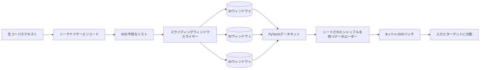
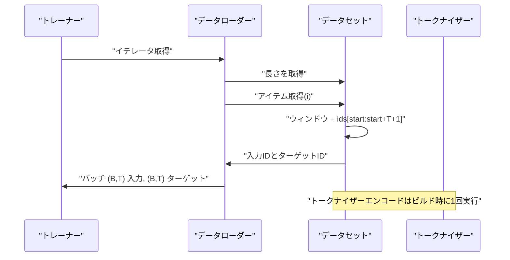

# スライディングウィンドウを用いたトークン化データセット

> 事前訓練の実行はトークンIDから勾配への関数です。このレッスンはIDを供給するコンベアを構築します。

## 学習目標
- トークナイザーを1回呼び出すことで生コーパスをトークンIDのストリームに変換する。
- 設定可能なオーバーラップストライドで固定長ウィンドウにIDストリームをスライスする。
- 次トークン予測のための入力テンソルとターゲットテンソルを返すPyTorch Datasetを構築する。
- エポックごとにシードされた確定的シャッフルを持つDataLoaderでデータセットをラップする。
- ストライド、冗長性、有効データセットサイズのトレードオフについて説明する。

## フレーム

事前訓練の実行は一度に1バッチのトークンIDを読み取り、モデルを更新します。各バッチの形状は訓練コントラクトによって固定されています。因果言語モデルの場合、バッチは `(B, T)` の入力IDと `(B, T)` のターゲットIDを保持し、ターゲットは入力を左に1つシフトしたものです。データパイプラインの仕事は、数ギガバイトの生テキストから構成されるコーパスから、確定的かつ再現可能な方法でそのコントラクトをオンデマンドで生成することです。

このレッスンはそのパイプラインを構築します。前のレッスンのトークナイザーはテキストを長い平坦なIDリストに変換します。スライディングウィンドウはそのリストを訓練サンプルにスライスします。カスタムDatasetがサンプルをテンソルとして公開します。DataLoaderはそれらをバッチ化し、既知のシードでシャッフルします。

## 形状コントラクト

因果言語モデルは形状 `(B, T)` のIDを消費します。ここで `B` はバッチサイズ、`T` はコンテキスト長です。位置 `t` のターゲットは位置 `t+1` の入力です。つまり、全ての訓練サンプルは `T+1` 個の生IDをカバーします。ウィンドウストライドは連続したサンプル間のオーバーラップの量を制御します。

スライサーはコーパスの境界をまたがることはありません。最後のウィンドウが `T+1` 位置を埋めるのに十分なIDがない場合、スライサーはそれを削除します。テールを `<|pad|>` でパディングすることも有効な選択肢ですが、損失マスクが複雑になります。このレッスンでは削除します。

## スライディングウィンドウの理由

事前訓練コーパスはIDの長い1つのストリームです。モデルが非重複ウィンドウだけを見ると、全ての訓練サンプルが同じ `T` 境界を教えることになります。ストライドを調整すると、それらの境界が移動し、モデルはより多様な次トークン予測タスクを見ます。

`T` のストライドは非重複ウィンドウを生成します。`T // 2` のストライドは50%のオーバーラップを生成し、有効データセットを2倍にします。`1` のストライドは最大のオーバーラップを生成し、データセットを `T` 倍にします。コストはエポックあたり多くの計算です。利点はより多くの境界多様性です。ほとんどの事前訓練の実行はコンテキスト長に等しいストライドを使用します。なぜならコーパスはすでに1エポックで終わらせられないほど大きく、境界多様性の議論が弱くなるからです。

## Datasetクラス

PyTorch Datasetには2つの必須メソッドがあります。`__len__` はサンプル数を返します。`__getitem__` は1つのサンプルをテンソルのペアとして返します。私たちのDatasetはエンコードされたIDストリームとストライドを保存します。インデックス付けはウィンドウの開始をオンザフライで計算するため、ストライドが生成するサンプル数に関係なく、メモリコストはIDストリームの1コピーです。

1シフトは `__getitem__` 内で行われます。Datasetは `(input, target)` を返し、`input = window[:-1]`、`target = window[1:]` です。両方ともPyTorchのlongテンソルです。訓練ループはそれらをグラウンドトゥルースとして扱います。

## 確定的シャッフル

`shuffle=True` を持つDataLoaderはPyTorchのランダムジェネレータから読み取ります。エポックごとにシードされた明示的な `torch.Generator` を渡すことで、実行が再起動されるたびに同じシャッフルが得られます。このプロパティは、単一のハイパーパラメータだけが異なる2つの実行を比較したい場合に重要です。シードがなければ、2つの実行は異なる順序でデータを見て、変更と関係のない理由で損失曲線が分岐します。

このレッスンのシードコントラクトはシンプルです。`epoch_seed = base_seed + epoch_index` です。ベースシードは構築時に渡されます。エポックインデックスは各エポックの開始時にトレーナーによってインクリメントされます。同じベースシードでの再実行は常に全エポックで同じ順序を見ます。

## バッチサンプラー

PyTorchのデフォルトサンプラーは、置換なしで均一にランダムにインデックスを選びます。これが事前訓練に必要なものです。小さなデータセットでのファインチューニングでもコントラクトは同じです。DataLoaderは `__getitem__` を `B` 回呼び出して結果をスタックすることでバッチを組み立てます。全てのサンプルは構造上同じ長さなので、パディングロジックは不要です。

このレッスンは簡潔さのために `num_workers=0` を使います。本番の実行ではワーカーが `__getitem__` 呼び出しを並列化します。私たちのパイプラインではほとんどノーオペレーションです。なぜなら作業はインメモリテンソルのスライスに過ぎないからですが、同じDataset APIはワーカーをクリーンにサポートします。

## サンプルのカウント

長さ `N` のIDストリーム、コンテキスト長 `T`、ストライド `S` に対して、サンプル数は `max(0, 1 + (N - (T + 1)) // S)` です。レッスンはその計算をDatasetの静的メソッドとして公開するため、トレーナーはイテレーションせずにエポックあたりの総ステップを計算できます。

## このレッスンがしないこと

ディスクからストリーミングしません。コーパスはメモリに完全にエンコードされ、単一のテンソルとして保持されます。数百万IDのコーパスでは100メガバイト未満で、レッスンに適した形状です。ディスクストリーミングは別の懸念事項であり、ストレージを置き換えることでプラグインできますが、DatasetコントラクトはO変わりません。

複数ドキュメントを扱いません。コーパスは1つの連続したIDストリームとして扱われます。次ドキュメントの境界は、複数ドキュメントからコーパスを構築するときに `<|endoftext|>` IDを挿入することでエンコードされます。モデルは境界周辺を予測することを学びます。

## コードの読み方

`main.py` は2つのクラスと1つのヘルパーを定義します。`SlidingWindowDataset` はPyTorch Datasetです。`make_dataloader` はシードされたジェネレータで設定されたDataLoaderを返します。`_encode_corpus_to_ids` はワンショットのトークナイザー呼び出しです。下部のデモはプロセス内で小さなトークナイザーを構築し、組み込みコーパスをエンコードし、データセットとデータローダーを構築し、1バッチを出力し、形状コントラクトをアサートします。`code/tests/test_dataset.py` のテストはウィンドウカウントの公式、1シフトプロパティ、確定的シャッフル、ストライドトレードオフを固定します。

デモを実行してください。次にコンテキスト長を16から32に変更し、エポックあたりのサンプル数がどのように減少するかを観察してください。その数がエポックあたりのステップバジェットです。
