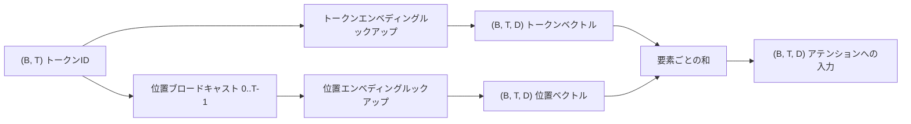
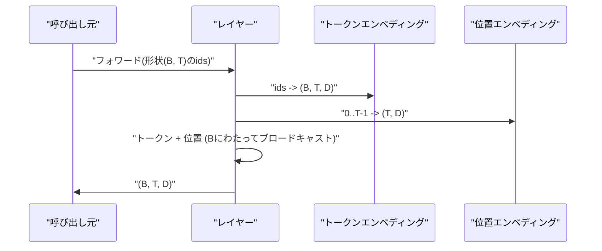

# トークンと位置のエンベディング

> IDは整数です。モデルはベクトルを必要とします。2つのルックアップテーブルがその間に位置し、位置のテーブルの選択がモデルが学習できるものを形作ります。


## 学習目標
- 語彙IDを密なベクトルにマップするトークンエンベディングルックアップテーブルを構築する。
- 位置でインデックス付けされた学習済み位置エンベディングルックアップテーブルを構築する。
- パラメータなしで位置でインデックス付けされた固定のサイン波位置エンベディングを構築する。
- トークンと位置のエンベディングをトランスフォーマーブロックの単一の入力に合成する。
- 長さの汎化とパラメータ数について学習済みとサイン波のエンベディングを比較する。

## フレーム

モデルがトークンIDと最初に接触するのは、トークンエンベディング行列での行ルックアップです。行列は語彙IDごとに1行、モデルの次元ごとに1列を持ちます。ルックアップはモデルの残りの部分がIDの意味として扱うベクトルを返します。バックプロパゲーションはフォワードパスで使用された行にのみ勾配を蓄積します。訓練を通じて、それらの行の幾何学はディレクションに類似性をエンコードすることを学びます。

トークンIDだけでは順序がありません。モデルには、位置1が位置17とは異なることを伝える2番目のシグナルが必要です。そのシグナルの2つの主要な選択肢は、学習済み位置エンベディング（2番目のルックアップテーブル、位置ごとに1行）と固定サイン波位置エンベディング（パラメータなしの数式）です。この選択には結果があります。学習済みテーブルはパラメータであり、モデルが訓練された最大コンテキスト長によって制限されます。サイン波テーブルは理論上はパラメータフリーで、数式は任意の位置に拡張できますが、このレッスンの `SinusoidalPositionalEmbedding` は `max_context_length` で固定テーブルを事前計算し、`forward` はその制限を超えると例外を発生させます。そのため両方のモジュールはここで最大コンテキスト長を適用します。訓練長を超えても、テーブルが十分大きい場合でもモデルは苦労する可能性があります。

このレッスンは両方を構築し、次のレッスンのアテンションブロックのための単一の入力にトークンエンベディングと合成します。

## 形状コントラクト

エンベディングステージへの入力は形状 `(B, T)` のトークンIDのバッチです。出力は形状 `(B, T, D)` のテンソルで、`D` はモデルの次元です。全バッチ要素は同じコンテキスト長 `T` を持ちます。全位置は同じベクトル次元 `D` を持ちます。



合成は連結ではなく和です。和を取ることでネットワーク全体で `D` が一定に保たれ、モデルは各レイヤーで各特徴量ごとにトークンの意味か位置が支配するかを決定できます。

## トークンエンベディング行列

トークンエンベディングは形状 `(V, D)` のパラメータテンソルです。ここで `V` は語彙サイズです。PyTorchはそれを `nn.Embedding(V, D)` として公開します。初期化時にエントリは小さなガウス分布から引かれます。トランスフォーマースケールのモデルでは伝統的に平均ゼロ、標準偏差約 `0.02` です。正確な初期化は実行間で一貫していることよりも重要ではありません。

フォワードパスは単一のインデックス操作です。PyTorchは `(B, T)` int64 IDを行を集めることで `(B, T, D)` floatにマップします。バックワードパスはフォワードパスで触れられた行にのみ勾配を蓄積します。バッチに一度も現れなかった2行はそのステップでゼロ勾配を受け取ります。

微妙な詳細があります。トークンエンベディングとモデルの最後の出力プロジェクションはしばしば重みを共有します（重みタイイング）。その場合、全バックワードパスは出力側を通じてエンベディングの全行に触れます。このレッスンでは両方を別々のモジュールとして公開しますが、フルモデルでは同じ行列が両方の役割を担うことができます。

## 学習済み位置エンベディング

学習済み位置エンベディングは形状 `(max_context_length, D)` の2番目の `nn.Embedding` です。ルックアップは位置ID `0, 1, 2, ..., T-1` でキー付けされます。フォワードパスはその位置ベクトルをバッチ次元全体にブロードキャストします。

学習済みテーブルの欠点は、モデルが位置 `T-1` までしか訓練されていない場合に位置 `T` でクエリできないことです。行が存在しません。このスキームを使用する本番デコーダのみのモデルは、アーキテクチャに最大コンテキスト長を組み込み、より長い入力の処理を拒否します。

## サイン波位置エンベディング

サイン波位置エンベディングは位置からベクトルへの関数です。位置 `p` と特徴 `i` は次を生成します

```python
angle = p / (10000 ** (2 * (i // 2) / D))
emb[p, 2k]     = sin(angle)
emb[p, 2k + 1] = cos(angle)
```

この関数にはパラメータがありません。全ての位置は固有のベクトルを持ちます。波長は特徴次元全体にわたって幾何学的に変化するため、低い次元は粗い位置をエンコードし、高い次元は細かい位置をエンコードします。

`sin` と `cos` を一緒に選択することで得られるプロパティは、位置 `p + k` のベクトルが位置 `p` のベクトルの線形関数であるということです。これにより、アテンション層は相対位置オフセットを学習する簡単なパスを持ちます。モデルは「5トークン後ろを見る」を表現するために別のパラメータを必要としません。

レッスンは構築時に完全なサイン波テーブルを一度計算し、フォワード時にそれにインデックス付けします。

## 合成

入力パイプラインは順番に3つのことをします。トークンIDを読み取る。トークンベクトルを検索する。位置ベクトルを追加する。和を返す。



和ステップのブロードキャストは `(T, D)` 位置テンソルをバッチ次元に沿って複製します。PyTorchはunsqueezeの後に位置テンソルが形状 `(1, T, D)` を持つため自動的にそれを処理します。

## 対比分析

レッスンは同じ入力で両方のバリアントを実行し、2つの診断を出力します。

最初はパラメータ数です。学習済みバリアントはトークンエンベディングの上に `max_context_length * D` パラメータを追加します。サイン波バリアントはゼロを追加します。

2番目は隣接位置間のエンベディングのコサイン類似度です。サイン波バリアントは関数が連続なので滑らかで予測可能な減衰を持ちます。学習済みバリアントは初期化時に行が独立に引かれるためほぼランダムな類似度を持ちます。訓練後、学習済みバリアントは通常同様の滑らかな構造を発展させますが、データからその構造を発見する必要があります。

## このレッスンがしないこと

ロータリー位置エンコーディング（RoPE）またはAliBiを構築しません。それらは本番トランスフォーマーでの最新の選択肢です。両方ともここのエンベディングと同じ形状コントラクト（形状 `(B, T, D)` のベクトルに位置依存の変換を適用する）に従いますが、入力ではなくアテンションプロジェクションステップで適用します。次のレッスンはアテンションブロックを構築し、オプションの拡張の1つはクエリとキーのプロジェクションにロータリーを組み込むことです。

エンベディングを訓練しません。訓練には損失が必要で、損失にはモデルの出力が必要で、それにはアテンションとLMヘッドが必要です。それは次のレッスンとその後のレッスンです。

## コードの読み方

`main.py` は3つのモジュールを定義します。`TokenEmbedding` は `nn.Embedding(V, D)` をラップします。`LearnedPositionalEmbedding` は `nn.Embedding(L, D)` をラップします。`SinusoidalPositionalEmbedding` はテーブルを事前計算してバッファとして公開します。`EmbeddingComposer` はトークンエンベディングと位置エンベディングを結び付けます。下部のデモは形状、パラメータ数、隣接位置類似度の診断を出力します。`code/tests/test_embeddings.py` のテストは形状、ブロードキャスト動作、パラメータ数、サイン波の数式を固定します。

デモを実行してください。次にモデル次元 `D` を64から32に変更し、サイン波の波長帯がどのように変化するかを観察してください。
