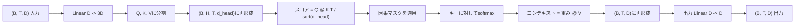
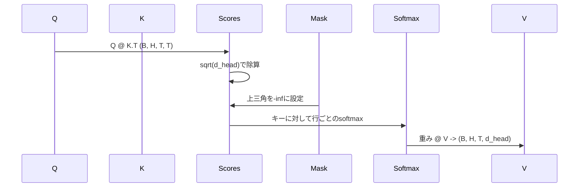

# マルチヘッド自己アテンション

> 1つの線形プロジェクション、3つのビュー、H個の並列ヘッド、1つのマスク。モデルが実際に使うアテンションブロック。

## 学習目標
- バッチ化されたQuery/Key/Valueプロジェクションを、H個のヘッドに分割された単一の線形層として実装する。
- 正しい正規化とデータ型処理を持つスケール付きドット積アテンションを計算する。
- 位置が未来の位置に注目することを防ぐ因果マスクを適用する。
- 固定入力に対してヘッドごとのアテンション重みを検査し、各ヘッドが何を見ているかを説明する。
- おもちゃタスクで小さなアテンションブロックを訓練し、ヘッドが特化するにつれて損失が低下するのを観察する。

## フレーム

アテンションは、トークンの表現が同じシーケンス内の他のトークンから情報を引き出すことを可能にする関数です。自己アテンションは、クエリ、キー、バリューが全て同じ入力から派生することを意味します。マルチヘッドは、プロジェクションがH個の並列アテンション問題に分割され、その出力が連結されて戻すプロジェクションされることを意味します。

効率的な実装パターンは、`D` から `3 * D` にプロジェクションする1つの線形層で、それを3つのビューにスライスし、次に各サイズ `D // H` のH個のヘッドに再形成します。matmul、softmax、重み付き和はバッチ化テンソル演算として行われるため、ヘッドはアクセラレータ上で並列に実行されます。

このレッスンはそのブロックを構築します。また、デコーダのみの言語モデルのアテンション層と同じコードが機能するように因果マスクも追加します。次のレッスンはブロックをフルトランスフォーマーにスタックし、その次のレッスンはそれを訓練します。

## 形状コントラクト

入力は `(B, T, D)` です。出力は `(B, T, D)` です。マスクは `(T, T)` またはブロードキャスト可能です。ブロック内の中間テンソルは形状 `(B, H, T, d_head)` を持ちます。ここで `d_head = D // H` です。制約は `D % H == 0` です。

2つの線形層（QKVプロジェクションと出力プロジェクション）がブロック内の唯一のパラメータです。マスク、softmax、matmul、再形成は全てパラメータフリーです。

## QKV分割

ナイーブな実装にはQ、K、V用に3つの別々の線形層があります。効率的なものは `3 * D` 特徴を出力する単一の層を持ち、結果を分割します。この2つは数学的に等価です。なぜなら `(D, D)` 重みによる3つの別々の行列積は、それらを積み重ねた `(3D, D)` 重みによる1つの行列積と全く同じだからです。

効率的バージョンは、アクセラレータが3つではなく1つのmatmulを起動するためより高速です。また、3つのサブ行列が同じパラメータテンソルに存在し一緒に初期化できるため、初期化も簡単です。

## ヘッドの再形成

分割後、Q、K、Vはそれぞれ `(B, T, D)` です。これをH個の並列アテンション問題に変えるために、`(B, T, H, d_head)` に再形成して `(B, H, T, d_head)` に転置します。ヘッド次元がバッチ次元の隣に来るため、PyTorchはヘッドごとのアテンションを `B * H` 個の独立なインスタンスにわたるバッチ化演算として扱います。

d_head次元が最後に残るため、スコアmatmul `Q @ K.transpose(-2, -1)` がそれを縮約します。結果はヘッドごとのアテンションスコア `(B, H, T, T)` です。

## スケーリング

スコアはsoftmaxの前に `sqrt(d_head)` で除算されます。このスケーリングがなければ、ドット積は `d_head` が大きくなるにつれて増大し、softmaxが1つのエントリにほぼ全ての質量があり他はほぼゼロのレジームにプッシュされます。そのレジームでの勾配は小さく、学習が停止します。`sqrt(d_head)` で除算することでヘッドサイズが変わっても分散がほぼ一定に保たれます。

## 因果マスク

デコーダのみの言語モデルは、次のトークンを予測するとき過去のみに条件付けできます。マスクはそれを強制します。具体的には、softmaxの前に `(T, T)` スコア行列の対角線より上の全エントリが負の無限大に置き換えられます。softmaxの後、それらの位置は重みゼロを取得します。

マスクをバッファとして構築時に登録することで、モデルと同じデバイスに存在し、勾配グラフの一部でなくなります。マスクはブロックが見る最大コンテキスト長をカバーします。フォワード時に左上 `(T, T)` コーナーをスライスします。

## 出力プロジェクション

ヘッドごとのコンテキストベクトル `(B, H, T, d_head)` の後、`(B, T, H, d_head)` に転置して戻し、`(B, T, D)` に再形成し、最後に `(D, D)` の線形プロジェクションを適用します。出力プロジェクションによりモデルはヘッドを混合できます。これがなければ、H個のヘッドは後のレイヤーを通じてのみ再結合でき、ブロックは人為的に制限されます。

## アテンション重みの検査

レッスンはフォワードパスに `return_weights=True` フラグを公開します。設定されると、ブロックは出力と並んでヘッドごとのアテンション重みを形状 `(B, H, T, T)` で返します。デモは短い入力で1つのヘッドの重みのヒートマップを出力するため、因果三角形構造と位置ごとのフォーカスを見ることができます。

訓練済みモデルでは、異なるヘッドは異なるパターンを学習します。いくつかのヘッドは直前のトークンに注目します。いくつかのヘッドはシーケンスの先頭に注目します。いくつかのヘッドはほぼ均一にアテンションを広げます。検査フックはその解釈可能性作業へのエントリポイントです。

## 訓練デモ

`main.py` 下部のデモはアテンションブロックを小さなLMヘッドに接続し、繰り返しタスクで全体を訓練します。入力の各行はコンテキスト全体で複製された単一のランダムIDです。ターゲットは1シフトされた入力なので、モデルは次のトークンが前のトークンと同じであることを学ばなければなりません。損失はクロスエントロピーです。H=4、D=32、T=12、語彙64で、損失はCPU上で3エポックにわたってランダム（約 `log(64) ~ 4.16`）から `1.0` 未満にまで低下します。

デモのポイントは有用なモデルを訓練することではありません。ポイントは勾配がブロックの全ての部分を流れ、答えが明らかな問題でヘッドが何かを学ぶことを確認することです。

## このレッスンがしないこと

フィードフォワードブロックを追加しません。実際のモデルのトランスフォーマー層はアテンションの後に2層のMLPが続き、それぞれの周りに残差接続とLayer Normが付いています。次のレッスンはそれらを追加します。

ロータリーやAliBiの位置エンコーディングを実装しません。両方とも同じブロックのQKVプロジェクションステップで適用されますが、別の教育ユニットです。ここで構築されたブロックは、matmulの前にQとKを変換することでどちらとも互換性があります。

推論のためのKVキャッシュを実装しません。フォワードパス全体でキーとバリューをキャッシュすることは、自己回帰デコードを高速化する最適化です。KとVテンソルの形状コントラクトを変更しますがQは変更しません。推論レッスンに属します。

## コードの読み方

`main.py` は `MultiHeadSelfAttention` を定義します。クラスは2つの線形層と登録されたマスクバッファを保持します。フォワードパスはプロジェクション、再形成、スコア付け、マスキング、softmax、重み付け、再形成、再プロジェクションを行います。下部のデモはアテンションをトークンおよび位置エンベディングとLMヘッドでラップした小さなモデルを構築し、コピータスクで3エポック訓練し、損失曲線とヘッドごとのアテンションヒートマップを出力します。`code/tests/test_attention.py` のテストは形状コントラクト、因果性プロパティ、softmaxプロパティ、ヘッド分割プロパティ、勾配フローを固定します。

デモを実行してください。次に `n_heads` を4から8に増やし（`d_model=32` を維持するため `d_head=4`）、ヒートマップがどのように変わるかを観察してください。
