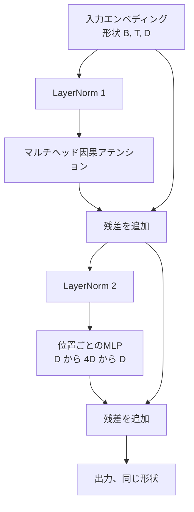
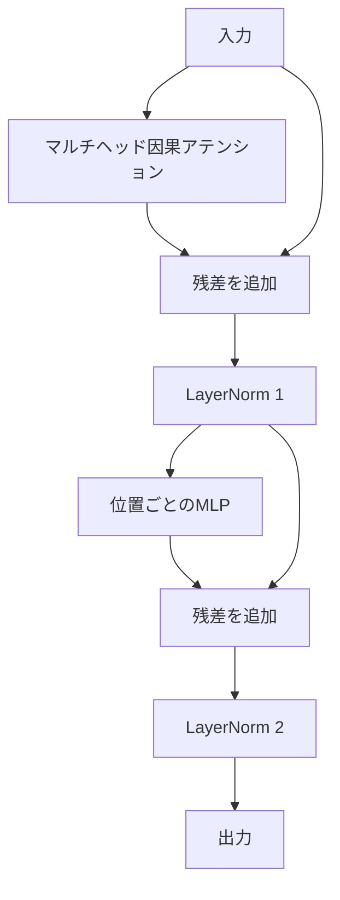

# スクラッチからのトランスフォーマーブロック

> 1つのブロックは全ての現代デコーダLLMの単位です。Layer Norm、マルチヘッドアテンション、残差、MLP、残差。pre-LNバリアントはウォームアップなしで安定して訓練されます。post-LNバリアントは元の論文が採用したものです。このレッスンは両方を並べて構築し、一般的な学習率での12層スタックでどちらが生き残るかを示します。


## 学習目標

- 4つの動く部品（LayerNorm、マルチヘッド因果アテンション、残差接続、位置ごとのMLP）からPyTorchでトランスフォーマーブロックを構築する。
- LayerNormを2つの設定（pre-LNとpost-LN）に配置し、なぜ一方がウォームアップなしで安定して訓練されるかを説明する。
- マルチヘッドアテンション内に因果マスキングを実装し、トークン `i` がトークン `j > i` を見られないようにする。
- 12層スタックの両方のバリアントで勾配フローを追跡し、誤魔化しなしに結果を読む。
- 次のレッスンが1億2400万パラメータのGPTを組み立てるときにブロックをドロップイン単位として再利用する。

## 問題

トランスフォーマーは1つのブロックを繰り返したものです。ブロックを一度間違えて12回繰り返すと、最初のエポックで発散するか、残りをウォームアップハックが必要なモデルを出荷することになります。このレッスンで見る2つの失敗モードは珍しくありません。学習者がブロックをナイーブにスタックするときに最初に現れます。一方はアテンション層が未来を参照すること。もう一方はLayerNormが深さでの残差シグナルを制御できない場所に配置されることです。

修正は一度見れば機械的です。ブロックにはちょうど2つの残差パスとちょうど2つの正規化位置があります。位置を正しく選択すれば、スタックの残りはブックキーピングに過ぎません。

## コンセプト

全てのデコーダのみトランスフォーマーブロックは、形状 `(batch, sequence, embedding)` のテンソルを受け取り、同じ形状のテンソルを返す関数です。内部では2つのサブ層が作業を行います。



これがpre-LNバリアントです。LayerNormは残差ブランチ内、サブ層の前に座っています。残差接続は非正規化シグナルを前方に運びます。

post-LNバリアントはLayerNormを残差加算の後に移動させます。



形状は同一です。訓練動作は同一ではありません。post-LNでは、残差パスを逆伝播する勾配はLayerNormを通過する必要があります。深さ12と学習率 `3e-4` では、その勾配はウォームアップスケジュールが必要なほど速く縮小します。pre-LNは残差パスを非正規化のままにするため、勾配はエンベディング層にきれいに伝播します。pre-LNはGPT-2以降がその理由で採用する設定です。

### 因果マルチヘッドアテンション

アテンションサブ層は入力をクエリ、キー、バリューテンソルの3方向にプロジェクションします。それぞれは `(B, T, D)` から `(B, H, T, D/H)` に再形成されます。ここで `H` はヘッド数です。スケール付きドット積アテンションはヘッドごとに `softmax(Q K^T / sqrt(d_k))` を計算し、上三角を負の無限大にマスクし、softmaxを介してマスクを適用し、`V` で乗算します。ヘッドは単一の `(B, T, D)` テンソルに連結し直され、もう一度プロジェクションされます。マスクがモデルを因果的にする唯一の部品です。マスクを忘れるとズルをするモデルを訓練することになります。

### MLP

位置ごとのMLPはトークンごとに独立して同じ2層ネットワークを適用します。隠れ幅はエンベディング幅の4倍、活性化はGELU、ドロップアウトが2番目の線形の後に続きます。MLP内でトークンが互いに対話することはありません。全てのトークン混合はアテンションで行われます。

### 残差接続は2つのことをする

勾配パスを深さを超えて加法的にします。これにより12層を通じて勾配ノルムがスケールに保たれます。また、各ブロックが完全な置き換えではなく実行中の表現への加法的更新を学習できるようにします。両方の効果がブロックがスケールする理由です。

## 実装する

`code/main.py` は実装します：

- `class LayerNorm`：学習可能なスケールとシフト、バイアス付きeps、トークンベクトルごとに適用。
- `class MultiHeadAttention`：`num_heads`、`head_dim = d_model // num_heads`、融合QKVプロジェクション、登録された因果マスク、アテンションと残差ドロップアウト。
- `class FeedForward`：2つの線形層、GELU活性化、ドロップアウト。
- `class TransformerBlock`：2つのバリアントを切り替える `pre_ln` フラグ付き。
- 6層のpre-LNスタックと6層のpost-LNスタックを同一入力で構築し、(a)出力形状、(b)1回のバックワードパス後のエンベディングでの勾配ノルムを出力するデモ。

実行：

```bash
python3 code/main.py
```

出力：両スタックの形状チェック、並べた勾配ノルム。pre-LNスタックのエンベディング勾配は同じ学習率でpost-LNスタックより桁違いに大きく、これがpre-LNがウォームアップなしで訓練される経験的シグナルです。

## スタック

- テンソル計算、自動微分、`nn.Module` 配管のための `torch`。
- `transformers` なし、事前訓練重みなし。ブロックはプリミティブから実装されます。

## 実際の本番パターン

3つのパターンが教科書のブロックを出荷できるものに変えます。

**融合QKVプロジェクション。** 3つの別々の線形層は3つのカーネル起動と3つのmatmulのコストがかかります。幅 `3 * d_model` の1つの線形層は同じ作業を1回の起動でこなし、次に出力を最後の軸に沿って分割します。融合パスはGPT-2、LLaMA、Mistralの参照実装が全て採用するように、全てのアクセラレータで高速です。

**登録された因果マスクバッファ。** マスクは最大コンテキスト長にのみ依存します。構築時に `register_buffer` で一度割り当て、フォワードパスごとにアクティブウィンドウをスライスし、呼び出しごとの割り当てをスキップします。これを忘れると長いコンテキストでマスクがアロケータのホットスポットになります。

**2か所のドロップアウト、3か所でなく。** ドロップアウトはアテンションsoftmaxの後（アテンションドロップアウト）とMLPの2番目の線形の後（残差ドロップアウト）に属します。残差自体へのドロップアウトは深さでの勾配フローを可能にする加法的アイデンティティを壊します。初期の実装の中にはこれを間違えて脆い訓練を代償として払ったものもありました。

## 使ってみる

- このレッスンのブロックはレッスン35のGPT組み立てにそのまま修正なしに差し込まれます。
- pre-LNバリアントは全ての現代オープンウェイトLLMが使用するものです。post-LNバリアントは元の2017年のアテンション論文が使用し、ウォームアップが必要でした。両方を知ることで、遭遇するあらゆるデコーダアーキテクチャを読むのに十分です。
- GELUをSiLUに交換するとLLaMAファミリーの活性化が得られます。LayerNormをRMSNormに交換するとLLaMAファミリーの正規化が得られます。同じスケルトンです。

## 演習

1. ブロックの全ての線形に `bias=False` フラグを追加してください。現代のオープンウェイトLLMは線形層にバイアスなしで出荷されています。12層768次元モデルで節約されるパラメータ数を計測してください。
2. `nn.LayerNorm` を手書きのRMSNormに置き換えて、出力形状が変わらないことを確認してください。
3. 最初のヘッドのアテンション重みを `(B, T, T)` テンソルとして返すフラグを追加してください。上三角をプロットしてsoftmaxの後にゼロであることを確認してください。
4. `(2, 16, 384)` テンソルを `H=6` で両バリアントに通して、フォワード出力が異なることをアサートするサニティチェックを構築してください（重みが同一に初期化されドロップアウトがゼロの場合、例えば `not torch.allclose`）。

## キーワード

| 用語 | 人々が言うこと | 実際の意味 |
|------|--------------|----------|
| Pre-LN | 「プレノーム」 | LayerNormが各サブ層の前に残差ブランチ内にある。残差は非正規化シグナルを運ぶ |
| Post-LN | 「ポストノーム」 | LayerNormが残差加算の後。2017年の論文が採用し、ウォームアップが必要 |
| 因果マスク | 「三角マスク」 | アテンションロジットの上三角がiがjより大きい場合にトークンiがトークンjを読めないように負の無限大に設定される |
| 融合QKV | 「結合プロジェクション」 | 幅Dの3つの線形ではなく幅3Dの1つの線形。1つのカーネル、1つのmatmul |
| 残差ストリーム | 「スキップ接続」 | 各ブロックが加算する非正規化テンソルが全ブロックを上から下へ流れる |

## 参考資料

- フェーズ7 レッスン02（スクラッチからの自己アテンション）：このブロックの下にあるアテンション計算について。
- フェーズ7 レッスン05（フルトランスフォーマー）：同じスケルトンのエンコーダデコーダバージョンについて。
- フェーズ10 レッスン04（ミニGPTの事前訓練）：このブロックが差し込まれる訓練手順について。
- フェーズ19 レッスン35（このトラック）：これらのブロックを12個スタックしてGPTモデルにする。
