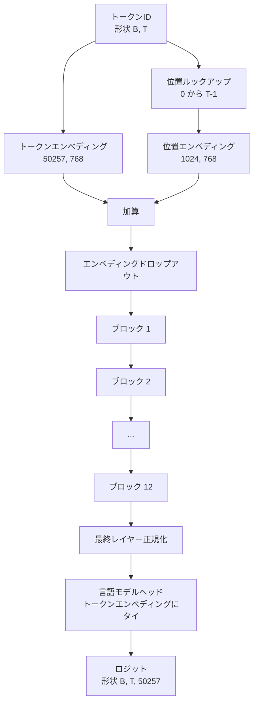
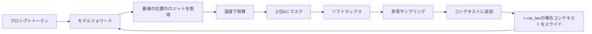

# GPTモデルの組み立て

> 12ブロックのスタック、トークンエンベディング、学習済み位置エンベディング、最終LayerNorm、タイされた言語モデルヘッド。それが1億2400万パラメータのGPTモデル全体です。このレッスンはこれらのピースを動作するクラスに組み立て、モデルが参照124M形状と一致することを確認するためにパラメータを数え、多項サンプリング・温度・top-kでテキストを生成します。


## 学習目標

- レッスン34のトランスフォーマーブロックをフルGPTモデルに組み立てる：トークンエンベディング、位置エンベディング、Nブロック、最終LayerNorm、言語モデルヘッド。
- 1億2400万パラメータの設定を再現する：語彙50257、コンテキスト1024、エンベディング768、12ヘッド、12層。
- 言語モデルヘッドの重みをトークンエンベディングにタイして、このスケールで約3800万パラメータを節約する理由を説明する。
- 多項サンプリング・温度スケーリング・top-k切り捨てを用いてプロンプトからテキストを生成し、スライディングウィンドウでコンテキスト長を保持する。
- パラメータ数とフォワードパスのコストを124Mの目標と比較する。

## 問題

トランスフォーマーブロック単独では何もしません。トークンIDをベクトルに変換し、位置情報を混合し、スタックを通して実行し、語彙ロジットに戻してプロジェクションする必要があります。この4つのステップのうちどれかを忘れると、モデルはフォワードに失敗するか、位置情報が漂うか、喋れなくなります。

モデルの形状も重要です。参照のGPT-2 smallは上記の設定で正確に1億2400万パラメータです。数字は魔法ではありません。語彙50257×エンベディング768がトークンテーブルです。位置1024×768が位置テーブルです。12ブロックがそれぞれ約700万パラメータで8400万です。最終ヘッドは重みタイイングによりトークンテーブルを再利用します。ピースを合計すると1億2400万になります。参照と一致しないパラメータ数を持つモデルを構築することは、何か間違った配線のサインです。

## コンセプト



トークンIDはトークンベクトルになります。位置IDは位置ベクトルになります。2つが加算されてスタックに送られます。最終LayerNormはブロック外にある唯一の部品で、全ての現代バリアントに存在します。LMヘッドはトークンエンベディング行列を再利用します。これが重みタイイングの意味です。

### 重みタイイング

トークンエンベディングは形状 `(vocab, d_model)` を持ちます。言語モデルヘッドは `d_model` から `vocab` にプロジェクションする必要があります。これらは互いの転置です。2つをタイすることは文字通り同じパラメータテンソルを2回使用することを意味します。語彙50257とd_model 768で、行列は3800万パラメータです。タイなしでは2回支払います。タイすると1回支払い、エンベディングとヘッドが一緒に更新されるためわずかにクリーンな勾配シグナルも得られます。

### 位置エンベディングは学習済みであり、サイン波ではない

GPT-2は学習済み位置エンベディングを採用しています。位置テーブルは形状 `(1024, 768)` の1つのパラメータテンソルです。モデルは全てのフォワードで位置0からT-1をルックアップし、ルックアップをトークンエンベディングに加算します。これは位置スキームの中で最もシンプルで（RoPE、AliBi、T5相対バイアスが代替案）、124M参照が使用するものです。

### 生成：温度、top-k、多項

生成は自己回帰的です。各ステップでモデルは全ての位置の全語彙に対するロジットを返します。最後の位置のみを取り、温度で除算し、オプションで上位k個以外のロジットを負の無限大にマスクし、softmaxで確率を得て、結果の分布から1トークンをサンプリングします。



3つのノブ、3つの異なる動作。温度がゼロに近いと貪欲になります。温度1はモデルの自然な分布と一致します。top-k 1は貪欲です。top-k 40はロングテールをフィルタします。組み合わせが重要で、次の訓練レッスンは定性的eval信号として生成を使用します。

## 実装する

`code/main.py` は実装します：

- `class GPTConfig` データクラス：124Mのデフォルト：`vocab_size=50257`、`context_length=1024`、`d_model=768`、`num_heads=12`、`num_layers=12`、`mlp_expansion=4`、`dropout=0.1`、`use_bias=True`、`weight_tying=True`。
- `class GPTModel`：トークンエンベディング、位置エンベディング、エンベディングドロップアウト、12の `TransformerBlock`、最終LayerNorm、フラグが設定されている場合にトークンエンベディングにタイする `lm_head`。
- 重みタイイングを考慮して固有パラメータ数を返す `count_parameters` ヘルパー。
- 温度、top-k、多項、スライディングウィンドウコンテキストを行う `generate` 関数。
- モデルを構築し、パラメータ数を参照124Mの隣に出力し、固定プロンプトから短いシーケンスを生成してパイプラインのエンドツーエンドを示すデモ。

実行：

```bash
python3 code/main.py
```

出力：124M参照の隣のパラメータ数、ランダムプロンプトからの生成されたトークンID、タイイングがオンの場合にLMヘッドとトークンエンベディングがストレージを共有していることの確認。

デモを高速に保つために、スクリプトは小さな設定（`d_model=64`、`num_layers=2`）もエンドツーエンドで実行し、生成されたトークンシーケンスをインラインで出力します。124M設定は構築されますが、そのパラメータ数と1回のフォワードパスのみが実行されます。

## スタック

- テンソル計算、自動微分、モジュール配管のための `torch`。
- `code/main.py` はレッスン34と同じブロックパターンをローカルで再実装します。

## 実際の本番パターン

実行するモデルと出荷するモデルの違いを生む3つのパターン。

**残差プロジェクションを小さく初期化する。** アテンションの出力プロジェクションとMLPの2番目の線形はどちらも残差加算に直接フィードします。それらを他の全ての線形と同じ標準偏差で初期化すると、残差ストリームが深さとともに成長し、最終LayerNormをホットなレジームに押し込みます。それら2つのプロジェクションのstdを `1 / sqrt(2 * num_layers)` でスケールする。残差ストリームは12層を通じてサニーな範囲に留まります。

**位置IDテンソルをキャッシュし、再計算しない。** `torch.arange(T)` は全フォワードで新しいメモリを割り当てます。`__init__` で最大コンテキスト用に一度割り当て、呼び出しごとに最初のTエントリをスライスし、アロケータラウンドトリップをスキップします。

**パラメータレベルで重みをタイし、コピーしない。** `lm_head.weight = token_embedding.weight` と設定することでテンソルを共有します。コピーはしません。オプティマイザーは1つのパラメータを更新する必要があり、自動微分グラフは1つの累積が必要です。コピーした場合、ヘッドはエンベディングから離れ、重みタイイングは何も買いません。

## 使ってみる

- このレッスンのモデルクラスは次のレッスンが訓練するものと同じ形状です。
- 学習済み位置エンベディングをRoPEに置き換えると、ブロックやヘッドに触れることなくLLaMAファミリーが得られます。
- GELUをSiLUに置き換えてLayerNormをRMSNormに置き換えると残りのLLaMAファミリーの変更が得られます。
- 生成関数はこのモデルだけでなく任意のロジットソースで機能します。レッスン37の事前訓練済みGPT-2ファイルからロジットを引き出して同じ生成ループを再利用できます。

## 演習

1. LMヘッドをトークンエンベディングからタイを外してパラメータを数え直してください。デルタが50257×768 = 3800万であることを確認してください。
2. 学習済み位置エンベディングを構築時に計算されたサイン波テーブルに置き換えてください。モデルが依然としてフォワードし、パラメータ数が786,432減少することを確認してください。
3. 生成に `greedy=True` フラグを追加し、サンプリングをスキップしてargmaxを選択するようにしてください。シーケンスが実行間で確定的であることを確認してください。
4. 生成の前にsoftmaxで定数で割ることでプロンプトまたは生成履歴内のトークンのロジットを除算する `repetition_penalty` ノブを追加してください。1以上の値が出力での繰り返し数を減らすことを固定プロンプトで示してください。
5. `top_k` の隣に `top_p`（ニュークレウス）サンプリングを追加してください。保持されたトークンの確率の合計が `top_p` を超えることの2行チェック。

## キーワード

| 用語 | 人々が言うこと | 実際の意味 |
|------|--------------|----------|
| 重みタイイング | 「タイされたエンベディング」 | LMヘッドとトークンエンベディングが同じパラメータテンソルを共有。vocab×d_modelパラメータを節約しGPT-2参照と一致 |
| 位置エンベディング | 「学習済み位置」 | コンテキスト長×d_modelの形状の別テーブルがトークンベクトルに加算。エンドツーエンドで学習 |
| スライディングウィンドウコンテキスト | 「コンテキストキャップ」 | プロンプト+生成されたトークンがコンテキスト長を超えると、アクティブウィンドウが収まるように最古のトークンを削除 |
| Top-kサンプリング | 「K切り捨て」 | 最も高い値のKロジットを保持し、残りを負の無限大にマスクし、残りのsoftmax |
| 温度 | 「サンプリング温度」 | softmaxの前にロジットをTで除算。T < 1は貪欲に向けてシャープ化。T = 1は自然な分布を保持。T > 1はフラット化 |

## 参考資料

- フェーズ19 レッスン34：このモデルがスタックするブロック。
- フェーズ19 レッスン36：このモデルを駆動する訓練ループ。
- フェーズ19 レッスン37：このアーキテクチャへの事前訓練済みGPT-2重みのロード。
- フェーズ7 レッスン07（GPT因果言語モデリング）：次トークン予測の計算。
- フェーズ10 レッスン04（ミニGPTの事前訓練）：同じアーキテクチャの元の訓練手順。
