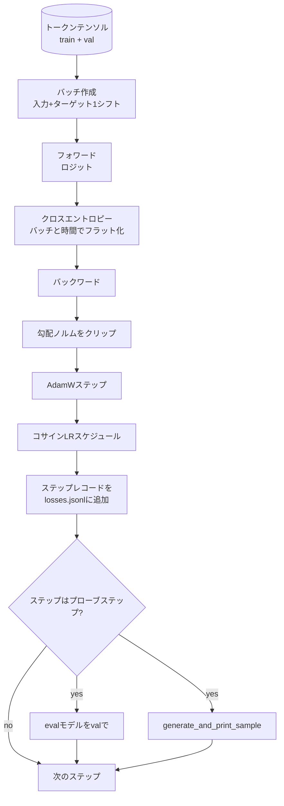

# 訓練ループと評価

> 測定しないループは嘘をつくループです。このレッスンはGPTモデルを駆動する訓練ループを構築します：重み減衰分割を持つAdamW、ウォームアップ+コサイン学習率スケジュール、`calc_loss_batch` ヘルパー、ホールドアウトデータの `evaluate_model` パス、K ステップごとの `generate_and_print_sample` 定性プローブ、そして後でプロットできる損失のJSONLログ。同じスケルトンが構築する全てのデコーダLLMを訓練します。


## 学習目標

- 次トークン予測のための正しい入力とターゲットのアライメントでクロスエントロピー損失を計算する訓練ループを構築する。
- 重み減衰をLayerNormやバイアステンソルではなく重みテンソルに適用するようにAdamWを設定する。
- 線形ウォームアップとコサイン減衰を持つ学習率スケジュールを実装し、時間に対する学習率を読む。
- `evaluate_model` でホールドアウト分割を評価し、実行間でeval損失が比較可能にする。
- `generate_and_print_sample` で K ステップごとに定性サンプルを生成して、損失曲線より前に発散を検出する。
- ステップごとの損失をJSONLに保持して、リロード・プロット・訓練ログを成果物として出荷できるようにする。

## 問題

損失を出力するだけで他には何もしない訓練スクリプトは3つの方法で失敗します。損失が正しい理由で減少しているかどうかがわかりません（モデルが訓練セットをオーバーフィットして決して学習しない可能性があります）。発散が始まっているかどうかがわかりません（損失は1ステップでスパイクして回復するか、1ステップでクラッシュする可能性があります）。モデルが何を学んだかがわかりません（損失はスカラーですが、生成サンプルはパラグラフです）。測定しなければ3つの失敗全てが隠れます。

このレッスンのループは3つの方法で測定します。全ステップでの訓練バッチの損失。K ステップごとのホールドアウトバッチの損失。K ステップごとの固定プロンプトからの生成継続。訓練ログはJSONLに記録され、アーティファクトはループの証言になります。

## コンセプト



2つの非自明な部分は損失アライメントとAdamW減衰分割です。

### 損失アライメント

モデルは全ての位置で次のトークンを予測します。入力バッチがトークン `[t0, t1, t2, t3]` の場合、ターゲットバッチは `[t1, t2, t3, t4]` でなければなりません。クロスエントロピーは平坦な形状 `(batch * seq, vocab)` と平坦なターゲット `(batch * seq,)` で計算されます。シフトを忘れると自分自身を予測するようにモデルを訓練することになり、損失はゼロに収束しながら有用なことを何も学びません。

### AdamW減衰分割

重み減衰は重みテンソルを正則化しますが、正規化スケールやバイアスは正則化しません。LayerNormスケールに減衰を置くとスケールがゆっくりゼロに向かい正規化が壊れます。バイアスに減衰を置くことは数学的には無害ですが無駄なサイクルです。標準の分割は：行列形状のテンソル（線形重み、エンベディングテーブル）は減衰を受け、スケールやシフトのように見えるものは受けません。

### ウォームアップ+コサインスケジュール

ウォームアップは数百ステップにわたって学習率をゼロから目標値にランプアップし、オプティマイザーの状態が定着する時間を与えます。コサイン減衰は残りのステップにわたって学習率をゼロ近くに戻し、最終フェーズが小さいステップサイズで重みをファインチューニングします。この組み合わせはオープンウェイトLLM訓練で最も一般的なスケジュールです。なぜなら最初の千ステップと最後の千ステップの脆弱な瞬間のほとんどを排除するからです。

### ホールドアウト評価

`evaluate_model` は検証分割から固定数のバッチを実行し、損失を蓄積し、バッチ数で割り、返します。勾配なし。ドロップアウトなし。同じシードと同じ分割を使えば実行間で再現可能です。訓練損失の隣にホールドアウト損失を報告することがオーバーフィットを発見する方法です。

### 早期シグナルとしての定性サンプリング

訓練損失が良く低下するがサンプルが全て同じトークンのモデルは壊れています。損失曲線が平坦に見えるがサンプルが一貫した単語にシャープ化しているモデルは学習しています。定性プローブはフル曲線を読むより速く、スカラーが見逃すモードを検出します。

## 実装する

`code/main.py` は実装します：

- `make_batches(token_ids, batch_size, context_length)`：長いトークンテンソルを入力とターゲットのペアにスライスする。
- `calc_loss_batch(model, inputs, targets)`：フォワードし、フラット化し、スカラーのクロスエントロピーを返す。
- `evaluate_model(model, val_loader, max_batches)`：grad_noで固定数の検証バッチをイテレートして平均損失を返す。
- `generate_and_print_sample(model, prompt, max_new_tokens)`：固定プロンプトでレッスン35の生成関数を実行して結果を出力する。
- `build_param_groups(model, weight_decay)`：2グループのAdamWパラメータリストを生成する。
- `cosine_with_warmup(step, warmup_steps, total_steps, max_lr, min_lr)`：与えられたステップでのLRを返す。
- `train(...)`：ループを実行し、`outputs/losses.jsonl` を保持し、`eval_every` ステップごとにeval損失とサンプルを出力する。
- 合成データで少数ステップ小さなモデルを訓練し、JSONLログを書き、プローブポイントでeval損失とサンプルを出力するデモ。CPU上で1分未満で実行されます。

実行：

```bash
python3 code/main.py
```

出力：ステップごとの損失行、プローブステップごとのeval損失、プローブステップごとの生成サンプル、`json.loads` で行ごとにロードできる最終的な `outputs/losses.jsonl`。

## スタック

- 自動微分、オプティマイザー、モジュールのための `torch`。
- `main.py` はレッスン35の `GPTModel` とサポートモジュールをローカルで再実装します。

## 実際の本番パターン

テキスト学習ループをまま一晩実行できるものに変える3つのパターン。

**勾配ノルムクリッピングは交渉不可能。** 悪いバッチ（異常なデータ、LRスパイク、数値エッジケース）は何時間もの訓練を消し去る巨大な勾配を生成します。`backward` の後、`step` の前に `torch.nn.utils.clip_grad_norm_(params, max_norm=1.0)` がオプティマイザーを安全な範囲に保ちます。クリッピング値は自由パラメータです。1は多くのセットアップで生き残るデフォルトです。

**再開可能なJSONLログ、ピクルのstateではなく。** ステップごとの損失レコードを `{"step": int, "train_loss": float, "lr": float}` 行としてJSONLに記録することは耐久性があります：クラッシュで読めるアーティファクトが残り、grepでき、30行のPythonでプロットでき、最後のステップを読むことで訓練を再開できます。ピクルのstateはそれを生成した正確なモジュールレイアウトに縛られ、リファクタリングをまたいで脆弱です。

**固定スライスから引かれるevalバッチ。** 検証トークンはオンザフライではなくスクリプト開始時にバッチにスライスされます。再現性は実行間でevalバッチが同一であることに依存します。そうでなければ2つの実行間のeval損失の比較はモデルと同様にバッチシャッフルも測定します。

## 使ってみる

- このレッスンのループは実際のデータで124Mモデルを訓練するのと同じスケルトンです。合成トークンテンソルを `datasets` スタイルのローダーに交換するとループは変わらず実行されます。
- JSONLログは訓練実行を証拠に変える成果物です。次のレッスンはそれを使って新しく訓練されたチェックポイントと事前訓練済みのものを比較します。
- 定性サンプルプローブはスカラー損失が置き換えられないキャッチオールです。

## 演習

1. スケールとバイアスパラメータが減衰なしグループに着地し、線形とエンベディング重みが減衰グループに着地することを確認する `weight_decay_groups()` ユニットテストを追加してください。
2. 合成ランダムトークンを小さなテキストファイルのバイトに置き換え、デモが可読なものに対して訓練されるようにしてください。生成されたサンプルがファイル内の文字を使用することを確認してください。
3. `min_lr` の下限を `max_lr` の10%にコサインスケジュールに追加して再プロットしてください。
4. JSONLログに加えて `eval_every` ステップごとにチェックポイントを保存してください。モデルstateとオプティマイザーstateをリロードする `resume_from` フラグを追加してください。
5. 損失の隣にステップごとのスループット（1秒あたりのトークン数）をログし、それが安定したバンドに留まることを確認してください。

## キーワード

| 用語 | 人々が言うこと | 実際の意味 |
|------|--------------|----------|
| 損失アライメント | 「1シフト」 | 位置0..T-1の入力トークン、位置1..Tのターゲットトークン。クロスエントロピーはフラット化された形状で計算される |
| 減衰分割 | 「2グループ」 | AdamWは重み減衰を持つ行列形状のテンソルと、なしのスケールまたはバイアステンソルを受け取る |
| ウォームアップ | 「ランプ」 | 学習率がオプティマイザーstateが定着できるように固定ステップ数にわたってゼロから目標に上昇する |
| Evalバッチ | 「ホールドアウトバッチ」 | スクリプト開始時に一度スライスされた検証トークンテンソルの固定スライス、毎回のプローブで同一に使用 |
| 定性プローブ | 「サンプルprint」 | 固定プロンプトからの短い生成がKステップごとに出力され、損失単独が隠す失敗モードを検出 |

## 参考資料

- フェーズ19 レッスン35：ループが駆動するモデル。
- フェーズ19 レッスン37：同じモデルへの事前訓練済み重みのロード。
- フェーズ10 レッスン04（ミニGPTの事前訓練）：実際のデータでの手順。
- フェーズ10 レッスン10（評価）：クロスエントロピー損失を超えた広いeval表面。
