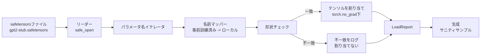

# 事前訓練済み重みのロード

> 1億2400万パラメータのモデルをスクラッチから訓練することは予算の問題であり、公開されたチェックポイントをロードするのは日常のことです。このレッスンはsafetensorsファイルからレッスン35の正確なアーキテクチャに事前訓練済みGPT-2スタイルの重みをロードし、パラメータ名マッピングを部品ごとに歩み、ロードが機能したことを証明するために継続を生成します。ネットワークなし、サードパーティのローダーなし、不透明な魔法なし。


## 学習目標

- `safetensors` Pythonライブラリでsafetensorsファイルを読み取り、テンソル名と形状を検査する。
- 各事前訓練済みパラメータ名をレッスン35 GPTモデル内のパラメータにマップする。
- 公開されたGPT-2重みとこのトラックのモデルで異なる2つの名前規約を処理する：`wte/wpe/h.N.attn.c_attn/c_proj` と `mlp.c_fc/c_proj` 対ローカル名 `tok_embed/pos_embed/blocks.N.attn.qkv/out_proj` と `mlp.fc1/fc2`。
- 形状の不一致を明確なエラーで検出して重みの割り当てが行われる前に拒否する。
- ロードされた重みで短い継続を生成し、トークンがランダム初期化のものではなくロードされた分布から来ることを確認する。

## 問題

公開された重みはあなたのアーキテクチャのためにパッケージされていません。元の実装が使用した名前を運びます。事前訓練済みファイルには形状 `(2304, 768)` の `transformer.h.0.attn.c_attn.weight` があります。あなたのモデルは形状 `(2304, 768)` の `blocks.0.attn.qkv.weight` を期待します（これは異なるレイアウト規約の同じ行列）、またはあなたのモデルが転置で行列を保存する `nn.Linear` を使用します。同じパラメータが3つの微妙に異なるアイデンティティ（名前、形状、バイトレイアウト）で現れ、ローダーはそれら3つを調整する必要があります。

盲目的にコピーするローダーは正しいテンソルを間違った場所に置き、ナンセンスを生成するモデルになります。形状が異なる場合はコピーを拒否するが何もログしないローダーはどのテンソルが着地に失敗したかを推測させます。このレッスンのローダーは明示的です：全ての割り当てがログされ、全ての形状がチェックされ、`LoadReport` がヒット、ミス、形状の不一致を要約するため、何が起きたかを読めます。

## コンセプト



名前マッパーは文字列から文字列への単なる関数です。形状チェックは1つのifです。割り当ては `torch.no_grad()` 内で行われるため自動微分はロードを追跡しません。レポートは全ての名前の結果を保持します。

### GPT-2の名前規約

公開されたGPT-2重みは次のような名前の下に存在します：

| 事前訓練済み名 | 形状 | 意味 |
|-------------|------|------|
| `wte.weight` | (50257, 768) | トークンエンベディング |
| `wpe.weight` | (1024, 768) | 位置エンベディング |
| `h.N.ln_1.weight` | (768,) | ブロックNのLayerNorm 1スケール |
| `h.N.ln_1.bias` | (768,) | LayerNorm 1シフト |
| `h.N.attn.c_attn.weight` | (768, 2304) | 融合QKV線形重み |
| `h.N.attn.c_attn.bias` | (2304,) | 融合QKV線形バイアス |
| `h.N.attn.c_proj.weight` | (768, 768) | アテンション出力プロジェクション |
| `h.N.attn.c_proj.bias` | (768,) | アテンション出力プロジェクションバイアス |
| `h.N.ln_2.weight` | (768,) | LayerNorm 2スケール |
| `h.N.ln_2.bias` | (768,) | LayerNorm 2シフト |
| `h.N.mlp.c_fc.weight` | (768, 3072) | MLP fc1重み |
| `h.N.mlp.c_fc.bias` | (3072,) | MLP fc1バイアス |
| `h.N.mlp.c_proj.weight` | (3072, 768) | MLP fc2重み |
| `h.N.mlp.c_proj.bias` | (768,) | MLP fc2バイアス |
| `ln_f.weight` | (768,) | 最終LayerNormスケール |
| `ln_f.bias` | (768,) | 最終LayerNormシフト |

計画すべき2つの驚き。`c_attn`、`c_proj`、`c_fc` 線形は `nn.Linear.weight` が期待するものに対して転置された行列として保存されています。ローダーは割り当て中に転置します。LMヘッドはファイルに全くありません。モデルは `wte` との重みタイイングに依存するため、`wte` が着地した後にエイリアスを設定することでヘッドが設定されます。

### ローカルの名前規約

このトラックのモデルは説明的な名前を使用します：

| ローカル名 | 意味 |
|----------|------|
| `tok_embed.weight` | トークンエンベディング |
| `pos_embed.weight` | 位置エンベディング |
| `blocks.N.ln1.scale` | ブロックNのLayerNorm 1スケール |
| `blocks.N.ln1.shift` | LayerNorm 1シフト |
| `blocks.N.attn.qkv.weight` | 融合QKV |
| `blocks.N.attn.qkv.bias` | 融合QKVバイアス |
| `blocks.N.attn.out_proj.weight` | アテンション出力プロジェクション |
| `blocks.N.attn.out_proj.bias` | 出力プロジェクションバイアス |
| `blocks.N.ln2.scale` | LayerNorm 2スケール |
| `blocks.N.ln2.shift` | LayerNorm 2シフト |
| `blocks.N.mlp.fc1.weight` | MLP fc1 |
| `blocks.N.mlp.fc1.bias` | MLP fc1バイアス |
| `blocks.N.mlp.fc2.weight` | MLP fc2 |
| `blocks.N.mlp.fc2.bias` | MLP fc2バイアス |
| `final_ln.scale` | 最終LayerNormスケール |
| `final_ln.shift` | 最終LayerNormシフト |

マッピングは固定関数です。レッスンはそれをローダーがイテレートするdictとして提供します。

### スタブフィクスチャ

実際のGPT-2重みは0.5 GBです。デモはそれらをダウンロードしません。最初の実行時に正確なGPT-2の名前規約と768ではなく192のd_modelを持つ12ブロックモデルに適した形状を持つ小さなsafetensorsフィクスチャを生成します。フィクスチャはローダーの全コードパスを実行するのに適した構造を持っています。フィクスチャを実際のファイルに交換するとローダーは変更なしで機能します。

## 実装する

`code/main.py` は実装します：

- このレッスンが自己完結するようにするレッスン35の `GPTModel` の小さな複製。
- 層ごとのエントリを展開する `make_pretrained_to_local(num_layers)`。
- 名前をイテレートし、マップし、形状をチェックし、conv1dスタイルの重みを転置し、`torch.no_grad()` 下で割り当てる `load_safetensors(model, path)`。`LoadReport` を返す。
- 正確な事前訓練済みの名前規約でフィクスチャファイルを生成する `make_stub_safetensors(path, cfg)`。
- 最初の実行時に `outputs/gpt2-stub.safetensors` を作成し、新鮮なモデルを構築し、ランダム初期化から1つの生成継続をキャプチャし、スタブをロードし、もう1つの継続をキャプチャし、両方を出力し、2つが異なること（ロードが実際にモデルを変えた）を確認するデモ。

実行：

```bash
python3 code/main.py
```

出力：フィクスチャパス、名前ごとのロードログ、`LoadReport` 要約、ロード前の継続、ロード後の継続、フィクスチャに注入された意図的に悪いテンソルによる1つの形状の不一致（失敗パスが実行されるように）。

## スタック

- ディスク上のフォーマットとストリーミングリーダーのための `safetensors`。
- モデルと割り当て計算のための `torch`。
- `transformers` なし、`huggingface_hub` なし、ネットワーク呼び出しなし。

## 実際の本番パターン

作成しなかった重みとの接触を生き延びる3つのパターン。

**割り当ての前にファイルを検証する。** ファイルを開き、dtypeと形状で全テンソル名をリストし、形状チェックで完全なマッピングを実行し、成功した場合のみ割り当てを開始します。半ロードされたモデルはサイレント失敗機械です。

**ソース名と宛先名で全ての割り当てをログする。** 何かおかしく見える場合、ログはどのテンソルがどこに着地したかを教えます。代替案は16進ダンプを読むことです。このレッスンの `LoadReport` データクラスは `loaded`、`missing`、`unexpected`、`shape_mismatch` リストを追跡して最後に要約を出力します。

**LMヘッドは重みタイイングのエイリアスであり、別のコピーではない。** `tok_embed` をロードした後に `model.lm_head.weight = model.tok_embed.weight` を設定することが標準パターンです。エンベディング行列を新しい `lm_head.weight` パラメータにコピーするとタイイングが壊れてサイレントにパラメータ数が2倍になります。

## 使ってみる

- ローダーは事前訓練済みの名前規約を使用する任意のsafetensorsファイルで機能します。実際のGPT-2ファイル（small / medium / large / xl）はコード変更なしで機能します。モデル設定のみが異なります。
- 同じパターンは名前マップを更新するとLLaMA、Mistral、Qwen重みに拡張されます。形状チェックとレポートは同一のままです。
- ロード後のサニティ生成はクイックゲートです：ロード後のサンプルがロード前のサンプルと同じに見える場合、ロードはモデルを変えていません。これはマッピングがサイレントに全テンソルをミスしたことを意味します。

## 演習

1. 各テンソルを割り当て中にターゲットdtype（`bfloat16`、`float16`、`float32`）にキャストする `dtype` 引数をローダーに追加してください。`float32` モデルを `bfloat16` にダウンキャストしても生成できることを確認してください。
2. モデルの `num_layers` と一致しない `h.N` インデックスを持つチェックポイントをロードすることを拒否する `expected_layers` 引数を追加してください。
3. ローダーをレッスン35の生成関数に接続し、並べた2つのサンプルを生成してください：ランダム初期化からとロードされたフィクスチャから。
4. エクスポートパスを追加してください：事前訓練済みの名前規約を使用して現在のモデルstateを新しいsafetensorsファイルに書き込みます。ローダーをラウンドトリップしてレポートが形状の不一致ゼロであることを確認してください。
5. `NAME_MAP` をLLaMAの名前規約（バイアスなし、RMSNorm、融合qkvレイアウト）を処理するように拡張し、生成したスタブLLaMAフィクスチャでローダーを再実行してください。

## キーワード

| 用語 | 人々が言うこと | 実際の意味 |
|------|--------------|----------|
| 名前マップ | 「キーのリマッピング」 | 事前訓練済みテンソル名からローカルパラメータ名への関数。通常はループで層インデックスを展開した1エントリあたりのリテラルdict |
| 形状の不一致 | 「悪い形状」 | 事前訓練済みテンソルがマップされた名前の下に存在するが、その次元がローカルパラメータと異なる。ローダーは割り当てを拒否してペアをログする |
| ロード時に転置 | 「Conv1dレイアウト」 | 公開されたGPT-2はアテンションとMLPのプロジェクションをnn.Linearが期待するものの転置で保存する。ローダーは割り当て中に転置する |
| 重みタイイングエイリアス | 「共有LMヘッド」 | ヘッドとエンベディングがストレージを共有するように model.lm_head.weight = model.tok_embed.weight を設定する。タイイングのためにヘッドはファイルにない |
| ロードレポート | 「カバレッジ要約」 | loaded、missing、unexpected、shape_mismatchリストを追跡する小さなデータクラス。それを出力することでロードが成功したかどうかがわかる |

## 参考資料

- フェーズ19 レッスン35：重みを受け取るアーキテクチャ。
- フェーズ19 レッスン36：同じ形状のチェックポイントを生成する訓練ループ。
- フェーズ10 レッスン11（量子化）：メモリが逼迫しているときにロードされた重みで何をするか。
- フェーズ10 レッスン13（完全なLLMパイプラインの構築）：ロードと推論を取り巻くフルライフサイクル。
