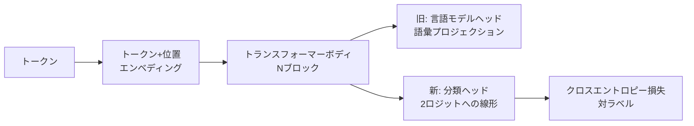
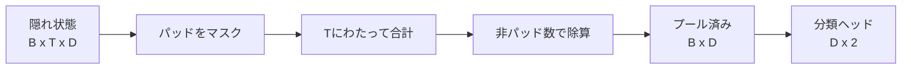
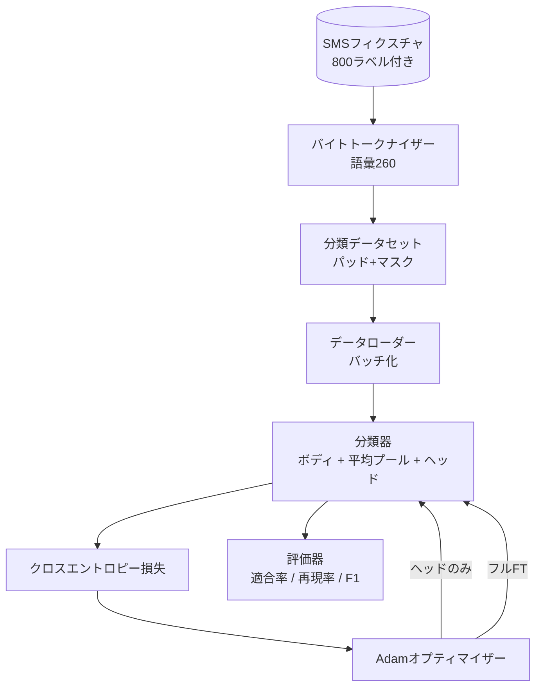

# キャップストーン レッスン38: ヘッドスワップによる分類器ファインチューニング

> トラックBの最初のキャップストーン。事前訓練済み言語モデルはトークン予測ヘッドで終わる自己アテンションブロックのスタックです。スパムかハムかを判定したい場合、ヘッドは間違っていますがボディはほぼ正しいです。このレッスンはヘッドを取り外し、プールされた表現に2クラスの線形層を貼り付け、2つの異なる方法で分類器を訓練します：最終層のみ、そしてフルファインチューニング。evalはホールドアウト分割の適合率、再現率、F1です。各戦略が何を買うか、そのコストとともに学びます。

## 学習目標

- ボディを再初期化せずに言語モデルヘッドを分類ヘッドに置き換える。
- 2つの訓練レジームを実装する：凍結ボディ（ヘッドのみ）とフルファインチューニング、1つの訓練ループを共有する。
- パディングし、パディングをマスクし、アテンション出力をプールするトークナイザー対応データパイプラインを構築する。
- 生のロジットから適合率、再現率、F1、混同行列を計算する。
- パラメータ数、訓練時間、ヘッドルームのトレードオフについて説明する。

## 問題

事前訓練済みの小さなトランスフォーマーを汎用コーパスで事前訓練しました。出力ヘッドは最後の隠れ状態を1000トークンの語彙にプロジェクションします。次に800個のSMSメッセージがスパムまたはハムとラベル付けされており、バイナリ分類器が必要です。3つの選択肢があります。

間違った選択肢は800例の新鮮な分類器をスクラッチから訓練することです。事前訓練済みモデルのボディはすでに有用な構造をエンコードしています：単語のアイデンティティ、位置、単純な共起。それを捨てることはそれを構築した計算を無駄にします。

2つの正しい選択肢は、ボディを凍結したヘッドスワップと、ボディを訓練可能にしたヘッドスワップです。ヘッドのみ訓練は速く、メモリがほぼフリーで、この少ないデータでオーバーフィットすることはほとんどありません。フルファインチューニングは遅く、小データでオーバーフィットする可能性がありますが、下流ドメインが事前訓練コーパスからドリフトしている場合により高い精度に達します。

このレッスンは両方を構築するため、同じフィクスチャで比較できます。

## コンセプト

モデルは関数 `f_theta(tokens) -> hidden_states` です。ヘッドは関数 `g_phi(hidden) -> logits` です。ヘッドをスワップすることは `theta` を保持して `g_phi` を置き換えることを意味します。ボディのパラメータは高コストな部分です。ヘッドは単一の線形層です。

2つの訓練可能なパラメータセットが重要です：

- `theta`（ボディ）：アテンションブロックごとに数万の重み。
- `phi`（ヘッド）：`hidden_dim * num_classes` の重みとバイアス。

ヘッドのみ訓練では `phi` に対して勾配を計算し、`theta` に対してはゼロにします。PyTorchはボディパラメータに `requires_grad=False` を設定することでこれを可能にします。オプティマイザーはヘッドのみを見て、ボディは凍結されたままです。

フルファインチューニングでは勾配がスタック全体を逆伝播します。ボディの重みは分類目標に合わせてドリフトします。リスクは小データでの破滅的な忘却です：ボディの事前訓練がオーバーフィットノイズで洗い流されます。

## プーリングの質問

分類器はトークンごとに1つのベクトルではなく、シーケンスごとに1つのベクトルが必要です。3つの一般的な選択肢：

- **平均プール**：アテンションマスクで重み付けしてシーケンス全体の隠れ状態を平均する。
- **CLSプール**：特殊トークンを先頭に追加してその出力のみを使用する。BERTが行うことです。
- **最終トークンプール**：最後の非パディングトークンを使用する。GPTクラスの分類器が行うことです。

このレッスンは明示的なアテンションマスク重み付けを持つ平均プーリングを使用します。これが最もシンプルで、シーケンス長全体で安定したシグナルを与え、CLSトークンの事前訓練を必要としません。

## データ

`code/main.py` で決定論的に800個のSMSメッセージ（スパム400、ハム400でバランス）が生成されます。ジェネレーターは固定シードを使用し、テンプレートを選んでスロットフィラーを代入し、5から25トークン長のメッセージを出力します。実際のデータセットにはこのフィクスチャにはないノイズがあります。フィクスチャのポイントは再現性です。

データは80/20で分割されます：訓練640、テスト160。分割は層別化されるため、テストセットは50/50バランスを維持します。既知のバランスを持つホールドアウトセットで適合率と再現率を正直な数値として読めます。

## メトリクス

クラス1を陽性クラス（スパム）としたバイナリ分類。カウント：

- `TP`：スパムと予測、実際にスパム。
- `FP`：スパムと予測、実際にハム。
- `FN`：ハムと予測、実際にスパム。
- `TN`：ハムと予測、実際にハム。

3つのヘッドラインメトリクス：

- `適合率 = TP / (TP + FP)`。スパムとフラグ付けされたメッセージのうち、実際にスパムの割合は？
- `再現率 = TP / (TP + FN)`。実際のスパムのうち、モデルがフラグ付けした割合は？
- `F1 = 2 * P * R / (P + R)`。2つの調和平均。

混同行列は4つのカウントを2×2グリッドとして出力します。デモは両方の訓練レジームでこれをstdoutに書きます。

## アーキテクチャ

ボディは意図的に小さなトランスフォーマーです：語彙260、隠れ64、4ヘッド、2ブロック、最大シーケンス32。CPU上で90秒以内に両方のレジームを収束させるのに十分小さいです。レッスンではボディは事前訓練されていません。代わりに `pretrain_quick` ヘルパーが同じフィクスチャのテキストで5エポックのLM訓練を行い、ボディに非自明な出発点を与えます。これによりレッスンが自己完結します。

## 実装するもの

実装は1つの `main.py` と1つのテストモジュール（`code/tests/test_main.py`）です。

1. `ByteTokenizer`：バイトをIDにマップし、パッドIDを予約。
2. `Block`：マルチヘッドアテンションとフィードフォワード層を持つトランスフォーマーブロック。Pre-norm。
3. `LMBody`：トークン+位置エンベディングとブロックのスタック。隠れ状態を返す。
4. `MeanPool`：シーケンス軸にわたるマスク重み付き平均。
5. `Classifier`：ボディ、プール、線形ヘッド。ボディは両方のレジームで同じインスタンス。
6. `freeze_body` と `unfreeze_body`：ボディパラメータの `requires_grad` を切り替え。
7. `train_classifier`：1つの共有ループ。モデルと訓練可能なパラメータグループ用に設定されたオプティマイザーを受け取る。
8. `evaluate`：テストセットを実行して `Metrics(precision, recall, f1, confusion)` を返す。
9. `run_demo`：ボディを簡単に事前訓練し、ヘッドのみを訓練して評価し、次にフルを、両方のレポートを出力して、ゼロで終了。

## 比較が重要な理由

ヘッドのみレジームは通常より速く訓練されより優雅にアンダーフィットします。このフィクスチャでは通常20エポックのヘッドのみ訓練後に適合率が約0.9、再現率が約0.85になります。フルファインチューニングは約3倍かかり、ランダムシードに応じて一方向または他方向に数ポイントの範囲で着地します。

レッスンは勝者を選びません。数字とコストを読むことを教えます。800例と小さなボディでは、ヘッドのみが正しい選択です。80,000例と大きなボディでは、フルファインチューニングが成果を上げ始めます。このレッスンから取るコントラクトはAPI：同じ `train_classifier` 関数が両方を処理し、トグルは1回の呼び出しです。

## ストレッチゴール

- 最後のブロックのみをアンフリーズする3番目のレジームを追加してください。これは部分ファインチューニングと呼ばれることもあります。フルFTよりコストが低く、ヘッドのみより多く学びます。
- 学習率スケジューラーを追加してください。ヘッドへのコサインスケジュールとボディへの小さい定数レートは一般的な本番設定です。
- 平均プーリングを学習済みアテンションプール：1つの学習済みクエリを持つ小さなアテンション層に置き換えてください。これは長いシーケンスで平均プールを上回ることが多いです。

実装はフックを与えます。テストはコントラクトを固定します。数字は自分で押し上げてください。
