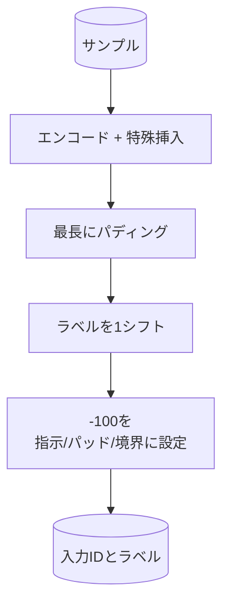

# キャップストーン レッスン39: 教師ありファインチューニングによる指示チューニング

> 事前訓練済みベースモデルはシーケンスを継続できますが指示に従えません。教師ありファインチューニング（SFT）はこれを修正する最小の変更です：指示と望ましい応答のペア例をモデルに与え、応答トークンを予測するようにボディを訓練します。トリックは損失が指示ではなく応答のみをカウントすることです。このレッスンは指示トークンを `ignore_index=-100` でマスクするカスタムコレート関数を持つAlpacaスタイルのSFTループを構築し、200の指示応答ペアを訓練し、exact-matchを使ってホールドアウト分割を評価します。


## 学習目標

- 明示的な境界トークンを持つ単一の因果シーケンスにペアになった指示応答データをフォーマットする。
- クロスエントロピーが応答トークンのみをカウントするように指示トークンをマスクするコレート関数を構築する。
- SFT目標でタイニートランスフォーマーボディを訓練し、evalメトリクスが動くのを見る。
- 応答開始境界を尊重する貪欲と温度サンプリング生成を実装する。
- 生成された完成形のホールドアウトexact-matchを計算する。

## 問題

次トークン予測で訓練されたベースモデルは指示が何かを知りません。文字列 `「フランスの首都は何ですか？」` を見せると、質問を続けるか新しい文章を作り上げます。モデルは言語を持っていますが、フォーマットコントラクトを持っていません。

SFTコントラクトは文字列テンプレートです。全ての訓練サンプルは3つの領域を持つ単一のシーケンスになります：

```text
<INST> フランスの首都は何ですか？ <RESP> フランスの首都はパリです。
```

境界トークンは訓練時に予約された特殊トークンです。モデルは `<RESP>` の後の全てが応答であり、応答が採点されることを学びます。ベースモデルの次トークン目標は依然として適用されます。全ての例がこの形状を持つコーパスで訓練されるだけです。

しかし落とし穴があります。シーケンス全体を通常のクロスエントロピー損失に与えると、指示トークンを予測するようにもモデルを訓練しています。指示は与えられています。それらの位置でゼロ勾配が必要です。修正がマスクです。

## コンセプト


`ignore_index` は `torch.nn.functional.cross_entropy` の機能です。`ignore_index` と等しいターゲット位置はゼロ損失とゼロ勾配を寄与します。PyTorchの慣例は `-100` です。コレート関数はサンプルごとに2つのテンソルを構築します：`input_ids`（完全なシーケンス）と `labels`（`input_ids` のコピーで指示位置が `-100` で上書き済み）。

モデルはフォワードパス中にシーケンス全体を見ます。アテンションは指示に注目できます。損失は応答トークンのみをカウントします。これがまさに必要なことです：指示を条件として、応答を予測する。

## データ

`main.py` で200の指示応答ペアが決定論的に生成されます。6つのタスクタイプをカバーします：

- 事実的シングルショット（Xの首都）
- 算術
- リスト抽出
- 一文要約
- コード（print、sort）
- 定義

各タスクにはテンプレート化された指示と確定的な応答があります。これは意図的にシンプルです。Exact-matchは脆弱であり、レッスンはフィクスチャを使って正解が1つの特定の文字列です。実際のSFTデータセットはファジーなメトリクスが必要です。原則は同一です。

分割は訓練160、テスト40です。テストセットは全6タスクタイプをカバーするため、カテゴリごとのexact-matchを報告できます。

## トークン化とパディング

トークナイザーは3つの予約済み特殊を持つバイトレベルです：

- `INST_ID = 256`：指示領域の開始をマーク。
- `RESP_ID = 257`：指示と応答の間の境界をマーク。
- `PAD_ID = 258`：可変長バッチのパディング。

シーケンスは `[INST] inst_bytes [RESP] resp_bytes [PAD]*` です。コレート関数：

1. 各サンプルをトークン化。
2. バッチ内の全サンプルをバッチ内の最長シーケンスにパディング。
3. `labels` = 1つシフトした `input_ids`（因果LMターゲット）を構築し：
   - 指示領域を `-100` で置き換え。
   - パディング領域を `-100` で置き換え。
   - `RESP_ID` 境界位置自体を `-100` で置き換え（境界トークンを予測するようにモデルを訓練しない。その後に来るものを予測する）。



シフトは標準的な因果トリック：`input_ids` の位置 `i` は位置 `i+1` を予測するため、`labels[i] = input_ids[i+1]` です（最終位置は入力から削除、最初は targets から削除）。マスクはシフトの後に適用して正しい位置に着地させます。

## 訓練


ループは標準的なPyTorch SFTループです。Adam、学習率約3e-4から1e-3、このフィクスチャで10から20エポック、スケジューラーなし。モデルは十分小さい（隠れ96、2ブロック、最大長64）ためCPU上で2分以内に収束します。

5エポックごとにループはホールドアウトセットで小さなevalパスを実行してexact-matchを出力します。エポック1でのexact-match 0.0がエポック15で約0.85になるのを見ることがレッスンの成果：モデルが同時にフォーマットと答えを学ぶのを見ることができます。

## 生成

evalに時ではモデルは指示プレフィックス `[INST] inst_bytes [RESP]` を受け取り、どちらかが起こるまでトークンを生成します：

- シーケンスが `max_len` に達する、または
- モデルが特殊停止ヒューリスティックを出力する：2つの連続した文章終了バイト（`.`、`!`、`?`）。

レッスンは貪欲デコードとオプションの温度サンプラーを提供します。Exact-matchは貪欲を使用します。温度はメトリクスを確率的にするからです。実際のシステムはしばしばサンプリングして後でファジーに判断します。そのパイプラインはレッスン41です。

## Exact-Match評価

Exact-matchは最も厳格なテキストメトリクスです。予測された応答文字列は正規化され（小文字、空白をストリップ、二重スペースを折りたたむ）、同様に正規化された参照応答と比較されます。メトリクスはサンプルごとに1か0です。集計は平均です。

実際のSFTパイプラインはexact-matchをトークンレベルF1（レッスン41）とジャッジモデルで補完します。Exact-matchは0.7と言えば正確に70%のテスト指示がゴールド応答を文字ごとに生成したことを意味するため、曖昧さがなく有用です。

## 実装するもの

実装は1つの `main.py` とテストです。

1. `InstructionTokenizer`：予約済み特殊を持つバイトレベルエンコーダー。指示プレフィックスまたは完全なペアのいずれかをエンコード。
2. `make_dataset`：固定シードで6タスクタイプにわたって200ペアを生成。
3. `SFTDataset`：サンプルごとに `(input_ids, labels)` を返し、マスク準備済み。
4. `sft_collate`：動的パディング、バッチテンソルを構築し、指示とパッド位置に `-100` を設定。
5. `TinyGPT`：タイされたまたはタイなしのLMヘッドを持つトランスフォーマーボディ。
6. `train_sft`：エポックごとのevalフックを持つSFTループ。
7. `generate`：プレフィックスからの因果デコード、貪欲またはサンプリング、停止ヒューリスティック付き。
8. `exact_match`：正規化された文字列比較、`[0, 1]` の浮動小数を返す。
9. `run_demo`：データを構築し、20エポック訓練し、評価し、カテゴリ別の内訳を出力し、成功でゼロで終了。

## マスクが重要な理由

マスクなしでは、損失は指示トークンをターゲットとして扱います。モデルは指示を予測することを学びます。これは異なる目標であり、2つの方法でモデルを悪化させます。第一に、ユーザーが常に提供する入力を再構築することにモデルの容量が無駄になります。第二に、ほとんどのバッチで応答トークンより指示トークンの方が多いため、応答損失は勾配の和でより小さくなります。重要な部分（応答）に対するオプティマイザーの実効学習率は意図したより低くなります。マスクは磨きではなく目標です。

## ストレッチゴール

- コサイン減衰に続く学習率ウォームアップを追加してください。SFTは事前訓練よりLRに対してより敏感です。
- ステップごとの損失ログを追加して訓練中の損失曲線をプロットしてください。初期エポックはテンプレートトークン（`<RESP>`、一般的なプレフィックス）に支配され、後期エポックは実際の答えトークンに支配されることに気づいてください。
- BLEU-1またはchrFにevalを拡張してください。Exact-matchは同じ答えを持つパラフレーズを生成するモデルを過小評価します。
- マルチターンフォーマットとフォローアップを含むフィクスチャで訓練するチャットテンプレートを追加してください。

実装はフォーマットコントラクト、マスク、ループを与えます。ベースモデルから指示フォロワーへの目標変換は1つのコレート関数です。
