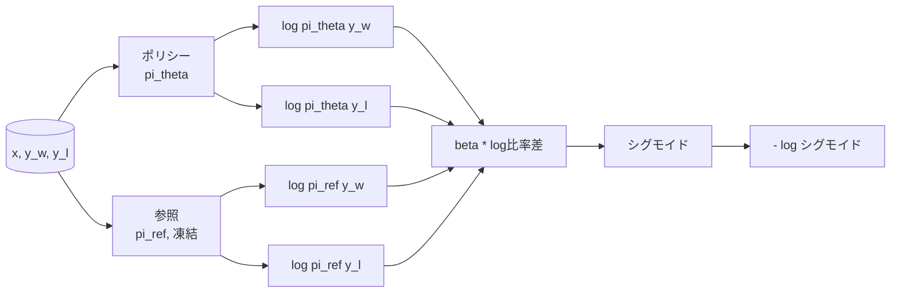
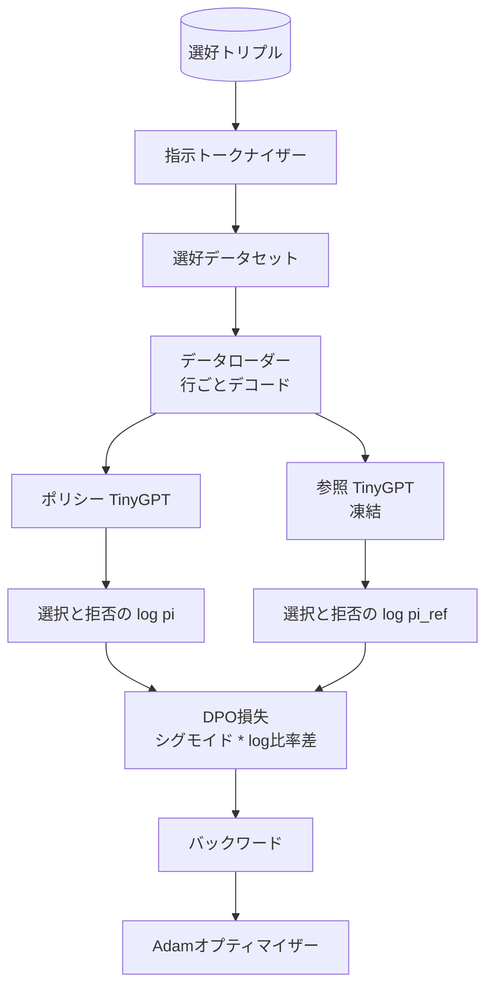

# キャップストーン レッスン40: スクラッチからのDirect Preference Optimization

> 報酬モデルとPPOはクラシカルなRLHFスタックです。DPOはそのスタックを単一の教師あり損失に折りたたみ、選好ペアに対して直接ポリシーをフィットします。このレッスンは報酬差分恒等式からDPO損失を導出し、動作する参照モデルとポリシーモデルを出荷し、トークンごとのlog確率を計算し、選択されたものと拒否されたものの完成形の選好フィクスチャ上でタイニートランスフォーマーを訓練します。テストは損失数学と勾配方向をピンするためあなたの実装が論文に一致することを確認できます。


## 学習目標

- DPO損失をスケールされたlog比率差のシグモイドとして導出し、暗黙の報酬に接続する。
- 凍結された参照と訓練可能なポリシーを持つ参照モデル + ポリシーモデルのペアを構築する。
- 両モデルの下で、プロンプトトークンをマスクしながら、シーケンスレベルのlog確率を計算する。
- `(プロンプト, 選択, 拒否)` トリプルでポリシーを訓練し、選択されたlog確率が拒否されたものに対して上昇するのを見る。
- 損失数学、勾配の符号、参照不変性に関するテストで動作をピンする。

## 問題

SFTモデルがあります。指示に従いますが、出力はムラがあります。いくつかの完成形は明確で、いくつかは冗長または誤りです。また、小さな選好ペアのデータセットもあります：同じプロンプトに対して、人間が一方の完成形を選択し、もう一方を拒否と印を付けました。

クラシカルなRLHFの答えは2段階のパイプラインです。選好から報酬モデルを訓練します。PPOで報酬に対してポリシーを最適化します。これは動作しますが高コストです：PPO中に2つのモデルがメモリに、参照の近くにポリシーを保つKL制御、報酬モデルが脆弱な時の報酬ハッキング。

DPOは両方のステージを単一の教師あり損失に置き換えます。報酬モデルは明示的に存在しません。ポリシーはSFT参照に対する明示的なKLペナルティを持つ選好ペアで直接訓練されます。Bradley-Terry選好モデルの下で同じ最適解、はるかに少ないコード。

## コンセプト

Bradley-Terryモデルから始めます。プロンプト `x` と2つの完成形 `y_w`（選択）と `y_l`（拒否）が与えられると、人間が `y_w` を好む確率は

```text
P(y_w > y_l | x) = sigmoid( r(x, y_w) - r(x, y_l) )
```

ここで `r` は何らかの潜在的な報酬関数です。RLHFはまず選好から `r` をフィットし、次にKLアンカー付きで `r` を最大化するようにポリシー `pi` を訓練します：

```text
max_pi   E_{x, y~pi} [ r(x, y) ] - beta * KL(pi || pi_ref)
```

DPO導出はこの目標の下の最適ポリシー `pi*` が `r` の項で閉形式を持つことを観察します：

```text
pi*(y | x) = (1/Z(x)) * pi_ref(y | x) * exp( r(x, y) / beta )
```

`r` について整理すると：

```text
r(x, y) = beta * ( log pi*(y | x) - log pi_ref(y | x) ) + beta * log Z(x)
```

`log Z(x)` 項は `y_w` と `y_l` の両方で同じです（`x` に依存し `y` に依存しない）ので、選好差分を計算するとキャンセルされます：

```text
r(x, y_w) - r(x, y_l) = beta * ( log pi_theta(y_w|x) - log pi_ref(y_w|x)
                                - log pi_theta(y_l|x) + log pi_ref(y_l|x) )
```

Bradley-Terryシグモイドに代入し、選好ペアに対して負の対数尤度を取ります：

```text
L_DPO(theta) = - E_{(x, y_w, y_l)} [
  log sigmoid( beta * ( log pi_theta(y_w|x) - log pi_ref(y_w|x)
                       - log pi_theta(y_l|x) + log pi_ref(y_l|x) ) )
]
```

これが損失です。サンプルごとに4つのlog確率から計算される単一のスカラーに対するシグモイドです。別の報酬モデルなし。PPOなし。損失にKL項なし。KL制約は閉形式導出に焼き付けられています。



## 勾配の符号

任意の訓練ランの前の有用なサニティチェック。`log pi_theta(y_w | x)` に対する勾配を取ります：

```text
d L_DPO / d log pi_theta(y_w | x) = - beta * (1 - sigmoid(z))
```

ここで `z` はシグモイドへの引数です。これは全ての `z` に対して負です。つまり：選択された完成形のポリシーのlog確率を増やすと損失が減ります。対称的に、`log pi_theta(y_l | x)` に対する勾配は正です：拒否されたlog確率を増やすと損失が増えます。訓練は選択されたものを上げ、拒否されたものを下げます。参照は凍結されています；動きません。

## データ

12の選好トリプルがレッスンに付属します。それぞれは `(プロンプト, 選択, 拒否)` です。選択された完成形は短く正確です。拒否されたものは冗長、トピック外、または誤りです。ペアはレッスン39と同じタスクファミリー（首都、算術、リスト）をカバーするため、SFTベースから始まったポリシーには合理的な出発点があります。

フィクスチャは意図的に小さいです。DPOは本番では何万ものペアで動作します；ここでのポイントは、損失数学とループが小さなデータセットでエンドツーエンドで動作し、選択対拒否のlog確率ギャップが目に見えて大きくなることです。

## 参照不変性

DPO実装は参照モデルを慎重に扱わなければなりません。参照は所定の位置に凍結されたSFTモデルです。3つのプロパティが成立しなければなりません：

- 参照パラメータは決して勾配を受け取りません。
- 参照のlog確率はエポック間で変わりません。
- ポリシーは参照と同じ重みから始まります。（最適な `theta` は参照プラス学習された更新です；参照のコピーとしてポリシーを初期化することが明確に定義された出発点です。）

実装はこれらを以下によって強制します：

- フォワードパス中に参照を `torch.no_grad()` でラップ。
- 全参照パラメータに `requires_grad=False` を設定。
- 参照が構築された後に `policy.load_state_dict(reference.state_dict())` でポリシーを構築。

## アーキテクチャ



モデルはレッスン39で使用した同じTinyGPTです（デコーダーオンリー、因果、バイトトークナイザー）。参照とポリシーはアーキテクチャを共有します；訓練中にポリシーの重みは参照からドリフトし、参照は固定されたままです。

## 実装するもの

実装は1つの `main.py` とテストです。

1. `InstructionTokenizer`：`INST` と `RESP` 特殊を持つバイトトークナイザー。レッスン39と同じ形状。
2. `TinyGPT`：デコーダーオンリートランスフォーマー。レッスン39と同じ形状でレッスンが自己完結する。
3. `make_preferences`：12の `(プロンプト, 選択, 拒否)` トリプルを返す。
4. `sequence_log_prob`：モデル、プロンプトプレフィックス、完成形が与えられると、完成形に対する次トークンlog確率の和を返す（プロンプト位置の寄与なし）。
5. `dpo_loss`：4つのlog確率と `beta` を取り、サンプルごとの損失テンソルとログのための暗黙の報酬デルタを返す。
6. `train_dpo`：ポリシーと参照の下で選択と拒否のlog確率を計算し、損失を適用し、Adamをステップするエポックごとのループ。
7. `evaluate_margins`：任意の時点でのポリシーの下での平均選択-拒否log確率マージンを返す。
8. `run_demo`：小さなウォームアップ事前訓練から参照とポリシーを構築し、重みをコピーし、30ステップ訓練し、ステップごとの損失とマージンを出力し、成功でゼロで終了する。

## DPOが機能する理由

DPOは報酬のパラメータ化まで、Bradley-Terry選好モデルの下でRLHFと数学的に等価です。暗黙の報酬 `r(x, y) = beta * (log pi(y|x) - log pi_ref(y|x))` は `x` の関数まで選好から識別可能であり、差分でキャンセルされます。閉形式ポリシーは明示的な報酬モデルをスキップさせます。KL制約は構造的に強制されます：`pi` が `pi_ref` からのどんな逸脱もlog比率を大きくし、シグモイドが飽和し、ポリシーが遠すぎるほど動くと勾配を減衰させます。参照はあなたのセーフネットです。

## ストレッチゴール

- log確率の和に長さ正規化を追加してください：完成形の長さで割ります。長さバイアスはモデルが絶対値でlog確率が大きいため短い完成形を優先的に選ぶ、既知のDPO失敗モードです。
- 損失のIPOバリアントを追加してください：シグモイド + logを `(z - 1)^2` に置き換えます。フィクスチャでの収束を比較してください。
- ハードな選択-拒否ラベルと一様0.5の間を補間するラベルスムージングパラメータを追加してください。
- 参照をより小さく安価なモデルに置き換えてください（知識蒸留フレーバー）。

実装は損失、参照不変性、訓練ループを与えます。数学がレッスンです。コードは数学を具体的にします。
