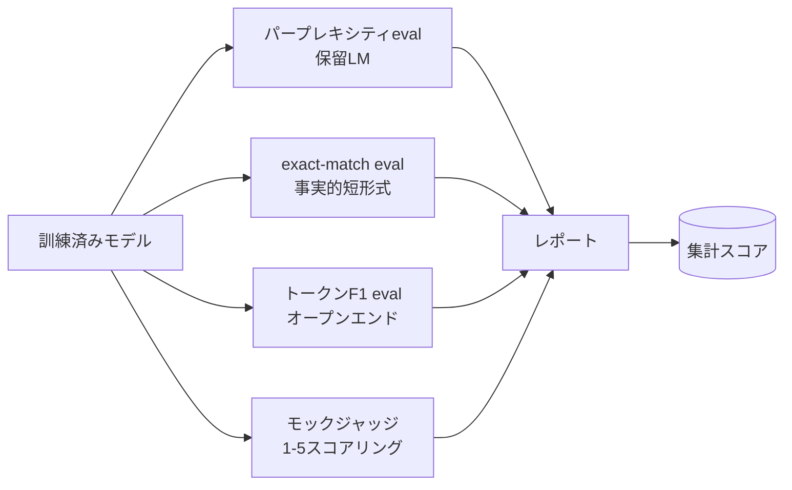
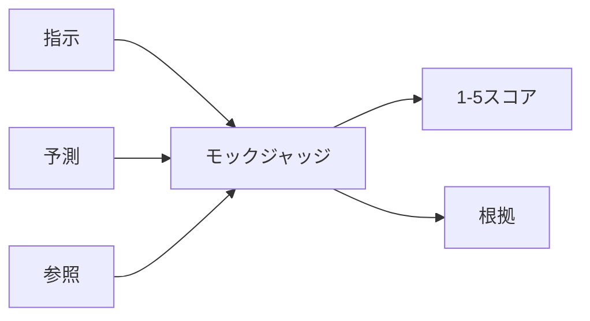
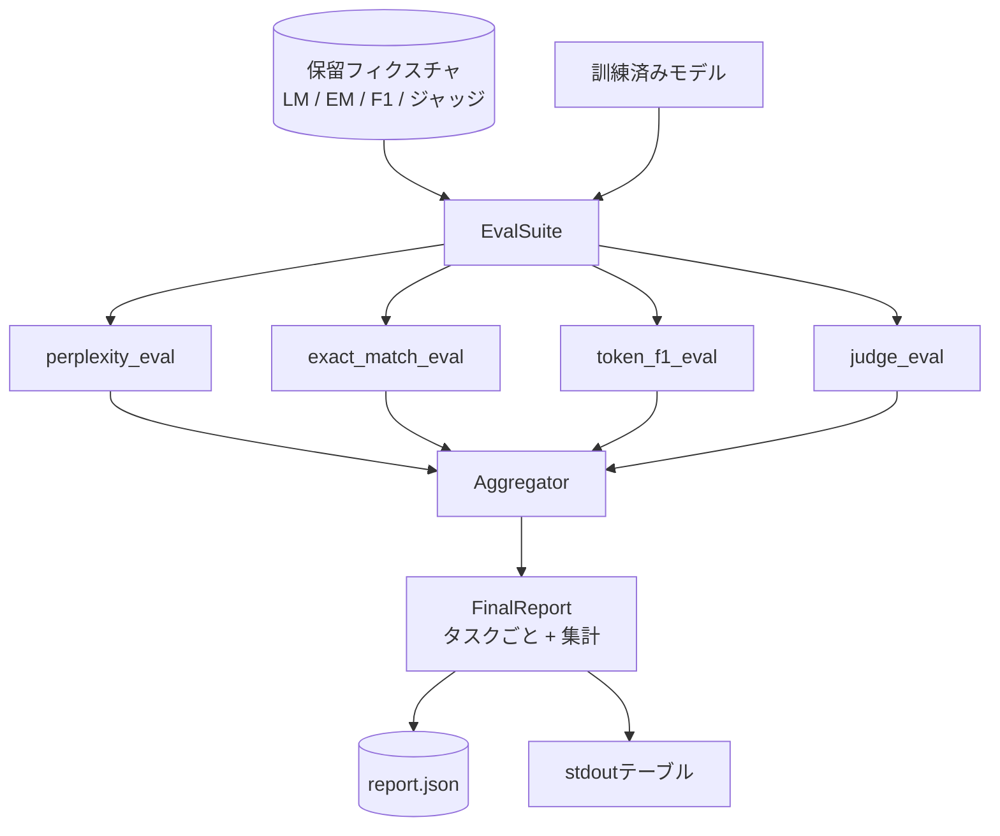

# キャップストーン レッスン41: 完全な評価パイプライン

> 訓練は損失曲線でモニタリングできる部分です。評価は設計しなければならない部分です。このレッスンは任意の訓練済み言語モデルを取り、4つの異種のevalを実行し、結果をタスクごとのレポートに集計し、ループがネットワークなしで動作するようにローカルモックのLLM-as-judgeを出荷する統合evalパイプラインを構築します。4つのevalは全ての出荷モデルが必要とする次元をカバーします：言語モデリング（パープレキシティ）、短形式の正確性（exact-match）、オープン形式の類似性（トークンF1）、定性的スコアリング（ジャッジ）。

## 学習目標

- タイニートランスフォーマーのマスクトークンアカウンティングで保留パープレキシティを計算する。
- 短形式の事実的プロンプトでexact-match evalを実行する。
- 正規化を使って予測と参照文字列間のトークンレベルF1を計算する。
- モデル出力を1-5スケールでスコアするローカルモックのLLM-as-judgeを構築する。
- 4つのevalをタスクごとの内訳を持つ単一の重み付きレポートに集計する。

## 問題

単一のメトリクスは言語モデルを説明できません。パープレキシティはモデルが言語分布にどれだけ適合するかを示しますが、質問に答えるかどうかは示しません。Exact-matchはモデルがゴールド文字列を生成するかどうかを示しますが、正しいパラフレーズを罰します。トークンF1はパラフレーズを許しますが、誤った内容との語彙的重複に騙されます。LLM-as-judgeは定性的次元を捉えますが高コストで確率的です。

実際に必要なパイプラインは4つ全てを持ちます。各evalはその他がミスする次元をカバーします。各evalはそのメトリクスのために形状が作られた保留データの異なるサブセットで動作します。最終レポートはタスクごとの数値を並べて表示し、レビュアーがモデルが作っているトレードオフを一目で見られます。

このレッスンはそのパイプラインをエンドツーエンドで1つのファイルで構築します。

## コンセプト

各evalは `(モデル, データセット) -> EvalResult` からの関数です。結果はメトリクス値、検査用のサンプルごとの詳細、集計のための名前を運びます。パイプラインはどのevalを実行するかとその重み付けを示すコンフィグでそれらを組み合わせます。

## パープレキシティ、適切にカウント

パープレキシティは `exp(トークンごとの平均負の対数尤度)` です。実装には2つのトラップがあります：

- 平均はバッチ * シーケンスではなく実際のトークン位置にわたって行われなければなりません。パディングトークンは分母から除外されなければなりません。そうしないとパープレキシティは実際より良く見えます。
- モデルは次のトークンを予測するため、位置 `i` のlogitは位置 `i+1` のトークンを予測します。ここでのオフバイワンのミスはサイレントです：損失は依然として訓練しますが、メトリクスは意味をなさなくなります。

evalはバッチごとに非パッド位置にわたる `-log p(トークン)` の合計とバッチごとのトークンカウントを計算し、最後に割ります。これはバッチごとのパープレキシティを平均するより数値的に安全で（短いシーケンスを過小評価する）、教科書の定義に一致します。

## Exact-match、正規化付き

ハーネスは比較前に予測と参照の両方を正規化します：

- 小文字化。
- 前後の空白をストリップ。
- 内部の空白連続を単一のスペースに折りたたむ。
- 両側が句読点のみで異なる場合、末尾の終止句読点（`.`、`!`、`?`）を削除。

正規化は実際のexact-matchを有用にします。`"パリ"` と言うモデルは正しく、`"パリ。"` と言うモデルも正しく、`"  パリ  "` と言うモデルも正しいです。メトリクスは依然として正規化後の答えが同じ文字列であることを要求します。

## トークンF1、正しいやり方

トークンF1はトークンのバッグに対して計算された精度と再現率の調和平均です。ステップ：

1. 予測と参照を正規化（exact-matchと同じルール）。
2. それぞれをトークンのリストに分割（空白トークン化）。
3. 多重集合の積を数える。
4. 精度 = `交差カウント / len(pred_tokens)`。再現率 = `交差カウント / len(ref_tokens)`。F1 = 調和平均。

予測と参照の両方が空の場合、F1は1（空虚な一致）。どちらか一方のみが空の場合、F1は0。このパターンはSQuAD評価リファレンスに一致し、パラフレーズにわたって安定した数値を生成します。

## ローカルモックのLLM-as-Judge

本物のジャッジはAPI背後のフロンティアモデルです。このレッスンではジャッジはオフラインで動作しなければなりません。モックジャッジは指示、モデルの予測、参照を取り、`{1, 2, 3, 4, 5}` のスコアと1行の根拠を返す決定論的スコアラーです。スコアリングルールは明示的です：

- 正規化された予測が正規化された参照と等しければ5。
- 予測と参照間のトークンF1が0.8以上なら4。
- トークンF1が `[0.5, 0.8)` の場合3。
- トークンF1が `[0.2, 0.5)` の場合2。
- それ以外は1。

これは本物のジャッジではありませんが、正しいインターフェースを持ちます。後で1つの関数を変えることで本物のモデルを差し込めます。パイプラインは気にしません。

## 集計

集計は正規化されたevalスコアの重み付き平均です。各evalは `[0, 1]` の自身の数値を報告します：

- パープレキシティ：`1 / (1 + log(perplexity))` として正規化。パープレキシティ1は1にマッピング、無限大は0にマッピング。
- Exact-match：既に `[0, 1]`。
- トークンF1：既に `[0, 1]`。
- ジャッジ：5で割る。

重みは設定可能です。デフォルトのミックスはパープレキシティ0.2、exact-match 0.3、トークンF1 0.3、ジャッジ0.2です。重みの選択は製品の決定です；レッスンはノブを公開して実験できます。

## アーキテクチャ

`EvalSuite` は薄いオーケストレーターです。各個別evalは `(モデル, トークナイザー, データセット, コンフィグ)` を取り `EvalResult` を返す自由関数です。`Aggregator` は結果を収集して最終レポートを生成します。デモはテーブルを出力し、下流のCIが取り込めるJSONコピーを書きます。

## 実装するもの

実装は1つの `main.py` とテストです。

1. `TinyGPT`：レッスン38-40で使用した同じデコーダーオンリーアーキテクチャ、レッスンが独立して成立するように含む。
2. `InstructionTokenizer`：INST / RESP / PAD特殊を持つバイトトークナイザー。
3. 4つのフィクスチャ：LMコーパス、EMセット、F1セット、ジャッジセット。それぞれ20例、決定論的。
4. `perplexity_eval`：パープレキシティ値とトークンごとの損失ヒストグラムを持つ `EvalResult` を返す。
5. `exact_match_eval`：平均EMとサンプルごとの記録を返す。
6. `token_f1_eval`：平均トークンF1とサンプルごとの記録を返す。
7. `mock_judge` と `judge_eval`：サンプルごとのスコアと根拠、セットにわたる平均スコア。
8. `Aggregator.normalise`：evalごとの正規化ルール。
9. `Aggregator.aggregate`：重み付き平均と組み立てられたレポート。
10. `run_demo`：タイニーモデルを少し訓練し、4つのeval全てを実行し、レポートテーブルを出力してJSONを書き、成功でゼロで終了する。

## レポートを読む

レポートには3つの層があります。上部は集計スコアです。その下には4つのeval別の数値があります。その下には診断用のサンプルごとの内訳があります。失敗したCIランは通常集計が必要ですが、回帰を追うレビュアーはモデルが間違えた入力を見るためにサンプルごとの内訳が必要です。

JSONダンプは安定したキーを使用するためCIダッシュボードがバージョンをまたいでトレンドラインをプロットできます。整形されたテーブルは訓練ランの後にターミナルを見ている人間のためです。

## ストレッチゴール

- キャリブレーションevalを追加してください：モデルのソフトマックス確率はその精度に一致しますか？予測を信頼度でバケット化し、バケットごとの経験的精度を報告してください。
- ロバストネスevalを追加してください：各例に摂動タグを付け（タイポ、パラフレーズ、ディストラクター）、摂動ごとのメトリクス低下を報告してください。
- モックジャッジをHTTP呼び出し背後の本物のモデルに置き換えてください。関数シグネチャは変わりません。
- タスクごとの重み学習を追加してください：固定重みの代わりに、モデルに対するターゲット選好順序に重みをフィットさせてください。

実装は4つのeval、アグリゲーター、レポートを与えます。本物の評価パイプラインはこの上に多くの次元を重ねます；パターンは同じです：evalごとに1つの関数、1つのアグリゲーター、1つのレポート。
