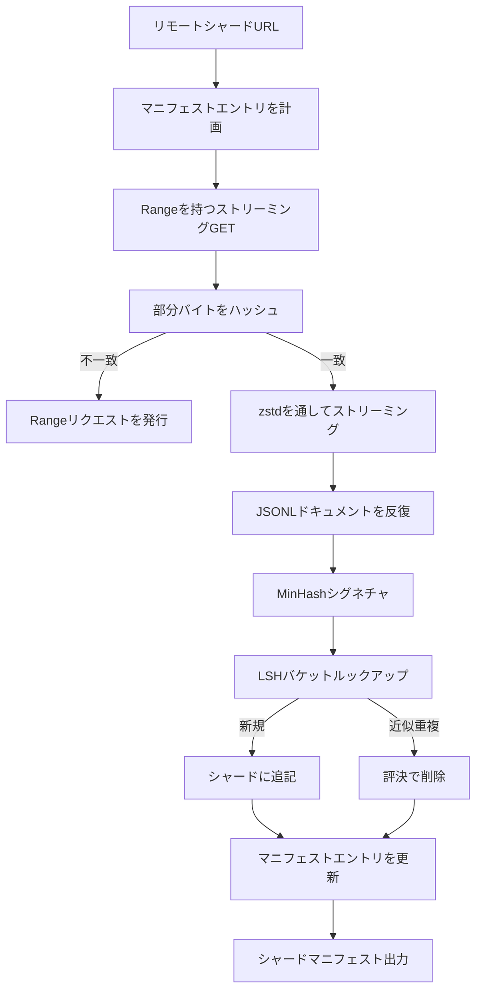

# 大規模コーパスダウンローダー

> 言語モデルの訓練は最初のフォワードパスのずっと前に始まります。コーパスはディスクに到着し、解凍され、重複排除され、アドレス可能でなければなりません。ネットワークが4パーセントで切れる前にリジュームストーリーが既にできていなければなりません。このレッスンは圧縮されたシャードを取得し、Zstandardでオンザフライで解凍し、MinHashとLocality-Sensitive Hashingで近似重複をフィンガープリントし、残りのパイプラインが信頼できるシャードマニフェストを書く、ストリーミングダウンローダーを構築します。


## 学習目標

- `urllib` でリモートシャードをストリーミングし、ファイル全体をメモリにバッファせずに `zstandard` で解凍する。
- 検証されたバイトオフセットに対してHTTP `Range` リクエストを発行することで部分ダウンロードをリジュームする。
- ドキュメントごとにMinHashシグネチャを構築し、近似重複がコリジョンするようにLSHでバケット化する。
- コンテンツハッシュ、バイトサイズ、ドキュメントカウント、重複排除評決を持つシャードマニフェストを出力する。

## 問題

200GBのコーパスで初めて訓練する時、ネットワークが41パーセントで切れてスクリプトが `urllib` 例外で終了します。2回目は78パーセントで切れます。99パーセントで、ループを3回書き直しました。最初の1分から設計しなければならない2つの失敗は、部分ダウンロードリジュームと重複ドキュメント削除です。どちらもよく知られた解決策があります；どちらも成長してしまった1行の `requests.get` 呼び出しとしてパイプラインが始まったため、ルーティンに省略されます。

リジュームはHTTPの問題です。サーバーは `Range` を尊重しなければならず、クライアントはディスク上の記録に対して検証されたオフセットを追跡しなければならず、検証されたオフセットはプロセスの死を生き延びなければなりません。オフセットとファイルが1バイトでも食い違うと、リジュームされたダウンロードはゴミを書き込み、コーパスはトークン化中にのみ現れる方法で破損します。

重複排除はシグネチャの問題です。正確なハッシュによる重複排除は近似重複を見逃します：同じWikipediaの記事が3つの異なる定型文フッターと共に現れ、同じコードファイルが異なるライセンスヘッダーで、同じブログポストが全てのリンクに追跡パラメータ付きで。MinHashプラスLSHはこれらを線形未満のコストで捉えます。コストはドキュメントごとに1つのシグネチャとシグネチャごとに1つのバケットルックアップです。

## コンセプト



### `urllib` でのストリーミング

標準ライブラリの `urllib.request.urlopen` はファイルライクオブジェクトを返します。それを `zstandard.ZstdDecompressor().stream_reader` でラップすると、バイトはネットワークから解凍器を通してドキュメントイテレーターに流れ、圧縮されたシャードも解凍されたシャードもメモリに具体化されません。唯一のメモリコストはラインバッファ、現在のドキュメントのMinHashシグネチャ、LSHインデックスです。

### `Range` でのリジューム

ダウンローダーはシャードごとに2つのファイルを書きます：シャード自体と `.partial.json` チェックポイントです。チェックポイントは `verified_bytes`、`expected_size`、`sha256_prefix`（最初の `verified_bytes` バイトに対して計算される）、ソースURLを記録します。起動時にダウンローダーはチェックポイントを読み、ディスク上のバイトに対して `sha256_prefix` を再計算し、再計算されたハッシュが一致する場合のみリジュームします。ハッシュが間違っている場合、部分ファイルは破棄されてダウンロードはバイトゼロから再開始します。検証されたバイトはチェックされており仮定されていないため、サイレントな破損は不可能です。

### MinHashプラスLSH

MinHashは固定スペースで2つの集合のJaccard類似度を推定します。ドキュメントの場合、集合はそのテキストのシングル（重複するn-gram）です。シグネチャは独立したハッシュ関数ごとに1つ、`k` 個の最小ハッシュ値です。Jaccard類似度 `s` を持つ2つのドキュメントはシグネチャの任意の単一コンポーネントで確率 `s` で一致します。

LSHは次に `k` コンポーネントを `r` 行の `b` バンドにグループ化します（`k = b * r`）。2つのドキュメントは少なくとも1つのバンドで確率 `1 - (1 - s^r)^b` でコリジョンします。これはあなたが `(b, r)` を調整する `s` の値の周りで鋭い閾値です。典型的なコーパス重複排除の閾値は `s = 0.8` で、LSH研究文献は `k = 128`、`b = 32`、`r = 4` で達します。

### コントラクトとしてのシャードマニフェスト

ダウンローダーの唯一の耐久性のある出力はマニフェストです。マニフェストはシャードごとにURL、解凍されたバイトカウント、ドキュメントカウント、重複排除後の一意なドキュメントカウント、最終シャードファイルのsha256を保持します。下流のトークン化はディレクトリリスティングではなくマニフェストを読みます。シャードが欠けているかそのsha256が間違っている場合、マニフェストは次のステージに開始を拒否するよう伝えます。マニフェストは「データがダウンロードされた」と「データがダウンロードされて検証可能」の間の決定的なエッジです。

## 実装する

`code/main.py` が実装します：

- `ShardPlanner` - シャードURLのリストを読み、計画されたマニフェストエントリを生成する。
- `StreamingDownloader` - オプションの `Range` を持つ `urllib` ストリームを開き、一時ファイルに書き込み、チャンクごとに `.partial.json` チェックポイントを更新し、リジューム時にsha256プレフィックスを検証する。
- `ZstdDocIterator` - ファイルライクストリームを `zstandard.ZstdDecompressor` でラップし、行ごとに1つのドキュメントを返す。
- `MinHasher` - 固定されたハッシュシード族を使って文字列の `k` コンポーネントシグネチャを生成する。
- `LSHIndex` - バンドでシグネチャをバケット化しコリジョンを報告する。
- `Dedup` - hasherとindexを組み合わせて各ドキュメントを一致するシャードidと共に `keep` または `near_duplicate` とラベル付けする。
- `ManifestWriter` - シャードごとの統計を収集し `manifest.json` を書く。

ファイルの下部のデモはディスク上に小さな合成コーパスを構築し、`zstandard` で圧縮し、`file://` URLを通してダウンロードし、重複排除し、マニフェストを出力します。

実行：

```bash
python3 code/main.py
```

スクリプトはゼロで終了しマニフェストサマリーを出力します。

## 本番パターン

4つのパターンがこのレッスンを本物のコーパスにスケールさせます。

**書き込みの前にチェックポイント。** `.partial.json` はバイトがシャードに追記される前に `fsync` されなければなりません。そうしないと電源喪失が順序を逆にします：ディスク上のシャードバイト、それらなしのチェックポイント、次のリジュームは持っているバイトより少ないと信じ、重複したサフィックスバイトがファイルを破損させます。最初にチェックポイント、次に書き込み。これはwrite-ahead logと同じ規律です。

**シャード化されたLSHインデックス。** 200GBスケールでのコーパス全体にわたる単一のLSHインデックスはRAMに収まりません。最初のバンドハッシュでLSHインデックスをパーティション化し、パーティションをディスクに保存し、新しいシグネチャが着地するパーティションのみを参照します。コストはドキュメントごとに追加のディスク読み取り1回；利点はLSHインデックスがハードメモリ上限でなくなることです。

**削除ではなくトゥームストーン。** ドロップされた重複はマニフェストに評決 `near_duplicate` とコリジョンしたドキュメントのシャードidで記録されます。削除すると重複とその保持者の間のリンクが失われます。トゥームストーニングは監査証跡を保存し、下流のパスが閾値について気を変えられます。

**マニフェスト内のシャードごとのsha256、プラスマニフェストsha256。** マニフェスト自体がコンテンツハッシュを取得します。下流のステージはシャードごとのエントリを信頼する前にマニフェストハッシュを検証します。これなしではマニフェストはサイレントな攻撃面です：1つのファイルを編集できる攻撃者はパイプライン全体を破損できます。

## 使ってみる

本番パターン：

- **全てのCIランでリジューム。** CIランナーは一時的です。ダウンローダーは全てのランで新鮮なディスクを想定し、キャッシュまたはリモートからリカバリしなければなりません。`--cache-dir` は第一級のフラグです。
- **トークン化の前に重複排除。** トークン化は高コストです。同じドキュメントで2回実行すると、同じ損失曲線のために2倍のコストになります。重複排除はトークン化の上流にあり、下流ではありません。
- **マージゲートとしてのマニフェスト。** 訓練ランはピンされたコミットからマニフェストsha256を読みます。新しいデータセットバージョンは新しいマニフェストコミットが必要です。コードとデータの間のリンクはgitであり、伝説ではありません。

## 成果物を出す

`outputs/skill-corpus-downloader.md` は本物のプロジェクトでは、どのURLがダウンローダーを供給するか、チェックポイントディレクトリがどのようにレイアウトされているか、重複排除が使用するシングル幅と `(k, b, r)` トリプルが何であるか、マニフェストがバージョン管理のどこにあるかを説明します。このレッスンはエンジンを出荷します。

## 演習

1. `--shingle-width` フラグを追加し、幅3、5、9で重複排除評決がどのように変わるかを測定してください。選んだデフォルトを擁護してください。
2. マジックバイトをスニッフィングしてzstdの隣にgzipサポートを追加してください。ダウンローダーは呼び出し元にコーデックを指定することを要求すべきではありません。
3. チェックポイントが見つからない場合に新鮮なダウンロードの開始を拒否する `--resume-only` モードを追加してください。1回のランが誤って200GBを再取得しないようにCIで有用です。
4. LSHインデックスをshelfまたはsqliteファイルに移動し、インメモリバリアントとのスループットを測定してください。
5. 起動時にマニフェストsha256チェックを追加してください。ダウンローダーはディスク上のマニフェストが `manifest.lock` のマニフェストハッシュと一致しない場合、閉じて失敗すべきです。

## キーワード

| 用語 | 人々の言い方 | 実際の意味 |
|------|-------------|-----------|
| シャード | 「ファイル」 | 独自のsha256を持つコーパスの自己完結したスライス、リジュームと重複排除の単位として使用 |
| MinHashシグネチャ | 「フィンガープリント」 | セットの `k` コンポーネントスケッチ、各コンポーネントはセット上の1つの独立したハッシュの最小値 |
| LSHバンド | 「バケット」 | コリジョン検出のための単一のバケットキーとして使用される `r` シグネチャコンポーネントのグループ |
| 検証されたバイト | 「リジュームオフセット」 | sha256プレフィックスがチェックポイントに一致するディスク上のバイト；リジュームの唯一の安全なオフセット |
| マニフェスト | 「インデックス」 | コンテンツハッシュを含む、ダウンローダーが生成したものの単一の耐久性のある記録 |

## 参考資料

- [RFC 7233](https://datatracker.ietf.org/doc/html/rfc7233) - HTTPランジリクエスト、リジュームプロトコル
- [Zstandard形式仕様](https://datatracker.ietf.org/doc/html/rfc8478) - ストリーミング解凍を安全にするフレーム形式
- [MinHash](https://en.wikipedia.org/wiki/MinHash) - このレッスンが使用するシグネチャ族
- [Locality-sensitive hashing](https://en.wikipedia.org/wiki/Locality-sensitive_hashing) - 重複排除閾値背後のバンディングスキーム
- フェーズ19 · 43 - ダウンローダーが供給するHDF5トークン化コーパス
- フェーズ19 · 44 - コーパスで訓練するコサインスケジュール
- フェーズ19 · 45 - スケジュールを消費するAMPループ
