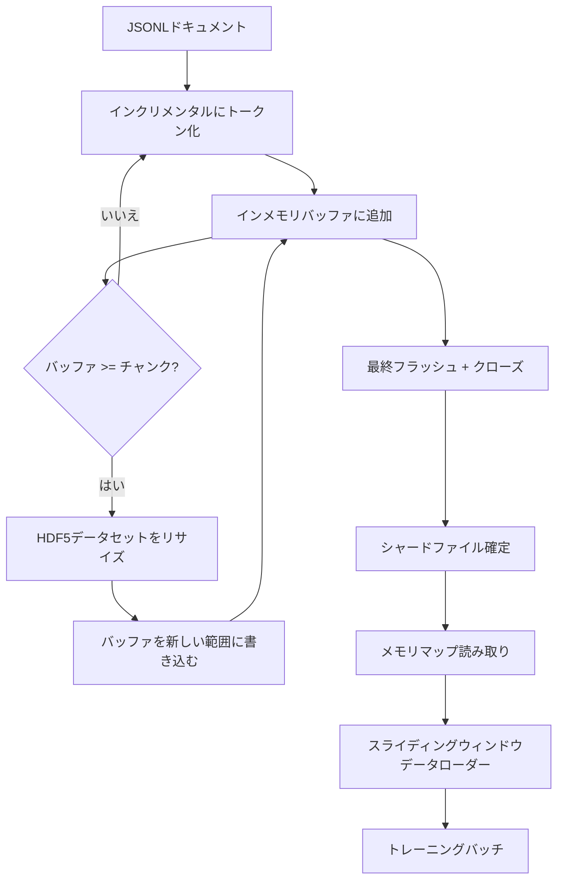

# HDF5 トークン化コーパス

> ダウンロードしたコーパスは、トレーナーが行速度でストリーミングできるレイアウトで保存する必要があります。ディスク上のJSONLは16個のデータローダーワーカーに耐えられません。リサイズ可能なチャンク付き整数データセットを持つHDF5ならば大丈夫です。このレッスンでは、リサイズ可能なHDF5データセットへのストリーミングトークン化、複数ファイルへの分割書き込み、トレーニング時のメモリマップ読み取り、固定長シーケンスを生成するスライディングウィンドウデータローダーを構築します。


## 学習目標

- ドキュメントを決定論的チャンキングを用いたリサイズ可能なHDF5整数データセットにストリーミングする。
- 障害範囲を限定し並列処理を可能にするために、書き込みを複数のHDF5ファイルにシャーディングする。
- データローダーがバッチ時にのみバッチバッファにコピーするよう、HDF5のページキャッシュ対応チャンクレイアウトを通じてトークンを読み取る。
- 明示的なパッキングルールで固定長トレーニングシーケンスを出力するスライディングウィンドウデータローダーを実装する。

## 問題

現代の言語モデルトレーニングでは、数十のワーカーが毎秒数十万サンプルのレートでトークンを読み取ります。ディスク上のJSONLは最初のコールドキャッシュページフォルトで死にます。JSONパーサーは遅く、ドキュメントの境界はアドレス指定できず、「サンプル4,217,884」へのシークにはファイルのスキャンが必要です。良好な圧縮を持つParquetでさえ、トレーナーが列を必要とせず、O(1)ランダムアクセスのフラットなトークンストリームを必要とするため適しません。

HDF5が適している理由は、チャンク化されたリサイズ可能な整数専用データセットを提供し、そのチャンクが読み取り時にページキャッシュフレンドリーだからです。トレーナーが`tokens[3,200,000 : 3,200,8192]`のスライスを要求すると、HDF5はページキャッシュからリクエストされたハイパースラブを新たに割り当てられたNumPy配列にコピーします。コストはワーカーごとに1つのオープンファイルハンドルとチャンクサイズのページキャッシュフットプリントだけで、JSONLのデコードコストと比べて無視できるほどです。

構築上の問題は書き込み側を正直にすることです。リサイズ可能なデータセットは誤用しやすい。一度に1ドキュメントずつ書き込むと、HDF5ファイルは使用不能なほど断片化します。すべてのドキュメントを一度にリサイズして書き込むと、プロセスの死亡でシャード全体が失われます。正しい規律はバッファしてから拡張することで、バッファサイズはチャンクサイズに合わせ、クラッシュで最大1つのシャードしか失わないように分割書き込みを行います。

## 概念



### 正しいリサイズ可能HDF5

トークンデータセットは`maxshape=(None,)`と固定`chunks=(chunk_size,)`で作成されます。書き込みは`chunk_size`長のNumPy配列にトークンをバッファリングして進みます。バッファがいっぱいになると、データセットは正確に`chunk_size`だけリサイズされ、バッファが新しい範囲に書き込まれます。シャード終了時に残りのバッファが最終的な部分範囲に書き込まれます。最後のチャンク以外のすべての書き込みは連続しチャンク整列されており、最後のチャンクはシャードのHDF5属性に記録された`token_count`でリーダーに切り詰めを指示します。

### シャーディング書き込み

単一のHDF5ファイルは単一障害点です。パイプラインは並列でシャードを書き込みます。フェーズ19レッスン42の各入力シャードが1つのHDF5出力シャードを生成します。`shards.json`インデックスはシャードごとにファイルパス、トークン数、ドキュメント数、トークンのsha256を記録します。トレーナーは`shards.json`を読んでグローバルオフセットを計算し、コーパスを検証します。

### メモリマップ読み取り

トレーニング時、各ワーカーが担当するHDF5ファイルを`swmr=True`モードで開き、`tokens[start:stop]`を要求します。HDF5のチャンクレイアウトにより、チャンクがホットになるとページキャッシュ対応の読み取りが行われます。ワーカーはファイル全体を実体化せず、スライスをデータローダーのバッチバッファにコピーし、データローダーがバッチ時にピンされたメモリトレーニングテンソルにコピーします。ホットパスはチャンク遷移ごとに1回のシステムコールのみで、それ以外はRAMアクセスです。

### スライディングウィンドウデータローダー

データローダーだけがトレーニングシーケンス長を知っています。グローバルトークンストリームでランダムな開始インデックスを選び、`window_size + 1`トークンを読み取り、`(input, target) = (tokens[:-1], tokens[1:])`を返します。ドキュメント境界は強制されず、ウィンドウは2つのドキュメントにまたがる可能性があり、その間に明示的な`boundary_token_id`があることでモデルがセパレーターの使用を学習します。これが標準的なパッキングルールであり、初心者が忘れると境界トークンが8%、自然テキストが92%のコーパスになります。

## 実装する

`code/main.py`が実装するもの：

- `Tokenizer` - デモに十分なバイトレベルの決定論的トークナイザー。インターフェースは`encode(text) -> list[int]`と`vocab_size`。
- `HDF5ShardWriter` - リサイズ可能な整数データセットを開き、チャンクサイズまでトークンをバッファリングし、固定サイズストライドでリサイズして書き込み、クローズ時にHDF5属性として`token_count`と`sha256`を記録する。
- `ShardedTokenizationPipeline` - 入力ドキュメントをイテレートし、ライターにルーティングし、`shards.json`インデックスを出力する。
- `MmapTokenStore` - メモリマップ読み取り用のシャードファイルを開き、グローバルオフセットを計算し、単一の`get_slice(start, stop)` APIを公開する。
- `SlidingWindowDataloader` - グローバルストリームからランダムウィンドウを選び、`(input_ids, target_ids)` NumPy配列を生成する。

ファイルの末尾のデモは、小さなインメモリコーパスを構築し、2つのシャードにトークン化し、メモリマップで開き、10バッチのデータローダーを実行し、各バッチの形状とチェックサムを出力します。

実行方法：

```bash
python3 code/main.py
```

スクリプトはゼロで終了し、バッチチェックサムを出力します。

## 本番パターン

4つのパターンでこのレッスンを実際のトレーニング実行にスケールさせます。

**チャンクサイズは典型的な読み取りと同じにする。** トレーナーはサンプルごとに`window_size + 1`トークンを読み取ります。HDF5チャンクを`window_size`の倍数に設定すれば読み取りがページキャッシュ整列されます。ミスマッチなチャンクは、すべてのサンプルが2つのチャンクにまたがるためスループットが半減します。

**データセットではなく属性にトークン数を保存する。** チャンクサイズがドキュメント境界で割り切れないため、データセットの末尾スライスが部分的に埋まることがあります。実際の`token_count`をデータセットのHDF5属性として保存し、リーダーにその値で切り詰めさせます。これがないと、リーダーはゼロパディングされたトークンの末尾に踏み込み、モデルがゼロを予測することを学習します。

**シャードごとのsha256による並列検証。** 各シャードはトークンバイトのsha256を持ちます。トレーナーはトレーニング開始前にすべてのシャードを並列検証できます。誤ったsha256は3エポック目ではなく早期に実行を失敗させます。

**両側で`swmr=True`、ライターは`libver="latest"`。** Single-Writer-Multiple-Readerモードでは、ライターが`libver="latest"`で開き、すべてのデータセットを事前に作成してから`file.swmr_mode = True`を設定する必要があります。その後、ライターは各リサイズ後に`dataset.flush()`を呼び出して、リーダーワーカー（`swmr=True`で開いた）が一貫したデータを確認できるようにします。`libver="latest"`を省略したり構造変更後にSWMRを有効にしたりすると「ファイルがロックされています」エラーの一般的な原因になります。

## 使ってみる

本番パターン：

- **ソースシャードごとに1つのHDF5。** ダウンローダー（レッスン42）はURLごとに1つのシャードを出力し、トークン化（このレッスン）はソースシャードごとに1つのHDF5を出力します。1:1マッピングにより再開と部分障害回復が簡単になります。
- **境界トークンID。** 境界トークンはトークナイザー語彙の一部で、データローダーが注入する唯一のトークンです。モデルがそれを無視すべき場合はトレーニング損失が境界トークンをマスクし、そうでない場合はシーケンスセパレーターとして使用することを学習します。
- **`shards.json`を唯一の真実の源とする。** 新しいシャードを追加するにはHDF5を書き、sha256を計算し、エントリを追記します。トレーナーは起動時に一度だけファイルを読み取り、ディレクトリリストには触れません。

## 成果物を出す

`outputs/skill-hdf5-tokenized-corpus.md`は実際のプロジェクトでは、どのトークナイザーがパイプラインを供給するか、どのチャンクサイズがトレーナーのウィンドウに合うか、`shards.json`がバージョン管理のどこにあるか、そしてデータローダーワーカーがどのようにファイルにシャーディングされるかを記述します。このレッスンはエンジンを実装します。

## 演習

1. HDF5ライターに`--compression gzip`フラグを追加し、デモコーパスでのスループットコストを測定する。選択したデフォルトを正当化すること。
2. スライディングウィンドウデータローダーに決定論的シードを追加し、同じシードで2回実行すると同一バッチが生成されることを検証する。
3. 各シャードを読み取り、トークンのsha256を再計算し、`shards.json`と比較する`--validate`モードを追加する。CIはトレーニング開始前にこれを実行すべき。
4. ウィンドウサイズと同じ、半分、2倍のチャンクサイズでデータローダーのスループットを比較する。ページキャッシュの効果を報告する。
5. 書き込み時に非常に長いドキュメントを切り詰める`--max-document-tokens`フラグを追加する。読み取り時に決定するのとのトレードオフを正当化すること。

## キーワード

| 用語 | よく言われること | 実際の意味 |
|------|-----------------|------------------------|
| リサイズ可能データセット | 「追記専用」 | チャンクサイズの刻みで`resize`呼び出しにより成長する`maxshape=(None,)`を持つHDF5データセット |
| チャンクレイアウト | 「HDF5の保存方法」 | カーネルがメモリマップできデータローダーが連続して読み取れる固定サイズのディスク上ページ |
| `swmr`モード | 「読み書き同時」 | データローダーワーカーがファイルを安全に共有できるSingle-Writer-Multiple-Readerモード |
| シャードインデックス | 「shards.json」 | オフセットとコンテンツハッシュを含む全トークンシャードの耐久性のあるインデックス |
| スライディングウィンドウ | 「トレーニングサンプル」 | トレーナーが1シフトターゲットとペアにするグローバルトークンストリームの固定長スライス |

## 参考資料

- [HDF5チャンキングドキュメント](https://docs.hdfgroup.org/hdf5/v1_14/) - このレッスンが使用するチャンク化リサイズ可能データセットレイアウト
- [h5pyユーザーガイド](https://docs.h5py.org/en/stable/) - HDF5のPythonバインディング
- [NumPyメモリマッピング](https://numpy.org/doc/stable/reference/generated/numpy.memmap.html) - h5pyが公開する読み取り側プリミティブ
- フェーズ19 · 42 - このレッスンがトークン化するダウンローダーの出力
- フェーズ19 · 44 - このデータローダーを消費するコサインスケジュール
- フェーズ19 · 45 - トレーニングステップをラップするAMPループ
