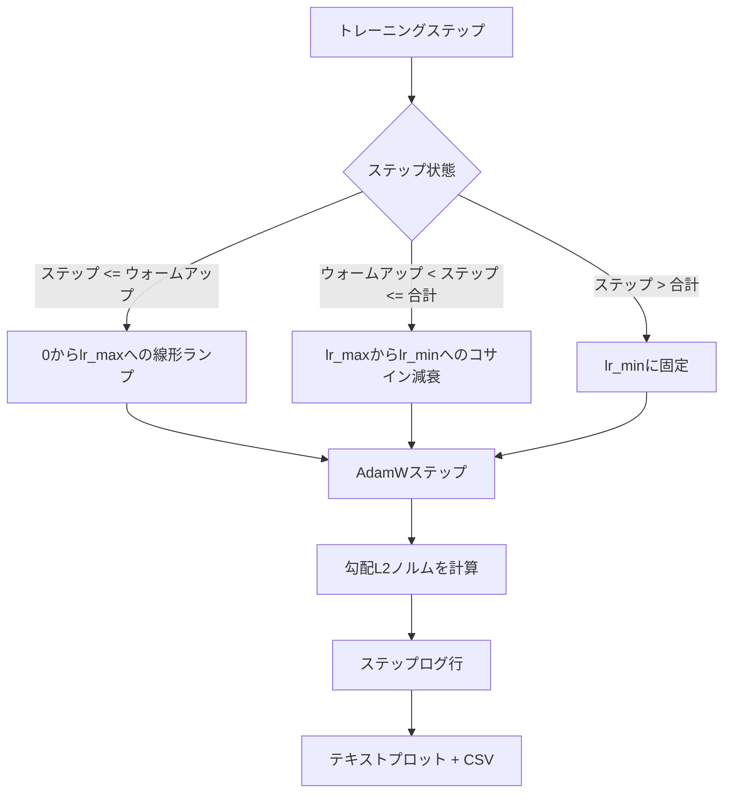

# 線形ウォームアップ付きコサインLR

> 学習率スケジュールは損失関数の次に重要な決定事項です。コサイン減衰と線形ウォームアップを備えたAdamWは、脆弱な最初の1000回の更新中に小さな有効ステップサイズをモデルに提示し、設定されたピークまでランプアップし、ゼロに向かって滑らかに減衰するため、言語モデルトレーニングの現代的なデフォルトです。このレッスンではそのスケジュールを構築し、トレーニングステップにわたって曲線をプロットし、スケジュールの隣に勾配ノルムをログし、スケジュールがウォームアップ・ピーク・減衰境界を遵守することを証明します。


## 学習目標

- 線形ウォームアップ付きコサイン学習率スケジュールと組み合わせたAdamWオプティマイザーを実装する。
- ランタイム間の浮動小数点ドリフトなしに、任意のステップでのスケジュールの正確な値を計算する。
- トレーニングの健全性を観察できるよう、学習率と並べて勾配L2ノルムをログする。
- 目で読めるテキストプロットとあらゆるツールが使えるCSVにスケジュールをレンダリングする。

## 問題

最初の1000回のトレーニング更新は最もノイジーです。モデルの重みはまだ初期化に近い状態です。オプティマイザーの二次モーメント推定が安定していません。勾配ノルムは大きくノイジーです。これらの更新中に学習率がピークにあると、モデルは直接発散するか、決して抜け出せない損失プラトーに落ち着きます。2つの既知の解決策は勾配クリッピング（フェーズ19レッスン45の主題）と、小さく始まってランプアップする学習率スケジュールです。

コサイン+ウォームアップスケジュールには3つの領域があります。ステップゼロからステップ`warmup_steps`まで、学習率はゼロから設定されたピーク`lr_max`まで線形にスケールします。ステップ`warmup_steps`からステップ`total_steps`まで、学習率は`lr_max`から`lr_min`へコサイン曲線の上半分に従います。`total_steps`後、設定ミスのトレーナーがオーバーシュートしてもサイレントにスケジュールを終了しないよう、学習率は`lr_min`に固定されます。

構築上の問題はスケジュールがオフバイワンで間違いやすいことです。オフバイワンはトレーニング実行の6時間後に、モデルが過学習し始めた瞬間に学習率が1%高すぎたり低すぎたりするとして現れますが、スケジュールが境界で徹底的にテストされない限り見えません。

## 概念



### ウォームアップ式

`warmup_steps > 0`の場合、`[0, warmup_steps]`の`step`に対して学習率は`lr_max * step / warmup_steps`です。退化した`warmup_steps = 0`の場合は「ウォームアップなし」として扱われます。スケジュールはステップゼロで直接`lr_max`から始まり、即座にコサイン減衰に入ります。一部のテストハーネスはスケジュールが依然として使用可能な曲線を生成することを確認するために`warmup_steps = 0`を渡します。

### コサイン式

`step`が`(warmup_steps, total_steps]`の場合、学習率は`lr_min + 0.5 * (lr_max - lr_min) * (1 + cos(pi * progress))`で、`progress = (step - warmup_steps) / max(1, total_steps - warmup_steps)`です。`step = warmup_steps`でコサインは`cos(0) = 1`と評価され、`lr_max`を与えてウォームアップの終点と正確に一致します。`step = total_steps`でコサインは`cos(pi) = -1`と評価され、`lr_min`を与えて減衰の終点と正確に一致します。

両端点での連続性は偶然ではありません。スケジュールが3つの異なる関数を繋ぎ合わせるのではなく、`step`上の単一の関数として実装されている理由です。繋ぎ合わせたスケジュールは`lr_max`を初めて変更したときに1つの境界を失います。

### total_steps後のフロア

`step > total_steps`の場合、学習率は`lr_min`に留まります。契約は明示的です。スケジュールはエラーを起こさず外挿もしません。フロアに固定し、トレーナーに警告をログさせます。トレーニングを延長する必要があるトレーナーはループではなくスケジュールの`total_steps`を変更します。

### 学習率に隣接した勾配ノルムロギング

スケジュールはトレーニングの健全性の半分です。勾配ノルムがもう半分です。トレーニングループはステップごとに両方をログします。発散するトレーニング実行は損失が上がる前に勾配ノルムが急増します。適切に調整されたウォームアップはノルムを学習率と線形に上昇させます。過度に積極的なピークはウォームアップ後もノルムが高いままとして現れます。ディスク上のデータセットは`step, lr, grad_l2_norm, loss`です。CSVが唯一の耐久性のある記録です。

## 実装する

`code/main.py`が実装するもの：

- `CosineWithWarmup` - 設定されたスケジュール上のステートレスな関数`lr(step) -> float`。
- `TrainState` - モデル、`AdamW`オプティマイザー、スケジュールを1つのステップ関数にラップする。
- `TrainState.step` - 1回のフォワードパス、1回のバックワードパスを実行し、勾配L2ノルムをログし、`lr(step)`をオプティマイザーに適用する。
- `plot_schedule_ascii` - スケジュールを目で読めるテキストプロットとしてレンダリングする。
- `write_schedule_csv` - 学習率を含む1ステップ1行を出力する。

ファイル末尾のデモは小さな`nn.Linear`モデルを構築し、固定入力バッチで20ステップトレーニングし、ステップごとの学習率、勾配ノルム、損失を出力します。スケジュールはテキストプロットとしてもレンダリングされます。

実行方法：

```bash
python3 code/main.py
```

スクリプトはゼロで終了し、ステップごとのトレーニングログとスケジュールプロットを出力します。

## 本番パターン

4つのパターンでスケジュールを本番アーティファクトに高めます。

**スケジュールはコードではなく設定ファイルに置く。** トレーナーはgitにコミットされたYAMLまたはJSON設定ファイルから`warmup_steps`、`total_steps`、`lr_max`、`lr_min`を読み取ります。スケジュールは設定がコンテンツアドレス指定されるため再現可能で、設定がPR差分の一部であるため監査可能です。

**ステップカウンターは単調でエポックから分離されている。** 一部のフレームワークはデータセットがシャーディングされていたりデータローダーが再起動したりするとステップとエポックを混同します。スケジュールはローカルカウンターではなくトレーナーのチェックポイントから`global_step`を読み取ります。再開した実行はステップカウンターが耐久性のある軸であるため、正しいスケジュール位置で継続します。

**実行ディレクトリにスケジュールプロット。** すべてのトレーニング実行が実行ディレクトリに`outputs/lr_schedule.png`（またはこのレッスンではテキストプロット）を書き込みます。ディレクトリを斜め読みするレビュアーが何も再実行せずにスケジュールを確認できます。これはPR時に設定ミスのスケジュールクラスのバグを発見します。

**ログ行スキーマは固定。** `step, lr, grad_l2_norm, loss`この順番で。ダウンストリームのノートブックやダッシュボードがスキーマを読み取ります。バージョンを上げずに列名を変更すると既存のすべてのダッシュボードが無効になります。

## 使ってみる

本番パターン：

- **まず他の何かを調整する前にピークを調整する。** `lr_max`が最も敏感なノブです。最初に小さなモデルで調整します。最適な`lr_max`はモデルサイズによって弱くスケールするため、小モデルスイープは強い先行情報です。
- **ウォームアップは絶対カウントではなくtotal_stepsの割合にする。** 2,000ウォームアップステップの2億ステップ実行はほぼ即座にピークから始まります。同じ数の20,000ステップ実行は10%ウォームアップします。スケジュールがトレーニング期間でスケールするよう、ウォームアップを割合（典型的には1〜3%）で設定します。
- **`lr_min`は意図的に非ゼロ。** `lr_max`の10%のフロアはオプティマイザーが長いテールでも学習し続けることを保ちます。`lr_min = 0`のスケジュールはプロットで見栄えが良く、実際にはトレーニングを完了していないモデルを生成します。

## 成果物を出す

`outputs/skill-cosine-warmup.md`は実際のプロジェクトでは、どの設定がスケジュールを持つか、グローバルカウンターがどのトレーナーステップから読み取られるか、デプロイされた値を生成した`lr_max`スイープが何かを記述します。このレッスンはエンジンを実装します。

## 演習

1. スケジュールの逆平方根バリアントを追加し、200ステップのおもちゃのトレーニング実行で比較する。どの曲線がより低い最終損失を生成するか？
2. `total_steps / 2`で2回目のウォームアップを追加する`--restart`フラグを追加する。おもちゃの実行でウォームリスタートが改善か悪化かを正当化すること。
3. スケジュールが連続であることのユニットテストを追加する。`[0, total_steps]`のすべてのステップで差`|lr(step+1) - lr(step)|`が`lr_max / warmup_steps`で有界であること。
4. スケジュールをフレームワークコードと組み合わせられるよう`torch.optim.lr_scheduler.LambdaLR`に組み込む。レッスンはプレーンなステップ関数を使用します。ラッパーは何を変えますか？
5. `matplotlib`で実際のプロットを書く`--plot-png`フラグを追加する。レッスンのテキストプロットとPNGのどちらがCIの実行のより良いデフォルトかを正当化すること。

## キーワード

| 用語 | よく言われること | 実際の意味 |
|------|-----------------|------------------------|
| ウォームアップ | 「スロースタート」 | 最初の`warmup_steps`回の更新にわたってゼロから`lr_max`への線形ランプ |
| コサイン減衰 | 「スムーズな降下」 | 残りのステップにわたって`lr_max`から`lr_min`へのコサイン曲線の上半分 |
| フロア | 「トレーニング後」 | スケジュールが`total_steps`後に固定する`lr_min`値 |
| 勾配ノルム | 「勾配のL2」 | 各ステップでログされる連結勾配ベクトルのユークリッドノルム |
| グローバルステップ | 「スケジュール軸」 | 再起動を経ても維持されスケジュールを駆動する単調なステップカウンター |

## 参考資料

- [LoshchilovとHutter、SGDR：Warm RestartsによるStochastic Gradient Descent (arXiv 1608.03983)](https://arxiv.org/abs/1608.03983) - コサインスケジュールの参考論文
- [LoshchilovとHutter、Decoupled Weight Decay Regularization (arXiv 1711.05101)](https://arxiv.org/abs/1711.05101) - AdamWの参考論文
- [PyTorch torch.optim.lr_scheduler](https://docs.pytorch.org/docs/stable/optim.html#how-to-adjust-learning-rate) - ステップ関数がフレームワークスケジューラーとどのように組み合わせるか
- フェーズ19 · 42 - このスケジュールが消費するコーパスのダウンローダー
- フェーズ19 · 43 - スケジュールが共進化するデータローダー
- フェーズ19 · 45 - ループの次のレイヤーである勾配クリッピングとAMP
