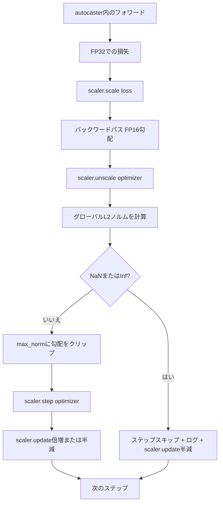

# 勾配クリッピングと混合精度

> 前のレッスンのオプティマイザーとスケジュールは勾配が正常であることを前提としています。実際はそうでないことが多いです。たった1つの悪いバッチが勾配ノルムを3桁上昇させることがあります。混合精度トレーニングはFP16のオーバーフローによって損失側でこれを増幅します。このレッスンでは本番トレーニングに欠かせない2つの安全ベルトを構築します。設定されたグローバルL2ノルムへの勾配クリッピングと、NaNとInfを検出し、ステップをクリーンにスキップし、フォレンジクスのためにスケーリングファクターをログするautcastとGradScalerを使った混合精度ループです。


## 学習目標

- 全パラメーター勾配のグローバルL2ノルムを計算し、設定されたしきい値を超えたときにインプレースでクリップする。
- FP16フォワードとバックワードパスがオーバーフローを乗り越えられるよう、autcastとGradScalerでトレーニングステップをラップする。
- 損失または勾配のNaNとInfを検出し、オプティマイザーステップをスキップし、スキップをログする。
- GradScalerのスケーリングファクターを毎ステップ報告して、長いスキップの連続が即座に見えるようにする。

## 問題

昨日クリーンに実行されたトレーニング実行が、ステップ8,217で損失曲線が垂直になります。原因は勾配ノルムが4,200（前のピークの20倍）の1つのバッチです。クリッピングなしでは、オプティマイザーはモデルが前の1時間で学習したすべてをリセットするステップを適用します。ノルム1.0でのグローバルL2クリップがあれば、同じバッチが単位ノルムの更新を行います。損失はそのトレンドラインに留まります。実行は生き残ります。

混合精度トレーニングはFP16でフォワードパスとバックワードパスの大部分を計算することで、スループットを2〜3倍向上させます。コストはFP16の指数範囲が狭いことです。FP16でオーバーフローする典型的な勾配はInfと評価され、後続のレイヤーにNaNとして伝播し、次のオプティマイザーステップですべての重みをNaNに設定します。PyTorchのGradScalerはバックワードパス前に大きなスケーリングファクターで損失を乗算し、オプティマイザーステップ前に同じファクターで勾配を除算することでこれを解決します。アンスケール時に勾配がInfまたはNaNの場合、スケーラーはステップをスキップしてスケーリングファクターを半分にします。前のNステップがクリーンだった場合、スケーラーはファクターを2倍にします。トレーニング中にファクターはFP16範囲が許す最高値を見つけます。

構築上の問題は2つを正しく組み合わせることです。アンスケール前にクリップするとしきい値はスケールされた勾配にかかります。アンスケール後にクリップするとGradScalerの操作順序が重要になります。正しい順序は`scaler.scale(loss).backward()`、次に`scaler.unscale_(optimizer)`、次に`clip_grad_norm_`、次に`scaler.step(optimizer)`、次に`scaler.update()`です。その他の順序はサイレントに壊れたループを生成します。

## 概念



### グローバルL2ノルム

グローバルL2ノルムはパラメーターごとのノルムではなく、連結された勾配ベクトルのユークリッドノルムです。PyTorchはこれを`torch.nn.utils.clip_grad_norm_(parameters, max_norm)`として実装しています。この関数はクリップ前ノルムを返すため、レッスンは自然値とクリップ後の値の両方をログでき、「すべてのステップでクリッピングしている」という診断に必要です。

### autocasterとGradScaler

`torch.amp.autocast(device_type)`は、対象となる演算（ほとんどのmatmul系演算）をFP16で選択的に実行するコンテキストマネージャーです。`torch.amp.GradScaler(device_type)`はバックワード前に損失をスケールし、オプティマイザーステップ前に勾配を逆スケールするヘルパーです。2つは一緒に設計されています。一方なしに他方を使用することはテストが捕捉すべき設定エラーです。

このレッスンはCIで実行されるものであるためCPU autocasterを使用します。`device_type="cpu"`を`device_type="cuda"`に変更するだけで同じパターンがGPUに転用されます。CPU上のGradScalerはスタブです（CPU autocasterはデフォルトでBF16で動作し、損失スケーリングを必要としません）が、レッスンはGPUループと配線が同一になるよう呼び出しサイトを含みます。

### NaNとInfの検出

検出は2か所で行われます。まず、損失自体がバックワード前に`torch.isfinite`で確認されます。InfまたはNaNの損失は有用な勾配を生成しないため、オプティマイザーに入らずにスキップされます。次に、`scaler.unscale_(optimizer)`後にレッスンは`has_non_finite_grad(...)`でアンスケールされた勾配をスキャンし、InfまたはNaNをスキップとして扱います。2つのチェックが一緒にフォワードパスとバックワードパスの両方の障害モードをカバーします。

### スケーリングファクター診断

スケーリングファクターはGradScalerの内部状態です。毎ステップ、レッスンは`scaler.get_scale()`を読み取り、学習率と勾配ノルムの隣にログします。健全な実行では`2^17`または`2^18`付近で飽和するまでスケーリングファクターが2の累乗で上昇します。誤動作する実行では、モデルの勾配が範囲内のときと外のときがあることを示す、高低の間でファクターが振動します。この診断はロギングなしには見えません。

## 実装する

`code/main.py`が実装するもの：

- `clip_global_l2_norm` - クリップ前後のノルムを返す`torch.nn.utils.clip_grad_norm_`のラッパー。
- `has_non_finite_grad` - NaNとInfの勾配をスキャンするヘルパー。
- `AmpTrainState` - モデル、`AdamW`オプティマイザー、GradScaler、autocasterデバイスをラップする。完全なクリッピング、スケーリング、NaN時スキップパイプラインを実行する`step(inputs, targets)`を公開する。
- `StepLog`と`SkipLog` - 構造化されたステップごとのレコード。
- ステップ5で勾配にInfを注入してスキップパスを実行し、結果のログを出力する、小さな`nn.Linear`モデルを20ステップトレーニングするデモ。

実行方法：

```bash
python3 code/main.py
```

スクリプトはゼロで終了し、各行が`STEP`または`SKIP`とタグ付けされたステップごとのログを出力します。少なくとも1行は`SKIP`です。

## 本番パターン

4つのパターンでループを本番トレーニングステップに高めます。

**スキップカウンターをログ行ではなくアラートとして使う。** トレーニング実行ごとに数回のスキップステップは健全です。エポックごとに数百回のスキップはハードアラートです。モデルはFP16が保持できないレジームにあり、ループはサイレントに失敗しています。レッスンは1,000ステップのローリングスキップレートを追跡し、本番環境では5%を超えるレートでページングします。

**クリップしきい値は設定ファイルに。** `max_norm = 1.0`は言語モデルトレーニングの現代的なデフォルトです。まず小さなモデルで調整します。大きなしきい値では本当に難しいバッチからモデルが回復できます。小さなしきい値はより多くのノイジーな損失曲線を代償に最悪ケースを制限します。しきい値はレッスン44のスケジュールと同じYAMLまたはJSON設定ファイルに属します。

**ノルムログをスケジュールのCSVに。** CSVカラムは`step, lr, grad_l2_pre_clip, grad_l2_post_clip, loss, skipped, skip_reason, scaler_scale`です。ファイルを開くレビュアーは1行でスケジュール、勾配ストーリー、スケーリングファクター、スキップ結果（理由付き）を確認できます。カラムをファイルに分割するとアラインされない分析のレシピになります。

**`scaler.update()`はスキップ時を含む毎ステップ実行する。** クリーンなステップでスケーラーはno-infカウンターを読み取り、インクリメントし、ファクターを2倍にする可能性があります。スキップされたステップでスケーラーはファクターを半分にしてカウンターをリセットします。スキップパスで`update()`を忘れることが「スケーリングファクターが変わらない」バグを生成します。

## 使ってみる

本番パターン：

- **autocasterデバイスはオプティマイザーデバイスと一致する。** GPUトレーニングには`torch.amp.autocast(device_type="cuda")`、CPUには`torch.amp.autocast(device_type="cpu")`。デバイスを混在させるとサイレントな型エラーが発生し、損失曲線は正常に見えるが学習していないモデルとして現れます。
- **バックワード前に損失チェック。** `torch.isfinite(loss).all()`は1つのテンソル還元です。コストは無視できるほど小さく、NaN損失での節約はトレーニングステップ全体です。常に実行してください。
- **`zero_grad`で`set_to_none=True`。** 勾配をゼロではなく`None`に設定し、オプティマイザーが影響を受けないパラメーターグループの計算をスキップできます。この設定は無料のスループット改善と若干のバグ表面削減です。

## 成果物を出す

`outputs/skill-clip-amp.md`は実際のプロジェクトでは、トレーニングステップが使用するクリップしきい値とautocasterデバイス、ステップごとのCSVがバージョン管理のどこにあるか、本番のスキップレートアラートしきい値が何かを記述します。このレッスンはエンジンを実装します。

## 演習

1. 合成Inf注入を実際の損失スパイク（1つのバッチのターゲットに1e8を乗算）に置き換え、スキップパスがトリガーされることを確認する。
2. autocasterをFP16の代わりにBF16に切り替える`--bf16`モードを追加する。BF16はFP16より広い指数範囲を持ちスケーリングをほとんど必要としません。同じデモでスキップレートがゼロに落ちることを確認する。
3. クリッピングが発生しない場合に勾配クリップラッパーがクリップ前後のノルムを正しく返すユニットテストを追加する。
4. ローリングウィンドウスキップレート計算と、100連続ステップで設定されたしきい値を超えた場合に実行を失敗させるCLIフラグを追加する。
5. 標準CSVを書き込むようにループを組み込み（`step, lr, grad_l2_pre_clip, grad_l2_post_clip, loss, skipped, skip_reason, scaler_scale`）、毎行後にフラッシュすることでCtrl-Cに耐えることを確認する。

## キーワード

| 用語 | よく言われること | 実際の意味 |
|------|-----------------|------------------------|
| グローバルL2ノルム | 「クリップターゲット」 | すべてのトレーニング可能なパラメーターにわたる連結勾配ベクトルのユークリッドノルム |
| autocast | 「混合精度」 | `with`ブロック内での対象演算の選択的FP16（またはBF16）実行 |
| GradScaler | 「損失スケーラー」 | バックワード前に損失を乗算し、オプティマイザーステップ前に勾配を逆スケールするヘルパー |
| スキップ | 「悪いステップ」 | 勾配または損失が非有限だったため拒否されたオプティマイザーステップ。スケーラーはファクターを半減 |
| スケーリングファクター | 「スケーラー状態」 | GradScalerの現在の乗数。クリーンな区間後に2倍になり、スキップごとに半減 |

## 参考資料

- [Micikevicius et al.、Mixed Precision Training (arXiv 1710.03740)](https://arxiv.org/abs/1710.03740) - 元の損失スケーリング提案
- [Pascanu、Mikolov、Bengio、On the difficulty of training recurrent neural networks (arXiv 1211.5063)](https://arxiv.org/abs/1211.5063) - 勾配クリッピングの参考論文
- [PyTorch torch.amp.GradScaler](https://docs.pytorch.org/docs/stable/amp.html) - このレッスンがラップするスケーラーAPI
- [PyTorch torch.nn.utils.clip_grad_norm_](https://docs.pytorch.org/docs/stable/generated/torch.nn.utils.clip_grad_norm_.html) - このレッスンが使用するクリッピングプリミティブ
- フェーズ19 · 42 - ループを供給するコーパスのダウンローダー
- フェーズ19 · 43 - ループが消費するデータローダー
- フェーズ19 · 44 - このループが組み合わせるスケジュール
