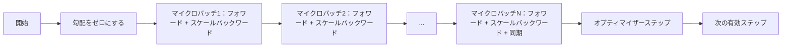
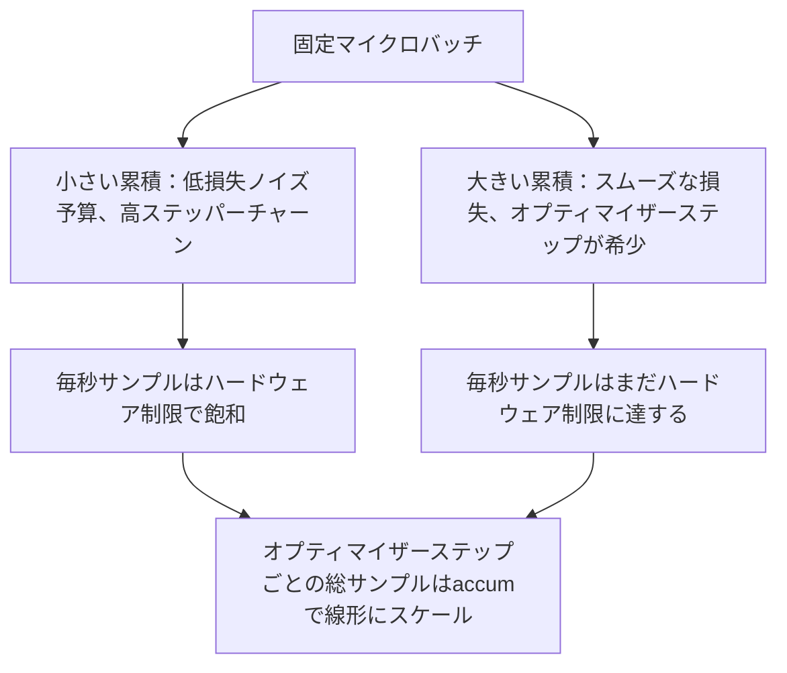

# 勾配累積

> 負担できない有効バッチサイズで1マイクロバッチずつトレーニングする。損失をスケールし、オプティマイザーステップを保留し、勾配を積み上げていく。


## 学習目標

- 有効バッチの等式を導出する：`effective_batch = micro_batch * accum_steps`
- 累積された勾配が1回のフルバッチバックワードと一致するよう、マイクロバッチごとの損失スケーリングを実装する。
- 最後のマイクロバッチまでオプティマイザーの同期をスキップする（最終ステップでの同期）。
- スループット対有効バッチ曲線を読んで逓減収益を説明する。

## 問題

損失曲線がスムーズになり、オプティマイザーステップがそのスケールでより理にかなっているため、有効バッチ512でトレーニングしたい。手元のアクセラレーターはメモリが尽きる前に32サンプルしか保持できません。バッチを倍にするのは選択肢にありません。モデルを半分にするのも選択肢にありません。2017年に分野が頼り、使い続けている技術は16回のバックワードパスを実行し、パラメーターバッファ内に勾配を累積させ、カウントがターゲットに達したときだけオプティマイザーをステップさせることです。

リスクは損失がより大きなバッチのときと同じ数字でなくなることです。16ミニバッチのクロスエントロピーをそのまま合計すると1フルバッチの損失の16倍になります。スケーリングなしでは、勾配の方向は正しいが大きさが間違っており、オプティマイザーのステップが16倍大きすぎます。解決策は1回の除算です。そして忘れやすいです。

## 概念



契約は短いです：

- 各マイクロバッチの損失は`backward()`前に`accum_steps`で除算されます。PyTorchはデフォルトで`param.grad`に勾配を合算します。除算によって累積合計が正しいスケールに戻ります。
- オプティマイザーのステップは、最後のマイクロバッチのバックワード後、有効バッチごとに1回だけ発動します。累積の途中でステップすると、残りの実行が依存するすべてのパラメーターが歪みます。
- オプティマイザーの状態（モーメンタムバッファ、Adamモーメント）はマイクロバッチごとではなく、有効ステップごとに1回進みます。指数移動平均は、そうでなければ間違った頻度を見て、スケジュールを使い果たします。
- 単一デバイスではこれはブックキーピングです。マルチランクのクラスタでは、同じパターンが非最終マイクロバッチを`no_sync`コンテキストにラップして勾配all-reduceをスキップします。最後のマイクロバッチはN回ネットワークコストを払う代わりに1回のパスで完全な累積勾配を削減します。

### コードでの等価性証明

```python
loss = criterion(model(x_full), y_full)
loss.backward()
opt.step()
```

は以下と等価です

```python
for x, y in chunks(x_full, y_full, n):
    scaled = criterion(model(x), y) / n
    scaled.backward()
opt.step()
```

浮動小数点の合計順序まで。ループ終了時の累積勾配バッファは、1回のフルバッチバックワードが生成するテンソルと同じです。レッスンコードは`equivalence_check`で1e-4未満の最大絶対差でこれをアサートします。

### コストの行き先

各マイクロバッチは1回のフォワードと1回のバックワードのコストがかかります。累積でメモリを時間と交換します。`outputs/accum-curve.json`のスループット曲線は、固定マイクロバッチで有効バッチが増えると何が起こるかを示します：



無料の昼食はありません。`accum_steps`を2倍にすると、オプティマイザーステップごとのウォールタイムが2倍になります。変わるのは勾配推定の分散です。同じウォール予算で、より少ないオプティマイザーステップを行いましたが、各ステップはより多くのサンプルを平均化しました。文献は大バッチと小バッチを異なる最適化問題として扱います。ここでのレッスンは統計的ではなく機械的です。

## 実装する

`code/main.py`が実行可能なアーティファクトです。3つのことを行います。

### ステップ1：等価性チェック

`equivalence_check()`は同じシードで同じネットワークの2つのコピーを構築します。1つは1回のフォワードパスで16サンプルのバッチを見ます。もう1つは損失を4で割った4つの4サンプルチャンクを見ます。関数はオプティマイザーステップ前の勾配バッファと後のパラメーターを比較します。アサーションは`max_abs_diff < 1e-4`です。

### ステップ2：最終ステップでの同期パターン

`train_one_optimizer_step`はマイクロバッチを歩きます。最後以外のすべてのマイクロバッチに対して`no_sync_context(model)`に入ります。単一プロセスではコンテキストはno-opです。DDPではここで勾配all-reduceがスキップされます。ブックキーピングは関係なく同じです。`sync_counter`はno_syncスコープを出た回数を記録します。Nマイクロバッチの場合、カウントは有効ステップごとに1です。

### ステップ3：スループット曲線

`sweep_effective_batches`は固定マイクロバッチと累積ステップのリストで同じモデルを実行します。各設定で以下をログします：

- `samples_per_sec`：ウォールタイムで割った総サンプル数
- `median_step_ms`：有効ステップごとの50パーセンタイル
- `sync_calls`：実行された集合ポイント
- `avg_loss`：スイープのオプティマイザーステップ全体の平均

出力は`outputs/accum-curve.json`に保存され、ノートブックから再利用可能です。

実行方法：

```bash
python3 code/main.py
```

スクリプトは等価性差分、次にスイープテーブル、次にJSONパスを出力します。終了コードゼロ。

## 使ってみる

本番トレーニングでは、勾配累積は1つのノブの後ろに置かれます。PyTorchのパターンは`accumulation_steps = effective_batch // (micro_batch * world_size)`です。ここでは使えないフレームワークが同じループをラップしますが、ステップは同じです：損失をスケールし、非最終マイクロで同期をスキップし、累積し、1回ステップします。

実際の3つのパターン：

- マイクロバッチサイズはデバイスメモリを飽和させるよう選ばれます。それより小さいとアクセラレーターサイクルが無駄になります。それより大きいとクラッシュします。
- 有効バッチは学習率スケジュールから選ばれます。大きな有効バッチにはスケールされた学習率とウォームアップが必要です。2017年以来語られてきた線形スケーリングルールです。
- 累積カウントは2つの橋渡しで、データローダーを書き直すことなく実行時に調整できる唯一のノブです。

## 成果物を出す

`outputs/skill-gradient-accumulation.md`はレシピを新しいリポジトリに組み込めるよう記録します：`accum_steps`で損失をスケール、非最終マイクロでオプティマイザー同期をスキップ、有効バッチごとに1回オプティマイザーをステップ、スループット対有効バッチをJSONとしてログしてトレードオフを見えるようにする。

## 演習

1. `--num-steps 100`でスイープを再実行し、毎秒サンプル対有効バッチをプロットする。どこで曲線が平坦になるか？
2. 間違ったスケーリングバリアント（除算なし）を追加し、参照に対してステップ1でのパラメーター差を示す。
3. SGDをAdamWに交換し、オプティマイザーの状態がマイクロバッチごとではなく有効ステップごとに1回進むことを確認する。
4. 本物の`DistributedDataParallel`ラッパーを導入し、`no_sync_context`をそのメソッドにルーティングする。有効バッチごとにsync_callsがN-1減少することを確認する。
5. 等価性チェックを2つの異なるマイクロ分割（2×8対4×4）を比較するよう修正し、緩和する必要がある許容値を説明する。

## キーワード

| 用語 | よく言われること | 実際の意味 |
|------|-----------------|------------------------|
| マイクロバッチ | フォワードするバッチ | 1回のフォワードパスでメモリに収まるスライス |
| 累積ステップ | ステップごとのバックワードパス | 1回のオプティマイザーステップ前に合算されるバックワード数 |
| 有効バッチ | バッチ | マイクロバッチ × 累積ステップ × データ並列ワールドサイズ |
| 損失スケーリング | Nで割る | 合算勾配がフルバッチと一致するようマイクロバッチごとの除算 |
| 最終でのみ同期 | 他はスキップ | 累積ウィンドウの最後のバックワードでのみ勾配集合を実行 |

## 参考資料

- 最終ステップでの同期トリックの本番バージョンについての`DistributedDataParallel.no_sync`に関するPyTorchドキュメント。
- Goyal et al.、2017年、大バッチトレーニングのための線形スケーリング。有効バッチを気にする標準的な理由。
- 混合精度アンスケーリングとの勾配累積の相互作用に関するPyTorchイシュートラッカー。
- フェーズ19 レッスン42〜45はこのレッスンが前提とするモデル、データローダー、オプティマイザー、トレーナースキャフォールディングをカバーします。
- フェーズ19 レッスン47は、長い累積実行がウォールクロックキャップを乗り越えられるようにするチェックポイントと再開をカバーします。
