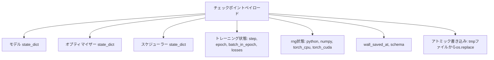
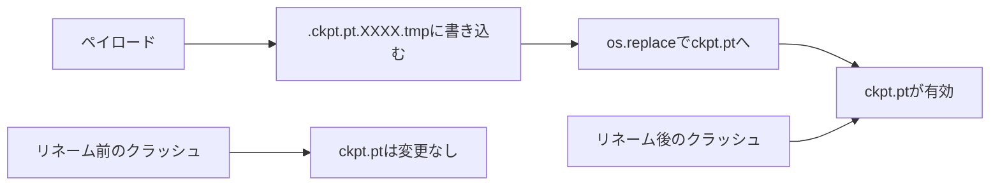
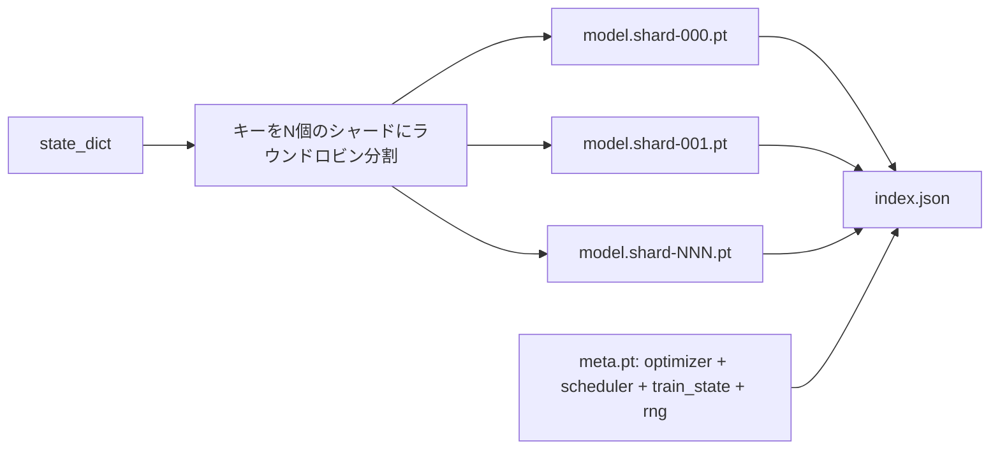

# チェックポイントの保存と再開

> トレーニングの中断は実行を台無しにします。チェックポイントによって継続できます。モデル、オプティマイザー、スケジューラー、損失履歴、ステップカウンター、RNG状態を、どのタイミングでクラッシュしても有効なファイルをディスクに残すようアトミックに保存します。


## 学習目標

- 完全なトレーニング状態を、新しいプロセスにリロードできる単一ペイロードにキャプチャする。
- クラッシュが半書き込みファイルを残さないよう、一時ファイルへの書き込み後にリネームするアトミック保存を実装する。
- 再開後の損失が中断なしのベースラインと一致するよう、Python、NumPy、PyTorchのRNG状態を復元する。
- ハッシュ検証されたシャードとJSONインデックスを持つ、単一ファイルに収まらないモデル用のシャード化チェックポイントレイアウトを構築する。

## 問題

18時間のトレーニングジョブを設定します。ウォールクロックキャップは4時間です。クラスタは11時間目に誰かが許可したカーネルアップグレードのために再起動します。チェックポイントなしでは最初からやり直しです。再開なしでは、モデルの重みが存命でも、AdamWのモーメントが消えているため最初の11時間で学習したオプティマイザー状態を失い、次のステップはトレーニング軌跡がすでに通り過ぎた方向に進みます。

正しいアーティファクトは継続に必要なすべてを保持する単一ファイルです：モデルパラメーター、オプティマイザー状態、スケジューラー状態、プロット用の損失履歴、現在のステップとエポックとエポック内バッチカウンター、そしてすべてのランダム性源のRNG状態。RNG状態なしでは、再開した損失曲線は異なる曲線です。同じモデル、同じデータ、異なるシャッフル、異なるドロップアウトマスク、ダッシュボード上の異なる数字。

アトミック保存は契約のもう半分です。最終ファイル名に書き込むと、書き込み途中のクラッシュが破損したファイルを残します。再開はゴミを読みます。同じディレクトリの一時ファイルに書き込んでからリネームすると、書き込み途中のクラッシュが以前の良いファイルを無傷のまま残します。リネームはPOSIXファイルシステムでアトミックです。

## 概念



### 5つの状態バケット

| バケット | 重要な理由 |
|--------|----------------|
| モデル | 重みとバッファ。モデルが何であるか。 |
| オプティマイザー | モーメンタムと適応モーメント。これらなしでは次のステップは異なる最適化問題です。 |
| スケジューラー | 学習率がその曲線のどこにあるか。特にコサインスケジュールは気にします。 |
| トレーニングカウンター | ステップ、エポック、エポック内バッチ、さらにダッシュボードを描く損失履歴。 |
| RNG状態 | ドロップアウト、データシャッフリング、モデル内のサンプリングのための決定論性。 |

### アトミック保存



2つのルール。まず、一時ファイルはターゲットと同じディレクトリに置かれ、リネームが同じファイルシステム内に収まるようにします。クロスデバイスリネームはアトミックではありません。次に、一時名は試みごとにユニークで、2つのライターが踏み込まないようにします。

### シャード化チェックポイント

モデルが大きくなると、単一ファイルのペイロードは高速に読み込むには大きすぎ、検査するには大きすぎ、ネットワーク共有が途中でつまずくと苦痛です。解決策はパラメーター状態をシャードに分割し、それらを結びつける小さなインデックスを書くことです。



インデックスはシャード数、各シャードのsha256、メタファイルのsha256を記録します。ローダーはハッシュが一致しない場合に大きな声で失敗します。シャードは異なる物理ディスクに置けます。メタは小さく最初に読まれます。

### 再開はエポックの途中から継続

次のエポックの開始にスナップする再開はどこかで数分から1日を無駄にします。解決策は`(epoch, batch_in_epoch)`とRNG状態です。ロード後、トレーニングループは現在のエポックでもう消費されたバッチを超えて乱数生成器を早送りし、`batch_in_epoch`から続行します。レッスンコードはこれを正確に行います。アサーションは再開後の損失軌跡が1e-4以内で中断なしのベースラインと一致することです。

## 実装する

`code/main.py`は4つのプリミティブとデモドライバーを提供します。

### ステップ1：RNG状態のキャプチャと復元

`capture_rng_state`はPythonの`random.getstate`、NumPyの`np.random.get_state`、PyTorchのCPUとCUDA RNGバイトを持つdictを返します。`restore_rng_state`はそれを逆にします。CPUテンソルはuint8バイトバッファで、PyTorchのRNGが消費することを知っています。

### ステップ2：アトミック保存

`atomic_save`はペイロードをターゲットディレクトリの一時ファイルに書き込み、次に`os.replace`で最終名にスワップします。`atomic_write_json`はシャード化インデックスで同じことをします。

### ステップ3：完全なチェックポイントのラウンドトリップ

`save_checkpoint`はモデル、オプティマイザー、スケジューラー、トレーニング状態、RNGを1つのdictにパッケージ化します。`load_checkpoint`はそれを逆にして`TrainState`を返します。schemaフィールドはアップグレードフックです。将来のフォーマット変更はバージョン文字列をバンプし、ローダーがディスパッチします。

### ステップ4：シャード化バリアント

`save_sharded_checkpoint`はパラメーターキーをN個のシャードにラウンドロビンし、各シャードをそれ自身のアトミック保存で書き、オプティマイザーとスケジューラーとトレーニング状態を持つメタファイルを書き、シャードのsha256を持つJSONインデックスを書きます。`load_sharded_checkpoint`はマージ前にすべてのシャードを検証します。

### ステップ5：再開デモ

`run_resume_demo`は小さなモデルを`total_steps`トレーニングし、`interrupt_at`でチェックポイントを保存してから続行します。第2のプロセスがチェックポイントを復元し、残りのステップを実行します。関数は中断ポイント後の2つの損失軌跡間の最大絶対差を返します。RNGが復元されると、差はゼロまたは浮動小数点ノイズです。

実行方法：

```bash
python3 code/main.py
```

単一ファイルとシャード化の両デモが1e-4未満のmax-diffをアサートします。サマリーは`outputs/resume-demo.json`に保存されます。

## 使ってみる

本番トレーニングスタックはチェックポイントをトレーナーの一部として提供します。形状は同じです：モデル + オプティマイザー + スケジューラー + カウンター + RNG、アトミックに書き込み、最新のものを簡単に見つけられるようステップ番号で命名します。シャード化レイアウトは並列読み取りで大きなモデルの読み込みを高速化します。index.jsonはそれを可能にするものです。

強制すべき3つのパターン：

- **スキーマはペイロードの文字列。** マイグレーションはそれに分岐します。なければバージョンを上げることなくフォーマットを進化させることができず、古い実行が壊れます。
- **すべてのシャードのsha256。** サイレントに切り捨てられたダウンロードは最悪の種類のバグです。ローダーは早期に失敗するかそうでなければ遅く失敗します。
- **チェックポイントのケイデンスを正直に保つ。** Nステップごとおよびウォールクロック分ごとに保存し、どちらか短い方。そうでなければクラッシュする長いステップが作業の完全なウィンドウを無駄にします。

## 成果物を出す

`outputs/skill-checkpoint-save-resume.md`はどの新しいトレーニングスクリプトのレシピです：ペイロード形状、アトミック書き込み、RNGキャプチャ、シャード化インデックス。スキルをリポジトリにドロップし、定期保存サイトで`save_checkpoint`を組み込み、起動時に`load_checkpoint`を組み込めば、実行はkillを乗り越えます。

## 演習

1. ラウンドロビンシャーディングをパラメーターグループ（`.weight`で終わるレイヤー対`.bias`）によるシャーディングに置き換える。各レイアウトはいつ好ましいか？
2. 最後のKチェックポイントを保持して古いものを削除する保存ループを拡張する。ディスクが小さい場合、正しいKは何か？
3. ステップカウントではなくウォールクロックインターバルで保存をトリガーする`--ckpt-every-seconds`フラグを追加する。
4. 起動時に実行し、ディレクトリのすべてのチェックポイントをスキャンし、どれが破損しているかを報告するチェックサム検証パスを追加する。
5. ペイロードに新しいフィールドを追加し、スキーマ文字列をバンプする`migrate_v1_to_v2`関数を実装する。ロードが両バージョンを許容するようにすること。

## キーワード

| 用語 | よく言われること | 実際の意味 |
|------|-----------------|------------------------|
| アトミック保存 | 「書いて祈る」 | 同じディレクトリの一時ファイルに書き込み、次にos.replaceでターゲット名へ |
| state dict | 「重み」 | パラメーター名でキー付けされたモデルパラメーターとバッファ |
| シャード化チェックポイント | 「大きなモデルファイル」 | シャードごとに1ファイル、sha256を持つメタファイルとJSONインデックスを加えた複数ファイル |
| RNG状態 | 「ランダムシード」 | python random、numpy、torch CPU、torch CUDA用のキャプチャされた状態。シードだけではない |
| エポック途中の再開 | 「リスタート」 | RNGを早送りして同じエポックの次のバッチから継続 |

## 参考資料

- `os.replace`が依存するアトミック性クレームのためのPOSIX `rename`セマンティクス。
- クロスデバイス復元の`map_location`を含む`torch.save`と`torch.load`に関するPyTorchドキュメント。
- フェーズ19 レッスン46はこのレッスンのチェックポイントペイロードが乗り越える勾配累積をカバーします。
- フェーズ19 レッスン48はこのスキームが収容するstate dictフォーマットの分散ラッパーをカバーします。
- アトミックリネームの背後にある耐久性保証のためのLinuxカーネル`fsync`ドキュメント。
