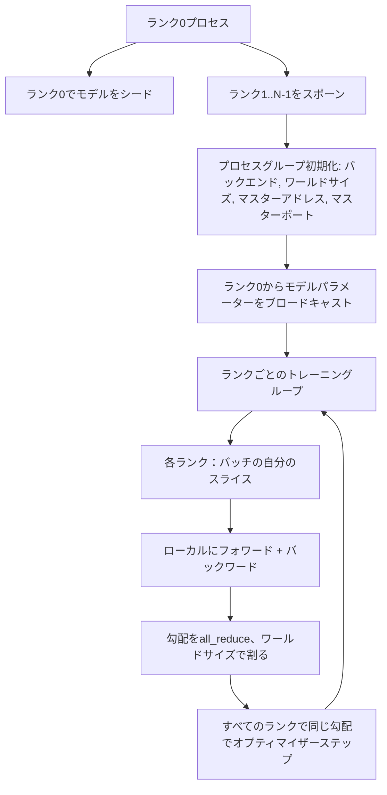
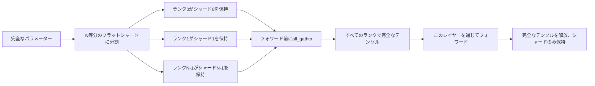

# スクラッチからの分散データ並列とFSDP

> マルチランクトレーニングは2つの集合演算と1つのルールです。起動時にパラメーターをブロードキャストし、バックワード後に勾配を平均し、ランクが同じステップにいることに決して異議を唱えないようにします。


## 学習目標

- 特殊なハードウェアなしで、`gloo`バックエンドを使ってNランク間でプロセスグループを立ち上げる。
- 構築時にパラメーターをブロードキャストし、バックワード後に勾配をall-reduceする最小限のDDPラッパーを実装する。
- ランクごとの勾配のall-reduceが連結入力上の単一プロセス勾配と一致することを証明する。
- FSPPパラメーターシャーディングのスケッチ：各ランクがスライスを保持し、フォワードパスのために完全なテンソルを収集してから後で解放する。

## 問題

モデルは1つのデバイスに収まります。データセットは収まりません。最適化予算は1秒あたりN倍のサンプルを見たいと言っています。最初のレバーはデータ並列です：各ランクが同じモデルをバッチの異なるスライスで実行し、次にオプティマイザーステップ前に勾配を平均します。2番目のレバーはFSDP：モデルも1つのデバイスに収まらないため、各ランクがすべてのパラメーターの一部を保持し、フォワードパス中にレイヤーごとに完全なテンソルを再構築します。

問題はブックキーピングです。ランク間でパラメーターが乖離すると、実行はサイレントに破損します。勾配を平均しても損失は平均しないとダッシュボードが嘘をつきます。集合バックエンドがトポロジーに同意できない場合、実行は永遠にハングします。解決策はコレクティブスを手書きで一度書いて、再現できないラッパーを信用しないことです。

このレッスンはCPUで実行します。CUDAは前提としません。`gloo`バックエンドはすべてのPyTorchビルドに付属し、`torch.multiprocessing`ワーカーを受け入れます。同じコードは構造を変えずに、マルチGPUノードで`nccl`に切り替えます。

## 概念



### 重要な2つの集合演算

| 集合演算 | 何をするか | いつ |
|------------|--------------|------|
| `broadcast` | 1つのランクから他のすべてにテンソルをコピー | パラメーター初期化、スケジューラー状態、any one-to-allシンク |
| `all_reduce` | すべてのランクでテンソルを合計（または平均、または最大）、すべてのランクが結果を得る | バックワード後の勾配平均 |
| `all_gather` | 各ランクがテンソルを提供、すべてのランクが連結を得る | ロジット収集、FSPPパラメーターアンシャード |

DDPの契約は構築時に`broadcast`、バックワード後に`all_reduce`です。FSPPスケッチは各レイヤーのフォワードパス前に`all_gather`を追加します。

### 勾配平均は単一プロセスの勾配と一致

Nランク間でBサンプルのバッチでトレーニングしたモデルは、N*Bのフルバッチで単一プロセスがトレーニングしたものと同じ勾配を生成しなければなりません。トリックはランクごとの勾配を合算してNで割ると平均損失勾配が得られることです。これは平均削減でのクロスエントロピーがフルバッチで生成するものです。レッスンコードは手動all-reduce勾配と参照単一プロセス勾配の間の`max-abs-diff < 1e-3`でこれをアサートします。

### FSPPスケッチ



メモリの利点は正確です：パラメーターのランクごとのメモリは1/Nに減少します。コストはギャザーで、すべてのフォワードパスで支払われます。本番FSPPは前のレイヤーの計算とギャザーをオーバーラップするため、ウォールクロックコストはナイーブな計算よりはるかに小さくなります。レッスンはすべてのパラメーターでラウンドトリップを行い、再構築がオリジナルとビット単位で一致することをアサートします。

### CPUとglooバックエンド

CUDAが本番ターゲットですが、同じコードパスがCPUにも存在します。`gloo`はCPU集合バックエンドです。GPUのncclよりも数桁遅いですが、APIサーフェスは同一です。レッスンのプロセスグループは`backend="gloo"`で初期化され、ランクはtorchrunではなく`torch.multiprocessing`でスポーンされます。どちらも同じ`torch.distributed`呼び出しに行き着きます。マルチGPUノードでは、変更は`backend="nccl"`、デバイステンソル、`torchrun`での起動だけです。

## 実装する

`code/main.py`が実行可能なアーティファクトです。

### ステップ1：プロセスグループを立ち上げる

```python
os.environ["MASTER_ADDR"] = "127.0.0.1"
os.environ["MASTER_PORT"] = str(port)
dist.init_process_group(backend="gloo", rank=rank, world_size=world_size)
```

`MASTER_ADDR`と`MASTER_PORT`はランデブーです：すべてのランクが同じホストの同じポートにダイヤルします。レッスンは複数の実行が1台のマシンを共有するときの衝突を避けるために、バインドアンドクローズトリックで空きポートを選びます。

### ステップ2：構築時にブロードキャスト

`MinimalDDP.__init__`はすべてのパラメーターとバッファを歩き、`dist.broadcast(tensor, src=0)`を呼び出します。ランク0の値が正準の初期化になります。これがなければ、各ランクが自分のシードで初期化し、ランクはステップ1から乖離します。

### ステップ3：バックワード後に勾配をall-reduce

```python
def all_reduce_grads_(module, world_size):
    for p in module.parameters():
        if p.grad is None:
            p.grad = torch.zeros_like(p.data)
        dist.all_reduce(p.grad.data, op=dist.ReduceOp.SUM)
        p.grad.data.div_(world_size)
```

すべてのランクが同じ平均勾配を得ます。オプティマイザーステップはすべてのランクで同じ入力の関数となり、だからこそパラメーターが実行全体で同期を保ちます。

### ステップ4：等価性を証明する

`manual_all_reduce_matches_single_process`はランク0で同じモデルを構築し、ポストall-reduce勾配を連結入力で単一プロセスが計算する勾配と比較します。最大絶対差は約1e-8です。

### ステップ5：FSPPラウンドトリップ

`fsdp_round_trip_sketch`は各パラメーターをフラット化し、`world_size`の倍数にパディングし、スライスし、all-gatherし、パディングを削除します。すべてのランクの再構築がオリジナルと一致します。これはアンシャードステップです。逆（フォワード後の再シャード）は収集されたテンソルからの1つのスライスです。

実行方法：

```bash
python3 code/main.py
```

デフォルトのワールドサイズは2です。2つのCPUプロセスがスポーンされ、`gloo`を通じて互いに話し、ゼロで終了します。出力`outputs/ddp-demo.json`はランクごとのパラメーター合計、all-reduce後の勾配ノルム、FSPPラウンドトリップ結果、手動対参照勾配差をキャプチャします。

## 使ってみる

本番トレーニングスタックは同じプリミティブを呼び出します。PyTorchの`DistributedDataParallel`が追加するもの：バックワードとall-reduceをオーバーラップするポストバックワード勾配フック、いくつかの小さな勾配を1つの集合演算に組み合わせるバケット化all-reduce、そしてレッスン46が使った`no_sync`コンテキスト。

PyTorchのFSPPが追加するもの：各ランクが1つの連続バッファを保持するレイヤーごとのフラットパラメービュー、次のレイヤーのアンシャードと現在のレイヤーの計算のオーバーラップ、シャードのオプションCPUオフロード。

形状は同じです：起動時にブロードキャスト、バックワード後に削減、収まらないときにパラメーターをシャード化。

## 成果物を出す

`outputs/skill-distributed-fsdp-ddp.md`は新しいトレーニングスクリプトのレシピです：CPUには`gloo`、GPUには`nccl`でプロセスグループを立ち上げ、構築時にブロードキャストしバックワード後に削減するDDPシェルにモデルをラップし、FSPPスケッチのall_gatherパターンでオプションでパラメーターをシャード化する。

## 演習

1. `--world-size 4`で実行し、実行全体でパラメースプレッドが1e-3未満に保たれることを確認する。
2. 手動平均を`dist.all_reduce(op=dist.ReduceOp.AVG)`に置き換え、差を計測する。
3. all-reduceがバックワードの残りとオーバーラップするよう、DDPラッパーにポストバックワードフックを追加する。ウォールクロックの改善を計測する。
4. FSPPの再シャードステップを実装する：フォワードパス後、完全なテンソルをローカルシャードに再度置き換える。ランクごとのメモリが落ちることを確認する。
5. CUDAボックスでバックエンドを`nccl`に切り替える。どの環境変数が変わり、どれが同じか確認する。

## キーワード

| 用語 | よく言われること | 実際の意味 |
|------|-----------------|------------------------|
| バックエンド | 「glooかnccl」 | 集合演算を実装するライブラリ。glooはCPU、ncclはGPU |
| ワールドサイズ | 「総ランク数」 | グループ内のプロセス数。グループは集合演算が操作する単位 |
| ランク | 「ワーカーID」 | グループ内のプロセス識別子、ゼロインデックス |
| All-reduce | 「勾配を合算」 | すべてのランクでテンソルを合算。すべてのランクが同じ結果を得る |
| アンシャード | 「パラメーターを収集」 | all_gatherでランクごとのスライスから完全なテンソルを再構築 |

## 参考資料

- このレッスンが依存する集合セマンティクスのためのPyTorch `torch.distributed`ドキュメント。
- CUDA対応の`nccl`プリミティブと形状が同一な`gloo`ライブラリの集合リスト。
- no_syncでDDPのall-reduceをラップする勾配累積パターンのためのフェーズ19 レッスン46。
- DDPとFSDP実行を乗り越えるチェックポイントレイアウトのためのフェーズ19 レッスン47。
- ここでスケッチされたパラメーターシャーディングの本番実装のためのPyTorch FSPPドキュメント。
