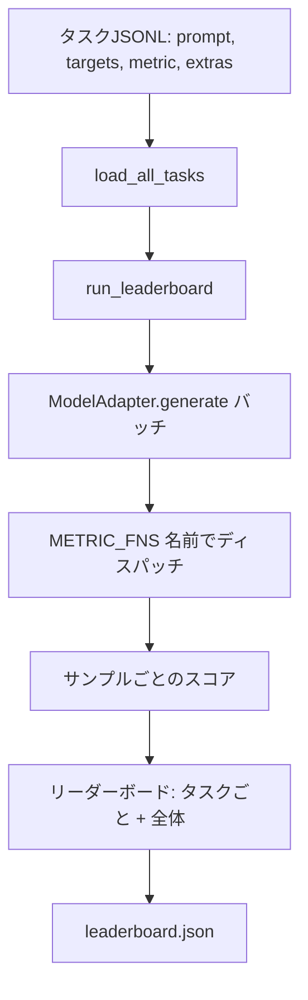
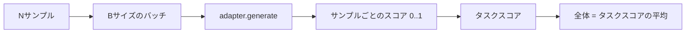

# 言語モデル評価ハーネス

> 定義できないタスクで良い成績を出すモデルは、偶然良い成績を出しているモデルです。ハーネスはタスク定義、メトリクス、ランナー、リーダーボードを1つの短く交換可能な形にまとめたものです。


## 学習目標

- タスクをJSONLファイルとして定義する。各サンプルに`prompt`、`targets`、`metric`、オプションの`extras`を持たせる。
- 5つのメトリクスを実装する：exact match、rouge-l F1、実行可能チェック、多肢選択、部分文字列含有。
- タスクごとにサンプルをバッチ処理し、交換可能なモデルアダプターにディスパッチするランナーを構築する。
- タスクごとのスコア、レイテンシー、再現可能な全体平均を持つリーダーボードJSONを出力する。

## 問題

新しい言語モデルが毎週登場します。マーケティングの主張は「良い成績を出す」ということです。正直な問いは「何において？」です。正直な答えは自分で書いたリーダーボードです。なぜならベンダーのリーダーボードは彼らが調整したものだからです。

リポジトリにハーネスがなければ、2つのモデルを感覚で比較します。ハーネスがあれば、固定タスクセットと固定メトリクスで、差分可能なJSON出力でスコアを比較できます。ハーネスは昨日の実行と今日の実行の間の契約です。これなしではリグレッションがシップされます。

落とし穴は1つのモデルにハーネスを過学習させることです。逆方向の同じ落とし穴が解決策です：ハーネスは15分で読めるほど小さく、タスクはリポジトリにシップできるほど小さく、メトリクスは同僚が監査できるようスクラッチで書かれ、アダプターがモデル固有のコードが住む唯一の場所です。アダプターを交換するとリーダーボードが動きます。タスクを交換するとリーダーボードが動きます。他は何も動くべきではありません。

## 概念



### タスクスペック

すべてのサンプルは1行のJSONLです：

```json
{"id": "arith-00", "prompt": "compute: 2 + 2", "targets": ["4"], "metric": "exact_match"}
```

スコアリングヘルパーが必要なメトリクスには、`extras`がサイドペイロードを持ちます：

```json
{
  "id": "code-00",
  "prompt": "python: write a function f that doubles its input",
  "targets": ["ok"],
  "metric": "code_exec",
  "extras": {"io_pairs": [[1, 2], [3, 6]]}
}
```

タスクは`outputs/tasks/`の`.jsonl`ファイルです。ファイル名がタスク名です。ファイル内のすべてのサンプルがメトリクスを共有します。

### 5つのフィクスチャータスク

| タスク | メトリクス | テストするもの |
|------|--------|---------------|
| arithmetic | exact_match | 決定論的な答えに対するトークンレベルの正確さ |
| summary | rouge_l | 1行の参照サマリーに対する最長共通部分列F1 |
| code-exec | code_exec | 実行可能テスト：予測された関数が入出力ペアのリストを満たさなければならない |
| multiple-choice | multiple_choice | 予測の最初の文字が許可された文字と一致しなければならない |
| generation | substring_contains | 自由形式テキストに少なくとも1つのターゲット部分文字列が含まれなければならない |

### メトリクス契約

すべてのメトリクスは`(prediction, targets, extras) -> [0.0, 1.0]のfloat`の関数です。ハーネスはサンプルごとのスコアを平均してタスクスコアを得、タスクスコアを平均して全体を得ます。メトリクス関数は小さいです：

- `exact_match`：小文字化、空白を折り畳む、等価性。
- `substring_contains`：同じ正規化、部分文字列テスト。
- `multiple_choice`：最初の文字を大文字化。
- `rouge_l`：LCS長を予測と参照の長さで割る、精度とリコールのF1。
- `code_exec`：制限されたネームスペースで予測を実行し、すべての入出力ペアで`f(x)`を呼び出し、一致をカウント。

code_execメトリクスは削ぎ落とされたbuiltinsネームスペースで予測を実行します。レッスンのテストは`import os`がネームスペースに`os`がないため爆発することをアサートします。コード予測からファイルシステムに到達できません。

### モデルアダプター

```python
class ModelAdapter(Protocol):
    def generate(self, prompts: Sequence[str]) -> List[str]: ...
    @property
    def name(self) -> str: ...
```

アダプターは縫い目です。レッスンは5つのフィクスチャータスクのすべてのプロンプトに正しい答えを返す決定論的パターンマッチャーである`ToyAdapter`を搭載しています。本物のアダプターはモデルを呼び出してその出力を返します。ハーネスはどちらかを気にしません。

### ランナー

`run_task`は`batch_size`プロンプトをバッチ処理し、メトリクス関数にディスパッチします。`run_leaderboard`はすべてのタスクを歩いて平均します。`write_leaderboard`はスキーマ文字列を持つJSONを出力するため、将来のフォーマット変更がサイレントにダッシュボードを壊しません。



## 実装する

`code/main.py`が実行可能なアーティファクトです。

### ステップ1：フィクスチャータスクをシード

`seed_fixture_tasks(target_dir)`は5つの`.jsonl`ファイルを書き込みます。`main.py`の最初の実行時、ディレクトリが空の場合にシードします。

### ステップ2：タスクをロード

`load_all_tasks(task_dir)`はすべての`.jsonl`を読み取り、タスク名から`Example`レコードのリストへのdictを返します。`#`で始まるコメント行と空行はスキップされるため、コントリビューターがファイルに注釈を付けられます。

### ステップ3：メトリクスを実装

各メトリクスはユニットテスト付きの小さな関数です。レッスンのテストスイートは正規化、部分的なオーバーラップ、コード実行、安全でないコード拒否をカバーする13ケースを含みます。

### ステップ4：ランナーを書く

`run_task`はバッチをイテレートし、スコア、正解数、総数、レイテンシーを持つ`TaskResult`を生成します。`run_leaderboard`はすべてのタスクを歩き、全体平均を持つ`Leaderboard`を生成します。

### ステップ5：JSONを出力

`write_leaderboard`はボードをシリアライズします。`--include-per-example`フラグはサンプルごとのレコードをダンプするため、スコアが動いたときに前の実行に対して予測を差分できます。

実行方法：

```bash
python3 code/main.py
```

スクリプトは最初の実行でフィクスチャーをシードし、おもちゃのアダプター（すべてのフィクスチャーを正解する）でスコアを付け、`outputs/leaderboard.json`を書き込みます。おもちゃのアダプターでは全体スコアが1.0です。`test_main.py`のスタブアダプターテストは同じハーネスがアダプターが答えられない場合に0.0を生成することを示します。

## 使ってみる

本物のモデルを組み込むにはアダプターを書きます。形状：

```python
class HttpAdapter:
    name = "vendor.v1"

    def __init__(self, endpoint, api_key):
        self.endpoint = endpoint
        self.api_key = api_key

    def generate(self, prompts):
        out = []
        for prompt in prompts:
            response = http_post(self.endpoint, prompt, self.api_key)
            out.append(response["text"])
        return out
```

`main()`のトップで`ToyAdapter`を`HttpAdapter`に交換します。ハーネス、タスク、メトリクス、リーダーボードは変わりません。

実際のプロジェクトでハーネスをシップするときに強制すべき3つのパターン：

- **タスクファイルを固定する。** leaderboard.jsonはハッシュ固定されたタスクコンテンツを持つか、JSONLを隣に持ちます。そうでなければタスクファイルが変わるとスコアが動き、どちらかを区別できません。
- **スコアだけでなく予測を差分する。** `--include-per-example`フラグでスコアが落ちた日のモデルの発言が見えます。
- **バッチサイズを制限する。** 本物のアダプターにはレート制限があります。小さなバッチサイズはハーネスをベンダー間で互換性を保ちます。

## 成果物を出す

`outputs/skill-lm-eval-harness.md`はレシピを持ちます：JSONLタスクスペック、5つのメトリクス、交換可能なアダプター、バッチ処理ランナー、スキーマ文字列を持つリーダーボードJSON。`outputs/tasks/`のタスクファイルがフィクスチャーです。実際のプロジェクトのスターターとしてコピーします。

## 演習

1. スクラッチで書いた独自メトリクス（BLEUライクオーバーラップ、BLEURTライク参照スコアリング、明確な契約を持つもの）で6番目のタスクを追加する。
2. stdoutをキャプチャして期待されるstdoutのリストをターゲットとして受け入れるよう`code_exec`を拡張する。
3. リーダーボード差分コマンドを追加する：2つの`leaderboard.json`ファイルを受け取り、どのタスクがどれだけ動いたかを出力する。
4. サンプルごとのレイテンシーを制限する。アダプター呼び出しをタイムアウトでラップし、リーダーボードに別の`timeouts`カラムを表示する。
5. sha256でタスクコンテンツをリーダーボードに固定し、将来の読者が同じタスクをスコアしたことを確認できるようにする。

## キーワード

| 用語 | よく言われること | 実際の意味 |
|------|-----------------|------------------------|
| タスクスペック | 「評価フォーマット」 | サンプルごとにprompt、targets、metric、オプションのextrasを持つJSONLファイル |
| メトリクス | 「スコアの付け方」 | (prediction, targets, extras) から[0, 1]のfloatへの関数 |
| アダプター | 「モデルクライアント」 | generate(prompts) -> list[str]メソッドを持つオブジェクト。唯一のモデル固有コード |
| リーダーボード | 「スコアボード」 | タスクごとのスコア、総数、レイテンシー、全体平均を持つJSON |
| code execメトリクス | 「実行してチェック」 | 制限されたネームスペースで予測を実行し、入出力ペアと比較 |

## 参考資料

- 本番参照のための元のlm-evaluation-harness（はるかに大きいが同じ形状）。
- 同じ契約の代替実装のためのHuggingFaceのlighteval。
- ハーネスがスコアするトレーニングスタックの勾配累積パターンのためのフェーズ19 レッスン46。
- スコアするチェックポイントフォーマットのためのフェーズ19 レッスン47。リーダーボードにチェックポイントハッシュを固定する。
- テスト対象のモデルを生成した分散トレーニングスタックのためのフェーズ19 レッスン48。
