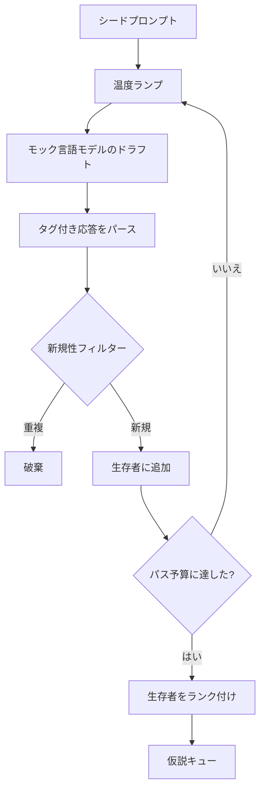

# 仮説生成器

> 同じ質問を2回する研究エージェントはトークンを無駄にしています。コツは各ドラフトを新しい場所に着地させることを強制することです。


## 学習目標
- シードプロンプトからサンプラーを駆動し、その出力を型付き仮説レコードに変換する。
- 次のドラフトが前のものからさらに離れるよう、各パスでサンプラー温度をランプアップする。
- 小さな埋め込みモデルとコサイン距離しきい値で近似重複をフィルタリングする。
- 生存者を新規性・具体性・テスト可能性をブレンドしたスコアリング関数でランク付けする。
- 同じシードが常に同じキューを生成するよう、すべてのステップを決定論的にする。

## なぜ生成してからフィルタリングするか

1回、1つのモデルに1回質問するプランナーは1つの仮説を得ます。それはワーク済みの例には十分です。研究ループには間違った形です。ループは深さのあるランク付きキューを必要とします。最初の仮説が失敗したとき、ランナーは別のフルサンプリングパスのコストを払うことなく次の仮説を用意できます。

2つのアイデアが組み合わさってそのキューを生成します。1つ目は温度ランピング：各サンプラーのパスで温度を少し上げ、後のドラフトがさまよいやすくなります。2つ目は新規性フィルタリング：各ドラフトの後、生成器はすべての先行生存者との埋め込み距離を測定し、クラスター内にあるものを拒否します。

このレッスンは固定プロンプトに対してスクリプト化されたトークンシーケンスを返すモック言語モデルを搭載しています。モックは完全なパスを実行するのに十分です：シードプロンプトが入力され、温度ランプが適用され、候補がパースされ、新規性フィルターが実行され、ランク付きキューが出力されます。

## 仮説の形状

```text
Hypothesis
  id             : int           (実行内で単調)
  text           : str           (主張)
  variables      : list[str]     (条件間で変化するもの)
  metric         : str           (ランナーが測定するもの)
  baseline_ref   : str | None    (比較が引用する論文または実行)
  draft_pass     : int           (どのサンプラーパスがこれを生成したか)
  temperature    : float         (ドラフト時のサンプラー設定)
  novelty_score  : float         (先行生存者からの距離, 0..1)
  rank_score     : float         (順序付けに使用する加重和)
```

`variables`と`metric`は自由テキストではありません。パーサーはタグ付き応答からそれらを引き出します。レッスン52のランナーは実験設定を構築するときにこれらのフィールドを直接読みます。

`baseline_ref`はオプションですが推奨されます。レッスン53の評価者はベースラインと比較する必要があります。仮説が省略した場合、評価者は同じメトリクスの前回の実行にフォールバックします。

## アーキテクチャ



ループは単純明快です。面白い部分は各ボックスに厳しい契約があることです。

## 温度ランプ

`t_min`から始まり、`t_max`で終わり、`(t_max - t_min) / (n_passes - 1)`のステップです。各パスは現在の温度でサンプラーを呼び出し、`GeneratorConfig.schedule()`から`n_passes`個の均等に間隔をあけた値を生成します。モックモデルは`(prompt, temp_bucket)`でキー付けされたスクリプト化された応答の小さなセットを切り替えることで温度を遵守します。バケットはオープン区間なので温度の小さな変化が異なるバケットを選び異なるドラフトを生成します。本番環境ではサンプラーは`temperature=t`を渡した本物のモデルになります。

デフォルトスケジュールは`0.2`から`1.2`への6パスです。6はとにかく新規性フィルターが拒否するサンプルに払うことなくキューを埋めるのに十分です。`0.2`以下ではモデルがシードをオウム返しします。`1.2`以上では応答がトピックを外れパーサーが失敗する傾向があります。

## 新規性フィルター

各ドラフトがパースされた後、生成器はテキストを埋め込み、すべての受け入れ済み仮説と比較します。埋め込みは単位長に正規化された小さなハッシュ化バッグオブワードトークンです。2つの単位ベクトル間のコサイン距離は`1 - dot(a, b)`です。ドラフトは任意の先行生存者への最小距離が`novelty_threshold`を超えた場合に通過します。デフォルトは`0.25`です。

ハッシュ化埋め込みは洗練されていません。決定論的で依存関係ゼロで、明らかなケースを捕捉するのに十分です：名詞の大部分を共有する2つのドラフト。本番デプロイメントでは小さな文章モデルに交換します。インターフェースは変わりません。

## ランクスコア

```text
rank_score = w_novelty * novelty_score
           + w_specificity * specificity_score
           + w_testability * testability_score
```

3つのサブスコアです。`novelty_score`は先行生存者からの最小埋め込み距離です。`specificity_score`は仮説内の具体的な変数数をターゲット数で割ったものです。`testability_score`は仮説がメトリクスとベースラインの両方を指定していれば1、メトリクスのみなら半分、そうでなければゼロです。

デフォルトの重みは`0.4`、`0.3`、`0.3`です。重みはジェネレーター設定に置かれているため、ダウンストリームのレッスンがコードをフォークせずにシフトできます。

## モック言語モデル

```python
class MockLLM:
    def sample(self, prompt: str, temperature: float, seed: int) -> str:
        ...
```

サンプラーは`(prompt, temperature, seed)`トリプルを与えると決定論的です。モックは`(prompt_signature, temperature_bucket)`でキー付けされたスクリプト化された応答テーブルを保持します。テーブルにキーのエントリがない場合、サンプラーはパーサーが失敗するフォールバックを返します。フォールバックパスはテストの1つで実行されます。

シードは応答に混ぜられるため、同じ`(prompt, temperature)`ペアに異なるシードを与えると異なるドラフトが生成されます。テストでは再現可能な結果を保つためシードを固定します。本番デプロイメントではシードはシステムクロックまたはカウンターから来ます。

## 出力キュー

出力は`rank_score`の降順にソートされた`Hypothesis`レコードのリストです。レッスン52のランナーは先頭をポップし実験を実行します。レッスン53の評価者は仮説IDに対して評決を書き返します。評決が仮説が間違っていたと言えば、ランナーは次のものをポップします。

キューは有限です。空になると、オーケストレーターはシードプロンプトを広げて生成器を再実行するか、予算を使い果たしたと報告して停止できます。

## コードの読み方

`code/main.py`は`Hypothesis`、`MockLLM`、`HypothesisGenerator`、決定論的デモを定義します。生成器はソートされたキューを返す単一の`run(seed_prompt)`メソッドを公開します。パス数は引数として渡されるのではなく`GeneratorConfig.n_passes`から読まれます。埋め込みはハッシュ化バッグオブトークンです。新規性フィルターは単一の関数です。ランクスコアは単一の関数です。何も`numpy`に依存しません。埋め込みの数学は純粋なstdlibなのでレッスンはポータブルです。

`code/tests/test_generator.py`は線形パス、重複拒否パス、パーサー失敗パス、温度ランプ境界、ランク順序をカバーします。

## ここでの位置づけ

レッスン50がキューを生成します。レッスン51はキューの先頭を取り、それを確認または反証するための文献検索を実行します。レッスン52は同じ先頭を取り実際の実験を実行します。レッスン53は両方の出力を読み評決を書きます。4つのレッスンが人間なしの研究ループに合成されます。人間はどの境界でも介入できます。
