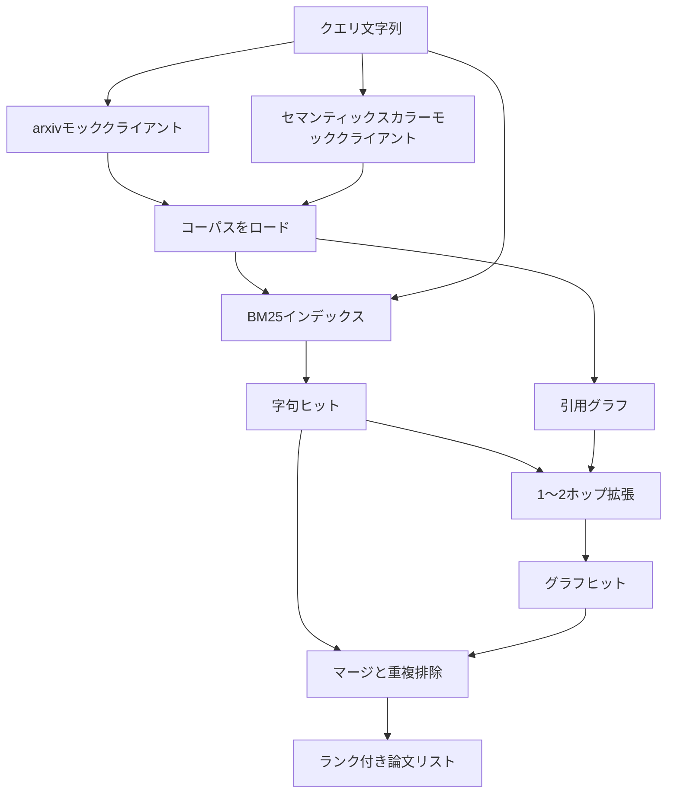

# 文献検索

> 仮説は安上がりです。誰かがすでにそれを証明したかどうかを知ることが高コストな部分です。ランナーがサンドボックスを立ち上げる前にその質問に答える検索レイヤーを構築します。


## 学習目標
- ループがダウンストリームで読む小さな論文レコードをモデル化する。
- stdlibデータ構造のみでアブストラクトに対するBM25インデックスを構築する。
- 字句検索が見逃した論文を見つけるために引用グラフを歩く。
- 安定した論文IDにより字句パスとグラフパスからのヒットを重複排除する。
- 実際のエンドポイントが来たとき呼び出しサイトが変わらないよう、2つのモック外部APIを単一クライアントの後ろにラップする。

## なぜ2つの検索パスか

アブストラクトに対するキーワード検索はクエリと語彙を共有する論文を返します。それは表面の大部分をカバーします。2つのケースを見逃します。1つ目は基礎的な論文が異なる語彙を使っている場合です。例えば「スパース注意」のクエリは「トランスフォーマールーティングのブロック選択」というタイトルの論文を見逃します。2つ目は関連する論文が既知のアンカーを引用するフォローアップの場合です。アンカーを見つけて前に進む方が、アブストラクトプールをブルートフォースするより効率的です。

レッスンは両方のパスを構築します。アブストラクトに対するBM25が字句ヒットを捕捉します。引用グラフのトラバーサルがシードセットを1〜2ホップ前後に拡張します。和集合が論文IDで重複排除されランクスコアの小さな組み合わせでランク付けされます。

## 論文の形状

```text
Paper
  id          : str           (安定した識別子、モックコーパスでは"p001")
  title       : str
  abstract    : str
  year        : int
  authors     : list[str]
  references  : list[str]     (この論文が引用する論文ID)
  citations   : list[str]     (この論文を引用する論文ID)
  source      : str           (どのモックAPIが提供したか、"arxiv"または"s2")
```

referencesとcitationsフィールドが有向引用グラフを形成します。2つのモックAPIは重複しているが同一ではないフィールドを返すため、コーパスローダーは`id`でそれらを和集合します。

## アーキテクチャ



検索クライアントは両方のパスとマージを所有します。呼び出し元はクエリを渡し、各エントリがランク付けを説明するスコアフィールド（`bm25_score`、`graph_distance`、`recency_score`、`final_score`）を持つランク付きリストを受け取ります。

## スクラッチからのBM25

実装はデフォルトパラメーター`k1=1.5`、`b=0.75`の標準的なOkapi BM25です。インデックスは2つの辞書です：`term -> doc_frequency`と`term -> list of (doc_id, term_count)`。ドキュメント長はアブストラクトのトークン数です。平均ドキュメント長はインデックス構築時に1回計算されます。クエリのスコアリングはクエリ語の`idf * tf_norm`の和で、`tf_norm`は標準的なBM25の長さ正規化された語頻度です。

トークナイザーは`lower`を実行してから非英数字で分割します。ステミングされません。本番システムでは小さなステマーを組み込みます。インターフェースは変わりません。

```text
idf(t)      = log((N - df + 0.5) / (df + 0.5) + 1.0)
tf_norm(t)  = (f * (k1 + 1)) / (f + k1 * (1 - b + b * dl / avgdl))
score(d, q) = sum over t in q of idf(t) * tf_norm(t)
```

## 引用グラフトラバーサル

グラフはコーパスから1回構築されます。前向きエッジは論文からそのreferencesへ向かいます。後向きエッジは論文からそのcitationsへ向かいます。トラバーサルはトップBM25ヒットでシードされた幅優先探索で、2ホップで上限が設定されます。

2ホップは意図的な上限です。1ホップは浅すぎます。エージェントはしばしば即座の祖先または子孫が欲しいです。3ホップは連結グラフで結果サイズが爆発しトピックを外れる傾向があります。レッスンはホップ制限を設定ノブとして公開し、ダウンストリームループが締められます。

## 重複排除とランキング

2つのパスは重複するセットを返します。マージは論文IDでキー付けします。各論文の最終スコアは加重ブレンドです。

```text
final_score = w_bm25 * bm25_score_norm
            + w_graph * graph_score
            + w_recency * recency_score
```

`bm25_score_norm`はBM25スコアをマージされたセットの最大BM25スコアで割ったものです（フィールドがゼロから一に収まるよう）。`graph_score`は直接字句ヒットが1、1ホップが`0.6`、2ホップが`0.3`、それ以外がゼロです。`recency_score`はコーパスの最小年でゼロから最大年で一への線形ランプです。

デフォルトの重みは`0.5`、`0.3`、`0.2`です。重みは設定です。古くなったトピックは新近性を下げ、急速に動くトピックは上げるかもしれません。

## モックコーパス

コーパスは100の論文で`build_corpus()`で生成されます。各論文は5つのトピックの1つに手書きのタイトルとアブストラクトを持ちます：注意スパース性、検索拡張、ローランクアダプター、データセット蒸留、評価ハーネス。referencesとcitationsは各トピックが連結サブグラフを形成しいくつかのクロストピックエッジを持つよう配線されます。

2つのモックAPIクライアント（`ArxivMockClient`、`SemanticScholarMockClient`）は同じコーパスから読みますが異なるフィールドを公開します。Arxivはtitle、abstract、year、authorsを返します。Semantic Scholarはreferencesとcitationsを追加します。検索クライアントはIDでマージします。クロスクライアントフィールド不一致の処理はフォローアップレッスンに延期されます。

## レッスン52と53が読むもの

レッスン52のランナーは実験のコンテキストとして`paper.id`、`paper.title`、アブストラクトのトップ3文を読みます。レッスン53の評価者は特定の論文にベースラインを帰属させるために`paper.year`と`paper.references`を読みます。

検索クライアントはランク付きリストとクエリごとのメトリクスの両方を持つ`RetrievalResult`を返します：ヒット数、平均スコア、トップスコア、総ウォールタイム。ランナーはこれらをログし、ダウンストリームの観測可能性パスが時間経過とともに品質をプロットできます。

## コードの読み方

`code/main.py`は`Paper`、`ArxivMockClient`、`SemanticScholarMockClient`、`BM25Index`、`CitationGraph`、`RetrievalClient`、決定論的デモを定義します。モッククライアントとコーパスは同じファイルにあるのでレッスンはポータブルです。BM25実装は1クラス60行です。グラフトラバーサルは1メソッドです。

`code/tests/test_retrieval.py`は字句パス、グラフパス、マージ、重複排除、空クエリをカバーします。

## ここでの位置づけ

レッスン50が仮説を生成します。レッスン51はその仮説がすでに解決されているかを確認するために文献を検索します。解決されていなければレッスン52が実験を実行します。レッスン53は検索結果と実験メトリクスの両方を読んで評決を書きます。検索クライアントは4つのステージの中で最も安価で、オーケストレーターで最初に実行されます。
