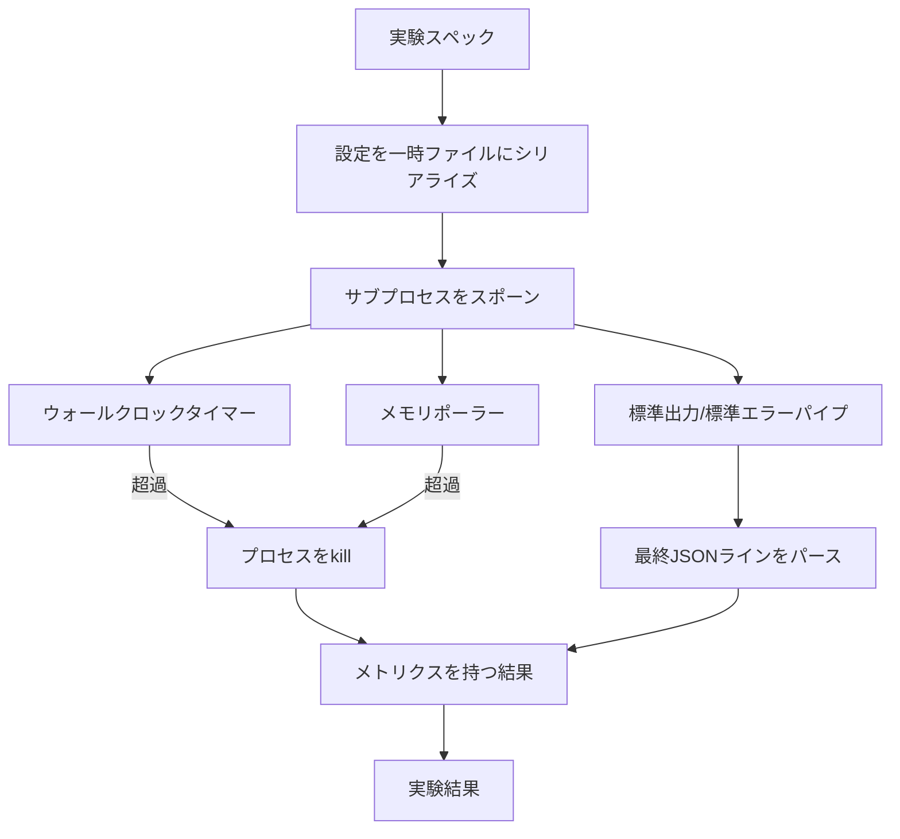

# 実験ランナー

> ループはその測定値と同じくらいしか正直ではありません。スペックを受け取り、サンドボックス化されたサブプロセスでそれを実行し、評価者が信頼できるJSONメトリクスブロブを出力するランナーを構築します。


## 学習目標
- 実験をランナーがサブプロセスにシリアライズできる型付きスペックとしてエンコードする。
- ハードウォールクロックタイムアウトとソフトメモリ上限でサブプロセスを起動し、両方をターミナル条件として表面化する。
- stdout、stderr、構造化メトリクスブロブを単一の結果レコードにキャプチャする。
- 固定ベーススペック上で1つの設定ノブを一度にスイープするアブレーションテーブルを構築する。
- 評価者が実行全体で同じ数字を見られるよう、シードが与えられるとすべての結果を決定論的にする。

## なぜサブプロセスか

研究ループは信頼されていないコードを実行します。仮説はサンプラーから来て、実験スクリプトは同じパスから来ています。どちらもインプロセスで安全として扱うことは、オーケストレーターを巻き込むクラッシュを求めることです。サブプロセスは言語がシップする最もシンプルな分離です：別のプロセス、独立したアドレス空間、親側のシグナルハンドル。

ここのランナーは完全なサンドボックスを実装しません。cgroupも、seccompフィルターも、ネームスペースリマッピングもありません。あるのはウォールクロックタイムアウト、メモリ成長のポーリングループ、どちらの制限でもプロセスを終了させるkillパスです。これがより精巧なサンドボックスが拡張するランタイム契約です。レッスンは1回の座りで読めるほど契約を小さくしておきます。

## ExperimentSpecの形状

```text
ExperimentSpec
  spec_id        : str            (安定したID、"exp_001")
  hypothesis_id  : int            (レッスン50のキューへのリンク)
  script_path    : str            (実行するPythonスクリプトのパス)
  config         : dict           (1つのJSON引数としてスクリプトに渡す)
  seed           : int            (実験の決定論的シード)
  wall_timeout_s : float          (ハードタイムアウト、超過でkill)
  memory_cap_mb  : int            (ソフト上限、ポーリング。超過でkill)
  metric_keys    : list[str]      (評価者が読むフィールド)
```

スクリプトはディスク上にあります。ランナーは設定をスクリプトが読む一時ファイルパスに書き込みます。スクリプトはstdout上に`metric_keys`のスーパーセットのキーを持つ単一のJSONラインを出力することが期待されます。stdout上の他のものはキャプチャされますが、メトリクスパーサーには無視されます。

## アーキテクチャ



ランナーは1つのクラスと1つのメインメソッドです。ポーラーはポール間隔ごとに目覚め、プラットフォームがそれを公開する場合にprocファイルシステムからサブプロセスの`psutil`相当を読む小さなスレッドです。プラットフォームがサポートしない場合はno-opにフォールバックします。

## なぜソフトメモリ上限か

ハードメモリ上限は`resource.setrlimit`が必要でPOSIXのみ動作します。レッスンはポータブルなアプローチをシップします：プラットフォームから常駐セットサイズをポーリングし、上限を超えた場合にサブプロセスをkillします。上限はポーラーが非ゼロの間隔を持つためソフトです。プロセスは上限を超えてから下がることもありますが、ランナーは最大観測RSSを記録するため評価者が制限にどれだけ近づいたかを確認できます。

プロセス検査サポートのないシステムでは、ポーラーはワンタイム警告をログして自分自身を無効化します。ウォールクロックタイムアウトは依然として適用されます。レッスンのテストは両方のパスをカバーします。

## stdoutとstderrのキャプチャ

ランナーは完了時に両方のパイプをドレインします。stdoutは行ごとにスキャンされます。必須の`metric_keys`すべてを持つJSONとしてパースされた最後の行が、メトリクスブロブとして取られます。より前のJSONラインは結果の`intermediate_metrics`に保持されます。評価者はこれらを学習曲線に使えます。

stderrは結果に逐語的にキャプチャされます。ランナーは非ゼロ終了コードでは発生させません。代わりにコードを結果に記録します。スクリプトがメトリクスを出力した場合でも、非ゼロ終了はすべて`"crash"`とラベル付けされるため、評価者はデフォルトで部分的な実行を失敗として扱います。

## アブレーションテーブル

```python
def ablate(base: ExperimentSpec, knob: str, values: list[Any]) -> list[ExperimentSpec]:
    ...
```

ベーススペックとノブ名を与えると、ヘルパーは`config[knob]`がオーバーライドされた値ごとのスペックを返します。各スペックには派生した`spec_id`（`f"{base.spec_id}_{knob}_{value}"`）があります。ランナーには`AblationRunner`が搭載されており、それらを順番に実行してノブ値でキー付けされた`AblationTable`を返します。

なぜ1度に1ノブか。完全な因数計画は指数的に爆発し、評価者が解釈できない結果を生成します。1度に1ノブでは評価者がプロットできるクリーンな軸が生成されます。レッスンはマルチノブスイープのみ、呼び出し元が合成した繰り返しの単一ノブアブレーションとしてサポートします。

## 決定論性

すべてのスペックはシードを持ちます。ランナーは設定dict（`config["__seed"] = spec.seed`）経由でシードをスクリプトに転送します。`code/experiments/`のモック実験スクリプトはシードを尊重し、実行全体で同一のメトリクスを生成します。レッスン53の評価者はこれに依存します。決定論性なしでは「リグレッション」が異なるランダム初期化かもしれません。

## モック実験スクリプト

レッスンには1つの実験スクリプトが搭載されています：`code/experiments/sparsity_experiment.py`。設定ファイルを読み、numpy乱数パスで小さなトレーニング実行をシミュレートし、JSONメトリクスブロブを出力する本物のスクリプトです。タイムアウトテスト用の`sleep_s`ノブとメモリポーラーテスト用の`allocate_mb`ノブを尊重します。

シミュレーションは本物のトレーニングを何もしていません。トレーニングループの形を模倣した数値計算です：損失曲線、最終パープレキシティ、ウォールタイム。レッスンの目的はシミュレーションではなくランナーです。本物の実験スクリプトはモデルをインポートします。

## 結果の形状

```text
ExperimentResult
  spec_id              : str
  hypothesis_id        : int
  exit_code            : int
  terminal             : "ok" | "timeout" | "oom" | "crash"
  wall_time_s          : float
  peak_rss_mb          : float | None
  metrics              : dict
  intermediate_metrics : list[dict]
  stdout_tail          : str
  stderr_tail          : str
```

評価者は最初に`metrics`と`terminal`を読みます。terminalが`"ok"`以外なら実験は失敗した実行としてカウントされ、評価者の評決は自動です。そうでなければメトリクスは有意差テストを通過します。

## コードの読み方

`code/main.py`は`ExperimentSpec`、`ExperimentResult`、`ExperimentRunner`、`AblationRunner`、決定論的デモを定義します。サブプロセス管理は1つのクラスです。メモリポーラーは小さなスレッドです。アブレーションヘルパーは単一の関数です。

`code/experiments/sparsity_experiment.py`はテストで使用されるモック実験です。設定ファイルパスをargvから読み取り、単一のJSONメトリクスラインを完了時に書き込みます。

`code/tests/test_runner.py`は成功パス、タイムアウトパス、クラッシュパス、アブレーションテーブル、2回の実行間の決定論性チェックをカバーします。

## ここでの位置づけ

レッスン50が仮説を生成します。レッスン51は文献がすでに解決しているものをフィルタリングします。レッスン52は残ったものに対して実験を実行します。レッスン53は結果を読み、有意差テストを実行し、オーケストレーターが仮説IDに対して保存する評決を書きます。
